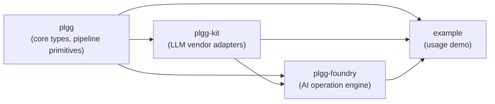
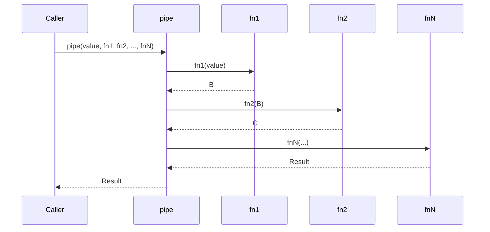
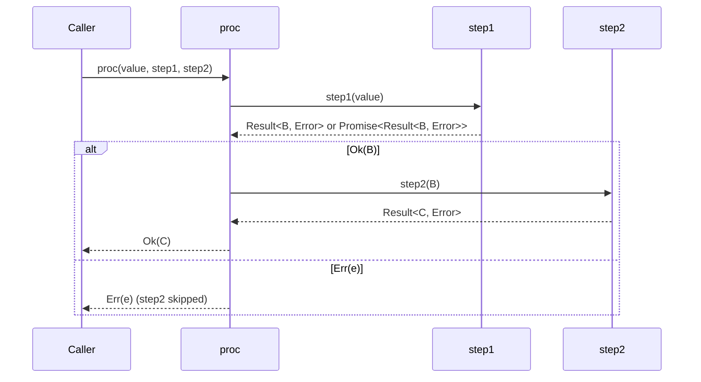
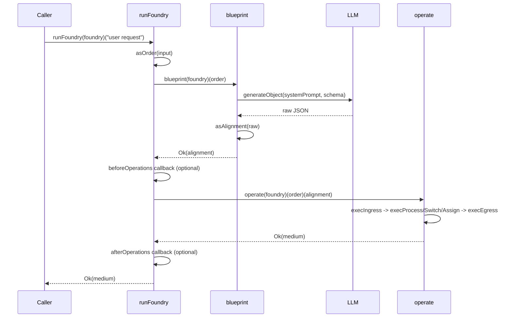

[English](application.md) | [Japanese](application_ja.md)

# Application Viewpoint

This viewpoint describes how the plgg system behaves at runtime: how data flows between packages, how the functional pipeline executes, how plgg-foundry orchestrates AI-driven operation sequences, and how plgg-kit dispatches to LLM vendor APIs.

## Package Dependency Flow

The monorepo contains four packages with a strict layered dependency order. `plgg` is the foundational package that all other packages depend on. `plgg-kit` depends on `plgg` to use its type system for modeling LLM providers. `plgg-foundry` depends on both `plgg` and `plgg-kit` to implement the AI-orchestrated operation engine. The `example` package depends on all three.

No package introduces circular dependencies. The dependency direction is always from higher-level to lower-level packages.

## Pipeline Execution in plgg

At runtime, the plgg core library enables data transformation through two primary composition primitives.

`pipe` is a synchronous function composition utility. It takes an initial value and chains up to 21 functions, each receiving the output of the previous. It provides full static type inference for each step.

`cast` is a synchronous pipeline for `Result`-returning validation functions. It accumulates errors from sibling attempts and propagates the first success. When all attempts fail, it collects sibling errors into an `InvalidError`.

`proc` is the async version of `cast`. It accepts a value and chains `Procedural`-returning functions. A `Procedural<T>` is `T | Result<T, Error> | Promise<T> | Promise<Result<T, Error>>`. The `proc` runtime unwraps Promises and Results automatically at each step, propagating `Err` values without calling the next function.

### Synchronous Pipeline Flow

### Async Procedural Pipeline Flow

## Foundry Operation Execution

`plgg-foundry` implements an AI-driven operation execution engine. The main entry point is `runFoundry`, which orchestrates three sequential phases.

**Phase 1 - Order validation**: The caller's input (a string or `OrderSpec` object) is validated into an `Order` using `asOrder`. An `Order` carries the user's text prompt and optional file attachments.

**Phase 2 - Blueprint (AI planning)**: `blueprint(foundry)(order)` sends a structured prompt to an LLM (via `plgg-kit`'s `generateObject`). The LLM receives a system prompt describing available apparatuses and returns an `Alignment` — a JSON object containing an `analysis` field, an `ingress` entry point, a sequence of typed operations (`assign`, `process`, `switch`), and an `egress` exit mapping.

**Phase 3 - Operate (execution)**: `operate(foundry)(order)(alignment)` executes the alignment starting from `ingress`. Operations execute sequentially. A register environment (`Env`) maps string addresses (e.g., `r0`, `r1`) to `Param` values. Each operation reads from and writes to this register file. A `maxOperationLimit` guard prevents infinite loops.

### runFoundry Lifecycle

## Operation Dispatch at Runtime

Inside `operate`, a recursive dispatch loop processes operations until `egress` is reached or an error occurs. The operation count is tracked against `maxOperationLimit`.

- `ingress`: Immediately follows `next` pointer to first operation.
- `assign`: Parses a JSON-encoded value from the alignment spec and writes it to the register at `address`. Then follows `next`.
- `process`: Looks up processor by `action` opcode in `foundry.apparatuses`. Loads input registers by variable name mapping, calls `processor.fn`, writes outputs to registers by variable name mapping, then follows `next`.
- `switch`: Looks up switcher by `action` opcode. Calls `switcher.fn`, which returns `[boolean, Dict]`. Branches to `nextWhenTrue` or `nextWhenFalse`. Writes outputs to registers from `outputWhenTrue` or `outputWhenFalse`.
- `egress`: Reads named output addresses from registers, constructs the final `Medium` with `alignment` and `params`, and returns it.

## LLM Provider Dispatch in plgg-kit

`generateObject` is the single LLM abstraction entry point. At runtime it:

1. Resolves the API key: uses inline key from `Provider` config if present, otherwise reads from environment variable (`OPENAI_API_KEY`, `ANTHROPIC_API_KEY`, or `GEMINI_API_KEY`).
2. Dispatches to the appropriate vendor adapter based on the `Provider` tag: `reqObjectGPT` for OpenAI, `reqObjectClaude` for Anthropic, `reqObjectGemini` for Google.
3. Returns `PromisedResult<unknown, Error>`.

The default provider in `makeFoundry` is `openai("gpt-5.1")`.

## Error Propagation

Error handling is uniform across the runtime. `PlggError` is the domain error union (`InvalidError | Exception | SerializeError`). `proc` catches thrown exceptions and wraps them in `Exception` with the original error as `parent`. `cast` accumulates sibling errors. All pipeline primitives return `Result<T, E>`, ensuring errors never escape as uncaught exceptions when using these primitives.

## Assumptions

- **[Explicit]** Package dependency graph is declared in `package.json` files: `plgg-foundry` depends on `plgg` and `plgg-kit` via `file:` links.
- **[Explicit]** `runFoundry` is the public API entry point, as observed in `src/plgg-foundry/src/Foundry/usecase/runFoundry.ts`.
- **[Explicit]** `maxOperationLimit` defaults to 10 as hardcoded in `makeFoundry`.
- **[Explicit]** Default LLM provider is `openai("gpt-5.1")` as hardcoded in `makeFoundry`.
- **[Explicit]** `beforeOperations` and `afterOperations` are optional lifecycle callbacks called synchronously around the `operate` phase.
- **[Inferred]** The register file (`Env`) is an ephemeral in-memory map scoped to a single `runFoundry` invocation; no persistence across calls is observed.
- **[Inferred]** Control flow loops are possible (a `switch` `nextWhenFalse` can point back to an earlier operation), constrained only by `maxOperationLimit`.
