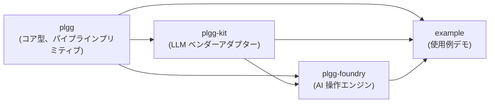
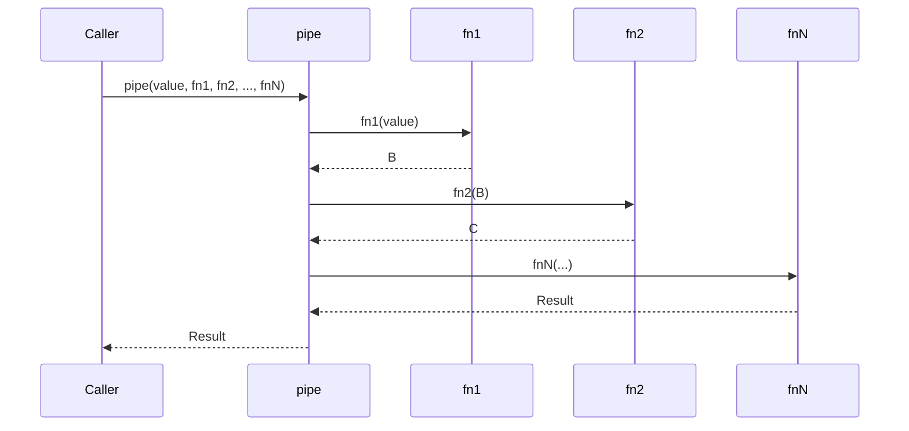
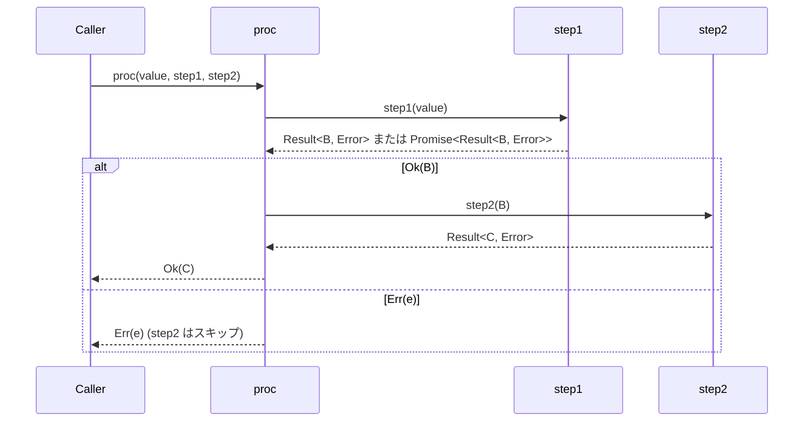
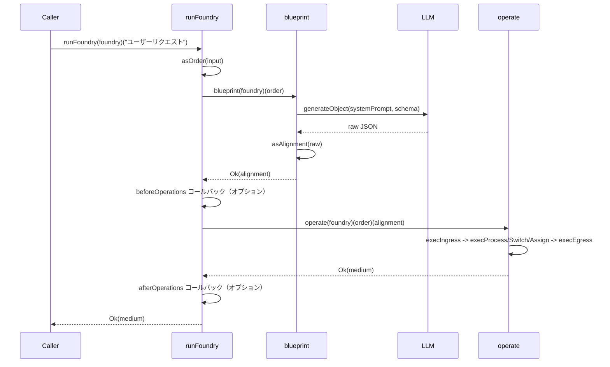

[English](application.md) | [Japanese](application_ja.md)

# Application Viewpoint

この viewpoint は、plgg システムのランタイム動作を説明します。パッケージ間のデータフロー、関数型パイプラインの実行方法、plgg-foundry が AI 駆動の操作シーケンスをオーケストレートする方法、plgg-kit が LLM ベンダー API にディスパッチする方法を扱います。

## パッケージ依存フロー

モノレポには、厳格な階層的依存順序を持つ 4 つのパッケージが含まれています。`plgg` は他のすべてのパッケージが依存する基盤パッケージです。`plgg-kit` は型システムを使用して LLM provider をモデル化するために `plgg` に依存します。`plgg-foundry` は AI オーケストレーション操作エンジンを実装するために `plgg` と `plgg-kit` の両方に依存します。`example` パッケージは 3 つすべてに依存します。

循環依存はありません。依存の方向は常に上位レベルから下位レベルのパッケージへです。

## plgg におけるパイプライン実行

plgg コアライブラリは、2 つの主要な合成プリミティブを通じてデータ変換を可能にします。

`pipe` は同期関数合成ユーティリティです。初期値と最大 21 個の関数を受け取り、各関数が前の関数の出力を受け取ります。各ステップの完全な静的型推論を提供します。

`cast` は `Result` を返す検証関数の同期パイプラインです。失敗したブランチからのシブリングエラーを蓄積し、最初の成功を伝播します。

`proc` は `cast` の非同期版です。値と `Procedural` を返す関数のチェーンを受け入れます。Promise と Result を各ステップで自動的にアンラップし、`Err` 値を伝播して次の関数を呼び出しません。

### 同期パイプラインフロー

### 非同期 Procedural パイプラインフロー

## Foundry 操作実行

`plgg-foundry` は AI 駆動の操作実行エンジンを実装します。メインエントリポイントは `runFoundry` で、3 つの順次フェーズをオーケストレートします。

**フェーズ 1 - Order 検証**: 呼び出し元の入力（文字列または `OrderSpec` オブジェクト）は `asOrder` を使用して `Order` に検証されます。

**フェーズ 2 - Blueprint (AI 計画)**: `blueprint(foundry)(order)` は `plgg-kit` の `generateObject` を介して LLM に構造化プロンプトを送信します。LLM は利用可能な apparatus を説明するシステムプロンプトを受け取り、`Alignment` — `analysis` フィールド、`ingress` エントリポイント、型付き操作のシーケンス (`assign`、`process`、`switch`)、および `egress` 出力マッピングを含む JSON オブジェクト — を返します。

**フェーズ 3 - Operate (実行)**: `operate(foundry)(order)(alignment)` は `ingress` から始まってアライメントを実行します。操作は順次実行されます。レジスタ環境 (`Env`) は文字列アドレス（例: `r0`、`r1`）を `Param` 値にマップします。

### runFoundry ライフサイクル

## ランタイムにおける操作ディスパッチ

`operate` 内では、`egress` に到達するかエラーが発生するまで操作を処理する再帰的なディスパッチループが動作します。操作カウントは `maxOperationLimit` に対して追跡されます。

- `ingress`: 直ちに `next` ポインタをたどって最初の操作に進みます。
- `assign`: アライメントスペックから JSON エンコードされた値を解析し、`address` のレジスタに書き込みます。
- `process`: `action` オペコードでプロセッサを検索し、変数名マッピングで入力レジスタを読み込み、`processor.fn` を呼び出し、出力をレジスタに書き込みます。
- `switch`: `action` オペコードでスイッチャーを検索し、`switcher.fn` を呼び出します。返り値 `[boolean, Dict]` に基づいてブランチを決定します。
- `egress`: レジスタから名前付き出力アドレスを読み取り、最終的な `Medium` を構築して返します。

## plgg-kit における LLM プロバイダーディスパッチ

`generateObject` は単一の LLM 抽象化エントリポイントです。ランタイムでは:

1. API キーを解決します: `Provider` 設定にインラインキーがあれば使用し、なければ環境変数から読み取ります。
2. `Provider` タグに基づいて適切なベンダーアダプターにディスパッチします。
3. `PromisedResult<unknown, Error>` を返します。

## エラー伝播

エラー処理はランタイム全体で統一されています。`PlggError` はドメインエラーユニオン (`InvalidError | Exception | SerializeError`) です。`proc` はスローされた例外を補足し、元のエラーを `parent` として持つ `Exception` でラップします。すべてのパイプラインプリミティブは `Result<T, E>` を返し、これらのプリミティブを使用する際にエラーが未捕捉の例外としてエスケープすることがありません。

## 前提条件

- **[Explicit]** パッケージ依存グラフは各 `package.json` で宣言されています。`plgg-foundry` は `file:` リンクを介して `plgg` と `plgg-kit` に依存しています。
- **[Explicit]** `runFoundry` は `src/plgg-foundry/src/Foundry/usecase/runFoundry.ts` で確認された公開 API エントリポイントです。
- **[Explicit]** `maxOperationLimit` は `makeFoundry` でデフォルト値 10 にハードコードされています。
- **[Explicit]** デフォルト LLM provider は `makeFoundry` でハードコードされた `openai("gpt-5.1")` です。
- **[Inferred]** レジスタファイル (`Env`) は単一の `runFoundry` 呼び出しにスコープされたエフェメラルなインメモリマップです。呼び出し間の永続化は観測されていません。
