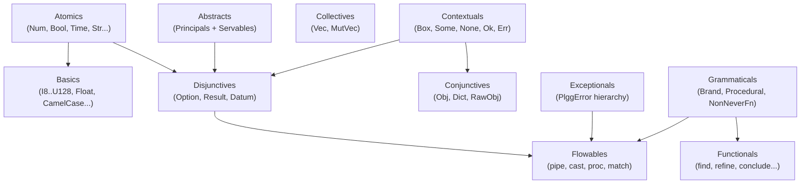
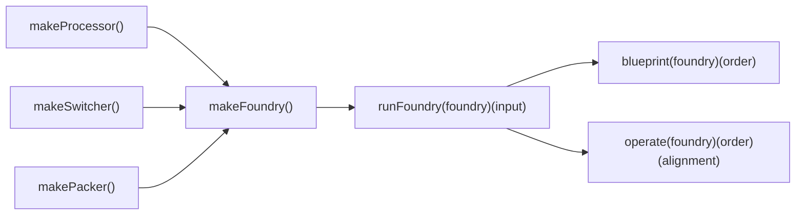

[English](component.md) | [Japanese](component_ja.md)

# Component Viewpoint

This viewpoint describes the internal structure of each package in the plgg monorepo, covering module boundaries, the category-based decomposition of `plgg`, the apparatus model of `plgg-foundry`, and the vendor adapter pattern of `plgg-kit`. See [Application Viewpoint](application.md) for runtime behavior and [Feature Viewpoint](feature.md) for capability inventory.

## Monorepo Package Map

The repository root contains four packages under `src/`:

| Package | Path | Version | Role |
|---|---|---|---|
| `plgg` | `src/plgg/` | 0.0.25 | Core functional type system and pipeline primitives |
| `plgg-foundry` | `src/plgg-foundry/` | 0.0.1 | AI-driven operation execution engine |
| `plgg-kit` | `src/plgg-kit/` | 0.0.1 | LLM vendor adapters (OpenAI, Anthropic, Google) |
| `example` | `src/example/` | unpublished | Usage demonstration using plgg domain modeling |

Each package has its own `tsconfig.json`, `vite.config.ts`, and `package.json`. TypeScript path aliases map the package name to `./src/*`, so imports like `plgg/Atomics` resolve to `src/plgg/src/Atomics/`.

### Package Internal Convention

Each package uses a consistent module convention: a top-level `src/index.ts` re-exports all public sub-modules. Sub-modules use two-level naming: `CategoryName/` contains a set of `*.ts` implementation files plus an `index.ts` barrel. Some sub-modules use a three-level structure with `model/` and `usecase/` sub-directories (observed in `plgg-foundry`).

## plgg Package — Category Decomposition

The `plgg` core package is organized into eleven named categories, each corresponding to a directory under `src/plgg/src/`.

### Abstracts

`src/plgg/src/Abstracts/` defines the typeclass infrastructure. It contains two sub-directories:

- `Principals/`: Functional programming typeclasses — `Functor`, `Apply`, `Applicative`, `Pointed`, `Chain`, `Monad`, `Foldable`, `Traversable`, `Monoid`, `Semigroup`. These are defined as TypeScript interfaces parameterized by a `KindKey` string literal. The `Kind.ts` file provides the higher-kinded type simulation via open interface augmentation (`MapKind1`, `MapKind2`, `MapKind3`, `MapKindDatum`).
- `Servables/`: Supporting interfaces — `Refinable<T>` (provides `is` type guard), `Castable<T>` (provides `as` validated cast), `JsonSerializable<T, J>` (provides `toJsonReady`/`fromJsonReady`).

### Atomics

`src/plgg/src/Atomics/` contains primitive wrapper types: `Num`, `BigInt`, `Bool`, `Bin` (binary buffer), `Time` (ISO date-time string), `SoftStr` (permissive string), and `Int` (abstract integer union). Each atomic exports a type, a `Refinable` instance, an `as*` cast function, and a `JsonSerializable` instance.

### Basics

`src/plgg/src/Basics/` contains refined types built on Atomics: fixed-width integer types (`I8`, `I16`, `I32`, `I64`, `I128`, `U8`, `U16`, `U32`, `U64`, `U128`), `Float`, branded string types (`Str`, `Alphabet`, `Alphanumeric`), and case-transformed string types (`CamelCase`, `PascalCase`, `KebabCase`, `SnakeCase`, `CapitalCase`). Each exports refinement functions.

### Collectives

`src/plgg/src/Collectives/` provides immutable and mutable array abstractions: `Vec<T>` (typed readonly array), `MutVec<T>` (mutable variant), `ReadonlyArray` utilities, and `VecLike` (structural interface).

### Conjunctives

`src/plgg/src/Conjunctives/` provides record types: `Obj<T>` (readonly record where all values are `Datum`), `Dict<T>` (homogeneous string-keyed record), `RawObj` (unconstrained object). Each includes `Refinable`, `Castable`, and `JsonSerializable` instances.

### Contextuals

`src/plgg/src/Contextuals/` provides container types: `Box<TAG, CONTENT>` (tagged nominal wrapper), `Some<T>`, `None` (Option components), `Ok<T>`, `Err<E>` (Result components), `Icon` (tag-only variant), `UntaggedBox` (content-only wrapper), `NominalDatum` and `OptionalDatum` (datum wrappers), `Pattern` (pattern matching witness type).

### Disjunctives

`src/plgg/src/Disjunctives/` provides union types with full typeclass instances: `Option<T>` (= `Some<T> | None`) and `Result<T, E>` (= `Ok<T> | Err<E>`). Both are registered in the `MapKind1`/`MapKind2` registries, making them usable with generic typeclass functions. Also contains union type definitions: `Atomic`, `Basic`, `Datum`, `ObjLike`, `JsonReady`.

### Exceptionals

`src/plgg/src/Exceptionals/` defines the error hierarchy: `BaseError` (abstract base with `parent` and `sibling` chains), `InvalidError` (validation failures), `SerializeError` (serialization failures), `DeserializeError`, `Exception` (general-purpose), `PlggError` (union of domain errors). Exports `isPlggError`, `printPlggError`, `unreachable`, and `toError`.

### Flowables

`src/plgg/src/Flowables/` provides pipeline primitives: `pipe` (sync function composition), `cast` (sync Result-chaining), `proc` (async Procedural-chaining), `flow` (point-free composition from left to right), `match` (exhaustive pattern matching for Box/Icon/atomic values).

### Functionals

`src/plgg/src/Functionals/` provides utility functions: `bind` (partial application), `tap` (side-effect injection), `pass` (identity with side effect), `find` (safe array lookup), `filter` (typed filter), `defined` (undefined guard), `refine` (predicate-based refinement), `conclude` (array of Results to Result of array), `debug` (console logging tap), `env` (environment variable access), `hold` (memoization), `atIndex`/`atProp` (safe accessors), `tryCatch` (exception-safe wrapper), `postJson` (HTTP POST helper), `forProp`/`forOptionProp`/`forContent` (field-level cast composers).

### Grammaticals

`src/plgg/src/Grammaticals/` defines type-level utilities: `Brand<T, B>` (nominal type branding), `Function<A, B>` (typed function type), `NonNeverFn<F>` (excludes never-returning functions), `Procedural<T>` (union of sync/async Result-returning forms), `PromisedResult<T, E>` (async Result alias), `BoolAlgebra` (type-level boolean logic).

### Structural Overview

## plgg-foundry Package — Apparatus Model

The `plgg-foundry` package is organized into two top-level modules (`Alignment`, `Foundry`) and an `Example` module for reference implementations.

### Alignment Module

`src/plgg-foundry/src/Alignment/model/` defines the data structures for AI-generated operation plans:

- `Alignment`: An `Obj<{analysis, ingress, operations, egress}>` — the complete operation plan.
- `Ingress`: Entry point with a `next` pointer.
- `Operation`: Union of `Assign | Process | Switch`.
- `Assign`: Writes a JSON-encoded literal value to a register address.
- `Process`: Executes a named processor, mapping inputs and outputs to registers via `NameTableEntry[]`.
- `Switch`: Executes a named switcher, branches on boolean result, maps conditional outputs.
- `Egress`: Collects named register values as the final output.

### Foundry Module

`src/plgg-foundry/src/Foundry/model/` defines the runtime engine structures:

- `Foundry`: The main configuration type holding `provider`, `description`, `maxOperationLimit`, `apparatuses`, and optional `beforeOperations`/`afterOperations` callbacks.
- `Apparatus`: A `Box` union of `Processor | Switcher | Packer`.
- `Processor`: Named apparatus with `fn: (medium: Medium) => unknown`, `arguments`, optional `returns`.
- `Switcher`: Named apparatus with `fn: (medium: Medium) => [boolean, Dict]`, `arguments`, optional `returnsWhenTrue`/`returnsWhenFalse`.
- `Packer`: Output field specification for egress.
- `Medium`: Passes both `alignment` and `params` (current register values) to apparatus functions.
- `Env`: Runtime register file mapping addresses to `Param` values.
- `OperationContext`: Carries `foundry`, `alignment`, `order`, `env`, and `operationCount` through recursive execution.

`src/plgg-foundry/src/Foundry/usecase/` contains three functions:
- `blueprint`: Generates an `Alignment` from an `Order` using AI.
- `operate`: Executes an `Alignment` against a `Foundry`.
- `runFoundry`: Composes validation, blueprint, and operate into the public API.

### Foundry Component Structure

## plgg-kit Package — Vendor Adapter Pattern

`src/plgg-kit/src/LLMs/` is organized into three sub-directories:

- `model/Provider.ts`: Defines `Provider = OpenAI | Anthropic | Google`, each as a `Box<"TAG", Config>` where `Config` holds `model` and optional `apiKey`. Constructor functions `openai()`, `anthropic()`, `google()` accept either a model string or a config object.
- `usecase/generateObject.ts`: Single-function facade that resolves the API key and dispatches to the appropriate vendor adapter.
- `vendor/OpenAI.ts`, `vendor/Anthropic.ts`, `vendor/Google.ts`: Each exports a `reqObject*` function that wraps the vendor's SDK or REST API call and returns `PromisedResult<unknown, Error>`.

## example Package

`src/example/src/modeling/Article.ts` demonstrates domain modeling using plgg types: `Obj<{id, createdAt, name, memo}>` with typed fields, refinements (name length), and cast composition via `cast`. The `example` package does not export a library; it serves as a reference implementation.

## Naming Conventions

All observable naming conventions follow consistent patterns:
- Type constructors: PascalCase (`Obj`, `Alignment`, `Foundry`).
- Type guard functions: `is*` prefix (`isObj`, `isAlignment`).
- Safe cast functions: `as*` prefix (`asObj`, `asAlignment`).
- Constructor/factory functions: `make*` prefix (`makeFoundry`, `makeProcessor`).
- Typeclass instances: `{lowerCamelCaseName}{TypeclassName}` suffix (`resultFunctor`, `optionMonad`).
- Extracted methods: matching lower camelCase (`mapResult`, `chainOption`).

## Assumptions

- **[Explicit]** The eleven category names in `plgg` (`Abstracts`, `Atomics`, `Basics`, `Collectives`, `Conjunctives`, `Contextuals`, `Disjunctives`, `Exceptionals`, `Flowables`, `Functionals`, `Grammaticals`) are verified by the directory listing of `src/plgg/src/`.
- **[Explicit]** Path alias resolution is declared in each package's `tsconfig.json` under `paths`.
- **[Explicit]** `plgg-foundry` exports two top-level modules (`Alignment`, `Foundry`) as verified by `src/plgg-foundry/src/index.ts`.
- **[Inferred]** The `model/` + `usecase/` sub-directory pattern within `plgg-foundry` is an intentional separation of data structures from behavior, following a ports-and-adapters style within the package.
- **[Inferred]** `example` is unpublished (no `"publish"` script beyond the common template); its purpose is documentation and testing rather than distribution.
