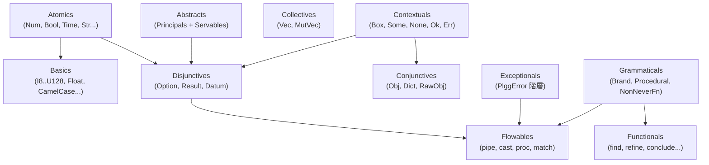

[English](component.md) | [Japanese](component_ja.md)

# Component Viewpoint

この viewpoint は plgg モノレポの各パッケージの内部構造を説明します。モジュール境界、`plgg` のカテゴリベースの分解、`plgg-foundry` の apparatus モデル、`plgg-kit` のベンダーアダプターパターンを扱います。ランタイム動作については [Application Viewpoint](application_ja.md)、機能インベントリについては [Feature Viewpoint](feature_ja.md) を参照してください。

## モノレポパッケージマップ

リポジトリルートには `src/` 以下に 4 つのパッケージが含まれています:

| パッケージ | パス | バージョン | 役割 |
|---|---|---|---|
| `plgg` | `src/plgg/` | 0.0.25 | コア関数型型システムとパイプラインプリミティブ |
| `plgg-foundry` | `src/plgg-foundry/` | 0.0.1 | AI 駆動の操作実行エンジン |
| `plgg-kit` | `src/plgg-kit/` | 0.0.1 | LLM ベンダーアダプター (OpenAI, Anthropic, Google) |
| `example` | `src/example/` | 未公開 | plgg ドメインモデリングを使用した使用例 |

各パッケージは独自の `tsconfig.json`、`vite.config.ts`、`package.json` を持ちます。TypeScript パスエイリアスはパッケージ名を `./src/*` にマップするため、`plgg/Atomics` のようなインポートは `src/plgg/src/Atomics/` に解決されます。

## plgg パッケージ — カテゴリ分解

`plgg` コアパッケージは 11 の名前付きカテゴリに整理されており、各カテゴリは `src/plgg/src/` 以下のディレクトリに対応しています。

### Abstracts

`src/plgg/src/Abstracts/` は型クラスインフラを定義します:

- `Principals/`: 関数型プログラミング型クラス — `Functor`、`Apply`、`Applicative`、`Pointed`、`Chain`、`Monad`、`Foldable`、`Traversable`、`Monoid`、`Semigroup`。これらは `KindKey` 文字列リテラルでパラメータ化された TypeScript インターフェースとして定義されます。`Kind.ts` は開放インターフェース拡張 (`MapKind1`、`MapKind2`、`MapKind3`) を介して高階カインド型シミュレーションを提供します。
- `Servables/`: サポートインターフェース — `Refinable<T>`（`is` 型ガードを提供）、`Castable<T>`（`as` 検証キャストを提供）、`JsonSerializable<T, J>`（`toJsonReady`/`fromJsonReady` を提供）。

### Atomics

`src/plgg/src/Atomics/` はプリミティブラッパー型を含みます: `Num`、`BigInt`、`Bool`、`Bin`（バイナリバッファ）、`Time`（ISO 日時文字列）、`SoftStr`（許容的な文字列）、`Int`（抽象整数ユニオン）。

### Basics

`src/plgg/src/Basics/` は Atomics 上に構築された精製型を含みます: 固定幅整数型（`I8`〜`I128`、`U8`〜`U128`）、`Float`、ブランド文字列型（`Str`、`Alphabet`、`Alphanumeric`）、ケース変換文字列型（`CamelCase`、`PascalCase`、`KebabCase`、`SnakeCase`、`CapitalCase`）。

### Collectives

`src/plgg/src/Collectives/` はイミュータブルおよびミュータブル配列抽象化を提供します: `Vec<T>`（型付き読み取り専用配列）、`MutVec<T>`（ミュータブル変種）、`ReadonlyArray` ユーティリティ、`VecLike`（構造的インターフェース）。

### Conjunctives

`src/plgg/src/Conjunctives/` はレコード型を提供します: `Obj<T>`（すべての値が `Datum` である読み取り専用レコード）、`Dict<T>`（同質な文字列キー辞書）、`RawObj`（制約のないオブジェクト）。

### Contextuals

`src/plgg/src/Contextuals/` はコンテナ型を提供します: `Box<TAG, CONTENT>`（タグ付き名目ラッパー）、`Some<T>`、`None`（Option コンポーネント）、`Ok<T>`、`Err<E>`（Result コンポーネント）、`Icon`（タグのみのバリアント）、`UntaggedBox`、`NominalDatum`、`OptionalDatum`、`Pattern`。

### Disjunctives

`src/plgg/src/Disjunctives/` は完全な型クラスインスタンスを持つユニオン型を提供します: `Option<T>`（= `Some<T> | None`）と `Result<T, E>`（= `Ok<T> | Err<E>`）。両方とも `MapKind1`/`MapKind2` レジストリに登録されています。

### Exceptionals

`src/plgg/src/Exceptionals/` はエラー階層を定義します: `BaseError`（`parent` と `sibling` チェーンを持つ抽象基底）、`InvalidError`（検証失敗）、`SerializeError`（シリアライズ失敗）、`DeserializeError`、`Exception`（汎用）、`PlggError`（ドメインエラーユニオン）。

### Flowables

`src/plgg/src/Flowables/` はパイプラインプリミティブを提供します: `pipe`（同期関数合成）、`cast`（同期 Result チェーン）、`proc`（非同期 Procedural チェーン）、`flow`（ポイントフリー合成）、`match`（Box/Icon/アトミック値の網羅的パターンマッチング）。

### Functionals

`src/plgg/src/Functionals/` はユーティリティ関数を提供します: `bind`、`tap`、`pass`、`find`、`filter`、`defined`、`refine`、`conclude`、`debug`、`env`、`hold`、`atIndex`、`atProp`、`tryCatch`、`postJson`、`forProp`、`forOptionProp`、`forContent`、`unbox`。

### Grammaticals

`src/plgg/src/Grammaticals/` は型レベルユーティリティを定義します: `Brand<T, B>`（名目型ブランディング）、`Function<A, B>`、`NonNeverFn<F>`、`Procedural<T>`（同期/非同期 Result 返却形式のユニオン）、`PromisedResult<T, E>`、`BoolAlgebra`。

### 構造的概要

## plgg-foundry パッケージ — Apparatus モデル

`plgg-foundry` パッケージは 2 つのトップレベルモジュール（`Alignment`、`Foundry`）と参照実装のための `Example` モジュールに整理されています。

### Alignment モジュール

`src/plgg-foundry/src/Alignment/model/` は AI 生成の操作計画のデータ構造を定義します:

- `Alignment`: 完全な操作計画 `Obj<{analysis, ingress, operations, egress}>`。
- `Ingress`: `next` ポインタを持つエントリポイント。
- `Operation`: `Assign | Process | Switch` のユニオン。
- `Assign`: レジスタアドレスに JSON エンコードされたリテラル値を書き込みます。
- `Process`: 名前付きプロセッサを実行し、`NameTableEntry[]` を介してレジスタへの入出力をマッピングします。
- `Switch`: 名前付きスイッチャーを実行し、ブール結果に基づいてブランチします。
- `Egress`: 名前付きレジスタ値を最終出力として収集します。

### Foundry モジュール

`src/plgg-foundry/src/Foundry/model/` はランタイムエンジン構造を定義します:

- `Foundry`: `provider`、`description`、`maxOperationLimit`、`apparatuses`、オプションのコールバックを持つメイン設定型。
- `Apparatus`: `Processor | Switcher | Packer` の `Box` ユニオン。
- `Processor`: `fn: (medium: Medium) => unknown` を持つ名前付き apparatus。
- `Switcher`: `fn: (medium: Medium) => [boolean, Dict]` を返す名前付き apparatus。
- `Medium`: `alignment` と `params`（現在のレジスタ値）の両方を apparatus 関数に渡します。
- `Env`: アドレスを `Param` 値にマップするランタイムレジスタファイル。

## plgg-kit パッケージ — ベンダーアダプターパターン

`src/plgg-kit/src/LLMs/` は 3 つのサブディレクトリに整理されています:

- `model/Provider.ts`: `Provider = OpenAI | Anthropic | Google` を定義します。各プロバイダーは `Box<"TAG", Config>` です。
- `usecase/generateObject.ts`: API キーを解決して適切なベンダーアダプターにディスパッチする単一関数ファサード。
- `vendor/OpenAI.ts`、`vendor/Anthropic.ts`、`vendor/Google.ts`: 各ベンダーの `reqObject*` 関数を実装します。

## 命名規則

- 型コンストラクター: PascalCase（`Obj`、`Alignment`、`Foundry`）。
- 型ガード関数: `is*` プレフィックス（`isObj`、`isAlignment`）。
- 安全なキャスト関数: `as*` プレフィックス（`asObj`、`asAlignment`）。
- コンストラクター/ファクトリー関数: `make*` プレフィックス（`makeFoundry`、`makeProcessor`）。
- 型クラスインスタンス: `{名前}{TypeclassName}` サフィックス（`resultFunctor`、`optionMonad`）。

## 前提条件

- **[Explicit]** `plgg` の 11 のカテゴリ名は `src/plgg/src/` のディレクトリ一覧で確認されています。
- **[Explicit]** パスエイリアスの解決は各パッケージの `tsconfig.json` で宣言されています。
- **[Inferred]** `plgg-foundry` 内の `model/` + `usecase/` サブディレクトリパターンは、パッケージ内でデータ構造と動作を意図的に分離したポート-アダプターパターンです。
