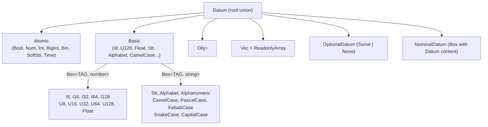
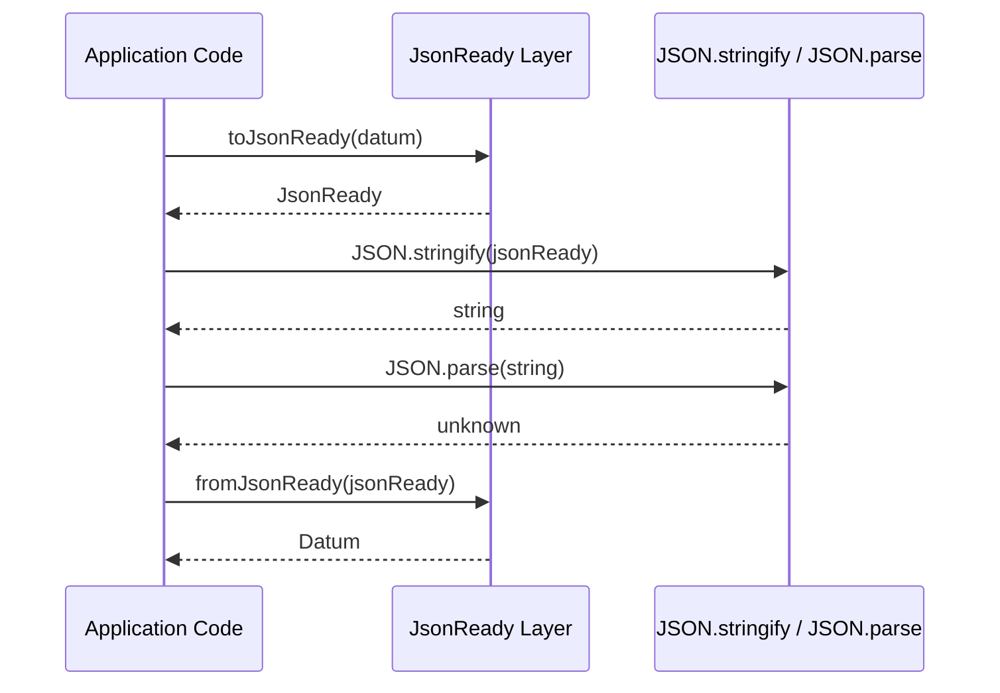
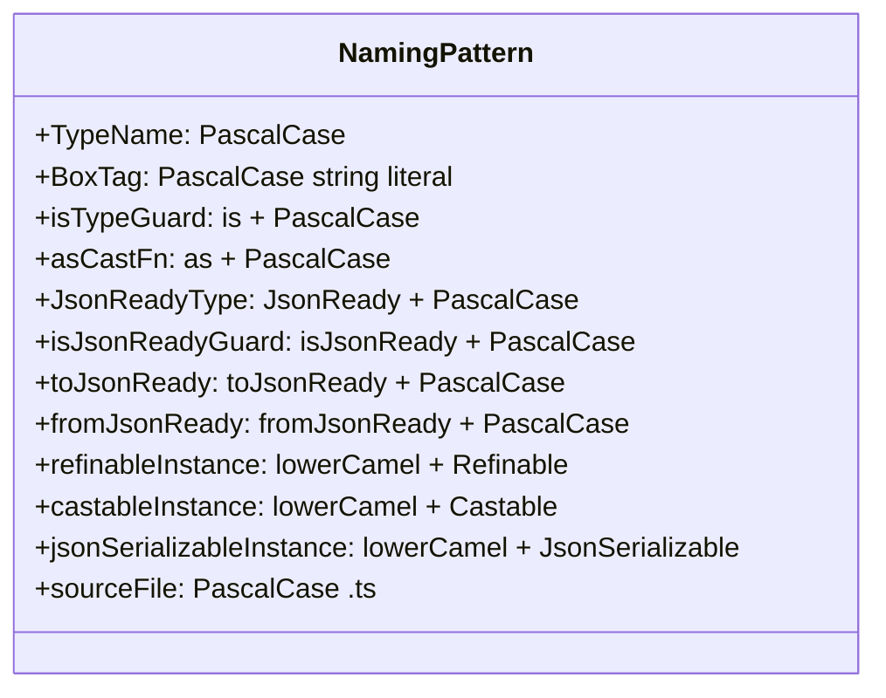
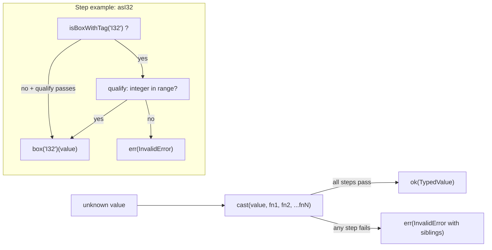

[English](data.md) | [Japanese](data_ja.md)

# Data Viewpoint

This viewpoint covers how data is structured, serialized, and validated across the plgg monorepo. The repository contains no external database and no persistent file store; all data concerns are realized as in-memory TypeScript types with a systematic JSON serialization layer. The viewpoint analyzes the type hierarchy in `plgg`, the `JsonReady` protocol, the register-machine data model in `plgg-foundry`, and the naming conventions and validation rules applied uniformly across all packages. See [Component Viewpoint](component.md) for module boundaries and [Application Viewpoint](application.md) for runtime behavior.

## Type Hierarchy

The `plgg` package defines a closed type hierarchy that stratifies all storable values into two strata: Atomic and Basic.

**Atomic** types (`src/plgg/src/Disjunctives/Atomic.ts`) are the primitive building blocks: `Bool` (JavaScript `boolean`), `Num` (JavaScript `number`, including safe `bigint` promotion), `Int` (abstract integer union), `BigInt` (JavaScript `bigint`), `Bin` (`Uint8Array`), `SoftStr` (unrestricted string), and `Time` (JavaScript `Date`). None of these carry a nominal brand at the type level; they map directly to JavaScript runtime primitives or standard objects.

**Basic** types (`src/plgg/src/Disjunctives/Basic.ts`) are refined wrappers encoded as `Box<TAG, content>` pairs. A `Box<TAG, CONTENT>` is a readonly plain object with two keys: `__tag: TAG` (a string literal) and `content: CONTENT` (`src/plgg/src/Contextuals/Box.ts`). The Basic union includes: fixed-width integers `I8`, `I16`, `I32`, `I64`, `I128` (signed) and `U8`, `U16`, `U32`, `U64`, `U128` (unsigned), `Float`, and branded strings `Str` (non-empty), `Alphabet`, `Alphanumeric`, `CamelCase`, `CapitalCase`, `KebabCase`, `PascalCase`, `SnakeCase`. Each Basic type carries a string literal tag equal to its type name (e.g., `Box<"I32", number>`, `Box<"Str", string>`).

**Datum** (`src/plgg/src/Disjunctives/Datum.ts`) is the root union: any `Atomic`, `Basic`, `Obj` (record of `Datum` values), `ReadonlyArray<Datum>` (aliased as `Vec<Datum>`), `OptionalDatum<DatumCore>` (wrapping `Some<T> | None`), or `NominalDatum<string, DatumCore>` (a tagged Box carrying a DatumCore). `Datum` is the constraint applied to all `Obj` values and `Vec` elements.

### Type Hierarchy Overview

## Serialization Format

The repository defines a formal JSON serialization protocol centered on the `JsonReady` type (`src/plgg/src/Disjunctives/JsonReady.ts`). `JsonReady` is the counterpart type to `Datum` that is safe to pass to `JSON.stringify` without precision or type loss. The full round-trip is `toJsonReady(datum) → JsonReady → JSON.stringify → string → JSON.parse → fromJsonReady → Datum`, implemented as `jsonEncode` and `jsonDecode` in `JsonReady.ts`.

**Atomic serialization rules** (evidence: `src/plgg/src/Disjunctives/Atomic.ts` and individual atomic files):

| Atomic type | Runtime type | JsonReady type | Encoding |
|---|---|---|---|
| `Bool` | `boolean` | `boolean` | identity |
| `Num` | `number` | `number` | identity |
| `SoftStr` | `string` | `string` | identity |
| `Int` | `number` (integer) | `number` | identity |
| `Time` | `Date` | `string` | `Date.toISOString()` — strict ISO 8601 format `YYYY-MM-DDTHH:mm:ss(.sss)?Z` |
| `BigInt` | `bigint` | `{ type: "bigint"; value: string }` | stringified decimal |
| `Bin` | `Uint8Array` | `{ type: "bin"; value: string }` | base64 encoded via `btoa` |

`Bool`, `Num`, `SoftStr`, and `Int` pass through as-is. `Time` serializes to an ISO 8601 UTC string; `isJsonReadyTime` enforces the regex `^\d{4}-\d{2}-\d{2}T\d{2}:\d{2}:\d{2}(\.\d{3})?Z$`. `BigInt` is wrapped in a discriminated object with `type: "bigint"` and a string value field. `Bin` uses a discriminated object with `type: "bin"` and a base64-encoded string value field.

**Container serialization rules**:

`Obj` serializes to `{ [key: string]: JsonReady }` by recursively converting each value. `Vec<A>` serializes to `ReadonlyArray<JsonReady>`. `Some<T>` serializes as `Box<"Some", JsonReadyCore>`, which retains the `__tag` / `content` structure. `None` serializes with `__tag: "None"` and no `content` field. `NominalDatum` (any other tagged Box) serializes preserving the `__tag` and recursively converting `content`.

### Serialization Round-Trip

## Frontmatter Schemas

No markdown frontmatter schemas are enforced programmatically in the source packages (`plgg`, `plgg-foundry`, `plgg-kit`, `example`). The `.workaholic/specs/` specification files carry YAML frontmatter with a consistent informal schema (fields: `title`, `description`, `category`, `modified_at`, `commit_hash`), but this schema is maintained by convention rather than by code validation. No schema validation tool for this frontmatter was observed in the repository.

## Naming Conventions

The following naming conventions are enforced uniformly across all source packages.

**Type names** use PascalCase and often double as a category label for groups of related definitions: `Obj`, `Vec`, `Alignment`, `Foundry`, `Order`, `Medium`, `Env`.

**Box tag strings** are PascalCase string literals identical to their type name. A `Box<"I32", number>` has `__tag === "I32"`. A `Box<"Str", string>` has `__tag === "Str"`. Provider boxes use `"OpenAI"`, `"Anthropic"`, `"Google"` as tag strings (`src/plgg-kit/src/LLMs/model/Provider.ts`). Contextual boxes use `"Some"`, `"None"`, `"Ok"`, `"Err"` (`src/plgg/src/Contextuals/`).

**Type guard functions** use the `is*` prefix: `isObj`, `isVec`, `isBool`, `isI32`, `isStr`, `isAlignment`, `isAssign`, `isProcess`, `isSwitch`. The pattern is `is` + PascalCase type name.

**Safe cast functions** use the `as*` prefix: `asObj`, `asVec`, `asBool`, `asI32`, `asStr`, `asAlignment`, `asOrder`. The pattern is `as` + PascalCase type name.

**JsonReady types** use the `JsonReady*` prefix: `JsonReadyBool`, `JsonReadyNum`, `JsonReadyBin`, `JsonReadyTime`, `JsonReadyBigInt`, `JsonReadyAtomic`, `JsonReadyObj`, `JsonReadyVec`, `JsonReadyCore`, `JsonReady`.

**JsonReady type guards** use the `isJsonReady*` prefix: `isJsonReadyBool`, `isJsonReadyTime`, `isJsonReadyBin`, `isJsonReadyBigInt`, `isJsonReadyAtomic`, `isJsonReadyObj`, `isJsonReadyVec`.

**Serialization functions** use `toJsonReady*` / `fromJsonReady*`: `toJsonReadyTime`, `fromJsonReadyBin`, `toJsonReadyBigInt`, etc.

**JsonSerializable instances** use the pattern `{lowerCamelCaseName}JsonSerializable`: `numJsonSerializable`, `boolJsonSerializable`, `binJsonSerializable`, `timeJsonSerializable`, `objJsonSerializer`, `vecJsonSerializer`.

**Refinable instances** use `{lowerCamelCaseName}Refinable`: `numRefinable`, `boolRefinable`, `binRefinable`, `timeRefinable`, `vecRefinable`.

**Castable instances** use `{lowerCamelCaseName}Castable`: `numCastable`, `boolCastable`, `binCastable`, `timeCastable`, `vecCastable`, `recCastable`.

**Source file naming** mirrors the type name with PascalCase for types (`Num.ts`, `Bool.ts`, `Time.ts`, `Bin.ts`, `Alignment.ts`, `Foundry.ts`) and `index.ts` for barrels.

**Spec file naming** uses the viewpoint slug in kebab-case for English files and appends `_ja` for Japanese translations: `component.md`, `component_ja.md`, `application.md`, `application_ja.md`.

### Naming Convention Summary

## Validation Rules

All validation in the codebase is performed through a unified `Result<T, InvalidError>` pipeline. No external schema validation library is used; validation is implemented in pure TypeScript.

**`Refinable<T>`** (`src/plgg/src/Abstracts/Servables/Refinable.ts`) is a single-method interface providing the `is(value: unknown): value is T` type guard. Every type in the system exposes a `Refinable` instance for its specific variant (e.g., `binRefinable`, `timeRefinable`, `strRefinable`).

**`Castable<T>`** (`src/plgg/src/Abstracts/Servables/Castable.ts`) is a single-method interface providing `as(value: unknown): Result<T, InvalidError>`. It converts an untyped value into a typed `Result`, returning `ok(value)` on success and `err(new InvalidError({message}))` on failure.

**`cast` pipeline** (`src/plgg/src/Flowables/cast.ts`) is the primary composition mechanism. It accepts a value and a sequence of `A -> Result<B, InvalidError>` functions, threading the result through each step in order. If any step fails, the error accumulates `sibling` errors from all failed steps. The `cast` function is overloaded to support up to 21 steps. This pattern is used pervasively for composite type validation, as seen in `asAlignment`, `asOrder`, and `asArticle`.

**`refine`** (`src/plgg/src/Functionals/refine.ts`) validates a typed value against an arbitrary predicate, returning the same value as `ok(a)` or an `InvalidError` when the predicate fails. It is used inline within `cast` pipelines for business-rule constraints (e.g., `refine(str => str.length >= 3, "Name must be at least 3 characters long")` in `src/example/src/modeling/Article.ts`).

**`forProp` / `forOptionProp`** are field-extraction helpers that apply a cast function to a named property of an `Obj`. They are used to build record validators from individual field validators in a compositional style.

**Range constraints on Basic integer types** are enforced at cast time. For example, `asI32` (`src/plgg/src/Basics/I32.ts`) checks `value >= -2147483648 && value <= 2147483647` before wrapping in `Box<"I32", number>`. Each fixed-width integer type defines its own range check inline.

**`InvalidError`** (`src/plgg/src/Exceptionals/InvalidError.ts`) is the sole error type produced by all validation operations. It extends `BaseError` with a `sibling: ReadonlyArray<InvalidError>` field for collecting parallel validation failures, a `parent` chain for wrapping lower-level errors, and a string `message`.

### Validation Pipeline Flow

## plgg-foundry Register Machine Data

`plgg-foundry` introduces a register-machine data model distinct from the `Datum` type system. Registers are identified by `Address` (plain `string`, e.g., `"r0"`, `"r1"`), and each register holds a `Param` value (`type Param = unknown`). The `Env` type is `Readonly<Record<Address, Param>>`. The `NameTable` maps `VariableName` strings to `Address` strings, and `NameTableEntry` is a `{ variableName: VariableName; address: Address }` pair that bridges function argument names to register addresses at runtime.

The `Alignment` type (`src/plgg-foundry/src/Alignment/model/Alignment.ts`) is the AI-generated operation plan serialized as a plain `Obj<{analysis: Str, ingress: Ingress, operations: Vec<Operation>, egress: Egress}>`. Its operations (`Assign`, `Process`, `Switch`) carry a discriminant `type` field (`"assign"`, `"process"`, `"switch"`) that is used for runtime dispatch. The `Assign` operation stores a JSON-encoded value in its `value: string` field, meaning it embeds a JSON-in-string payload.

The `Order` type (`src/plgg-foundry/src/Foundry/model/Order.ts`) carries `text: Str` (a non-empty branded string) and `files: Vec<Bin>` (binary attachments as `Uint8Array` elements).

## Assumptions

- **[Explicit]** The `Datum` type hierarchy (Atomic, Basic, Obj, Vec, OptionalDatum, NominalDatum) is defined in `src/plgg/src/Disjunctives/Datum.ts` and its imports.
- **[Explicit]** `JsonReady` serialization with `toJsonReady`/`fromJsonReady` and `jsonEncode`/`jsonDecode` is defined in `src/plgg/src/Disjunctives/JsonReady.ts`.
- **[Explicit]** `Time` serializes to ISO 8601 UTC; the regex `^\d{4}-\d{2}-\d{2}T\d{2}:\d{2}:\d{2}(\.\d{3})?Z$` is in `src/plgg/src/Atomics/Time.ts`.
- **[Explicit]** `BigInt` and `Bin` serialize to discriminated envelope objects (`{type: "bigint", value: string}` and `{type: "bin", value: string}`) as defined in `src/plgg/src/Atomics/BigInt.ts` and `src/plgg/src/Atomics/Bin.ts`.
- **[Explicit]** All validation is performed through `Result<T, InvalidError>` without external schema libraries; evidence in `src/plgg/src/Flowables/cast.ts`, `src/plgg/src/Functionals/refine.ts`.
- **[Explicit]** Range constraints for fixed-width integer types are implemented inline in each `as*` function (e.g., `asI32` checks `>= -2147483648 && <= 2147483647`).
- **[Explicit]** The `.workaholic/specs/` frontmatter fields (`title`, `description`, `category`, `modified_at`, `commit_hash`) are used by convention; no programmatic validator is observed.
- **[Inferred]** The discriminant envelope pattern for `BigInt` and `Bin` (`{type: "bigint"}`, `{type: "bin"}`) is chosen to allow round-trip through `JSON.stringify`/`JSON.parse` without data loss for types that JSON natively cannot represent (arbitrary-precision integers and binary buffers).
- **[Inferred]** `Param = unknown` in the register machine is intentionally untyped; the type system boundary is enforced at apparatus function boundaries (`Processor`, `Switcher`) rather than at the register level.
- **[Inferred]** The `Assign` operation's `value: string` field holds a JSON-encoded payload (documented in `src/plgg-foundry/src/Alignment/model/Assign.ts` comments) as a deliberate embedding of serialized data within the operation plan.
