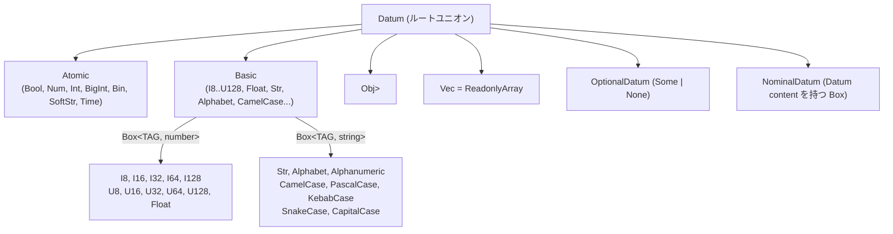
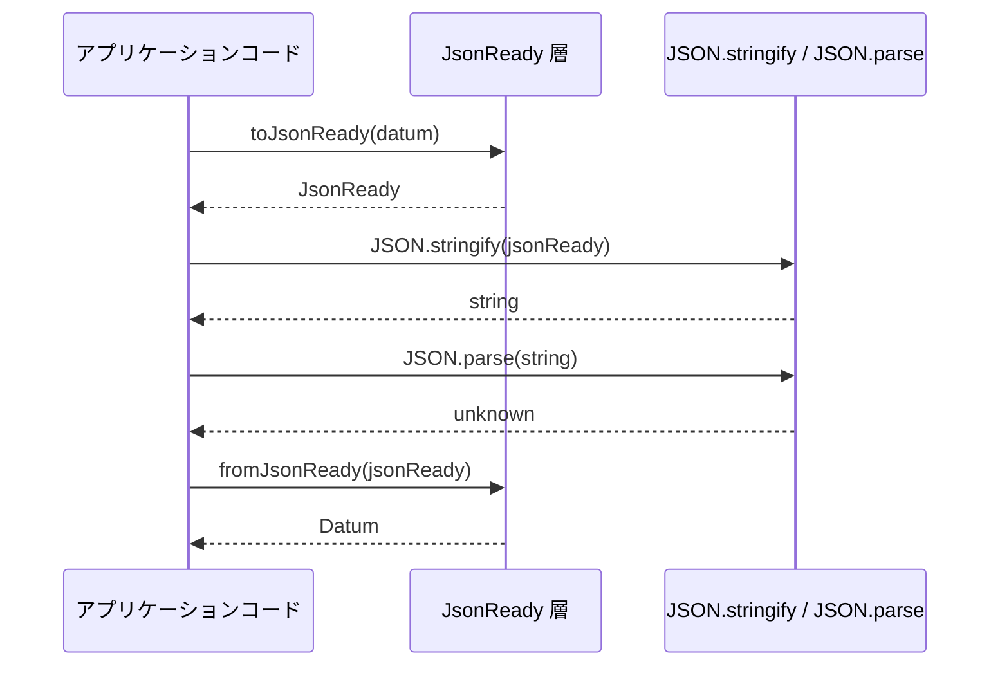
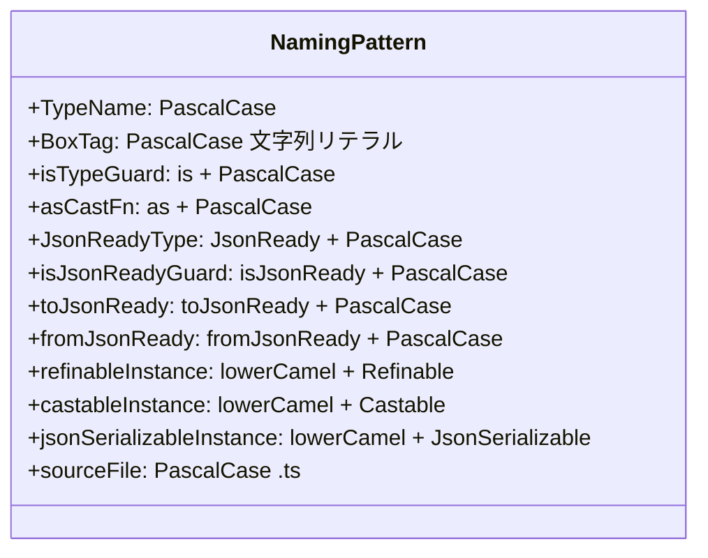
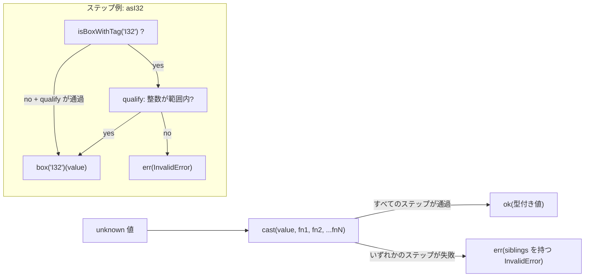

[English](data.md) | [Japanese](data_ja.md)

# Data Viewpoint

この viewpoint は、plgg monorepo 全体でデータがどのように構造化、シリアライズ、バリデーションされるかを扱います。このリポジトリには外部データベースも永続ファイルストアも存在せず、すべてのデータに関する関心事は、体系的な JSON シリアライゼーション層を持つインメモリ TypeScript 型として実現されています。この viewpoint では、`plgg` の型ヒエラルキー、`JsonReady` プロトコル、`plgg-foundry` のレジスタマシンデータモデル、およびすべてのパッケージに均一に適用される命名規則とバリデーションルールを分析します。module 境界については [Component Viewpoint](component_ja.md)、runtime behavior については [Application Viewpoint](application_ja.md) を参照してください。

## 型ヒエラルキー

`plgg` パッケージは、すべての格納可能な値を Atomic と Basic の 2 つの層に分類する閉じた型ヒエラルキーを定義しています。

**Atomic** 型 (`src/plgg/src/Disjunctives/Atomic.ts`) は基本的な構成要素です: `Bool` (JavaScript `boolean`)、`Num` (JavaScript `number`、安全な `bigint` 昇格を含む)、`Int` (抽象整数ユニオン)、`BigInt` (JavaScript `bigint`)、`Bin` (`Uint8Array`)、`SoftStr` (制約なし文字列)、`Time` (JavaScript `Date`)。これらのいずれも型レベルで公称ブランドを持たず、JavaScript の runtime プリミティブまたは標準オブジェクトに直接マッピングされます。

**Basic** 型 (`src/plgg/src/Disjunctives/Basic.ts`) は、`Box<TAG, content>` ペアとしてエンコードされた精製ラッパーです。`Box<TAG, CONTENT>` は、`__tag: TAG` (文字列リテラル) と `content: CONTENT` の 2 つのキーを持つ readonly プレーンオブジェクトです (`src/plgg/src/Contextuals/Box.ts`)。Basic ユニオンには: 固定幅整数 `I8`、`I16`、`I32`、`I64`、`I128` (符号付き) と `U8`、`U16`、`U32`、`U64`、`U128` (符号なし)、`Float`、ブランド付き文字列 `Str` (非空)、`Alphabet`、`Alphanumeric`、`CamelCase`、`CapitalCase`、`KebabCase`、`PascalCase`、`SnakeCase` が含まれます。各 Basic 型はその型名と等しい文字列リテラルタグを持ちます (例: `Box<"I32", number>`、`Box<"Str", string>`)。

**Datum** (`src/plgg/src/Disjunctives/Datum.ts`) はルートユニオンです: 任意の `Atomic`、`Basic`、`Obj` (Datum 値のレコード)、`ReadonlyArray<Datum>` (`Vec<Datum>` としてエイリアス)、`OptionalDatum<DatumCore>` (`Some<T> | None` をラップ)、または `NominalDatum<string, DatumCore>` (DatumCore を持つタグ付き Box)。`Datum` はすべての `Obj` 値と `Vec` 要素に適用される制約です。

### 型ヒエラルキー概要

## シリアライゼーションフォーマット

リポジトリは `JsonReady` 型 (`src/plgg/src/Disjunctives/JsonReady.ts`) を中心とした正式な JSON シリアライゼーションプロトコルを定義しています。`JsonReady` は `Datum` の対応型であり、精度や型の損失なく `JSON.stringify` に渡すことができます。完全なラウンドトリップは `toJsonReady(datum) → JsonReady → JSON.stringify → string → JSON.parse → fromJsonReady → Datum` で、`JsonReady.ts` に `jsonEncode` と `jsonDecode` として実装されています。

**Atomic シリアライゼーションルール** (根拠: `src/plgg/src/Disjunctives/Atomic.ts` および個別の atomic ファイル):

| Atomic 型 | Runtime 型 | JsonReady 型 | エンコーディング |
|---|---|---|---|
| `Bool` | `boolean` | `boolean` | そのまま |
| `Num` | `number` | `number` | そのまま |
| `SoftStr` | `string` | `string` | そのまま |
| `Int` | `number` (整数) | `number` | そのまま |
| `Time` | `Date` | `string` | `Date.toISOString()` — 厳密な ISO 8601 フォーマット `YYYY-MM-DDTHH:mm:ss(.sss)?Z` |
| `BigInt` | `bigint` | `{ type: "bigint"; value: string }` | 10 進数文字列化 |
| `Bin` | `Uint8Array` | `{ type: "bin"; value: string }` | `btoa` による base64 エンコード |

`Bool`、`Num`、`SoftStr`、`Int` はそのまま通過します。`Time` は ISO 8601 UTC 文字列にシリアライズされ、`isJsonReadyTime` は正規表現 `^\d{4}-\d{2}-\d{2}T\d{2}:\d{2}:\d{2}(\.\d{3})?Z$` を強制します。`BigInt` は `type: "bigint"` と文字列値フィールドを持つ判別オブジェクトにラップされます。`Bin` は `type: "bin"` と base64 エンコードされた文字列値フィールドを持つ判別オブジェクトを使用します。

**コンテナシリアライゼーションルール**:

`Obj` は各値を再帰的に変換することで `{ [key: string]: JsonReady }` にシリアライズされます。`Vec<A>` は `ReadonlyArray<JsonReady>` にシリアライズされます。`Some<T>` は `Box<"Some", JsonReadyCore>` としてシリアライズされ、`__tag` / `content` 構造を維持します。`None` は `__tag: "None"` でシリアライズされ `content` フィールドはありません。`NominalDatum` (他のタグ付き Box) は `__tag` を保持し `content` を再帰的に変換してシリアライズされます。

### シリアライゼーションラウンドトリップ

## Frontmatter スキーマ

ソースパッケージ (`plgg`、`plgg-foundry`、`plgg-kit`、`example`) ではマークダウン frontmatter スキーマはプログラム的に強制されていません。`.workaholic/specs/` の仕様ファイルには一貫した非公式スキーマ (フィールド: `title`、`description`、`category`、`modified_at`、`commit_hash`) を持つ YAML frontmatter が付いていますが、このスキーマはコードバリデーションではなく規約によって維持されています。この frontmatter に対するスキーマバリデーションツールはリポジトリ内で観察されませんでした。

## 命名規則

以下の命名規則はすべてのソースパッケージに均一に強制されています。

**型名** は PascalCase を使用し、関連する定義グループのカテゴリラベルとしても機能することが多いです: `Obj`、`Vec`、`Alignment`、`Foundry`、`Order`、`Medium`、`Env`。

**Box タグ文字列** はその型名と同一の PascalCase 文字列リテラルです。`Box<"I32", number>` は `__tag === "I32"` を持ちます。Provider box は `"OpenAI"`、`"Anthropic"`、`"Google"` をタグ文字列として使用します (`src/plgg-kit/src/LLMs/model/Provider.ts`)。Contextual box は `"Some"`、`"None"`、`"Ok"`、`"Err"` を使用します (`src/plgg/src/Contextuals/`)。

**型ガード関数** は `is*` プレフィックスを使用します: `isObj`、`isVec`、`isBool`、`isI32`、`isStr`、`isAlignment`。パターンは `is` + PascalCase 型名です。

**安全なキャスト関数** は `as*` プレフィックスを使用します: `asObj`、`asVec`、`asBool`、`asI32`、`asStr`、`asAlignment`、`asOrder`。パターンは `as` + PascalCase 型名です。

**JsonReady 型** は `JsonReady*` プレフィックスを使用します: `JsonReadyBool`、`JsonReadyNum`、`JsonReadyBin`、`JsonReadyTime`、`JsonReadyBigInt`、`JsonReadyAtomic`、`JsonReadyObj`、`JsonReadyVec`。

**JsonReady 型ガード** は `isJsonReady*` プレフィックスを使用します: `isJsonReadyBool`、`isJsonReadyTime`、`isJsonReadyBin`。

**シリアライゼーション関数** は `toJsonReady*` / `fromJsonReady*` を使用します: `toJsonReadyTime`、`fromJsonReadyBin`、`toJsonReadyBigInt` など。

**JsonSerializable インスタンス** は `{lowerCamelCaseName}JsonSerializable` パターンを使用します: `numJsonSerializable`、`boolJsonSerializable`、`binJsonSerializable`、`objJsonSerializer`。

**Refinable インスタンス** は `{lowerCamelCaseName}Refinable` を使用します: `numRefinable`、`boolRefinable`、`binRefinable`、`vecRefinable`。

**Castable インスタンス** は `{lowerCamelCaseName}Castable` を使用します: `numCastable`、`boolCastable`、`binCastable`、`vecCastable`。

**ソースファイル命名** は型の PascalCase を反映します (`Num.ts`、`Bool.ts`、`Time.ts`、`Alignment.ts`、`Foundry.ts`)。barrel は `index.ts` を使用します。

**仕様ファイル命名** は English ファイルにビューポイントスラグ (kebab-case) を使用し、日本語翻訳には `_ja` を付加します: `component.md`、`component_ja.md`。

### 命名規則サマリー

## バリデーションルール

コードベース内のすべてのバリデーションは、統一された `Result<T, InvalidError>` パイプラインを通じて実行されます。外部スキーマバリデーションライブラリは使用されておらず、バリデーションは純粋な TypeScript で実装されています。

**`Refinable<T>`** (`src/plgg/src/Abstracts/Servables/Refinable.ts`) は `is(value: unknown): value is T` 型ガードを提供するシングルメソッドインターフェースです。システム内のすべての型は、その特定のバリアントに対して `Refinable` インスタンスを公開しています (例: `binRefinable`、`timeRefinable`、`strRefinable`)。

**`Castable<T>`** (`src/plgg/src/Abstracts/Servables/Castable.ts`) は `as(value: unknown): Result<T, InvalidError>` を提供するシングルメソッドインターフェースです。型なし値を型付き `Result` に変換し、成功時は `ok(value)`、失敗時は `err(new InvalidError({message}))` を返します。

**`cast` パイプライン** (`src/plgg/src/Flowables/cast.ts`) は主要な合成メカニズムです。値と `A -> Result<B, InvalidError>` 関数のシーケンスを受け取り、各ステップを順番に結果をスレッドします。いずれかのステップが失敗した場合、エラーはすべての失敗ステップからの `sibling` エラーを蓄積します。`cast` 関数は最大 21 ステップをサポートするようオーバーロードされています。このパターンは `asAlignment`、`asOrder`、`asArticle` で見られるように、複合型バリデーションに広く使用されています。

**`refine`** (`src/plgg/src/Functionals/refine.ts`) は型付き値を任意のプレディケートに対して検証し、プレディケートが成功した場合は同じ値を `ok(a)` として返し、失敗した場合は `InvalidError` を返します。ビジネスルール制約のために `cast` パイプライン内でインラインで使用されます (例: `src/example/src/modeling/Article.ts` の `refine(str => str.length >= 3, "Name must be at least 3 characters long")`)。

**`forProp` / `forOptionProp`** は `Obj` の名前付きプロパティにキャスト関数を適用するフィールド抽出ヘルパーです。個別のフィールドバリデーターから合成スタイルでレコードバリデーターを構築するために使用されます。

**Basic 整数型の範囲制約** はキャスト時に強制されます。例えば `asI32` (`src/plgg/src/Basics/I32.ts`) は `Box<"I32", number>` にラップする前に `value >= -2147483648 && value <= 2147483647` を確認します。各固定幅整数型はインラインで独自の範囲チェックを定義しています。

**`InvalidError`** (`src/plgg/src/Exceptionals/InvalidError.ts`) はすべてのバリデーション操作が生成する唯一のエラー型です。並行バリデーション失敗を収集するための `sibling: ReadonlyArray<InvalidError>` フィールド、下位エラーをラップするための `parent` チェーン、および文字列 `message` を持つ `BaseError` を拡張しています。

### バリデーションパイプラインフロー

## plgg-foundry レジスタマシンデータ

`plgg-foundry` は `Datum` 型システムとは異なるレジスタマシンデータモデルを導入しています。レジスタは `Address` (プレーン `string`、例: `"r0"`、`"r1"`) によって識別され、各レジスタは `Param` 値 (`type Param = unknown`) を保持します。`Env` 型は `Readonly<Record<Address, Param>>` です。`NameTable` は `VariableName` 文字列を `Address` 文字列にマッピングし、`NameTableEntry` は関数引数名を runtime のレジスタアドレスにブリッジする `{ variableName: VariableName; address: Address }` ペアです。

`Alignment` 型 (`src/plgg-foundry/src/Alignment/model/Alignment.ts`) は、プレーン `Obj<{analysis: Str, ingress: Ingress, operations: Vec<Operation>, egress: Egress}>` としてシリアライズされた AI 生成操作プランです。その operations (`Assign`、`Process`、`Switch`) は runtime ディスパッチに使用される判別子 `type` フィールド (`"assign"`、`"process"`、`"switch"`) を持ちます。`Assign` 操作は `value: string` フィールドに JSON エンコードされた値を格納し、操作プラン内に JSON-in-string ペイロードを埋め込みます。

`Order` 型 (`src/plgg-foundry/src/Foundry/model/Order.ts`) は `text: Str` (非空ブランド付き文字列) と `files: Vec<Bin>` (`Uint8Array` 要素としてのバイナリ添付ファイル) を持ちます。

## Assumptions

- **[Explicit]** `Datum` 型ヒエラルキー (Atomic、Basic、Obj、Vec、OptionalDatum、NominalDatum) は `src/plgg/src/Disjunctives/Datum.ts` とそのインポートで定義されています。
- **[Explicit]** `toJsonReady`/`fromJsonReady` と `jsonEncode`/`jsonDecode` による `JsonReady` シリアライゼーションは `src/plgg/src/Disjunctives/JsonReady.ts` で定義されています。
- **[Explicit]** `Time` は ISO 8601 UTC にシリアライズされます。正規表現 `^\d{4}-\d{2}-\d{2}T\d{2}:\d{2}:\d{2}(\.\d{3})?Z$` は `src/plgg/src/Atomics/Time.ts` にあります。
- **[Explicit]** `BigInt` と `Bin` は判別エンベロープオブジェクト (`{type: "bigint", value: string}` と `{type: "bin", value: string}`) にシリアライズされます (根拠: `src/plgg/src/Atomics/BigInt.ts`、`src/plgg/src/Atomics/Bin.ts`)。
- **[Explicit]** すべてのバリデーションは外部スキーマライブラリなしで `Result<T, InvalidError>` を通じて実行されます (根拠: `src/plgg/src/Flowables/cast.ts`、`src/plgg/src/Functionals/refine.ts`)。
- **[Explicit]** 固定幅整数型の範囲制約は各 `as*` 関数にインラインで実装されています (例: `asI32` は `>= -2147483648 && <= 2147483647` を確認)。
- **[Explicit]** `.workaholic/specs/` frontmatter フィールド (`title`、`description`、`category`、`modified_at`、`commit_hash`) は規約によって使用されており、プログラム的なバリデーターは観察されていません。
- **[Inferred]** `BigInt` と `Bin` の判別エンベロープパターン (`{type: "bigint"}`、`{type: "bin"}`) は、JSON がネイティブに表現できない型 (任意精度整数とバイナリバッファ) の `JSON.stringify`/`JSON.parse` ラウンドトリップを可能にするために選択されています。
- **[Inferred]** レジスタマシンの `Param = unknown` は意図的に型なしです。型システムの境界はレジスタレベルではなく apparatus 関数の境界 (`Processor`、`Switcher`) で強制されます。
- **[Inferred]** `Assign` 操作の `value: string` フィールドは JSON エンコードされたペイロードを保持します (`src/plgg-foundry/src/Alignment/model/Assign.ts` のコメントに文書化)。これは操作プラン内にシリアライズされたデータを埋め込む意図的な設計です。
