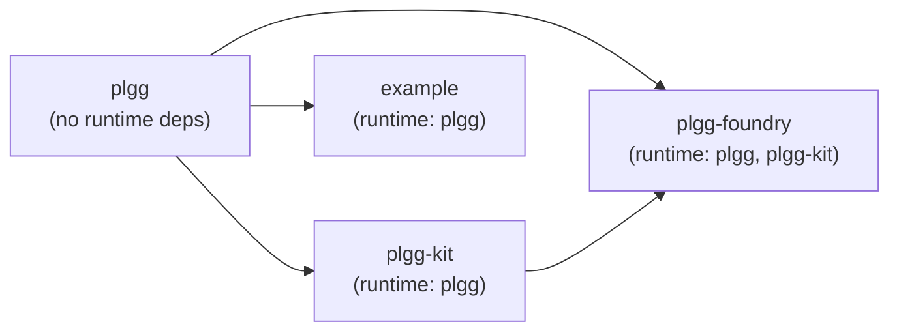
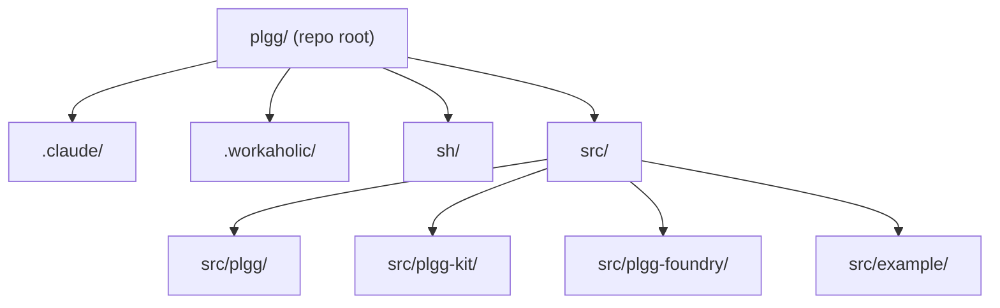
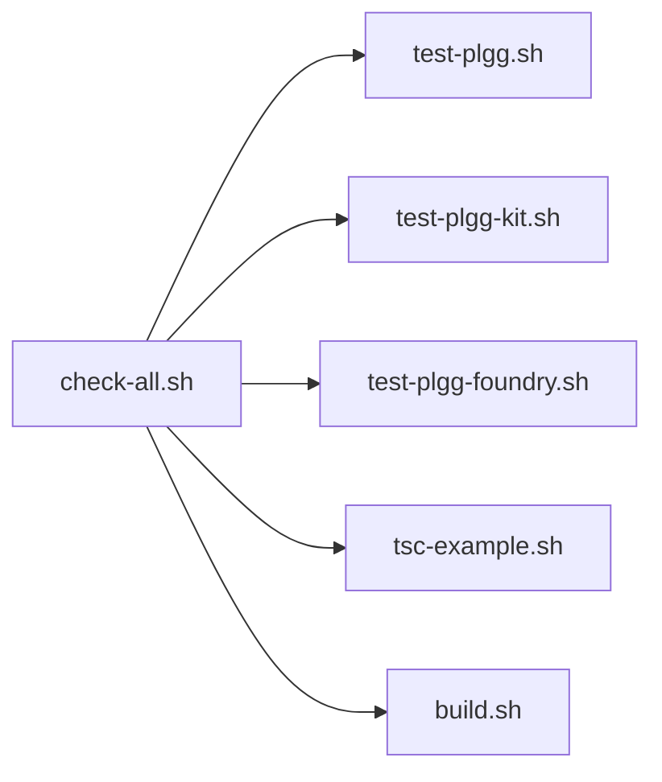

[English](infrastructure.md) | [Japanese](infrastructure_ja.md)

# Infrastructure Viewpoint

This viewpoint describes the external tools and services the plgg monorepo depends on, how the repository is laid out on disk, how each package is installed and built, and what runtime environment requirements exist. See [Component Viewpoint](component.md) for module-level decomposition and [Application Viewpoint](application.md) for runtime behavior.

## External Dependencies

The monorepo relies on a deliberately small set of external dependencies. The guiding principle, reflected in the architecture constraint at `.workaholic/constraints/architecture.md`, is that all LLM API calls go through direct HTTP requests rather than vendor SDKs, avoiding third-party SDK coupling entirely.

### Runtime Dependencies

`plgg` has no runtime dependencies. All types and pipeline primitives are implemented in plain TypeScript with no external packages.

`plgg-kit` declares one runtime dependency: `plgg` itself via a `file:` link (`"plgg": "file:../plgg"`). No LLM vendor SDK (OpenAI, Anthropic, Google) appears as a dependency. All three vendor adapters (`OpenAI.ts`, `Anthropic.ts`, `Google.ts`) communicate with LLM APIs using `postJson` — a plain HTTP POST helper implemented inside `plgg` — against the respective REST endpoints. This deliberate choice means no third-party SDK is introduced at runtime.

`plgg-foundry` declares two runtime dependencies: `plgg` and `plgg-kit`, both via `file:` links. No additional runtime packages are introduced.

`example` declares one runtime dependency: `plgg` via a `file:` link.

### Development Dependencies

Every package shares an identical set of development dependencies (evidence: all four `package.json` files):

| Package | Version constraint |
|---|---|
| `typescript` | `^5.8.3` |
| `vite` | `^6.3.5` |
| `vite-plugin-dts` | `^4.5.4` |
| `vitest` | `^3.2.4` |
| `@vitest/coverage-v8` | `^3.2.4` |
| `@types/node` | `^24.0.3` |

`plgg-kit` and `plgg-foundry` also include `dotenv` (`^17.2.3`) as a dev dependency, used exclusively to load `.env` files during test execution (configured in `vite.config.ts` via `dotenv.config({ path: ".env" })`).

### Dependency Topology



### External API Endpoints

`plgg-kit` makes HTTP requests to three LLM provider REST APIs at runtime. These are the only external network endpoints the system contacts:

| Provider | Endpoint | Authentication header |
|---|---|---|
| OpenAI | `https://api.openai.com/v1/responses` | `Authorization: Bearer {key}` |
| Anthropic | `https://api.anthropic.com/v1/messages` | `x-api-key: {key}` |
| Google Gemini | `https://generativelanguage.googleapis.com/v1beta/models/{model}:generateContent` | `x-goog-api-key: {key}` |

No package registry mirror, private npm registry, or other remote endpoint is configured (evidence: no `.npmrc` file observed in the repository).

## File System Layout

The repository root contains four top-level directories and key configuration files.

```
plgg/                          # repository root
├── .claude/                   # Claude Code project configuration
│   ├── agents/                # Sub-agent definitions
│   ├── commands/              # Slash command definitions
│   └── settings.json          # Project-level Claude Code settings
├── .workaholic/               # Workaholic plugin workspace
│   ├── constraints/           # Architecture and project constraints
│   ├── guides/                # User-facing guides
│   ├── policies/              # Policy documents
│   ├── specs/                 # Developer architecture specs
│   ├── terms/                 # Glossary terms
│   └── tickets/               # Work tickets (active and archived)
├── sh/                        # Shell scripts for development tasks
├── src/                       # Source packages
│   ├── plgg/                  # Core functional type system
│   ├── plgg-foundry/          # AI operation engine
│   ├── plgg-kit/              # LLM vendor adapters
│   └── example/               # Usage demonstration
├── .gitignore                 # Git ignore rules
└── CLAUDE.md                  # Project-level Claude Code instructions
```

### Per-Package Layout

Each of the four packages under `src/` follows an identical directory convention:

```
src/<package>/
├── src/
│   └── index.ts               # Public API barrel
├── package.json               # Package manifest
├── package-lock.json          # Lockfile
├── tsconfig.json              # TypeScript configuration
└── vite.config.ts             # Build and test configuration
```

`plgg` additionally has a `coverage/` directory (git-ignored) produced by `vitest --coverage`. `plgg-foundry` has a `TodoFoundry.ts` file at its package root (not inside `src/`) used as a development scratchpad.

### Package Directory Tree



## Installation

No root-level `package.json` exists; the monorepo does not use npm workspaces. Each package is installed independently. The script `sh/npm-install.sh` automates sequential installation across all four packages:

```sh
cd $REPO_ROOT/src/plgg && npm install
cd $REPO_ROOT/src/plgg-kit && npm install
cd $REPO_ROOT/src/plgg-foundry && npm install
cd $REPO_ROOT/src/example && npm install
```

The order matters because `plgg-kit`, `plgg-foundry`, and `example` reference `plgg` via a `file:` symlink; `plgg`'s `node_modules` must be present before dependent packages resolve it.

### Build Process

`sh/build.sh` builds `plgg` and `plgg-kit` using Vite:

```sh
cd $REPO_ROOT/src/plgg && npm run build
cd $REPO_ROOT/src/plgg-kit && npm run build
```

Each package's `vite.config.ts` configures Vite in library mode with two output formats: ES module (`index.es.js`) and CommonJS (`index.cjs.js`). `vite-plugin-dts` generates TypeScript declaration files (`dist/index.d.ts`). The `plgg` build uses `rollupTypes: false` (individual `.d.ts` files per module), while `plgg-foundry` and `plgg-kit` use `rollupTypes: true` (a single rolled-up declaration file).

`plgg-foundry` and `example` are not included in `build.sh`. Their build scripts exist in `package.json` (`npm run build`) but are not invoked by any top-level shell script.

### Build Output

Each package emits output to its `dist/` directory (git-ignored):

| File | Purpose |
|---|---|
| `dist/index.es.js` | ES module bundle |
| `dist/index.cjs.js` | CommonJS bundle |
| `dist/index.d.ts` | TypeScript declarations |

### Publishing

`sh/publish-plgg.sh` publishes `plgg` to npm by running `npm run publish` in `src/plgg`, which executes `vite build && npm publish`. Only `plgg` has a `publish` script; `plgg-foundry`, `plgg-kit`, and `example` do not have top-level publish automation via `sh/`.

## Development Workflow

The `sh/` directory contains 20 shell scripts covering the full development lifecycle. All scripts use `#!/bin/sh -eu` and resolve the repository root via `git rev-parse --show-toplevel`.

### Script Inventory

| Script | Purpose |
|---|---|
| `npm-install.sh` | Install all four packages |
| `build.sh` | Build `plgg` and `plgg-kit` |
| `publish-plgg.sh` | Build and publish `plgg` to npm |
| `tsc-plgg.sh` | Type-check `plgg` |
| `tsc-plgg-kit.sh` | Type-check `plgg-kit` |
| `tsc-plgg-foundry.sh` | Type-check `plgg-foundry` |
| `tsc-example.sh` | Type-check `example` |
| `tsc-watch-plgg.sh` | Watch type-check `plgg` |
| `tsc-watch-plgg-kit.sh` | Watch type-check `plgg-kit` |
| `tsc-watch-plgg-foundry.sh` | Watch type-check `plgg-foundry` |
| `tsc-watch-example.sh` | Watch type-check `example` |
| `test-plgg.sh` | Run `plgg` test suite |
| `test-plgg-kit.sh` | Run `plgg-kit` test suite |
| `test-plgg-foundry.sh` | Run `plgg-foundry` test suite |
| `test-watch-plgg.sh` | Watch test `plgg` |
| `test-watch-plgg-kit.sh` | Watch test `plgg-kit` |
| `test-watch-plgg-foundry.sh` | Watch test `plgg-foundry` |
| `coverage-plgg.sh` | Generate coverage report for `plgg` |
| `check-all.sh` | Run all test suites, type-check `example`, then build |
| `menu.sh` | Interactive menu for running scripts |

`check-all.sh` is the full CI-equivalent gate: it runs `test-plgg.sh`, `test-plgg-kit.sh`, `test-plgg-foundry.sh`, `tsc-example.sh`, and `build.sh` in sequence.

### Script Execution Flow



## Environment Requirements

### Runtime

Node.js is required. The observed version in this environment is `v24.13.1` with npm `11.8.0`. No `.nvmrc`, `.node-version`, or `engines` field in any `package.json` specifies a minimum version constraint explicitly; the Node version requirement is not observed as documented.

TypeScript target is `ES2021` (configured in all four `tsconfig.json` files). Module format is `NodeNext`.

### API Keys

LLM API calls require credentials provided as environment variables. The three recognized variables are:

| Variable | Provider |
|---|---|
| `OPENAI_API_KEY` | OpenAI |
| `ANTHROPIC_API_KEY` | Anthropic |
| `GEMINI_API_KEY` | Google Gemini |

These variables are read at runtime by `plgg-kit/src/LLMs/usecase/generateObject.ts`. Alternatively, API keys can be supplied inline in the `Provider` configuration object passed to `makeFoundry`. During test execution, `plgg-kit` and `plgg-foundry` load a `.env` file from the package root via `dotenv` in `vite.config.ts`.

The `.gitignore` excludes `.env` and `.env.*` files (with the exception of `.env.example`, which is permitted but not observed in the repository).

### Claude Code Configuration

`.claude/settings.json` is committed to the repository (evidence: present in git history since commit `ddbb696`) and applies to all contributors. It sets:

- `permissions.deny`: `["Bash(git -C:*)"]` — prevents Claude Code from running git commands with the `-C` flag, which could operate outside the project directory.
- `env.CLAUDE_BASH_MAINTAIN_PROJECT_WORKING_DIR`: `"1"` — keeps bash sessions rooted at the project directory.
- `env.CLAUDE_CODE_EXPERIMENTAL_AGENT_TEAMS`: `"1"` — enables the experimental agent teams feature.
- `extraKnownMarketplaces.workaholic`: configures the workaholic plugin marketplace sourced from `github:qmu/workaholic`.
- `enabledPlugins`: enables the `core@workaholic` plugin.

Personal overrides are placed in `.claude/settings.local.json`, which is excluded from version control via `.gitignore`.

### TypeScript Compiler Configuration

All four packages use an identical `tsconfig.json` strictness profile:

| Setting | Value |
|---|---|
| `strict` | `true` |
| `noUnusedLocals` | `true` |
| `noUnusedParameters` | `true` |
| `noUncheckedIndexedAccess` | `true` |
| `exactOptionalPropertyTypes` | `true` |
| `noImplicitReturns` | `true` |
| `noFallthroughCasesInSwitch` | `true` |
| `erasableSyntaxOnly` | `true` |
| `isolatedModules` | `true` |
| `allowJs` | `false` |
| `skipLibCheck` | `true` |

The use of `as`, `any`, and `@ts-ignore` is explicitly prohibited by `CLAUDE.md` and enforced by the architecture constraint.

### Coverage Thresholds

`plgg`'s `vite.config.ts` configures coverage thresholds: 90% statements, 90% branches, 90% functions, and 90% lines. Coverage is collected using the V8 provider and reported as text, LCOV, and HTML. No coverage thresholds are configured for `plgg-kit`, `plgg-foundry`, or `example` (their `vite.config.ts` files declare `coverage: { all: true }` without thresholds).

## Assumptions

- **[Explicit]** No LLM vendor SDK appears in any `package.json` `dependencies` or `devDependencies`. All vendor communication is via HTTP using the built-in `postJson` helper from `plgg`. Verified by inspecting all four `package.json` files and the vendor adapter source files.
- **[Explicit]** `file:` links in `package.json` are used for intra-monorepo dependencies: `plgg-kit` and `plgg-foundry` reference `plgg` as `"plgg": "file:../plgg"`, and `plgg-foundry` references `plgg-kit` as `"plgg-kit": "file:../plgg-kit"`. Verified in all package manifests.
- **[Explicit]** `.claude/settings.json` is tracked in version control and applies project-level Claude Code settings to all contributors. Verified by commit `ddbb696`.
- **[Explicit]** The `.gitignore` excludes `node_modules/`, `**/dist/`, `**/coverage/`, `.env`, `.env.*`, and `.claude/settings.local.json`. Verified by reading `.gitignore`.
- **[Explicit]** `sh/check-all.sh` is the full integration gate, combining test, type-check, and build steps. Verified by reading the script.
- **[Inferred]** No root-level `package.json` implies the monorepo does not use npm workspaces. Each package manages its own `node_modules`. This is consistent with independent versioning and publishing of each package.
- **[Inferred]** The absence of a `.nvmrc` or `engines` field suggests that no specific Node version constraint is formally enforced; the observed `v24.13.1` is the development environment version but is not guaranteed to be the minimum supported version.
- **[Inferred]** `dotenv` as a dev-only dependency (not in `dependencies`) confirms that API key loading from `.env` files is a test-time behavior only. Production consumers are expected to supply API keys via environment variables or inline configuration.
- **[Inferred]** The `TodoFoundry.ts` file at the root of `plgg-foundry/` (outside `src/`) is a development scratchpad and is not part of the package's published surface.
- **[Not observed]** No CI/CD pipeline configuration (GitHub Actions, CircleCI, etc.) is present in the repository. Continuous integration is not observed as implemented.
- **[Not observed]** No Docker or container configuration exists. Containerization is not observed as implemented.
- **[Not observed]** No deployment configuration, hosting target, or infrastructure-as-code (Terraform, Pulumi, etc.) exists. The packages are distributed via npm; no server deployment is observed.
