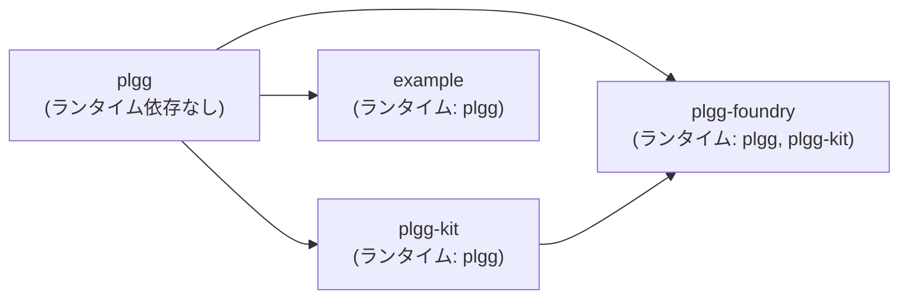
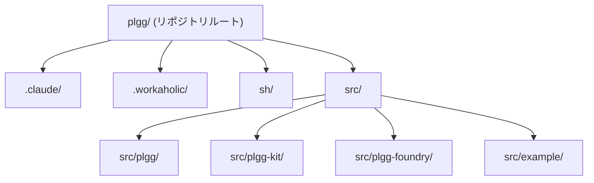
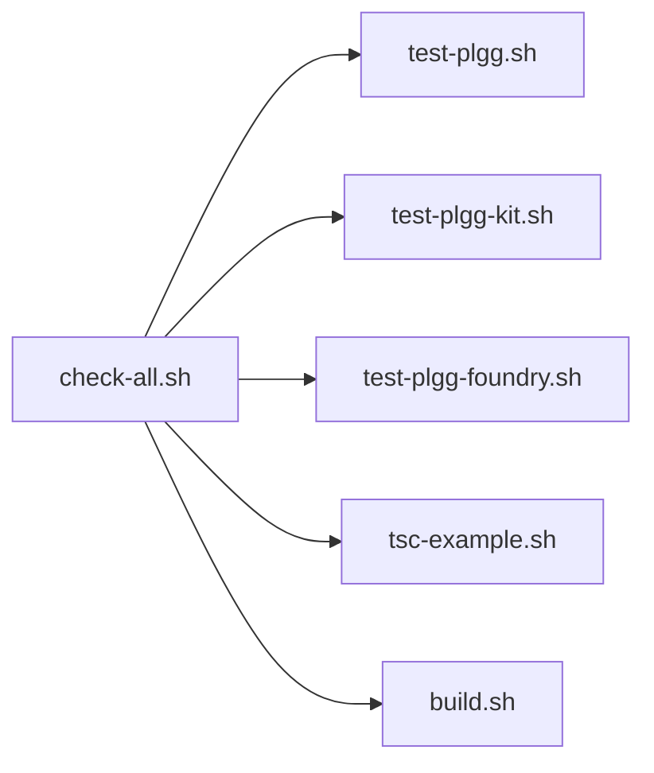

[English](infrastructure.md) | [Japanese](infrastructure_ja.md)

# Infrastructure Viewpoint

この viewpoint では、plgg モノリポが依存する外部ツールとサービス、リポジトリのディスク上のレイアウト、各 package のインストールとビルド方法、およびランタイム環境要件について説明します。モジュールレベルの分解については [Component Viewpoint](component_ja.md) を、ランタイム動作については [Application Viewpoint](application_ja.md) を参照してください。

## 外部依存関係

このモノリポは意図的に少ない外部依存関係のみに依存しています。`.workaholic/constraints/architecture.md` のアーキテクチャ制約に反映されている指針として、すべての LLM API 呼び出しはベンダー SDK を経由せず、直接 HTTP リクエストで行われます。これにより、サードパーティ SDK の結合を完全に排除しています。

### ランタイム依存関係

`plgg` にはランタイム依存関係がありません。すべての型とパイプラインプリミティブは、外部パッケージなしの純粋な TypeScript で実装されています。

`plgg-kit` は `file:` リンク経由で `plgg` 自体 (`"plgg": "file:../plgg"`) のみをランタイム依存関係として宣言しています。OpenAI、Anthropic、Google の LLM ベンダー SDK は依存関係として存在しません。3 つのベンダーアダプター（`OpenAI.ts`、`Anthropic.ts`、`Google.ts`）はいずれも、`plgg` 内部に実装された HTTP POST ヘルパーである `postJson` を使用して、それぞれの REST エンドポイントに通信します。この意図的な選択により、ランタイムにサードパーティ SDK が導入されません。

`plgg-foundry` は `file:` リンク経由で `plgg` と `plgg-kit` の 2 つをランタイム依存関係として宣言しています。追加のランタイム package は導入されません。

`example` は `file:` リンク経由で `plgg` のみをランタイム依存関係として宣言しています。

### 開発依存関係

4 つの package すべてが同一の開発依存関係を共有しています（証拠：4 つの `package.json` ファイルすべて）：

| Package | バージョン制約 |
|---|---|
| `typescript` | `^5.8.3` |
| `vite` | `^6.3.5` |
| `vite-plugin-dts` | `^4.5.4` |
| `vitest` | `^3.2.4` |
| `@vitest/coverage-v8` | `^3.2.4` |
| `@types/node` | `^24.0.3` |

`plgg-kit` と `plgg-foundry` は、テスト実行時に `.env` ファイルを読み込むために使用される `dotenv` (`^17.2.3`) も開発依存関係として含んでいます（`vite.config.ts` で `dotenv.config({ path: ".env" })` により設定）。

### 依存関係トポロジー



### 外部 API エンドポイント

`plgg-kit` はランタイムに 3 つの LLM プロバイダー REST API に HTTP リクエストを送信します。これらはシステムが接続する唯一の外部ネットワークエンドポイントです：

| プロバイダー | エンドポイント | 認証ヘッダー |
|---|---|---|
| OpenAI | `https://api.openai.com/v1/responses` | `Authorization: Bearer {key}` |
| Anthropic | `https://api.anthropic.com/v1/messages` | `x-api-key: {key}` |
| Google Gemini | `https://generativelanguage.googleapis.com/v1beta/models/{model}:generateContent` | `x-goog-api-key: {key}` |

パッケージレジストリミラー、プライベート npm レジストリ、その他のリモートエンドポイントは設定されていません（証拠：リポジトリに `.npmrc` ファイルは観察されません）。

## ファイルシステムレイアウト

リポジトリルートには 4 つのトップレベルディレクトリと主要な設定ファイルが含まれています。

```
plgg/                          # リポジトリルート
├── .claude/                   # Claude Code プロジェクト設定
│   ├── agents/                # サブエージェント定義
│   ├── commands/              # スラッシュコマンド定義
│   └── settings.json          # プロジェクトレベルの Claude Code 設定
├── .workaholic/               # Workaholic plugin ワークスペース
│   ├── constraints/           # アーキテクチャとプロジェクト制約
│   ├── guides/                # ユーザー向けガイド
│   ├── policies/              # ポリシー文書
│   ├── specs/                 # 開発者向けアーキテクチャ spec
│   ├── terms/                 # 用語集
│   └── tickets/               # 作業チケット（アクティブとアーカイブ）
├── sh/                        # 開発タスク用シェルスクリプト
├── src/                       # ソース package
│   ├── plgg/                  # コア関数型型システム
│   ├── plgg-foundry/          # AI オペレーションエンジン
│   ├── plgg-kit/              # LLM ベンダーアダプター
│   └── example/               # 使用例のデモ
├── .gitignore                 # Git 除外ルール
└── CLAUDE.md                  # プロジェクトレベルの Claude Code 指示
```

### package ごとのレイアウト

`src/` 以下の 4 つの package はそれぞれ同一のディレクトリ規約に従っています：

```
src/<package>/
├── src/
│   └── index.ts               # パブリック API バレル
├── package.json               # package マニフェスト
├── package-lock.json          # ロックファイル
├── tsconfig.json              # TypeScript 設定
└── vite.config.ts             # ビルドとテスト設定
```

`plgg` には `vitest --coverage` で生成される `coverage/` ディレクトリ（git 除外）もあります。`plgg-foundry` には `src/` の外側のパッケージルートに開発メモとして使用される `TodoFoundry.ts` ファイルがあります。

### package ディレクトリツリー



## インストール

ルートレベルの `package.json` は存在せず、モノリポは npm workspaces を使用していません。各 package は独立してインストールされます。スクリプト `sh/npm-install.sh` は 4 つの package すべてのインストールを順次自動化します：

```sh
cd $REPO_ROOT/src/plgg && npm install
cd $REPO_ROOT/src/plgg-kit && npm install
cd $REPO_ROOT/src/plgg-foundry && npm install
cd $REPO_ROOT/src/example && npm install
```

順序が重要です。`plgg-kit`、`plgg-foundry`、`example` は `file:` シンボリックリンク経由で `plgg` を参照しており、依存 package が解決できるように `plgg` の `node_modules` が先に存在している必要があります。

### ビルドプロセス

`sh/build.sh` は Vite を使用して `plgg` と `plgg-kit` をビルドします：

```sh
cd $REPO_ROOT/src/plgg && npm run build
cd $REPO_ROOT/src/plgg-kit && npm run build
```

各 package の `vite.config.ts` は Vite をライブラリモードで設定し、2 つの出力フォーマットを生成します：ES モジュール（`index.es.js`）と CommonJS（`index.cjs.js`）。`vite-plugin-dts` が TypeScript 宣言ファイル（`dist/index.d.ts`）を生成します。`plgg` のビルドは `rollupTypes: false`（モジュールごとの個別 `.d.ts` ファイル）を使用し、`plgg-foundry` と `plgg-kit` は `rollupTypes: true`（単一のロールアップ宣言ファイル）を使用します。

`plgg-foundry` と `example` は `build.sh` に含まれていません。ビルドスクリプトは `package.json` に存在しますが（`npm run build`）、トップレベルのシェルスクリプトからは呼び出されません。

### ビルド出力

各 package は `dist/` ディレクトリ（git 除外）に出力を生成します：

| ファイル | 目的 |
|---|---|
| `dist/index.es.js` | ES モジュールバンドル |
| `dist/index.cjs.js` | CommonJS バンドル |
| `dist/index.d.ts` | TypeScript 宣言 |

### パブリッシュ

`sh/publish-plgg.sh` は `src/plgg` で `npm run publish` を実行して `plgg` を npm に publish します。`npm run publish` は `vite build && npm publish` を実行します。`plgg-foundry`、`plgg-kit`、`example` には `sh/` 経由のトップレベル publish 自動化はありません。

## 開発ワークフロー

`sh/` ディレクトリには開発ライフサイクル全体をカバーする 20 のシェルスクリプトが含まれています。すべてのスクリプトは `#!/bin/sh -eu` を使用し、`git rev-parse --show-toplevel` でリポジトリルートを解決します。

### スクリプト一覧

| スクリプト | 目的 |
|---|---|
| `npm-install.sh` | 4 つの package すべてをインストール |
| `build.sh` | `plgg` と `plgg-kit` をビルド |
| `publish-plgg.sh` | `plgg` をビルドして npm に publish |
| `tsc-plgg.sh` | `plgg` の型チェック |
| `tsc-plgg-kit.sh` | `plgg-kit` の型チェック |
| `tsc-plgg-foundry.sh` | `plgg-foundry` の型チェック |
| `tsc-example.sh` | `example` の型チェック |
| `tsc-watch-plgg.sh` | `plgg` のウォッチ型チェック |
| `tsc-watch-plgg-kit.sh` | `plgg-kit` のウォッチ型チェック |
| `tsc-watch-plgg-foundry.sh` | `plgg-foundry` のウォッチ型チェック |
| `tsc-watch-example.sh` | `example` のウォッチ型チェック |
| `test-plgg.sh` | `plgg` テストスイートの実行 |
| `test-plgg-kit.sh` | `plgg-kit` テストスイートの実行 |
| `test-plgg-foundry.sh` | `plgg-foundry` テストスイートの実行 |
| `test-watch-plgg.sh` | `plgg` のウォッチテスト |
| `test-watch-plgg-kit.sh` | `plgg-kit` のウォッチテスト |
| `test-watch-plgg-foundry.sh` | `plgg-foundry` のウォッチテスト |
| `coverage-plgg.sh` | `plgg` のカバレッジレポート生成 |
| `check-all.sh` | すべてのテストスイート実行、`example` の型チェック、ビルド |
| `menu.sh` | スクリプト実行のインタラクティブメニュー |

`check-all.sh` は完全な CI 相当のゲートです：`test-plgg.sh`、`test-plgg-kit.sh`、`test-plgg-foundry.sh`、`tsc-example.sh`、`build.sh` を順次実行します。

### スクリプト実行フロー



## 環境要件

### ランタイム

Node.js が必要です。この環境で観察されたバージョンは npm `11.8.0` を伴う `v24.13.1` です。`.nvmrc`、`.node-version`、または `engines` フィールドはいずれの `package.json` にも存在せず、最小バージョン制約は明示的には文書化されていません。

TypeScript ターゲットは `ES2021`（4 つの `tsconfig.json` ファイルすべてで設定）です。モジュールフォーマットは `NodeNext` です。

### API キー

LLM API 呼び出しには環境変数で提供される認証情報が必要です。認識される 3 つの変数は以下の通りです：

| 変数 | プロバイダー |
|---|---|
| `OPENAI_API_KEY` | OpenAI |
| `ANTHROPIC_API_KEY` | Anthropic |
| `GEMINI_API_KEY` | Google Gemini |

これらの変数は `plgg-kit/src/LLMs/usecase/generateObject.ts` によってランタイムに読み込まれます。あるいは、`makeFoundry` に渡す `Provider` 設定オブジェクトで API キーをインライン指定することもできます。テスト実行中、`plgg-kit` と `plgg-foundry` は `vite.config.ts` の `dotenv` 経由で package ルートの `.env` ファイルを読み込みます。

`.gitignore` は `.env` および `.env.*` ファイルを除外しています（`.env.example` は許可されますが、リポジトリでは観察されていません）。

### Claude Code 設定

`.claude/settings.json` はリポジトリにコミットされており（証拠：コミット `ddbb696` 以降 git 履歴に存在）、すべてのコントリビューターに適用されます。設定内容：

- `permissions.deny`: `["Bash(git -C:*)"]` — プロジェクトディレクトリ外で動作する可能性がある `-C` フラグ付きの git コマンドを Claude Code が実行するのを防ぎます。
- `env.CLAUDE_BASH_MAINTAIN_PROJECT_WORKING_DIR`: `"1"` — bash セッションをプロジェクトディレクトリに固定します。
- `env.CLAUDE_CODE_EXPERIMENTAL_AGENT_TEAMS`: `"1"` — 実験的なエージェントチーム機能を有効にします。
- `extraKnownMarketplaces.workaholic`: `github:qmu/workaholic` から sourced された workaholic plugin マーケットプレースを設定します。
- `enabledPlugins`: `core@workaholic` plugin を有効にします。

個人用のオーバーライドは `.claude/settings.local.json` に配置し、`.gitignore` でバージョン管理から除外されます。

### TypeScript コンパイラ設定

4 つの package すべてが同一の `tsconfig.json` 厳格性プロファイルを使用しています：

| 設定 | 値 |
|---|---|
| `strict` | `true` |
| `noUnusedLocals` | `true` |
| `noUnusedParameters` | `true` |
| `noUncheckedIndexedAccess` | `true` |
| `exactOptionalPropertyTypes` | `true` |
| `noImplicitReturns` | `true` |
| `noFallthroughCasesInSwitch` | `true` |
| `erasableSyntaxOnly` | `true` |
| `isolatedModules` | `true` |
| `allowJs` | `false` |
| `skipLibCheck` | `true` |

`as`、`any`、`@ts-ignore` の使用は `CLAUDE.md` で明示的に禁止されており、アーキテクチャ制約によって適用されています。

### カバレッジ閾値

`plgg` の `vite.config.ts` はカバレッジ閾値を設定しています：ステートメント 90%、ブランチ 90%、関数 90%、行 90%。カバレッジは V8 プロバイダーを使用して収集され、テキスト、LCOV、HTML として報告されます。`plgg-kit`、`plgg-foundry`、`example` にはカバレッジ閾値が設定されていません（これらの `vite.config.ts` は閾値なしで `coverage: { all: true }` を宣言しています）。

## Assumptions

- **[Explicit]** LLM ベンダー SDK はいずれの `package.json` の `dependencies` または `devDependencies` にも存在しません。すべてのベンダー通信は `plgg` に実装された組み込みの `postJson` ヘルパーを使用した HTTP 経由で行われます。4 つの `package.json` ファイルとベンダーアダプターのソースファイルを検査して確認済み。
- **[Explicit]** `file:` リンクはモノリポ内依存関係に使用されています：`plgg-kit` と `plgg-foundry` は `"plgg": "file:../plgg"` として `plgg` を参照し、`plgg-foundry` は `"plgg-kit": "file:../plgg-kit"` として `plgg-kit` を参照しています。すべての package マニフェストで確認済み。
- **[Explicit]** `.claude/settings.json` はバージョン管理に追跡されており、すべてのコントリビューターにプロジェクトレベルの Claude Code 設定を適用します。コミット `ddbb696` で確認済み。
- **[Explicit]** `.gitignore` は `node_modules/`、`**/dist/`、`**/coverage/`、`.env`、`.env.*`、`.claude/settings.local.json` を除外しています。`.gitignore` の読み取りで確認済み。
- **[Explicit]** `sh/check-all.sh` はテスト、型チェック、ビルドステップを組み合わせた完全な統合ゲートです。スクリプトを読み取って確認済み。
- **[Inferred]** ルートレベルの `package.json` がないことは、モノリポが npm workspaces を使用していないことを意味します。各 package は独自の `node_modules` を管理しています。これは各 package の独立したバージョニングとパブリッシュと一致しています。
- **[Inferred]** `.nvmrc` または `engines` フィールドがないことから、特定の Node バージョン制約が正式に適用されていないことが示唆されます。観察された `v24.13.1` は開発環境のバージョンですが、サポートされる最小バージョンとして保証されているわけではありません。
- **[Inferred]** `dotenv` が開発専用依存関係（`dependencies` ではなく）であることは、`.env` ファイルからの API キー読み込みがテスト時の動作のみであることを確認します。本番コンシューマーは環境変数またはインライン設定で API キーを提供することが期待されています。
- **[Inferred]** `plgg-foundry/` のルート（`src/` の外側）にある `TodoFoundry.ts` ファイルは開発用のメモであり、package の公開サーフェスの一部ではありません。
- **[Not observed]** CI/CD パイプライン設定（GitHub Actions、CircleCI 等）はリポジトリに存在しません。継続的インテグレーションの実装は観察されません。
- **[Not observed]** Docker またはコンテナ設定は存在しません。コンテナ化の実装は観察されません。
- **[Not observed]** デプロイ設定、ホスティングターゲット、またはインフラストラクチャコード（Terraform、Pulumi 等）は存在しません。package は npm 経由で配布されており、サーバーデプロイは観察されません。
