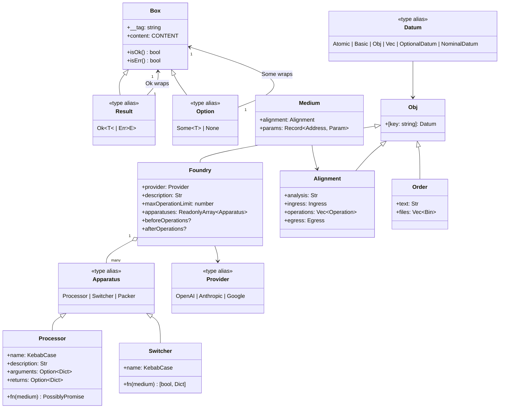
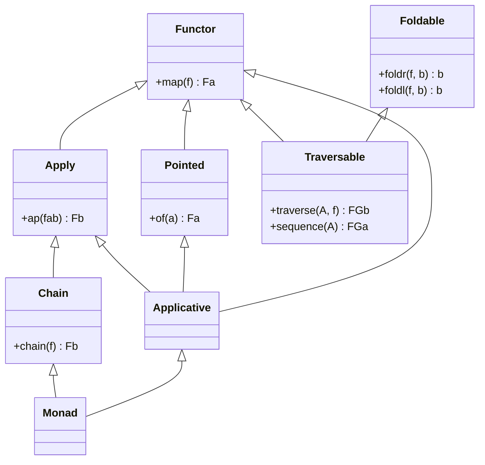
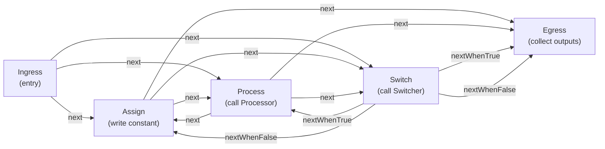
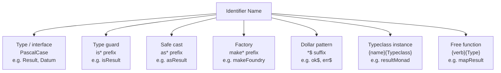

[English](model.md) | [Japanese](model_ja.md)

# Model Viewpoint

This viewpoint describes the core domain entities of the plgg monorepo, how they relate to one another, the invariants that hold across the system, and the naming conventions that encode domain knowledge. The domain spans three conceptual layers: the `plgg` core type algebra, the `plgg-foundry` AI-orchestrated execution model, and the `plgg-kit` LLM provider abstraction. See [Component Viewpoint](component.md) for module boundaries and [Application Viewpoint](application.md) for runtime behavior.

## Domain Entities

### The plgg Core Type Algebra

The `plgg` package establishes a typed domain of values that all other packages build upon. The central concept is the `Datum` type, which defines the universe of values the system recognizes as valid data. A `Datum` is recursively defined as an `Atomic`, `Basic`, `Obj`, `Vec<Datum>`, an `OptionalDatum<DatumCore>` (the `Option` wrapper), or a `NominalDatum<string, DatumCore>` (the `Box` wrapper). This closed universe prevents untyped values from crossing domain boundaries.

#### Atomic and Basic Types

`Atomic` is the leaf-level union of primitive wrapper types: `Num`, `BigInt`, `Bool`, `Bin` (binary buffer), `Time` (ISO date-time string branded to prevent misuse), and `SoftStr` (a permissive string that accepts any string value). `Int` is an abstract alias for the integer union.

`Basic` extends `Atomic` with refined types that carry additional constraints. The fixed-width integers (`I8`, `I16`, `I32`, `I64`, `I128`, `U8`, `U16`, `U32`, `U64`, `U128`) and `Float` impose numeric range semantics. The string refinements (`Str`, `Alphabet`, `Alphanumeric`, `CamelCase`, `PascalCase`, `KebabCase`, `SnakeCase`, `CapitalCase`) carry case and character-set constraints. Every `Basic` type is a `Brand<T, U>` — a TypeScript intersection type that attaches a phantom string literal to the base type, making distinct refinements structurally incompatible.

#### Container Types: Box, Option, Result

`Box<TAG, CONTENT>` is the structural core of the domain. A `Box` is a readonly object with a `__tag: TAG` string literal discriminant and a `content: CONTENT` payload. Every tagged entity in the system — `Ok`, `Err`, `Some`, `None`, `Icon`, `Provider`, `Processor`, `Switcher`, `Packer` — is a `Box` specialization. The `__tag` field serves as a runtime discriminant for exhaustive pattern matching.

`Option<T>` is the union `Some<T> | None`. `Some<T>` is `Box<"Ok", T>` (note: `Some` uses "Ok" as tag in practice; see Assumptions). `None` is an `Icon` (a tag-only `Box` with `content: undefined`). `Option` answers the question "does this value exist?" without allowing null/undefined to propagate through the pipeline.

`Result<T, E>` is the union `Ok<T> | Err<E>`. `Ok<T>` is `Box<"Ok", T>` and `Err<E>` is `Box<"Err", E>`. Both expose `isOk()` and `isErr()` method guards for ergonomic narrowing. `Result` is the return type of all cast functions, validation functions, and pipeline steps that can fail. Because every error is explicit in the return type, exceptions are never the primary error-signaling mechanism.

#### Record and Collection Types

`Obj<T>` is a readonly record where every value is a `Datum`. It is the structural basis for all compound domain entities: `Alignment`, `Order`, `Processor` content, `Foundry` fields, and user-defined domain models. `Dict<T>` is a homogeneous string-keyed record. `Vec<T>` is a typed `ReadonlyArray<T>`.

#### Error Hierarchy

`BaseError` extends native `Error` with `detail: Option<string>`, `parent: Option<BaseError | Error>`, and a brand field `__ = "PlggError"`. The inheritance tree is: `BaseError` -> `InvalidError` (validation failures, with `sibling: ReadonlyArray<InvalidError>` for tracking alternative cast attempts) and `BaseError` -> `Exception` (general runtime failures). `SerializeError` and `DeserializeError` cover serialization failures. `PlggError` is the union of all four. This hierarchy enables structured error trees rather than flattened message strings.

#### Pipeline Primitives

`pipe` composes sync functions: `pipe(value, f1, f2, ..., fN)` threads a value through up to 21 typed functions. `cast` composes `Result`-returning validation functions and implements "try all, keep first success, accumulate sibling errors on total failure." `proc` is the async `Result` pipeline, accepting `Procedural<T>` at each step. `Procedural<T>` is the union of `T | Result<T, Error> | Promise<T> | Promise<Result<T, Error>>`, meaning each step may return a plain value, a wrapped result, or a promise of either. `flow` creates point-free composed functions. `match` performs exhaustive pattern matching against `Box` tags, atomic literals, or boolean values.

### Typeclass Abstractions

The `Abstracts/Principals/` module provides Haskell-style typeclass interfaces: `Functor`, `Apply`, `Applicative`, `Pointed`, `Chain`, `Monad`, `Foldable`, `Traversable`, `Monoid`, `Semigroup`. These are parameterized by a `KindKey` string literal registered in the open `MapKind1<A>`, `MapKind2<A, B>`, or `MapKind3<A, B, C>` interface via `declare module` augmentation. `Option` registers as `MapKind1` (one type parameter) and `Result` registers as `MapKind2` (two type parameters). This simulates higher-kinded types in TypeScript. Full instances — `optionMonad`, `resultMonad`, etc. — are exported alongside extracted free functions (`mapOption`, `chainResult`, etc.).

`Servables` define per-type capabilities: `Refinable<T>` provides an `is` type guard, `Castable<T>` provides an `as` validated cast returning `Result<T, InvalidError>`, and `JsonSerializable<T, J>` provides `toJsonReady`/`fromJsonReady` for JSON round-trip serialization.

### plgg-foundry Domain Model

The foundry domain models an AI-orchestrated register machine. Its entities fall into two groups: the static configuration (what a developer declares) and the dynamic execution plan (what the LLM generates at runtime).

#### Static Configuration: Foundry and Apparatuses

A `Foundry` is the developer-declared configuration: an LLM `Provider`, a `description: Str` (the system prompt fragment), a `maxOperationLimit: number` (circuit breaker), and an ordered list of `Apparatus` instances. A `Foundry` cannot be mutated after construction; `makeFoundry` produces an immutable `Readonly` object with defaults applied.

`Apparatus` is the union `Processor | Switcher | Packer`. Each variant is a `Box` with a tag and a content record:

- `Processor = Box<"Processor", { name: KebabCase, description: Str, arguments: Option<Dict<VariableName, VirtualType>>, returns: Option<Dict<VariableName, VirtualType>>, fn: (medium: Medium) => PossiblyPromise<unknown> }>`. A Processor is a named, typed function. Its `arguments` and `returns` fields describe the register variables it reads and writes. These descriptions are rendered into the system prompt so the LLM knows how to wire processors into a plan.
- `Switcher = Box<"Switcher", { name: KebabCase, description: Str, arguments: ..., returnsWhenTrue: ..., returnsWhenFalse: ..., fn: (medium: Medium) => [boolean, Dict] }>`. A Switcher is a named boolean predicate. It takes inputs, evaluates a condition, and returns a tuple of `[boolean, Dict]` — the boolean selects which branch to take, and the Dict carries conditional outputs.
- `Packer = Box<"Packer", { fields: ReadonlyArray<PackerField> }>`. A Packer describes the egress output structure: which register addresses map to which output field names.

`VirtualType = Obj<{ type: Str, optional: Option<Bool>, description: Option<Str> }>` is the type descriptor used in Processor and Switcher argument/return signatures. It carries a human-readable type name, an optional flag, and an optional description. These descriptors are surfaced to the LLM so it can produce correctly-typed operation plans.

`Medium = Readonly<{ alignment: Alignment, params: Record<Address, Param> }>` is the execution context passed to every `Processor.fn` and `Switcher.fn`. `params` is the register snapshot at the time the apparatus is invoked.

#### Dynamic Execution Plan: Alignment and Operations

An `Alignment = Obj<{ analysis: Str, ingress: Ingress, operations: Vec<Operation>, egress: Egress }>` is the LLM-generated plan produced by the `blueprint` function. It describes a sequence of register-machine operations with named control-flow edges.

The node types in an Alignment form a small instruction set:

- `Ingress = Obj<{ type: "ingress", next: string }>` — the entry point; `next` points to the first `Operation` by name.
- `Assign = Obj<{ type: "assign", name: string, address: Address, value: string, next: string }>` — writes a JSON-encoded constant to a register.
- `Process = Obj<{ type: "process", name: string, action: string, input: ReadonlyArray<NameTableEntry>, output: ReadonlyArray<NameTableEntry>, next: string }>` — executes a named Processor opcode, mapping registers to variables via `NameTableEntry` pairs.
- `Switch = Obj<{ type: "switch", name: string, action: string, nextWhenTrue: string, nextWhenFalse: string, input: ..., outputWhenTrue: ..., outputWhenFalse: ... }>` — evaluates a named Switcher opcode and branches.
- `Egress = Obj<{ type: "egress", ... }>` — the exit node; collects named outputs.
- `Operation = Assign | Process | Switch` — the union of navigable mid-stream nodes.

`NameTableEntry = { variableName: VariableName, address: Address }` maps a variable name (as the Processor/Switcher sees it) to a register address (as the `Env` stores it). This indirection allows the LLM to route arbitrary data between apparatus calls without hard-coding register addresses into apparatus definitions.

`Env = Readonly<Record<Address, Param>>` is the register file. `Param = unknown` — registers can hold any value because LLM-generated data is not typed by the domain model at the register level.

`Order = Obj<{ text: Str, files: Vec<Bin> }>` is the user's request to the foundry, carrying a text prompt and optional binary file attachments. `OperationContext` bundles the entire execution state — `foundry`, `alignment`, `order`, `env`, and `operationCount` — and is threaded through the recursive execution loop.

### plgg-kit Provider Model

`Provider = OpenAI | Anthropic | Google`. Each variant is `Box<"TAG", Config>` where `Config = Obj<{ model: string, apiKey: Option<string> }>`. The `model` field is a `SoftStr`, allowing arbitrary model identifiers. The `apiKey` is an `Option<string>` — if absent, the adapter falls back to the corresponding environment variable at call time. Constructor functions (`openai()`, `anthropic()`, `google()`) accept either a plain model string or a config object.

### Class Diagram of Core Domain Entities

## Relationships

### The Datum Universe as a Closed Set

The `Datum` type is the closed-world assumption of the plgg domain. Every value that can be stored in an `Obj`, passed through a pipeline, or registered in an `Env` must satisfy `isDatum`. The recursive structure of `Datum` — `DatumCore | OptionalDatum<DatumCore> | NominalDatum<string, DatumCore>` — allows arbitrary nesting of records, arrays, optionals, and nominally-tagged values while maintaining a single type-safe boundary.

The relationship between `DatumCore` and `Datum` is: `DatumCore = Atomic | Basic | Obj | ReadonlyArray<Datum>`. Arrays are typed as `ReadonlyArray<Datum>` recursively, making `Vec<Datum>` a first-class Datum value. `Obj` (a readonly record whose values are all `Datum`) is also a `DatumCore`. This means `Obj` can nest arbitrarily: an `Obj` containing `Vec<Obj<...>>` is valid `Datum`.

### Box as the Universal Variant

The `Box<TAG, CONTENT>` pattern unifies all tagged variants. `Ok`, `Err`, `Some`, `None`, `Icon`, `OpenAI`, `Anthropic`, `Google`, `Processor`, `Switcher`, `Packer` are all `Box` instances with different `TAG` literals. The `pattern(tag)` constructor creates typed witness values used with `match` to dispatch exhaustively over unions of `Box` variants. The `hasTag(tag)` predicate narrows a `Box<string, unknown>` to `Box<T, unknown>`.

### Foundry-Alignment Dependency

A `Foundry` is static; it is configured once by the developer. An `Alignment` is dynamic; it is produced by an LLM given the `Foundry`'s description and apparatus list. At execution time, an `Alignment`'s `Process` and `Switch` nodes reference `Foundry.apparatuses` by opcode name (`action` field). The `findProcessor` and `findSwitcher` functions resolve these references at runtime. If an `action` opcode does not match any registered apparatus, the operation fails with an `Err`.

### NameTable as a Variable-Address Bridge

`NameTableEntry` bridges two namespaces: the variable namespace (how apparatus `fn` arguments are named in code) and the register address namespace (how data is stored in `Env`). A single `Process` node carries `input: ReadonlyArray<NameTableEntry>` and `output: ReadonlyArray<NameTableEntry>`. Before calling `processor.fn`, the executor reads from `env[entry.address]` and constructs `medium.params[entry.variableName]`. After the call, it reads `result[entry.variableName]` and writes to `env[entry.address]`.

### Typeclass Hierarchy

The typeclass hierarchy from `Abstracts/Principals` follows a standard Haskell-style lattice: `Functor` (map) is the base. `Apply` extends `Functor` with `ap`. `Pointed` extends `Functor` with `of`. `Applicative` combines `Apply`, `Functor`, and `Pointed`. `Chain` extends `Apply` with `chain` (flatMap). `Monad` combines `Chain` and `Applicative`. `Foldable` provides `foldr`/`foldl`. `Traversable` extends `Functor` and `Foldable` with `traverse`/`sequence`. Each interface is parameterized by a `KindKey` string literal resolved via the `MapKind*` registry.

### Typeclass Inheritance Lattice

### Alignment Operation Graph

An `Alignment` forms a directed graph of named nodes. The invariant is that execution always starts at `Ingress.next` and terminates at `Egress`. Every `Assign` and `Process` node has exactly one outgoing edge (`next`). Every `Switch` node has exactly two outgoing edges (`nextWhenTrue`, `nextWhenFalse`). This structure encodes a finite-state machine. The `operationCount` counter enforces termination via `maxOperationLimit`, handling cycles that would otherwise loop indefinitely.

## Invariants

The following invariants are maintained by the domain model and enforced by type guards, cast functions, and runtime checks.

**Datum Closure**: Every value stored in an `Obj` must satisfy `isDatum`. The `asObj` cast function validates this recursively. An object whose values include raw JavaScript objects, functions, Symbols, or undefined values does not satisfy `isDatum` and cannot enter the Datum universe without explicit wrapping.

**Box Discriminant Integrity**: A `Box` is only constructed via the `box(tag)(content)` factory or the `ok()`/`err()`/`some()`/`none()` constructors. The `__tag` field is `Readonly` and set at construction time. No mutating operation exists. Pattern matching via `match` relies on `__tag` identity comparison.

**Result Non-Escape**: Pipeline functions (`pipe`, `cast`, `proc`) accept only `NonNeverFn` arguments, excluding functions that return `never`. `proc` catches synchronous exceptions and wraps them in `Exception`; no thrown exception can silently escape a `proc` chain. Every fallible step returns `Result<T, E>` explicitly.

**cast Sibling Accumulation**: When `cast` receives multiple validator functions (used as alternative cast attempts), it applies each to the original value. If the first succeeds, the rest are skipped. If the first fails and the second succeeds, an `Err` with the first error is returned (not the successful value — `cast` commits to the first attempt). If all fail, a single `InvalidError` is returned whose `sibling` array contains all individual failures.

**Alignment Single Ingress / Single Egress**: `asAlignment` validates that an `Alignment` has exactly one `ingress` and one `egress` field. The `findIngress` and `findEgress` helpers return `Ok` unconditionally because the validated `Alignment` type guarantees these fields exist.

**Foundry Operation Limit**: `OperationContext.operationCount` is incremented on every operation dispatch. When it reaches `Foundry.maxOperationLimit`, the executor returns an `Err`. This is the only runtime invariant enforcement for alignment termination; it does not prevent infinite loops statically.

**Processor Name is KebabCase**: `Processor.content.name` and `Switcher.content.name` are typed as `KebabCase`, a `Brand<string, "KebabCase">`. The `makeProcessor` and `makeSwitcher` factories cast the developer-provided string to `KebabCase` via `box("KebabCase")(spec.name) as KebabCase`. This convention ensures that opcode lookup in `findProcessor`/`findSwitcher` uses consistent kebab-case strings, matching what the LLM is instructed to produce.

**Option as Explicit Null**: `None` replaces `null` and `undefined` throughout the domain. No field in any `Obj<T>` accepts `null` or `undefined` as a value. Optional fields are represented as `Option<T>` explicitly. The `forOptionProp` cast helper handles the pattern of an object property that may be missing.

## Naming Conventions

The naming conventions of the codebase encode domain roles directly in identifier names.

**Type names**: PascalCase for all type aliases, interfaces, and classes. (`Result`, `Datum`, `Alignment`, `Processor`, `VirtualType`). One-word names are preferred; multi-word names avoid underscores.

**Type guard functions**: `is*` prefix, lowercase first letter of the guarded type. (`isResult`, `isAlignment`, `isProcessor`, `isAssign`). These are standalone functions exported from each module, not methods.

**Safe cast functions**: `as*` prefix, lowercase first letter of the target type. (`asResult`, `asAlignment`, `asObj`). Return type is always `Result<T, InvalidError>`.

**Constructor / factory functions**: `make*` prefix for complex construction, or bare lower camelCase for simple wrappers. (`makeFoundry`, `makeProcessor`, `makeSwitcher` vs. `ok()`, `err()`, `some()`, `none()`, `box(tag)(content)`).

**Pattern constructors**: `*$` suffix (dollar sign) for `pattern()` witnesses used with `match`. (`ok$`, `err$`, `some$`, `none$`, `openAI$`, `anthropic$`, `google$`). The dollar sign signals "this is a pattern witness, not a value constructor."

**Typeclass instances**: `{lowerCamelCaseName}{TypeclassName}` — the entity name in lower camel case concatenated with the typeclass name. (`resultFunctor`, `resultMonad`, `optionChain`, `optionApplicative`). Extracted free functions use `{verb}{TypeName}`. (`mapResult`, `chainOption`, `traverseResult`).

**Category directory names**: PascalCase for categories, chosen as English adjective plurals that describe the structural role of the contained types. (`Atomics`, `Basics`, `Conjunctives`, `Contextuals`, `Disjunctives`, `Collectives`, `Exceptionals`, `Flowables`, `Functionals`, `Grammaticals`, `Abstracts`). The suffix "-ives" or "-als" signals a category of related abstractions, not a single class.

**KindKey string literals**: PascalCase string literals matching the type name exactly. (`"Option"`, `"Result"`, `"Ok"`, `"Err"`, `"Str"`, `"KebabCase"`, `"Processor"`, `"Switcher"`). These are used both as `__tag` discriminants in `Box` values and as `KindKey` registry keys in `MapKind1` / `MapKind2`.

**Address and VariableName**: Both are `string` aliases without runtime enforcement (`type Address = string`, `type VariableName = string`). The naming convention in generated alignments is lowercase with numeric suffix (`r0`, `r1`, `r2` for addresses), but this is an LLM convention, not a type-level constraint.

**`Procedural<T>`**: The `Procedural` type name signals "a value that may or may not be async and may or may not be a Result." It avoids overloading `Promise` or `Async` since neither alone captures the four-way union. The name is chosen to evoke a computation that "proceeds" through the pipeline.

### Naming Convention Summary

## Assumptions

- **[Explicit]** `Datum` is defined recursively in `src/plgg/src/Disjunctives/Datum.ts` as `DatumCore | OptionalDatum<DatumCore> | NominalDatum<string, DatumCore>` where `DatumCore = Atomic | Basic | Obj | ReadonlyArray<Datum>`.
- **[Explicit]** `Box<TAG, CONTENT>` is the universal variant type, defined in `src/plgg/src/Contextuals/Box.ts` with `__tag: TAG` and `content: CONTENT` as the only fields.
- **[Explicit]** `Result<T, E> = Ok<T> | Err<E>` and `Option<T> = Some<T> | None` are defined in `src/plgg/src/Disjunctives/`.
- **[Explicit]** `cast` accumulates sibling errors on multi-validator failure as verified in `src/plgg/src/Flowables/cast.ts` lines 527–551.
- **[Explicit]** `Processor.content.name` is typed as `KebabCase` as verified in `src/plgg-foundry/src/Foundry/model/Processor.ts`.
- **[Explicit]** `Param = unknown` — register values are untyped at the model level, as verified in `src/plgg-foundry/src/Foundry/model/Param.ts`.
- **[Explicit]** Pattern witness functions use `$` suffix (`ok$`, `err$`, `openAI$`, `anthropic$`, `google$`) as verified in `src/plgg/src/Contextuals/Ok.ts` and `src/plgg-kit/src/LLMs/model/Provider.ts`.
- **[Explicit]** `Foundry.maxOperationLimit` defaults to 10, `provider` defaults to `openai("gpt-5.1")`, as verified in `src/plgg-foundry/src/Foundry/model/Foundry.ts` lines 67–68.
- **[Inferred]** The category names in `plgg` (`Atomics`, `Conjunctives`, `Disjunctives`, etc.) follow a Latin-derived grammatical convention: "Atomics" (elemental), "Conjunctives" (joining), "Disjunctives" (branching), "Contextuals" (wrapping), etc. This naming scheme encodes the structural role each category plays in the type algebra, not just what it contains.
- **[Inferred]** `Some<T>` is implemented as `Box<"Some", T>` and `None` as `Icon<"None">`, consistent with the universal `Box` pattern, though not explicitly cross-referenced in comments — inferred from structural analysis of `Ok.ts` and `Some.ts`.
- **[Inferred]** The `$` suffix for pattern witnesses distinguishes them from constructors intentionally: `ok(value)` constructs an `Ok<T>`, while `ok$(value)` creates a pattern for matching. This intentional disambiguation is inferred from the symmetry of the naming pattern across all variant types.
- **[Inferred]** The choice of `Obj<T>` as the base for all model types (rather than plain interfaces) is intentional — it enforces that all object-shaped domain entities can be serialized (via `JsonSerializable`) and validated (via `isDatum`). This creates a disciplined serialization boundary.
- **[Inferred]** `Address` and `VariableName` are deliberately left as unbranded `string` aliases (not `Brand<string, "Address">`) to remain compatible with LLM-generated JSON, which cannot be brand-checked at compile time.
