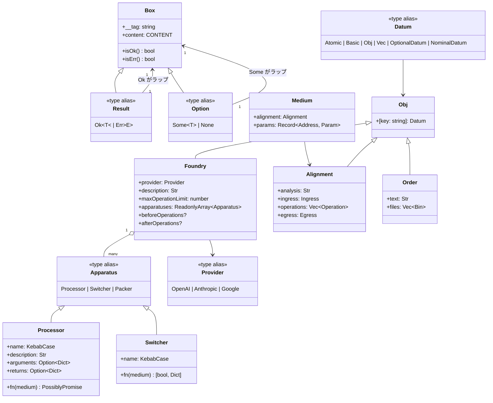
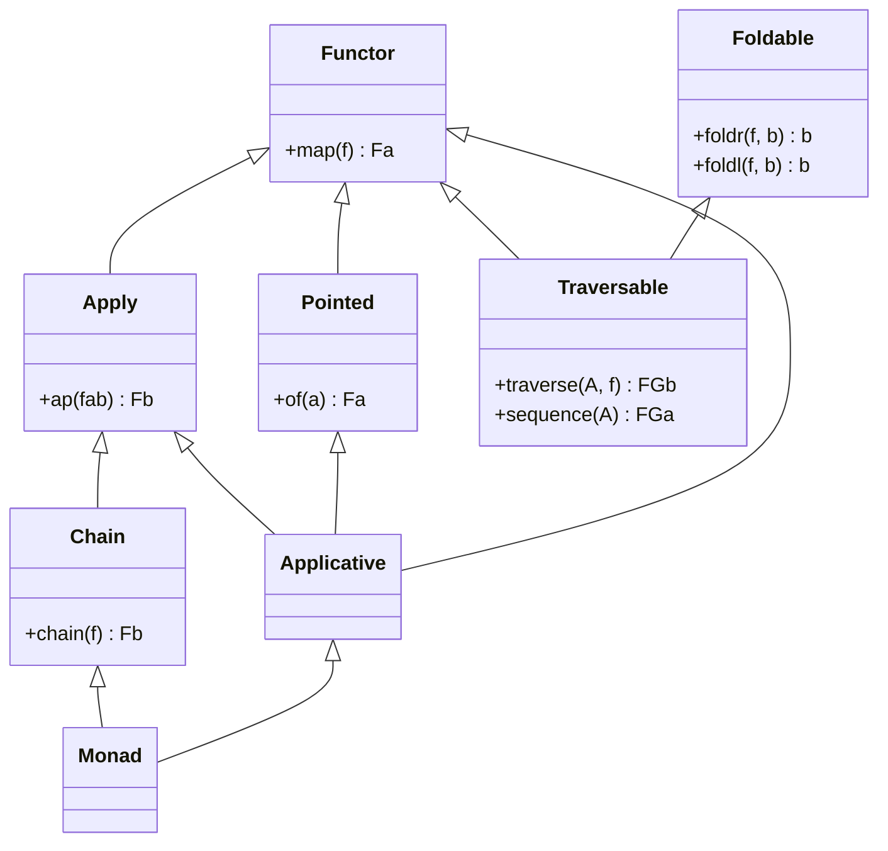
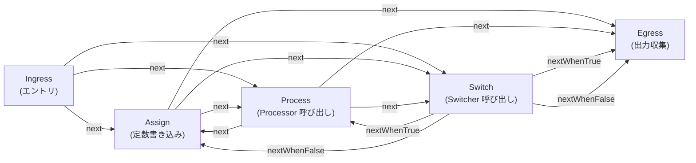
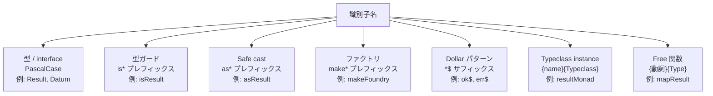

[English](model.md) | [Japanese](model_ja.md)

# Model Viewpoint

この viewpoint は、plgg monorepo のコアドメインエンティティ、それらの相互関係、システム全体で維持される invariant、およびドメイン知識をエンコードする命名規則を説明します。ドメインは3つの概念レイヤにわたります: `plgg` コア型代数、`plgg-foundry` AI オーケストレーション実行モデル、そして `plgg-kit` LLM provider 抽象。module 境界については [Component Viewpoint](component_ja.md)、runtime 動作については [Application Viewpoint](application_ja.md) を参照してください。

## Domain Entities

### plgg コア型代数

`plgg` package は、他のすべての package が基盤とする型付きドメインの値を確立します。中心的な概念は `Datum` 型で、システムが有効なデータとして認識する値の宇宙を定義します。`Datum` は再帰的に `Atomic`、`Basic`、`Obj`、`Vec<Datum>`、`OptionalDatum<DatumCore>`（`Option` wrapper）、または `NominalDatum<string, DatumCore>`（`Box` wrapper）として定義されます。この閉じた宇宙は型付けされていない値がドメイン境界を越えることを防ぎます。

#### Atomic と Basic 型

`Atomic` はプリミティブな wrapper 型のリーフレベルの union です: `Num`、`BigInt`、`Bool`、`Bin`（binary buffer）、`Time`（ISO 日時文字列、誤用防止のためにブランド付き）、および `SoftStr`（任意の文字列値を受け入れる許容的な文字列）。`Int` は整数 union の抽象的なエイリアスです。

`Basic` は追加の制約を持つ refined な型で `Atomic` を拡張します。固定幅整数（`I8`、`I16`、`I32`、`I64`、`I128`、`U8`、`U16`、`U32`、`U64`、`U128`）と `Float` は数値範囲のセマンティクスを課します。文字列の refinement（`Str`、`Alphabet`、`Alphanumeric`、`CamelCase`、`PascalCase`、`KebabCase`、`SnakeCase`、`CapitalCase`）はケースと文字セットの制約を持ちます。すべての `Basic` 型は `Brand<T, U>` — ベース型にファントム文字列リテラルを付加する TypeScript の intersection 型 — であり、異なる refinement を構造的に非互換にします。

#### Container 型: Box、Option、Result

`Box<TAG, CONTENT>` はドメインの構造的なコアです。`Box` は `__tag: TAG` 文字列リテラル判別子と `content: CONTENT` ペイロードを持つ readonly オブジェクトです。システム内のすべてのタグ付きエンティティ — `Ok`、`Err`、`Some`、`None`、`Icon`、`Provider`、`Processor`、`Switcher`、`Packer` — は `Box` の特殊化です。`__tag` フィールドは網羅的なパターンマッチングのための runtime 判別子として機能します。

`Option<T>` は union `Some<T> | None` です。`Some<T>` は `Box<"Some", T>` です。`None` は `Icon`（`content: undefined` のタグのみの `Box`）です。`Option` は null/undefined をパイプラインを通じて伝播させることなく「この値は存在するか?」という問いに答えます。

`Result<T, E>` は union `Ok<T> | Err<E>` です。`Ok<T>` は `Box<"Ok", T>`、`Err<E>` は `Box<"Err", E>` です。両方とも人間工学的な narrowing のための `isOk()` と `isErr()` メソッドガードを公開します。`Result` はすべての cast 関数、バリデーション関数、および失敗する可能性のある pipeline ステップの戻り値型です。すべてのエラーが戻り値型に明示されるため、例外はプライマリなエラーシグナルとして機能しません。

#### Record と Collection 型

`Obj<T>` はすべての値が `Datum` である readonly record です。すべての複合ドメインエンティティの構造的な基盤です: `Alignment`、`Order`、`Processor` content、`Foundry` フィールド、ユーザー定義のドメインモデル。`Dict<T>` は均質な文字列キーの record です。`Vec<T>` は型付き `ReadonlyArray<T>` です。

#### Error 階層

`BaseError` は `detail: Option<string>`、`parent: Option<BaseError | Error>`、および brand フィールド `__ = "PlggError"` でネイティブ `Error` を拡張します。継承ツリーは: `BaseError` -> `InvalidError`（バリデーション失敗、代替 cast 試みを追跡する `sibling: ReadonlyArray<InvalidError>` 付き）および `BaseError` -> `Exception`（一般的な runtime 失敗）。`SerializeError` と `DeserializeError` はシリアル化の失敗をカバーします。`PlggError` は4つすべての union です。この階層は平坦なメッセージ文字列ではなく構造化されたエラーツリーを可能にします。

#### Pipeline プリミティブ

`pipe` は sync 関数を合成します: `pipe(value, f1, f2, ..., fN)` は最大21個の型付き関数を通じて値をスレッドします。`cast` は `Result` を返すバリデーション関数を合成し、「すべて試す、最初の成功を保持、完全失敗時に sibling エラーを蓄積」を実装します。`proc` は async `Result` pipeline で、各ステップで `Procedural<T>` を受け入れます。`Procedural<T>` は `T | Result<T, Error> | Promise<T> | Promise<Result<T, Error>>` の union で、各ステップはプレーン値、ラップされた result、またはそのいずれかの promise を返せます。`flow` はポイントフリーの合成関数を作成します。`match` は `Box` タグ、atomic リテラル、または boolean 値に対して網羅的なパターンマッチングを実行します。

### Typeclass 抽象

`Abstracts/Principals/` module は Haskell スタイルの typeclass インターフェースを提供します: `Functor`、`Apply`、`Applicative`、`Pointed`、`Chain`、`Monad`、`Foldable`、`Traversable`、`Monoid`、`Semigroup`。これらは `declare module` 拡張を通じてオープンな `MapKind1<A>`、`MapKind2<A, B>`、または `MapKind3<A, B, C>` インターフェースに登録された `KindKey` 文字列リテラルによってパラメータ化されます。`Option` は `MapKind1`（1つの型パラメータ）として、`Result` は `MapKind2`（2つの型パラメータ）として登録されます。これにより TypeScript で higher-kinded 型をシミュレートします。完全な instance — `optionMonad`、`resultMonad` など — は抽出された free 関数（`mapOption`、`chainResult` など）とともにエクスポートされます。

`Servables` は型ごとの機能を定義します: `Refinable<T>` は `is` 型ガードを提供し、`Castable<T>` は `Result<T, InvalidError>` を返す `as` バリデーション cast を提供し、`JsonSerializable<T, J>` は JSON ラウンドトリップシリアル化のための `toJsonReady`/`fromJsonReady` を提供します。

### plgg-foundry ドメインモデル

foundry ドメインは AI オーケストレーションされたレジスタマシンをモデル化します。そのエンティティは2つのグループに分かれます: 静的な設定（開発者が宣言するもの）と動的な実行計画（LLM が runtime に生成するもの）。

#### 静的設定: Foundry と Apparatus

`Foundry` は開発者が宣言する設定です: LLM `Provider`、`description: Str`（system prompt フラグメント）、`maxOperationLimit: number`（サーキットブレーカー）、および順序付きの `Apparatus` インスタンスリスト。`Foundry` は構築後に変更できません。`makeFoundry` はデフォルト値を適用した immutable な `Readonly` オブジェクトを生成します。

`Apparatus` は union `Processor | Switcher | Packer` です。各バリアントはタグと content record を持つ `Box` です:

- `Processor = Box<"Processor", { name: KebabCase, description: Str, arguments: Option<Dict<VariableName, VirtualType>>, returns: Option<Dict<VariableName, VirtualType>>, fn: (medium: Medium) => PossiblyPromise<unknown> }>`. Processor は名前付きで型付けされた関数です。`arguments` と `returns` フィールドは読み書きするレジスタ変数を説明します。これらの説明は LLM が processor を計画にワイヤリングする方法を知るために system prompt にレンダリングされます。
- `Switcher = Box<"Switcher", { name: KebabCase, description: Str, arguments: ..., returnsWhenTrue: ..., returnsWhenFalse: ..., fn: (medium: Medium) => [boolean, Dict] }>`. Switcher は名前付きの boolean 述語です。入力を取り、条件を評価し、`[boolean, Dict]` のタプルを返します — boolean がどのブランチを取るかを選択し、Dict が条件付き出力を運びます。
- `Packer = Box<"Packer", { fields: ReadonlyArray<PackerField> }>`. Packer は egress 出力構造を説明します: どのレジスタアドレスがどの出力フィールド名にマップされるか。

`VirtualType = Obj<{ type: Str, optional: Option<Bool>, description: Option<Str> }>` は Processor と Switcher の argument/return シグネチャで使用される型記述子です。人間が読める型名、optional フラグ、およびオプションの説明を持ちます。これらの記述子は LLM が正しく型付けされた operation 計画を生成できるように公開されます。

`Medium = Readonly<{ alignment: Alignment, params: Record<Address, Param> }>` はすべての `Processor.fn` と `Switcher.fn` に渡される実行コンテキストです。`params` は apparatus が呼び出された時点のレジスタスナップショットです。

#### 動的実行計画: Alignment と Operation

`Alignment = Obj<{ analysis: Str, ingress: Ingress, operations: Vec<Operation>, egress: Egress }>` は `blueprint` 関数によって生成される LLM が作成した計画です。名前付きの制御フローエッジを持つレジスタマシン操作のシーケンスを説明します。

Alignment のノード型は小さな命令セットを形成します:

- `Ingress = Obj<{ type: "ingress", next: string }>` — エントリポイント。`next` は最初の `Operation` を名前で指します。
- `Assign = Obj<{ type: "assign", name: string, address: Address, value: string, next: string }>` — JSON エンコードされた定数をレジスタに書き込みます。
- `Process = Obj<{ type: "process", name: string, action: string, input: ReadonlyArray<NameTableEntry>, output: ReadonlyArray<NameTableEntry>, next: string }>` — 名前付き Processor オペコードを実行し、`NameTableEntry` ペアを通じてレジスタを変数にマッピングします。
- `Switch = Obj<{ type: "switch", name: string, action: string, nextWhenTrue: string, nextWhenFalse: string, input: ..., outputWhenTrue: ..., outputWhenFalse: ... }>` — 名前付き Switcher オペコードを評価してブランチします。
- `Egress = Obj<{ type: "egress", ... }>` — 終了ノード。名前付き出力を収集します。
- `Operation = Assign | Process | Switch` — ナビゲート可能な中間ノードの union。

`NameTableEntry = { variableName: VariableName, address: Address }` は変数名（Processor/Switcher がそれを認識する方法）をレジスタアドレス（`Env` が格納する方法）にマッピングします。この間接参照により、LLM は apparatus 定義にレジスタアドレスをハードコードせずに apparatus 呼び出し間で任意のデータをルーティングできます。

`Env = Readonly<Record<Address, Param>>` はレジスタファイルです。`Param = unknown` — レジスタはどんな値でも保持できます。LLM が生成したデータはレジスタレベルでドメインモデルによって型付けされません。

`Order = Obj<{ text: Str, files: Vec<Bin> }>` は foundry へのユーザーリクエストで、テキストプロンプトとオプションのバイナリファイル添付を運びます。`OperationContext` は実行状態全体 — `foundry`、`alignment`、`order`、`env`、および `operationCount` — をバンドルし、再帰的な実行ループを通じてスレッドされます。

### plgg-kit Provider モデル

`Provider = OpenAI | Anthropic | Google`。各バリアントは `Box<"TAG", Config>` で、`Config = Obj<{ model: string, apiKey: Option<string> }>` です。`model` フィールドは `SoftStr` で、任意のモデル識別子を許可します。`apiKey` は `Option<string>` です — 存在しない場合、adapter は呼び出し時に対応する環境変数にフォールバックします。コンストラクタ関数（`openai()`、`anthropic()`、`google()`）はプレーンなモデル文字列または config オブジェクトのどちらかを受け入れます。

### コアドメインエンティティのクラス図

## Relationships

### 閉じた集合としての Datum 宇宙

`Datum` 型は plgg ドメインの閉世界仮説です。`Obj` に格納される、pipeline を通じて渡される、または `Env` に登録されるすべての値は `isDatum` を満たす必要があります。`Datum` の再帰構造 — `DatumCore | OptionalDatum<DatumCore> | NominalDatum<string, DatumCore>` — は単一の型安全な境界を維持しながら record、配列、optional、名義タグ付き値の任意のネストを許可します。

`DatumCore` と `Datum` の関係: `DatumCore = Atomic | Basic | Obj | ReadonlyArray<Datum>`。配列は再帰的に `ReadonlyArray<Datum>` として型付けされ、`Vec<Datum>` を第一級の Datum 値にします。`Obj`（すべての値が `Datum` である readonly record）も `DatumCore` です。これは `Obj` が任意にネストできることを意味します: `Vec<Obj<...>>` を含む `Obj` は有効な `Datum` です。

### ユニバーサルバリアントとしての Box

`Box<TAG, CONTENT>` パターンはすべてのタグ付きバリアントを統一します。`Ok`、`Err`、`Some`、`None`、`Icon`、`OpenAI`、`Anthropic`、`Google`、`Processor`、`Switcher`、`Packer` はすべて異なる `TAG` リテラルを持つ `Box` インスタンスです。`pattern(tag)` コンストラクタは `Box` バリアントの union を網羅的にディスパッチするために `match` で使用される型付きウィットネス値を作成します。`hasTag(tag)` 述語は `Box<string, unknown>` を `Box<T, unknown>` に narrowing します。

### Foundry-Alignment 依存関係

`Foundry` は静的です。開発者によって一度設定されます。`Alignment` は動的です。`Foundry` の説明と apparatus リストを与えられた LLM によって生成されます。実行時に、`Alignment` の `Process` と `Switch` ノードはオペコード名（`action` フィールド）で `Foundry.apparatuses` を参照します。`findProcessor` と `findSwitcher` 関数が runtime にこれらの参照を解決します。`action` オペコードが登録された apparatus と一致しない場合、操作は `Err` で失敗します。

### 変数とアドレスを橋渡しする NameTable

`NameTableEntry` は2つの名前空間を橋渡しします: 変数名前空間（apparatus の `fn` 引数がコードでどのように名付けられているか）とレジスタアドレス名前空間（データが `Env` にどのように格納されるか）。単一の `Process` ノードは `input: ReadonlyArray<NameTableEntry>` と `output: ReadonlyArray<NameTableEntry>` を持ちます。`processor.fn` を呼び出す前に、executor は `env[entry.address]` から読み込んで `medium.params[entry.variableName]` を構築します。呼び出し後、`result[entry.variableName]` を読み込んで `env[entry.address]` に書き込みます。

### Typeclass 階層

`Abstracts/Principals` の typeclass 階層は標準的な Haskell スタイルの格子に従います: `Functor`（map）が基盤です。`Apply` は `ap` で `Functor` を拡張します。`Pointed` は `of` で `Functor` を拡張します。`Applicative` は `Apply`、`Functor`、`Pointed` を組み合わせます。`Chain` は `chain`（flatMap）で `Apply` を拡張します。`Monad` は `Chain` と `Applicative` を組み合わせます。`Foldable` は `foldr`/`foldl` を提供します。`Traversable` は `traverse`/`sequence` で `Functor` と `Foldable` を拡張します。各インターフェースは `MapKind*` レジストリを通じて解決される `KindKey` 文字列リテラルによってパラメータ化されます。

### Typeclass 継承ラティス

### Alignment Operation グラフ

`Alignment` は名前付きノードの有向グラフを形成します。invariant は実行が常に `Ingress.next` で始まり `Egress` で終わることです。すべての `Assign` と `Process` ノードは正確に1つの送出エッジ（`next`）を持ちます。すべての `Switch` ノードは正確に2つの送出エッジ（`nextWhenTrue`、`nextWhenFalse`）を持ちます。この構造は有限状態機械をエンコードします。`operationCount` カウンターは `maxOperationLimit` を通じて終了を強制し、無限ループするサイクルを処理します。

## Invariants

以下の invariant はドメインモデルによって維持され、型ガード、cast 関数、および runtime チェックによって強制されます。

**Datum の閉鎖性**: `Obj` に格納されるすべての値は `isDatum` を満たす必要があります。`asObj` cast 関数はこれを再帰的に検証します。raw な JavaScript オブジェクト、関数、Symbol、または undefined の値を含むオブジェクトは `isDatum` を満たさず、明示的なラッピングなしに Datum 宇宙に入れません。

**Box 判別子の完全性**: `Box` は `box(tag)(content)` ファクトリまたは `ok()`/`err()`/`some()`/`none()` コンストラクタを通じてのみ構築されます。`__tag` フィールドは `Readonly` で構築時に設定されます。変更操作は存在しません。`match` によるパターンマッチングは `__tag` の等価性比較に依存します。

**Result の非エスケープ**: Pipeline 関数（`pipe`、`cast`、`proc`）は `never` を返す関数を除外する `NonNeverFn` 引数のみを受け入れます。`proc` は同期例外をキャッチして `Exception` にラップします。スローされた例外は `proc` チェーンからサイレントにエスケープできません。すべての失敗するステップは明示的に `Result<T, E>` を返します。

**cast Sibling 蓄積**: `cast` が複数のバリデーター関数を受け取ると（代替 cast 試みとして使用）、それぞれを元の値に適用します。最初が成功すれば残りはスキップされます。最初が失敗して2番目が成功すると、最初のエラーを持つ `Err` が返されます（成功した値ではなく — `cast` は最初の試みにコミットします）。すべてが失敗すると、`sibling` 配列にすべての個別失敗を含む単一の `InvalidError` が返されます。

**Alignment の単一 Ingress / 単一 Egress**: `asAlignment` は `Alignment` が正確に1つの `ingress` と1つの `egress` フィールドを持つことを検証します。`findIngress` と `findEgress` ヘルパーは検証済みの `Alignment` 型がこれらのフィールドの存在を保証するため無条件に `Ok` を返します。

**Foundry Operation 制限**: `OperationContext.operationCount` はすべての operation ディスパッチでインクリメントされます。`Foundry.maxOperationLimit` に達すると、executor は `Err` を返します。これは alignment の終了に対する唯一の runtime invariant 強制です。静的に無限ループを防ぐことはありません。

**Processor 名は KebabCase**: `Processor.content.name` と `Switcher.content.name` は `KebabCase`（`Brand<string, "KebabCase">`）として型付けされます。`makeProcessor` と `makeSwitcher` ファクトリは `box("KebabCase")(spec.name) as KebabCase` を通じて開発者が提供した文字列を `KebabCase` に cast します。この規則により `findProcessor`/`findSwitcher` でのオペコード検索が一貫した kebab-case 文字列を使用することを保証し、LLM が生成するよう指示されたものと一致します。

**明示的 null としての Option**: `None` はドメイン全体で `null` と `undefined` を置き換えます。`Obj<T>` のいかなるフィールドも `null` または `undefined` を値として受け入れません。オプションフィールドは明示的に `Option<T>` として表現されます。`forOptionProp` cast ヘルパーは存在しないかもしれないオブジェクトプロパティのパターンを処理します。

## 命名規則

コードベースの命名規則はドメインの役割を識別子名に直接エンコードします。

**型名**: すべての型エイリアス、インターフェース、クラスに PascalCase。（`Result`、`Datum`、`Alignment`、`Processor`、`VirtualType`）。単語名が優先されます。複数単語の名前はアンダースコアを避けます。

**型ガード関数**: `is*` プレフィックス、ガードされる型の最初の文字を小文字に。（`isResult`、`isAlignment`、`isProcessor`、`isAssign`）。これらは各 module からエクスポートされるスタンドアロン関数で、メソッドではありません。

**Safe cast 関数**: `as*` プレフィックス、対象型の最初の文字を小文字に。（`asResult`、`asAlignment`、`asObj`）。戻り値型は常に `Result<T, InvalidError>` です。

**コンストラクタ / ファクトリ関数**: 複雑な構築には `make*` プレフィックス、シンプルなラッパーには bare な lower camelCase。（`makeFoundry`、`makeProcessor`、`makeSwitcher` 対 `ok()`、`err()`、`some()`、`none()`、`box(tag)(content)`）。

**Pattern コンストラクタ**: `match` で使用される `pattern()` ウィットネスの `*$` サフィックス（ドル記号）。（`ok$`、`err$`、`some$`、`none$`、`openAI$`、`anthropic$`、`google$`）。ドル記号は「これはパターンウィットネスで値コンストラクタではない」ことを示します。

**Typeclass instance**: `{lowerCamelCaseName}{TypeclassName}` — エンティティ名の lower camel case と typeclass 名を連結。（`resultFunctor`、`resultMonad`、`optionChain`、`optionApplicative`）。抽出された free 関数は `{動詞}{TypeName}` を使用。（`mapResult`、`chainOption`、`traverseResult`）。

**カテゴリディレクトリ名**: カテゴリには PascalCase、含まれる型の構造的役割を説明する英語形容詞の複数形として選択。（`Atomics`、`Basics`、`Conjunctives`、`Contextuals`、`Disjunctives`、`Collectives`、`Exceptionals`、`Flowables`、`Functionals`、`Grammaticals`、`Abstracts`）。サフィックス "-ives" または "-als" は単一のクラスではなく関連する抽象のカテゴリを示します。

**KindKey 文字列リテラル**: 型名と正確に一致する PascalCase 文字列リテラル。（`"Option"`、`"Result"`、`"Ok"`、`"Err"`、`"Str"`、`"KebabCase"`、`"Processor"`、`"Switcher"`）。これらは `Box` 値の `__tag` 判別子と `MapKind1` / `MapKind2` の `KindKey` レジストリキーの両方として使用されます。

**Address と VariableName**: 両方とも runtime 強制なしの `string` エイリアスです（`type Address = string`、`type VariableName = string`）。生成された alignment での命名規則は小文字に数値サフィックス（アドレスには `r0`、`r1`、`r2`）ですが、これは LLM の規則であり、型レベルの制約ではありません。

**`Procedural<T>`**: `Procedural` 型名は「非同期かもしれず、Result かもしれない値」を示します。`Promise` や `Async` のどちらも単独では4方向の union を捉えないため、過負荷を避けます。名前はパイプラインを「進む」計算を想起させるために選ばれました。

### 命名規則サマリー

## Assumptions

- **[Explicit]** `Datum` は `src/plgg/src/Disjunctives/Datum.ts` で `DatumCore | OptionalDatum<DatumCore> | NominalDatum<string, DatumCore>` として再帰的に定義されています（`DatumCore = Atomic | Basic | Obj | ReadonlyArray<Datum>`）。
- **[Explicit]** `Box<TAG, CONTENT>` はユニバーサルバリアント型で、`src/plgg/src/Contextuals/Box.ts` で `__tag: TAG` と `content: CONTENT` を唯一のフィールドとして定義されています。
- **[Explicit]** `Result<T, E> = Ok<T> | Err<E>` と `Option<T> = Some<T> | None` は `src/plgg/src/Disjunctives/` で定義されています。
- **[Explicit]** `cast` はマルチバリデーター失敗時に sibling エラーを蓄積します（`src/plgg/src/Flowables/cast.ts` 行 527–551 で確認）。
- **[Explicit]** `Processor.content.name` は `KebabCase` として型付けされています（`src/plgg-foundry/src/Foundry/model/Processor.ts` で確認）。
- **[Explicit]** `Param = unknown` — レジスタ値はモデルレベルで型なしです（`src/plgg-foundry/src/Foundry/model/Param.ts` で確認）。
- **[Explicit]** パターンウィットネス関数は `$` サフィックスを使用します（`ok$`、`err$`、`openAI$`、`anthropic$`、`google$`）（`src/plgg/src/Contextuals/Ok.ts` と `src/plgg-kit/src/LLMs/model/Provider.ts` で確認）。
- **[Explicit]** `Foundry.maxOperationLimit` はデフォルト 10、`provider` はデフォルト `openai("gpt-5.1")`（`src/plgg-foundry/src/Foundry/model/Foundry.ts` 行 67–68 で確認）。
- **[Inferred]** `plgg` のカテゴリ名（`Atomics`、`Conjunctives`、`Disjunctives` など）はラテン語由来の文法規則に従います: "Atomics"（要素的）、"Conjunctives"（結合）、"Disjunctives"（分岐）、"Contextuals"（ラッピング）など。この命名スキームは各カテゴリが型代数で果たす構造的役割をエンコードします。
- **[Inferred]** `Some<T>` は `Box<"Some", T>` として、`None` は `Icon<"None">` として実装されており、ユニバーサル `Box` パターンと一致します（コメントに明示的な相互参照はなく、`Ok.ts` と `Some.ts` の構造分析から推論）。
- **[Inferred]** パターンウィットネスの `$` サフィックスはコンストラクタとの区別を意図しています: `ok(value)` は `Ok<T>` を構築し、`ok$(value)` はマッチング用のパターンを作成します。この意図的な区別はすべてのバリアント型にわたる命名パターンの対称性から推論されます。
- **[Inferred]** すべてのモデル型の基盤として（プレーンなインターフェースではなく）`Obj<T>` を選択することは意図的です — すべてのオブジェクト形状のドメインエンティティがシリアル化（`JsonSerializable` を通じて）および検証（`isDatum` を通じて）できることを強制します。これにより厳格なシリアル化境界が生まれます。
- **[Inferred]** `Address` と `VariableName` は意図的にブランドなしの `string` エイリアスのままにされています（`Brand<string, "Address">` ではなく）。LLM が生成した JSON はコンパイル時にブランドチェックできないためです。
