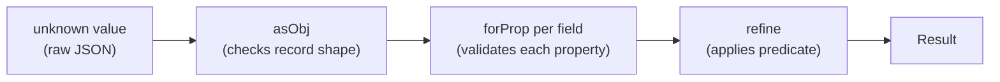
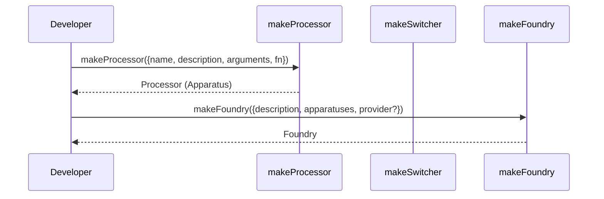
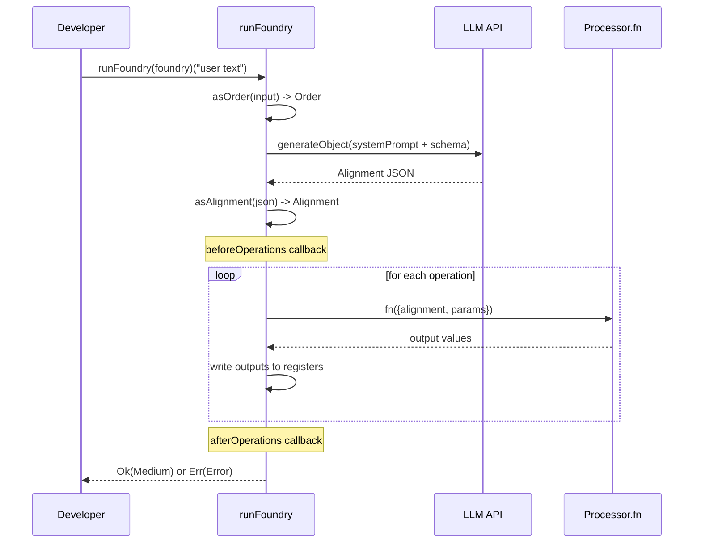

[English](usecase.md) | [Japanese](usecase_ja.md)

# Use Case Viewpoint

This viewpoint describes how developers interact with the plgg library ecosystem through concrete usage patterns. It covers domain modeling with the `plgg` type system, building and running AI-driven pipelines with `plgg-foundry`, and configuring LLM providers via `plgg-kit`. See [Feature Viewpoint](feature.md) for the full capability inventory and [Application Viewpoint](application.md) for runtime mechanics.

## Use Case: Defining a Domain Model with Validated Types

A developer defines a domain type (e.g., `Article`) using `plgg` primitives: `Obj<T>` for the record type, `Str` / `Time` / `Option<string>` for field types, and `cast` composition for validated construction.

```typescript
import {
  Time, Option, Obj, Str, Result, InvalidError,
  asSoftStr, asObj, forProp, forOptionProp,
  asTime, cast, refine, asStr,
} from "plgg";

export type Article = Obj<{
  id: string;
  createdAt: Time;
  name: Str;
  memo: Option<string>;
}>;

export const asArticle = (v: unknown): Result<Article, InvalidError> =>
  cast(
    v,
    asObj,
    forProp("id", asSoftStr),
    forProp("createdAt", asTime),
    forProp("name", (v) => cast(v, asSoftStr, refine((s) => s.length >= 3, "Name must be at least 3 characters long"), asStr)),
    forOptionProp("memo", asSoftStr),
  );
```

**Input**: `unknown` value (e.g., parsed JSON).
**Output**: `Result<Article, InvalidError>` — `Ok(article)` on success, or `Err(invalidError)` with detailed sibling diagnostics on failure.

### Domain Modeling Flow



## Use Case: Chaining Transformations with pipe

`pipe` is used for synchronous, exception-free data transformation. The developer chains functions explicitly; TypeScript infers the type at each step.

```typescript
import { pipe, mapResult, chainResult, ok } from "plgg";

const result = pipe(
  rawData,
  asUser,
  chainResult((user) => findProfile(user.id)),
  mapResult((profile) => profile.displayName),
);
// result: Result<string, InvalidError>
```

**Input**: An initial value of any type.
**Output**: The return type of the last function in the chain.
**Constraint**: Each function must accept the output type of the previous function. TypeScript enforces this statically.

## Use Case: Async Pipeline with proc

`proc` handles mixed sync/async Result-returning steps. The developer does not need to await intermediate steps; `proc` flattens Promises and short-circuits on `Err`.

```typescript
import { proc, asStr } from "plgg";
import { generateObject } from "plgg-kit";
import { openai } from "plgg-kit";

const result = await proc(
  { provider: openai("gpt-4o"), userPrompt: "Hello", schema: { type: "object" } },
  generateObject,
  // next step receives the unwrapped object
  (data) => asStr(data),
);
// result: Result<Str, Error>
```

**Input**: An initial value (can be a Promise, Result, or plain value).
**Output**: `Promise<Result<T, Error>>`.

## Use Case: Pattern Matching on Box Unions

`match` provides exhaustive pattern matching over `Box`-tagged unions. TypeScript reports a compile error if a branch is missing.

```typescript
import { match, openAI$, anthropic$, google$ } from "plgg-kit";
import type { Provider } from "plgg-kit";

const modelName = (provider: Provider): string =>
  match(
    provider,
    [openAI$(),   (p) => `OpenAI: ${p.content.model}`],
    [anthropic$(), (p) => `Anthropic: ${p.content.model}`],
    [google$(),    (p) => `Google: ${p.content.model}`],
  );
```

**Input**: A value of a Box union type.
**Output**: The return type of the handler functions (must be uniform).

## Use Case: Building a Foundry for AI-Driven Operations

A developer defines a `Foundry` with processors (functions the AI can call), then submits user requests to `runFoundry`.

```typescript
import { makeFoundry, makeProcessor, runFoundry } from "plgg-foundry";
import { proc, asSoftStr, asNum } from "plgg";
import { anthropic } from "plgg-kit";

const todos = new Map<number, string>();
let id = 0;

const myFoundry = makeFoundry({
  description: "A foundry for managing a TODO list.",
  provider: anthropic("claude-opus-4-6"),
  maxOperationLimit: 5,
  apparatuses: [
    makeProcessor({
      name: "add",
      description: "Inserts a new TODO item.",
      arguments: { todo: { type: "string" } },
      fn: ({ params }) =>
        proc(params["todo"], asSoftStr, (v) => { todos.set(++id, v); }),
    }),
    makeProcessor({
      name: "remove",
      description: "Removes a TODO by numeric ID.",
      arguments: { id: { type: "number", description: "The TODO id" } },
      fn: ({ params }) =>
        proc(params["id"], asNum, (v) => { todos.delete(v); }),
    }),
  ],
});
```

**Input**: `makeFoundry` spec with description, apparatuses, and optional provider/limit/callbacks.
**Output**: `Foundry` value.

### Foundry Construction Sequence



## Use Case: Running a User Request Through a Foundry

After constructing a `Foundry`, the developer submits a natural language request. `runFoundry` handles AI planning and execution automatically.

```typescript
const result = await runFoundry(myFoundry)("Add 'buy groceries' to my TODOs");
if (isOk(result)) {
  console.log("Done. Params:", result.content.params);
} else {
  console.error("Failed:", result.content.message);
}
```

**Input**: A string prompt, or an `OrderSpec` object `{ text: string; files?: ... }`.
**Output**: `Promise<Result<Medium, Error>>` where `Medium = { alignment: Alignment; params: Record<string, Param> }`.

### runFoundry Execution Sequence



## Use Case: Observing Execution with Lifecycle Callbacks

The `beforeOperations` and `afterOperations` callbacks allow the developer to inspect the AI-generated plan and the final output without modifying the execution logic.

```typescript
const foundry = makeFoundry({
  description: "...",
  apparatuses: [...],
  beforeOperations: ({ alignment, order }) => {
    console.log("AI plan:", alignment.analysis.content);
    console.log("Operations:", alignment.operations.length);
  },
  afterOperations: ({ medium, order }) => {
    console.log("Result params:", medium.params);
  },
});
```

**Input**: Callbacks receive `{alignment, order}` (before) and `{medium, order}` (after).
**Output**: Callbacks are void; they are called for side effects only.

## Use Case: Configuring an LLM Provider

A developer selects a provider and optionally supplies an inline API key.

```typescript
import { openai, anthropic, google } from "plgg-kit";

// Using environment variable (OPENAI_API_KEY)
const p1 = openai("gpt-4o");

// With inline API key
const p2 = anthropic({ model: "claude-opus-4-6", apiKey: process.env.MY_KEY });

// Google Gemini
const p3 = google("gemini-2.0-flash");
```

**Input**: A model name string, or a `{model, apiKey?}` config object.
**Output**: A `Provider` value (`OpenAI | Anthropic | Google`) that can be passed to `makeFoundry` or `generateObject`.

## Use Case: Iterative Validation with refine and cast

`refine` composes with `cast` to add predicate-based constraints at any validation step.

```typescript
import { cast, asSoftStr, refine, asStr } from "plgg";

const asUsername = (v: unknown) =>
  cast(
    v,
    asSoftStr,
    refine((s) => s.length >= 3, "Username must be at least 3 characters"),
    refine((s) => /^[a-z0-9]+$/.test(s), "Username must be lowercase alphanumeric"),
    asStr,
  );
```

**Input**: `unknown` value.
**Output**: `Result<Str, InvalidError>` with detailed error messages on failure.

## Input/Output Contracts Summary

| Entry Point | Input | Output |
|---|---|---|
| `pipe(value, ...fns)` | Any type; functions must chain | Return type of last function |
| `cast(value, ...fns)` | Any type; functions return `Result` | `Result<T, InvalidError>` |
| `proc(value, ...fns)` | Any type; functions return `Procedural` | `Promise<Result<T, Error>>` |
| `match(value, ...cases)` | Box union, atomic, or boolean | Return type of handlers |
| `makeFoundry(spec)` | `FoundrySpec` object | `Foundry` |
| `runFoundry(foundry)(input)` | `string` or `OrderSpec` | `Promise<Result<Medium, Error>>` |
| `generateObject(args)` | `{provider, systemPrompt?, userPrompt, schema}` | `Promise<Result<unknown, Error>>` |
| `asArticle(v)` (example) | `unknown` | `Result<Article, InvalidError>` |

## Assumptions

- **[Explicit]** The `TodoFoundry.ts` example in `src/plgg-foundry/src/Example/` demonstrates the `makeFoundry` + `makeProcessor` + `runFoundry` workflow with an in-memory `Map`.
- **[Explicit]** `runFoundry` accepts both `string` and `OrderSpec` as verified in `src/plgg-foundry/src/Foundry/usecase/runFoundry.ts`.
- **[Explicit]** `Medium` is `{alignment: Alignment; params: Record<string, Param>}` as observed in `src/plgg-foundry/src/Foundry/model/Medium.ts`.
- **[Inferred]** `OrderSpec` carries at minimum `{text: string}` based on the string-to-OrderSpec coercion in `runFoundry`; file attachment fields are not confirmed from observed code.
- **[Inferred]** No CLI entry point or HTTP server is present; all use cases are library API calls from user application code.
