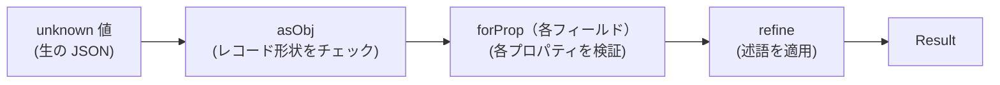
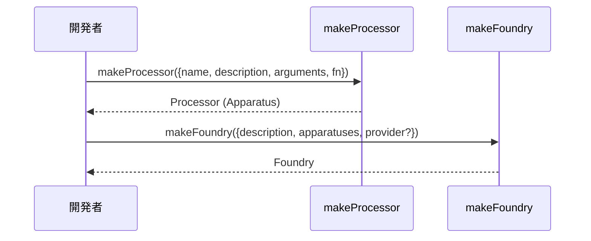
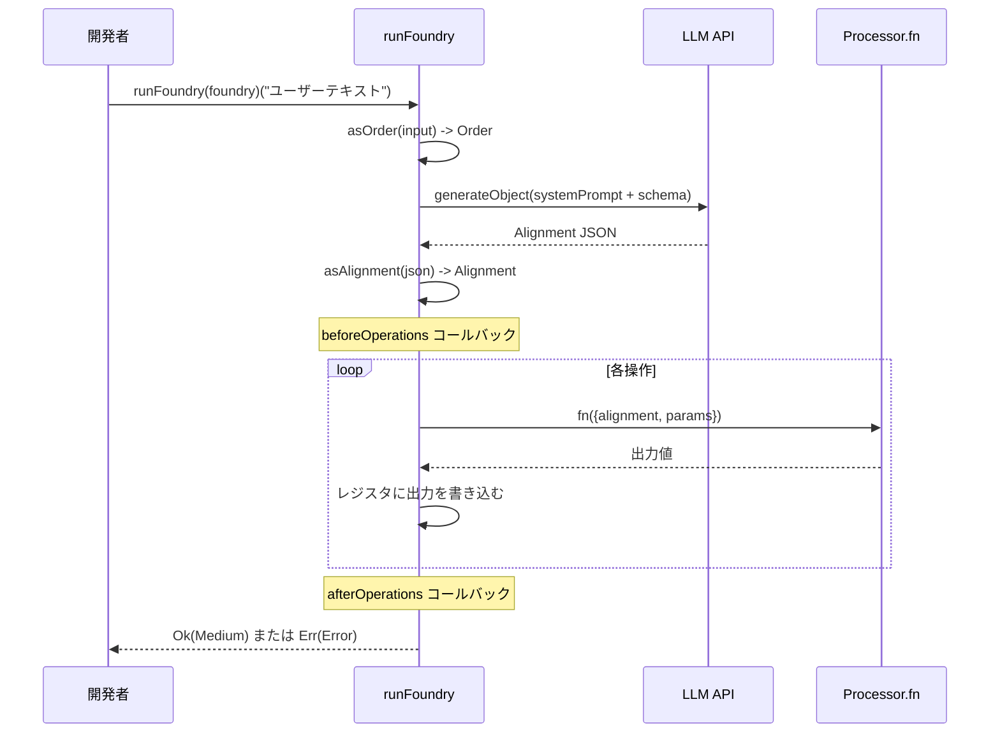

[English](usecase.md) | [Japanese](usecase_ja.md)

# Use Case Viewpoint

この viewpoint は開発者が具体的な使用パターンを通じて plgg ライブラリエコシステムとどのように対話するかを説明します。`plgg` 型システムを使ったドメインモデリング、`plgg-foundry` を使った AI 駆動パイプラインの構築と実行、`plgg-kit` を介した LLM プロバイダーの設定を扱います。完全な機能インベントリについては [Feature Viewpoint](feature_ja.md)、ランタイムメカニズムについては [Application Viewpoint](application_ja.md) を参照してください。

## ユースケース: 検証済み型でドメインモデルを定義する

開発者は `plgg` プリミティブを使用してドメイン型（例: `Article`）を定義します: レコード型には `Obj<T>`、フィールド型には `Str` / `Time` / `Option<string>`、検証済みコンストラクションには `cast` 合成を使用します。

```typescript
import {
  Time, Option, Obj, Str, Result, InvalidError,
  asSoftStr, asObj, forProp, forOptionProp,
  asTime, cast, refine, asStr,
} from "plgg";

export type Article = Obj<{
  id: string;
  createdAt: Time;
  name: Str;
  memo: Option<string>;
}>;

export const asArticle = (v: unknown): Result<Article, InvalidError> =>
  cast(
    v,
    asObj,
    forProp("id", asSoftStr),
    forProp("createdAt", asTime),
    forProp("name", (v) => cast(v, asSoftStr, refine((s) => s.length >= 3, "Name must be at least 3 characters long"), asStr)),
    forOptionProp("memo", asSoftStr),
  );
```

**入力**: `unknown` 値（例: パース済み JSON）。
**出力**: `Result<Article, InvalidError>` — 成功時は `Ok(article)`、失敗時は詳細なシブリング診断を持つ `Err(invalidError)`。

### ドメインモデリングフロー



## ユースケース: pipe によるトランスフォーメーションのチェーン

`pipe` は同期的な例外のないデータ変換に使用されます。

```typescript
import { pipe, mapResult, chainResult, ok } from "plgg";

const result = pipe(
  rawData,
  asUser,
  chainResult((user) => findProfile(user.id)),
  mapResult((profile) => profile.displayName),
);
// result: Result<string, InvalidError>
```

**制約**: 各関数は前の関数の出力型を受け入れる必要があります。TypeScript がこれを静的に強制します。

## ユースケース: proc による非同期パイプライン

`proc` は混合同期/非同期の Result を返すステップを処理します。

```typescript
import { proc, asStr } from "plgg";
import { generateObject, openai } from "plgg-kit";

const result = await proc(
  { provider: openai("gpt-4o"), userPrompt: "Hello", schema: { type: "object" } },
  generateObject,
  (data) => asStr(data),
);
// result: Result<Str, Error>
```

**入力**: 初期値（Promise、Result、または通常の値）。
**出力**: `Promise<Result<T, Error>>`。

## ユースケース: Box ユニオンのパターンマッチング

`match` は `Box` タグ付きユニオンの網羅的なパターンマッチングを提供します。

```typescript
import { match, openAI$, anthropic$, google$ } from "plgg-kit";
import type { Provider } from "plgg-kit";

const modelName = (provider: Provider): string =>
  match(
    provider,
    [openAI$(),   (p) => `OpenAI: ${p.content.model}`],
    [anthropic$(), (p) => `Anthropic: ${p.content.model}`],
    [google$(),    (p) => `Google: ${p.content.model}`],
  );
```

## ユースケース: AI 駆動操作のための Foundry を構築する

開発者は Processor（AI が呼び出せる関数）を持つ `Foundry` を定義し、`runFoundry` にユーザーリクエストを送信します。

```typescript
import { makeFoundry, makeProcessor, runFoundry } from "plgg-foundry";
import { proc, asSoftStr, asNum } from "plgg";
import { anthropic } from "plgg-kit";

const todos = new Map<number, string>();
let id = 0;

const myFoundry = makeFoundry({
  description: "TODO リストを管理するための Foundry。",
  provider: anthropic("claude-opus-4-6"),
  maxOperationLimit: 5,
  apparatuses: [
    makeProcessor({
      name: "add",
      description: "新しい TODO アイテムを挿入します。",
      arguments: { todo: { type: "string" } },
      fn: ({ params }) =>
        proc(params["todo"], asSoftStr, (v) => { todos.set(++id, v); }),
    }),
    makeProcessor({
      name: "remove",
      description: "数値 ID で TODO を削除します。",
      arguments: { id: { type: "number", description: "TODO の id" } },
      fn: ({ params }) =>
        proc(params["id"], asNum, (v) => { todos.delete(v); }),
    }),
  ],
});
```

### Foundry 構築シーケンス



## ユースケース: Foundry を通じてユーザーリクエストを実行する

```typescript
const result = await runFoundry(myFoundry)("買い物リストを TODO に追加して");
if (isOk(result)) {
  console.log("完了。Params:", result.content.params);
} else {
  console.error("失敗:", result.content.message);
}
```

**入力**: 文字列プロンプト、または `OrderSpec` オブジェクト `{ text: string; files?: ... }`。
**出力**: `Promise<Result<Medium, Error>>`。

### runFoundry 実行シーケンス



## ユースケース: ライフサイクルコールバックによる実行の観測

```typescript
const foundry = makeFoundry({
  description: "...",
  apparatuses: [...],
  beforeOperations: ({ alignment, order }) => {
    console.log("AI 計画:", alignment.analysis.content);
    console.log("操作数:", alignment.operations.length);
  },
  afterOperations: ({ medium, order }) => {
    console.log("結果 params:", medium.params);
  },
});
```

## ユースケース: LLM プロバイダーを設定する

```typescript
import { openai, anthropic, google } from "plgg-kit";

// 環境変数を使用 (OPENAI_API_KEY)
const p1 = openai("gpt-4o");

// インライン API キーを使用
const p2 = anthropic({ model: "claude-opus-4-6", apiKey: process.env.MY_KEY });

// Google Gemini
const p3 = google("gemini-2.0-flash");
```

## ユースケース: refine と cast による反復的な検証

```typescript
import { cast, asSoftStr, refine, asStr } from "plgg";

const asUsername = (v: unknown) =>
  cast(
    v,
    asSoftStr,
    refine((s) => s.length >= 3, "ユーザー名は 3 文字以上必要です"),
    refine((s) => /^[a-z0-9]+$/.test(s), "ユーザー名は小文字英数字のみ"),
    asStr,
  );
```

## 入出力コントラクトまとめ

| エントリポイント | 入力 | 出力 |
|---|---|---|
| `pipe(value, ...fns)` | 任意の型; 関数はチェーン可能 | 最後の関数の返り値型 |
| `cast(value, ...fns)` | 任意の型; 関数は `Result` を返す | `Result<T, InvalidError>` |
| `proc(value, ...fns)` | 任意の型; 関数は `Procedural` を返す | `Promise<Result<T, Error>>` |
| `match(value, ...cases)` | Box ユニオン、アトミック、またはブール | ハンドラーの返り値型 |
| `makeFoundry(spec)` | `FoundrySpec` オブジェクト | `Foundry` |
| `runFoundry(foundry)(input)` | `string` または `OrderSpec` | `Promise<Result<Medium, Error>>` |
| `generateObject(args)` | `{provider, systemPrompt?, userPrompt, schema}` | `Promise<Result<unknown, Error>>` |

## 前提条件

- **[Explicit]** `src/plgg-foundry/src/Example/TodoFoundry.ts` の例は、インメモリ `Map` を使った `makeFoundry` + `makeProcessor` + `runFoundry` ワークフローを示しています。
- **[Explicit]** `runFoundry` は `src/plgg-foundry/src/Foundry/usecase/runFoundry.ts` で確認されたとおり、`string` と `OrderSpec` の両方を受け入れます。
- **[Inferred]** CLI エントリポイントや HTTP サーバーは存在しません。すべてのユースケースはユーザーアプリケーションコードからのライブラリ API 呼び出しです。
