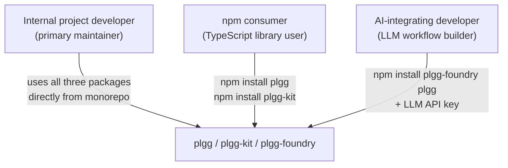
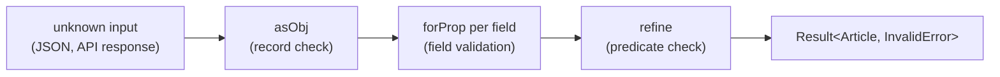
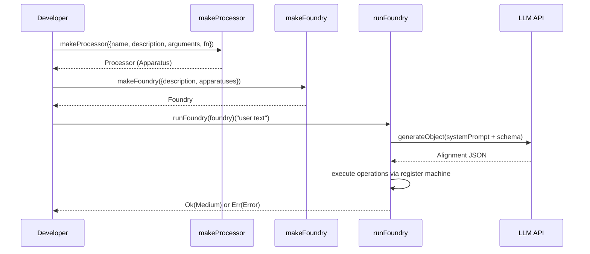
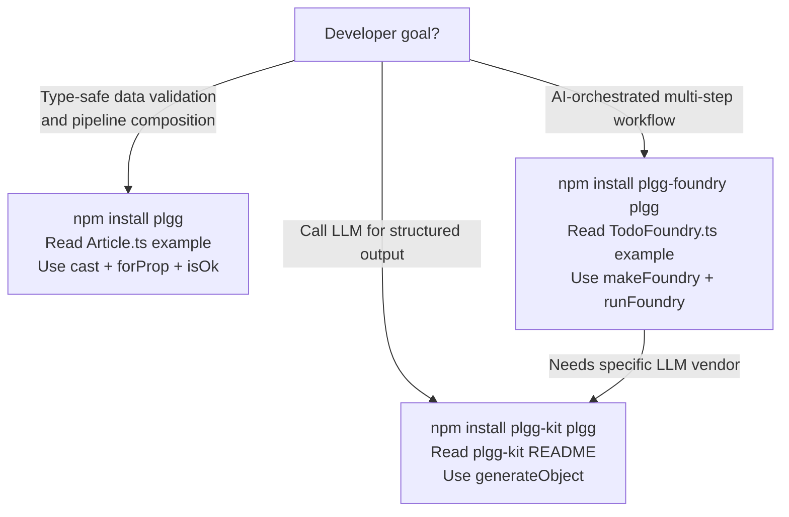

[English](ux.md) | [Japanese](ux_ja.md)

# UX Viewpoint

This viewpoint describes how developers experience the plgg library ecosystem: who uses it, what journeys they follow to accomplish their goals, how they interact with each package's API, and what paths exist for getting started. Every statement is grounded in observable codebase artifacts. Absent information is marked "not observed." See [Use Case Viewpoint](usecase.md) for concrete input/output contracts and [Feature Viewpoint](feature.md) for the full capability inventory.

## User Types

Three user types are observable from the README files, package configurations, and the stability disclaimer.

**The internal project developer** is the primary user. The root `README.md` (line 3) states the library is "primarily intended for our own projects," and the single identified maintainer (`a@qmu.jp` / `@tamurayoshiya`) is referenced in PR #6's checklist and commit authorship. This user has full access to the monorepo source, reads TypeScript source directly, and works with the strict type system enforced by CLAUDE.md (`as`, `any`, and `@ts-ignore` are prohibited). All three packages — `plgg`, `plgg-kit`, `plgg-foundry` — are in active use by this type.

**The npm consumer** is a secondary user who installs published packages from npm. The packages `plgg`, `plgg-kit`, and `plgg-foundry` are present in the public npm registry (evidenced by `package.json` `name` fields and the `npm install` instructions in each README). This user interacts via the public API surface exported from each package's `src/index.ts` and documented in the per-package README files. They do not have visibility into monorepo internals or TypeScript path alias configuration.

**The AI-integrating developer** is an emerging user type implied by the `plgg-foundry` and `plgg-kit` packages. This developer is building systems that route natural language requests through LLM APIs and needs a vendor-neutral structured output layer. The `plgg-foundry` README targets this user explicitly with a complete example showing a character design foundry that integrates image generation, content moderation, and OpenAI structured outputs.

**Not observed**: end-user consumers who interact through a built application, non-developer stakeholders, CLI users, web UI users.

### User Type Map



## User Journeys

### Journey 1: Domain Modeling with Type-Safe Validation

The internal developer and npm consumer both follow this journey when integrating `plgg` into domain model definitions. The journey begins with an `unknown` value from external input (parsed JSON, API response, form data) and ends with a strongly typed domain object wrapped in `Result`.

The developer imports types (`Obj`, `Str`, `Time`, `Option`) and cast functions (`asObj`, `asStr`, `asTime`, `asSoftStr`, `cast`, `refine`, `forProp`, `forOptionProp`) from `plgg`. They define a domain type using `Obj<T>` and a validator function using `cast` composition. The `src/example/src/modeling/Article.ts` file demonstrates this pattern: `Article` is defined as `Obj<{id, createdAt, name, memo}>` and `asArticle` chains `asObj`, three `forProp` calls, and one `forOptionProp` call.

When validation succeeds, the caller receives `Ok(article)`. When validation fails on multiple fields simultaneously, `cast` accumulates sibling errors in an `InvalidError` so the caller can present comprehensive error feedback in one pass.

### Validation Journey Flow



### Journey 2: Synchronous Data Transformation Pipeline

A developer uses `pipe` to chain synchronous transformations without explicit intermediate variables. This journey applies to both validation chains and pure data transformation sequences. The developer calls `pipe(initialValue, fn1, fn2, ..., fnN)` and TypeScript infers the type at each step. No manual type annotations are required as long as each function's input type matches the previous function's output type. The `plgg` README Quick Start shows `chain` (an older term; current term is `pipe`) used for validating a user object.

This journey is entirely compile-time-safe: a type mismatch between pipeline steps is a TypeScript error, not a runtime error.

### Journey 3: Async Pipeline with Error Short-Circuiting

The `proc` function handles the more common real-world journey where async operations (LLM calls, database queries, HTTP requests) must be chained with error propagation. The developer does not write `await`, `try/catch`, or manual `if isOk` checks between steps. `proc` unwraps `Promise<Result<T, E>>` at each step and skips remaining steps when `Err` is returned.

The `usecase.md` documents an example combining `plgg-kit`'s `generateObject` with `plgg`'s `asStr` in a single `proc` chain — the primary use case for developers building LLM-backed pipelines.

### Journey 4: Building an AI-Orchestrated Workflow (Foundry)

This is the primary journey for the AI-integrating developer user type. It proceeds in four stages:

1. **Define apparatus inventory**: The developer calls `makeProcessor` and/or `makeSwitcher` for each operation the workflow should support. Each apparatus has a `name`, a `description` shown to the LLM, `arguments` (inputs), and `returns`/`returnsWhenTrue`/`returnsWhenFalse` (outputs). Names must be unique kebab-case identifiers; descriptions must be specific enough for the LLM to distinguish operations.

2. **Assemble the foundry**: `makeFoundry({ description, apparatuses, provider?, maxOperationLimit? })` combines all apparatuses. The description summarizes the system's purpose for the LLM. An optional `beforeOperations` callback enables plan inspection before execution; `afterOperations` enables result inspection afterward.

3. **Submit a natural language order**: `runFoundry(foundry)("user text")` triggers the AI planning phase. The LLM receives the foundry description, all apparatus descriptions, and a JSON schema for the `Alignment` structure. It returns an operation sequence (Alignment). No manual workflow writing is required.

4. **Handle the result**: The caller receives `Promise<Result<Medium, Error>>`. On success, `medium.params` contains the final register values. On failure, the error describes which phase failed (order validation, blueprint generation, or operation execution).

The `src/plgg-foundry/src/Example/TodoFoundry.ts` file shows the simplest observable implementation: a foundry with two processors (`add`, `remove`) backed by an in-memory `Map`, with no explicit provider (defaults to `openai("gpt-5.1")`).

### Foundry Journey Sequence



### Journey 5: LLM Provider Configuration

The developer selects a provider using `openai(model)`, `anthropic(model)`, or `google(model)` from `plgg-kit`. The model argument can be a plain string or a `{model, apiKey}` config object. When `apiKey` is omitted, the runtime reads `OPENAI_API_KEY`, `ANTHROPIC_API_KEY`, or `GEMINI_API_KEY` from the environment. The resulting `Provider` value is passed to `makeFoundry` or directly to `generateObject`.

The `plgg-kit` README documents three providers with identical call signatures, allowing the developer to swap providers without changing the downstream code.

## Interaction Patterns

### Pattern 1: Curried Two-Step Entry Points

The two most prominent entry points (`runFoundry`, `pipe`, `cast`, `proc`) follow a curried or variadic pattern that enables partial application. `runFoundry(foundry)` returns a function, so the developer can name the bound function and reuse it. `pipe(value, ...fns)` is variadic but always proceeds immediately. This pattern keeps call sites concise and allows construction-time configuration to be separated from runtime invocation.

**Evidence**: `src/plgg-foundry/src/Foundry/usecase/runFoundry.ts`, `usecase.md` examples throughout.

### Pattern 2: Result-Typed Returns Everywhere

No function in the public API throws an exception for expected failure cases. Every fallible operation returns `Result<T, E>`. The caller pattern is always:

```typescript
if (isOk(result)) {
  // use result.content
} else {
  // handle result.content (error)
}
```

Both `isOk` and `isErr` are exported from `plgg` as type guards that narrow the `Result` type. This pattern is observable in every code example across all three package READMEs and the `usecase.md`.

**Note on README inconsistency**: The `plgg-foundry` README (line 193) and `plgg-kit` README (line 53) use `result.isOk()` method-call syntax, while the current `plgg` API uses the functional `isOk(result)` pattern. The `usecase.md` consistently uses `isOk(result)`. The method-call style in the package READMEs may be outdated. See `project-context.md` Issues 5 and 6.

### Pattern 3: Constructor Functions over Class Instantiation

All apparatus and foundry values are created via `make*` factory functions (`makeFoundry`, `makeProcessor`, `makeSwitcher`). No `new` keyword or class constructor is observable in the public API. This matches the overall library style where type construction uses `as*` cast functions and value construction uses `make*` or direct constructor functions (`ok`, `err`, `some`, `none`, `openai`, `anthropic`, `google`).

**Evidence**: `src/plgg-foundry/src/Example/TodoFoundry.ts`, `usecase.md` all examples.

### Pattern 4: Named Register Addressing for Inter-Operation Data Flow

Within `plgg-foundry`, data flows between operations through string-addressed registers (`r0`, `r1`, etc.). The developer does not write register addresses manually — the LLM assigns them in the generated Alignment. However, within apparatus `fn` implementations, the developer accesses input values as `medium.params["argumentName"]?.value`. The parameter name matches the `arguments` key declared in the apparatus spec, not the register address. This indirection is managed automatically by the operation executor.

**Evidence**: `src/plgg-foundry/src/Example/TodoFoundry.ts` lines 21–22, 34–35.

## Onboarding Paths

### Path 1: plgg Only (Functional Primitives)

The minimal onboarding for `plgg` alone:

1. Run `npm install plgg`.
2. Read the root `README.md` Quick Start (lines 22–34), which shows `chain` / `Obj.cast` / `Str.cast` usage. Note: this Quick Start uses an older API surface (`chain`, `Obj.cast`) that differs from the current documented API (`pipe`, `asObj`, `cast`). The `usecase.md` contains accurate current usage.
3. Import types and cast functions from `plgg` and write a validator function using `cast` + `forProp`.
4. Use `isOk` / `isErr` to handle the result.

The `src/example/src/modeling/Article.ts` is the canonical reference for this path, as it is the only non-test, non-library TypeScript file modeling a real domain type.

**Gap**: No dedicated getting-started guide exists in `.workaholic/guides/`. The README Quick Start is the sole onboarding artifact for npm consumers, and it uses an API pattern that may not match the current implementation (see `project-context.md` Issues 5 and 6).

### Path 2: plgg-kit Standalone (LLM Structured Output)

1. Run `npm install plgg-kit plgg`.
2. Obtain an API key for the chosen provider.
3. Read `src/plgg-kit/README.md`. Import `generateObject` and a provider constructor (`openai`, `anthropic`, or `google`).
4. Call `generateObject({provider, userPrompt, schema})` and handle the `Result`.

This path does not require `plgg-foundry`. It is the right entry point for developers who want LLM structured output without AI-orchestrated workflows.

**Gap**: The `plgg-kit` README uses `result.isOk()` method syntax. Developers following this README verbatim may encounter type errors if the current `plgg` API does not expose `isOk` as an instance method.

### Path 3: plgg-foundry (AI Workflow Orchestration)

1. Run `npm install plgg-foundry plgg`.
2. Obtain an LLM API key (OpenAI by default; the `plgg-foundry` README specifies "You'll also need an OpenAI API key with access to structured outputs").
3. Define apparatuses with `makeProcessor` / `makeSwitcher`.
4. Assemble with `makeFoundry`.
5. Call `runFoundry(foundry)(orderText)` and handle the `Result<Medium, Error>`.

The `plgg-foundry` README provides a complete character-design example with validation loops as the primary onboarding scenario. The `src/plgg-foundry/src/Example/TodoFoundry.ts` file provides a simpler in-package reference.

**Gap**: The `plgg-foundry` README Quick Start (lines 28–68) uses `makeFoundrySpec`, `makeProcessorSpec`, `runFoundry({spec, provider})({prompt})` — a different call signature from the current implementation (`makeFoundry`, `makeProcessor`, `runFoundry(foundry)(text)`). This divergence will cause onboarding failures for any developer who copies the Quick Start directly.

### Onboarding Path Decision



## Assumptions

- **[Explicit]** The root `README.md` (line 3) declares the library "UNSTABLE" and "primarily intended for our own projects." This directly informs the internal developer as primary user type.
- **[Explicit]** Three npm package names (`plgg`, `plgg-foundry`, `plgg-kit`) with `npm install` instructions appear in package README files, confirming npm consumer as a user type.
- **[Explicit]** `src/plgg-foundry/src/Example/TodoFoundry.ts` is the canonical minimal implementation of the Foundry journey, using `makeFoundry` and `makeProcessor`.
- **[Explicit]** `src/example/src/modeling/Article.ts` is the canonical domain modeling example, using `cast`, `forProp`, `forOptionProp`, and `refine`.
- **[Explicit]** The `plgg-foundry` README (line 193) and `plgg-kit` README (line 53) use `result.isOk()` method-call syntax rather than the functional `isOk(result)` pattern used in `usecase.md`. This is an observable inconsistency, not an inference.
- **[Explicit]** The `plgg-foundry` README Quick Start uses `makeFoundrySpec`/`makeProcessorSpec` and `runFoundry({spec, provider})({prompt})`, while `TodoFoundry.ts` and `usecase.md` use `makeFoundry`/`makeProcessor` and `runFoundry(foundry)(text)`. These are two distinct API surfaces; which reflects the current implementation is not resolvable from documentation alone.
- **[Inferred]** No CLI entry point or web UI exists. All interaction patterns are TypeScript library API calls. This is inferred from the absence of any CLI binary declarations in `package.json` files and any HTTP server or routing code in the observed source.
- **[Inferred]** The "AI-integrating developer" user type is identified from the `plgg-foundry` and `plgg-kit` package purposes. No explicit user persona is declared anywhere in the codebase.
- **[Inferred]** The npm consumer depends on post-release package versions, but no non-Unreleased version exists in any CHANGELOG. All current development is pre-release. This means the npm consumer's onboarding path is currently blocked by the absence of stable releases.
