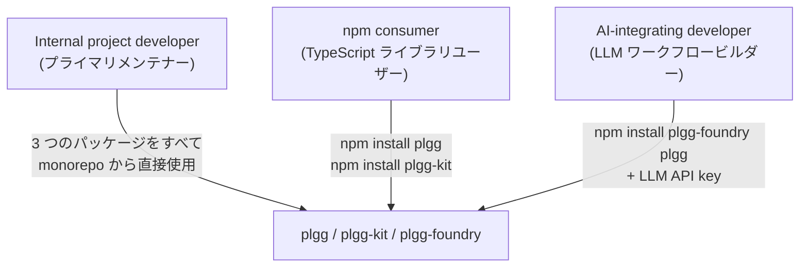
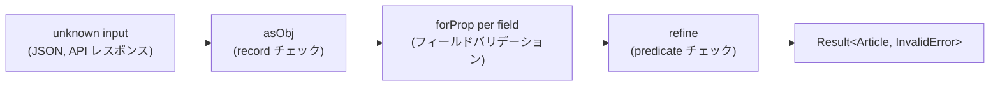
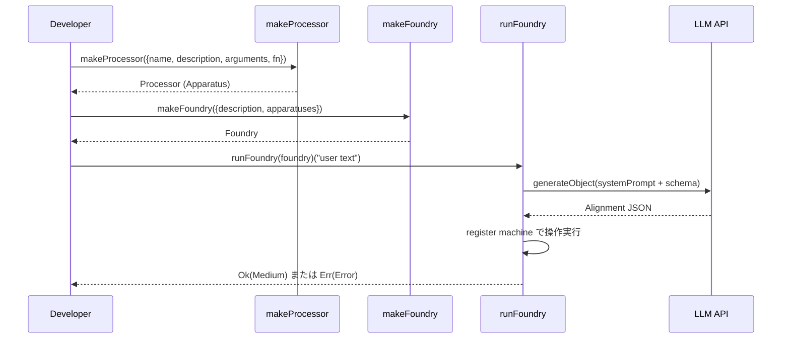
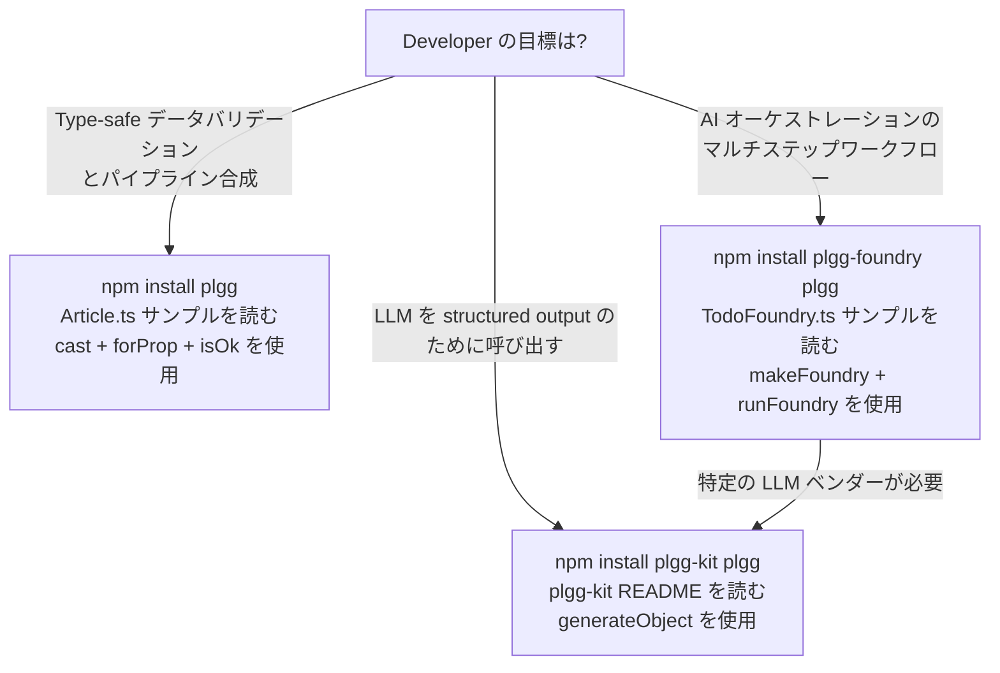

[English](ux.md) | [Japanese](ux_ja.md)

# UX Viewpoint

この viewpoint は、developer が plgg ライブラリエコシステムをどのように体験するかを記述します。誰が使用するか、目標達成のためにどのような journey をたどるか、各パッケージの API とどのようにインタラクションするか、そして開始するためのパスが何であるかを扱います。すべての記述はコードベースの観察可能なアーティファクトに基づいています。観察されない情報は「not observed」として明記します。具体的な入出力コントラクトについては [Use Case Viewpoint](usecase_ja.md) を、機能の全インベントリについては [Feature Viewpoint](feature_ja.md) を参照してください。

## User Types

3 種類の user type が README ファイル、パッケージ設定、および安定性に関する免責事項から観察されます。

**internal project developer** はプライマリユーザーです。root `README.md`（3 行目）には「primarily intended for our own projects」と記載されており、唯一確認されているメンテナー（`a@qmu.jp` / `@tamurayoshiya`）は PR #6 のチェックリストとコミット作者として参照されています。このユーザーは monorepo ソースへの完全なアクセス権を持ち、TypeScript ソースを直接読み、CLAUDE.md が強制する厳格な type system（`as`、`any`、`@ts-ignore` は禁止）で作業します。3 つのパッケージすべて — `plgg`、`plgg-kit`、`plgg-foundry` — がこのタイプによって使用されています。

**npm consumer** は、npm から公開パッケージをインストールするセカンダリユーザーです。`plgg`、`plgg-kit`、`plgg-foundry` の各パッケージは公開 npm レジストリに存在します（`package.json` の `name` フィールドと各 README の `npm install` 手順で確認できます）。このユーザーは各パッケージの `src/index.ts` からエクスポートされる public API surface と、パッケージごとの README ファイルを通じてインタラクションします。monorepo 内部や TypeScript path alias 設定は見えません。

**AI-integrating developer** は `plgg-foundry` と `plgg-kit` パッケージによって示される新興の user type です。この developer は自然言語リクエストを LLM API 経由でルーティングするシステムを構築しており、ベンダーニュートラルな structured output レイヤーを必要としています。`plgg-foundry` README は、画像生成、コンテンツモデレーション、OpenAI structured outputs を統合したキャラクターデザイン foundry の完全な例でこのユーザーを明確にターゲットとしています。

**Not observed**: 構築済みアプリケーションを通じてインタラクションするエンドユーザー消費者、非 developer のステークホルダー、CLI ユーザー、web UI ユーザー。

### User Type Map



## User Journeys

### Journey 1: Type-Safe Validation によるドメインモデリング

internal developer と npm consumer の両方が、`plgg` をドメインモデル定義に統合する際にこの journey をたどります。外部入力（パース済み JSON、API レスポンス、フォームデータ）からの `unknown` 値から始まり、`Result` でラップされた強く型付けされたドメインオブジェクトで終わります。

developer は `plgg` から型（`Obj`、`Str`、`Time`、`Option`）と cast 関数（`asObj`、`asStr`、`asTime`、`asSoftStr`、`cast`、`refine`、`forProp`、`forOptionProp`）をインポートします。`Obj<T>` を使用してドメイン型を定義し、`cast` 合成を使用してバリデーター関数を定義します。`src/example/src/modeling/Article.ts` ファイルがこのパターンを示しています: `Article` は `Obj<{id, createdAt, name, memo}>` として定義され、`asArticle` は `asObj`、3 つの `forProp` 呼び出し、1 つの `forOptionProp` 呼び出しをチェーンします。

バリデーションが成功した場合、呼び出し元は `Ok(article)` を受け取ります。複数のフィールドで同時にバリデーションが失敗した場合、`cast` は `InvalidError` 内の sibling error を蓄積するため、呼び出し元は 1 回のパスで包括的なエラーフィードバックを提示できます。

### Validation Journey Flow



### Journey 2: 同期データ変換パイプライン

developer は `pipe` を使用して、明示的な中間変数なしに同期変換をチェーンします。この journey はバリデーションチェーンと純粋なデータ変換シーケンスの両方に適用されます。developer は `pipe(initialValue, fn1, fn2, ..., fnN)` を呼び出し、TypeScript は各ステップで型を推論します。各関数の入力型が前の関数の出力型と一致している限り、手動の型アノテーションは不要です。`plgg` README の Quick Start は、ユーザーオブジェクトのバリデーションに使用される `chain`（旧用語；現在の用語は `pipe`）を示しています。

この journey は完全にコンパイル時安全です: パイプラインステップ間の型の不一致は TypeScript エラーであり、ランタイムエラーではありません。

### Journey 3: エラー short-circuit を伴う非同期パイプライン

`proc` 関数は、非同期操作（LLM 呼び出し、データベースクエリ、HTTP リクエスト）をエラー伝播とともにチェーンする必要がある、より一般的な現実世界の journey を処理します。developer はステップ間に `await`、`try/catch`、または手動の `if isOk` チェックを書きません。`proc` は各ステップで `Promise<Result<T, E>>` をアンラップし、`Err` が返されたときに残りのステップをスキップします。

`usecase.md` は、`plgg-kit` の `generateObject` と `plgg` の `asStr` を単一の `proc` チェーンで組み合わせた例を文書化しており、LLM バックエンドパイプラインを構築する developer のプライマリユースケースです。

### Journey 4: AI オーケストレーションワークフローの構築（Foundry）

これは AI-integrating developer user type のプライマリ journey です。4 つのステージで進行します:

1. **Apparatus インベントリの定義**: developer はワークフローがサポートすべき各操作に対して `makeProcessor` および/または `makeSwitcher` を呼び出します。各 apparatus には `name`、LLM に表示される `description`、`arguments`（入力）、および `returns`/`returnsWhenTrue`/`returnsWhenFalse`（出力）があります。名前は一意の kebab-case 識別子でなければならず、description は LLM が操作を区別するのに十分な具体性が必要です。

2. **Foundry の組み立て**: `makeFoundry({ description, apparatuses, provider?, maxOperationLimit? })` がすべての apparatuses を結合します。description は LLM のためにシステムの目的を要約します。オプションの `beforeOperations` callback は実行前のプランインスペクションを有効にし、`afterOperations` は結果のインスペクションを有効にします。

3. **自然言語 order の送信**: `runFoundry(foundry)("user text")` は AI プランニングフェーズをトリガーします。LLM は foundry description、すべての apparatus descriptions、および `Alignment` 構造の JSON schema を受け取ります。操作シーケンス（Alignment）を返します。手動のワークフロー記述は不要です。

4. **結果の処理**: 呼び出し元は `Promise<Result<Medium, Error>>` を受け取ります。成功時、`medium.params` に最終レジスタ値が含まれます。失敗時、エラーはどのフェーズ（order バリデーション、blueprint 生成、または操作実行）が失敗したかを説明します。

`src/plgg-foundry/src/Example/TodoFoundry.ts` ファイルは最もシンプルな観察可能な実装を示しています: インメモリ `Map` でバックアップされた 2 つのプロセッサ（`add`、`remove`）を持つ foundry で、明示的な provider なし（デフォルトは `openai("gpt-5.1")`）。

### Foundry Journey Sequence



### Journey 5: LLM Provider 設定

developer は `plgg-kit` から `openai(model)`、`anthropic(model)`、または `google(model)` を使用して provider を選択します。model 引数はプレーン文字列または `{model, apiKey}` config オブジェクトです。`apiKey` が省略された場合、ランタイムは環境から `OPENAI_API_KEY`、`ANTHROPIC_API_KEY`、または `GEMINI_API_KEY` を読み取ります。結果の `Provider` 値は `makeFoundry` または `generateObject` に直接渡されます。

`plgg-kit` README は、同一の呼び出しシグネチャを持つ 3 つの provider を文書化しており、developer はダウンストリームのコードを変更せずに provider を交換できます。

## Interaction Patterns

### Pattern 1: カリー化された 2 ステップエントリーポイント

最も目立つ 2 つのエントリーポイント（`runFoundry`、`pipe`、`cast`、`proc`）は、部分適用を可能にするカリー化または可変長パターンに従います。`runFoundry(foundry)` は関数を返すため、developer はバインドされた関数に名前をつけて再利用できます。`pipe(value, ...fns)` は可変長ですが、常に即座に進行します。このパターンにより、呼び出しサイトを簡潔に保ち、構築時の設定をランタイム呼び出しから分離できます。

**Evidence**: `src/plgg-foundry/src/Foundry/usecase/runFoundry.ts`、`usecase.md` の全サンプルコード。

### Pattern 2: すべての場所での Result 型リターン

public API 内のどの関数も、予期される失敗ケースで例外をスローしません。すべての失敗する可能性のある操作は `Result<T, E>` を返します。呼び出し元のパターンは常に:

```typescript
if (isOk(result)) {
  // result.content を使用
} else {
  // result.content（エラー）を処理
}
```

`isOk` と `isErr` の両方が `plgg` から `Result` 型を絞り込む type guard としてエクスポートされています。このパターンは 3 つのパッケージ README すべてと `usecase.md` のすべてのコードサンプルで観察されます。

**README の不整合に関する注記**: `plgg-foundry` README（193 行目）と `plgg-kit` README（53 行目）は `result.isOk()` メソッド呼び出し構文を使用していますが、現在の `plgg` API は関数型の `isOk(result)` パターンを使用しています。`usecase.md` は一貫して `isOk(result)` を使用しています。パッケージ README のメソッド呼び出しスタイルは古い可能性があります。`project-context.md` の Issues 5 と 6 を参照してください。

### Pattern 3: クラスインスタンス化よりコンストラクター関数

すべての apparatus と foundry の値は `make*` ファクトリー関数（`makeFoundry`、`makeProcessor`、`makeSwitcher`）で作成されます。public API では `new` キーワードやクラスコンストラクターは観察されません。これは型構築に `as*` cast 関数、値構築に `make*` またはダイレクトコンストラクター関数（`ok`、`err`、`some`、`none`、`openai`、`anthropic`、`google`）を使用するライブラリ全体のスタイルと一致しています。

**Evidence**: `src/plgg-foundry/src/Example/TodoFoundry.ts`、`usecase.md` の全サンプルコード。

### Pattern 4: 操作間データフローのための Named Register Addressing

`plgg-foundry` 内では、データは文字列アドレスのレジスタ（`r0`、`r1` など）を通じて操作間を流れます。developer はレジスタアドレスを手動で記述しません — LLM が生成した Alignment でそれらを割り当てます。ただし、apparatus `fn` 実装内では、developer は入力値に `medium.params["argumentName"]?.value` としてアクセスします。パラメーター名は apparatus spec で宣言された `arguments` キーと一致し、レジスタアドレスとは一致しません。この間接参照は操作エグゼキューターによって自動的に管理されます。

**Evidence**: `src/plgg-foundry/src/Example/TodoFoundry.ts` 21-22 行目、34-35 行目。

## Onboarding Paths

### Path 1: plgg のみ（Functional Primitives）

`plgg` 単独での最小オンボーディング:

1. `npm install plgg` を実行する。
2. root `README.md` の Quick Start（22-34 行目）を読む。`chain` / `Obj.cast` / `Str.cast` の使用を示しているが、これは現在の文書化済み API（`pipe`、`asObj`、`cast`）とは異なる古い API surface を使用している。`usecase.md` に正確な現在の使用方法が含まれている。
3. `plgg` から型と cast 関数をインポートし、`cast` + `forProp` を使用してバリデーター関数を記述する。
4. `isOk` / `isErr` を使用して結果を処理する。

`src/example/src/modeling/Article.ts` はこのパスの canonical リファレンスです。これは実際のドメイン型をモデリングする非テスト、非ライブラリの TypeScript ファイルとして唯一観察されるものです。

**Gap**: `.workaholic/guides/` には専用の getting-started ガイドが存在しません。README の Quick Start は npm consumer の唯一のオンボーディングアーティファクトであり、現在の実装と一致しない可能性のある API パターンを使用しています（`project-context.md` の Issues 5 と 6 を参照）。

### Path 2: plgg-kit スタンドアロン（LLM Structured Output）

1. `npm install plgg-kit plgg` を実行する。
2. 選択したプロバイダーの API キーを取得する。
3. `src/plgg-kit/README.md` を読む。`generateObject` とプロバイダーコンストラクター（`openai`、`anthropic`、または `google`）をインポートする。
4. `generateObject({provider, userPrompt, schema})` を呼び出し、`Result` を処理する。

このパスは `plgg-foundry` を必要としません。AI オーケストレーションワークフローなしに LLM structured output が必要な developer の正しいエントリーポイントです。

**Gap**: `plgg-kit` README は `result.isOk()` メソッド構文を使用しています。この README をそのまま参考にする developer は、現在の `plgg` API が `isOk` をインスタンスメソッドとして公開していない場合、型エラーに遭遇する可能性があります。

### Path 3: plgg-foundry（AI ワークフローオーケストレーション）

1. `npm install plgg-foundry plgg` を実行する。
2. LLM API キーを取得する（デフォルトは OpenAI；`plgg-foundry` README には「You'll also need an OpenAI API key with access to structured outputs」と記載）。
3. `makeProcessor` / `makeSwitcher` で apparatuses を定義する。
4. `makeFoundry` で組み立てる。
5. `runFoundry(foundry)(orderText)` を呼び出し、`Result<Medium, Error>` を処理する。

`plgg-foundry` README はバリデーションループを含む完全なキャラクターデザイン例をプライマリオンボーディングシナリオとして提供しています。`src/plgg-foundry/src/Example/TodoFoundry.ts` ファイルはよりシンプルなパッケージ内リファレンスを提供しています。

**Gap**: `plgg-foundry` README の Quick Start（28-68 行目）は `makeFoundrySpec`、`makeProcessorSpec`、`runFoundry({spec, provider})({prompt})` を使用しており、現在の実装（`makeFoundry`、`makeProcessor`、`runFoundry(foundry)(text)`）とは異なる呼び出しシグネチャです。この乖離は、Quick Start を直接コピーする developer のオンボーディング失敗を引き起こします。

### Onboarding Path の判断



## Assumptions

- **[Explicit]** root `README.md`（3 行目）はライブラリを「UNSTABLE」かつ「primarily intended for our own projects」と宣言しています。これは internal developer をプライマリ user type として直接特定します。
- **[Explicit]** 3 つの npm パッケージ名（`plgg`、`plgg-foundry`、`plgg-kit`）と `npm install` 手順がパッケージ README ファイルに記載されており、npm consumer が user type であることを確認します。
- **[Explicit]** `src/plgg-foundry/src/Example/TodoFoundry.ts` は `makeFoundry` と `makeProcessor` を使用した Foundry journey の canonical 最小実装です。
- **[Explicit]** `src/example/src/modeling/Article.ts` は `cast`、`forProp`、`forOptionProp`、`refine` を使用した canonical ドメインモデリング例です。
- **[Explicit]** `plgg-foundry` README（193 行目）と `plgg-kit` README（53 行目）は `result.isOk()` メソッド呼び出し構文を使用しており、`usecase.md` で使用されている関数型の `isOk(result)` パターンとは異なります。これは推論ではなく観察可能な不整合です。
- **[Explicit]** `plgg-foundry` README の Quick Start は `makeFoundrySpec`/`makeProcessorSpec` と `runFoundry({spec, provider})({prompt})` を使用していますが、`TodoFoundry.ts` と `usecase.md` は `makeFoundry`/`makeProcessor` と `runFoundry(foundry)(text)` を使用しています。これら 2 つは異なる API surface であり、どちらが現在の実装を反映しているかはドキュメントのみからは解決できません。
- **[Inferred]** CLI エントリーポイントや web UI は存在しません。すべてのインタラクションパターンは TypeScript ライブラリ API 呼び出しです。これは `package.json` ファイルに CLI バイナリ宣言がなく、観察されたソースに HTTP サーバーやルーティングコードがないことから推論されます。
- **[Inferred]** 「AI-integrating developer」user type は `plgg-foundry` と `plgg-kit` パッケージの目的から特定されています。コードベースのどこにも明示的なユーザーペルソナは宣言されていません。
- **[Inferred]** npm consumer はリリース済みのパッケージバージョンに依存しますが、どの CHANGELOG にも非 Unreleased バージョンは存在しません。すべての現在の開発はプレリリースです。これは npm consumer のオンボーディングパスが安定リリースの不在により現在ブロックされていることを意味します。
