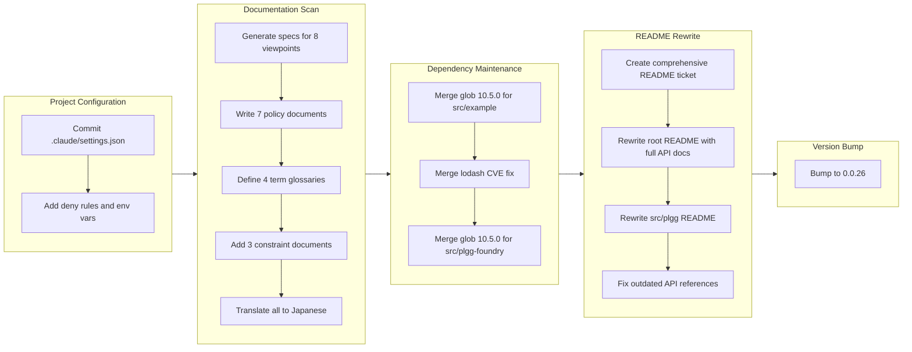

## 1. Overview

This branch consolidated project hygiene, documentation, and dependency maintenance for the plgg monorepo. It committed the previously untracked `.claude/settings.json` for shared Claude Code configuration, performed a full documentation scan producing specs, policies, terms, and constraints with Japanese translations, merged three Dependabot security and maintenance updates, rewrote both the root and core package README files with comprehensive API documentation, and bumped the version to 0.0.26.

**Highlights:**

1. Comprehensive documentation overhaul: 50+ new files covering specs (8 viewpoints), policies (7 documents), terms (4 documents), and constraints (3 documents), all with Japanese translations
2. Complete README rewrite for both root monorepo and core plgg package, expanding from ~40 lines each to full API reference documentation
3. Dependency maintenance: merged glob 10.5.0 updates for two packages and lodash CVE fix (4.17.21 to 4.17.23)

## 2. Motivation

The plgg project had reached a maturity point where its internal documentation lagged behind the actual capabilities of the library. The root README still showed a minimal Quick Start with outdated API references (e.g., `chain` instead of `cast`), and there was no formal specification or policy documentation. Meanwhile, three Dependabot PRs had accumulated unmerged, including a security fix for lodash. This branch addressed all of these debts in a single focused session -- establishing a documentation foundation that matches the library's functional programming architecture, securing dependencies, and preparing the project for its 0.0.26 release.

## 3. Journey

The session began with a configuration housekeeping task -- committing the `.claude/settings.json` that had been sitting untracked. This naturally led to a broader documentation effort, generating a comprehensive documentation suite across specs, policies, terms, and constraints. With the project documentation established, three accumulated Dependabot branches were merged to clear the dependency backlog. The developer then turned to the most visible documentation gap: the README files. After creating a detailed ticket specifying the rewrite scope, both the root and core package READMEs were transformed from minimal stubs into full API references. The session concluded with a version bump to 0.0.26.

## 4. Changes

### 4-1. Add .claude/settings.json for project-level Claude Code configuration ([ddbb696](https://github.com/qmu/plgg/commit/ddbb696))

Committed the previously untracked `.claude/settings.json` containing project-level Claude Code configuration including permission deny rules, environment variables, and plugin/marketplace settings. This ensures all contributors share the same Claude Code project configuration.

### 4-2. Update documentation ([f54abfd](https://github.com/qmu/plgg/commit/f54abfd))

Performed a comprehensive documentation scan, generating 50+ new files: specs covering 8 architectural viewpoints, 7 policy documents, 4 term glossaries, 3 constraint documents, and a CHANGELOG update. All documents were created with Japanese translations.

### 4-3. Merge glob 10.5.0 update for src/example ([de1f602](https://github.com/qmu/plgg/commit/de1f602))

Merged Dependabot's glob dependency update from 10.4.5 to 10.5.0 in the example sub-package.

### 4-4. Merge lodash CVE fix for src/example ([6e49bf3](https://github.com/qmu/plgg/commit/6e49bf3))

Merged Dependabot's lodash security update from 4.17.21 to 4.17.23 in the example sub-package, addressing a known CVE.

### 4-5. Merge glob 10.5.0 update for src/plgg-foundry ([1099633](https://github.com/qmu/plgg/commit/1099633))

Merged Dependabot's glob dependency update from 10.4.5 to 10.5.0 in the plgg-foundry sub-package.

### 4-6. Make comprehensive README.md ([6374a76](https://github.com/qmu/plgg/commit/6374a76))

Rewrote the root `README.md` from 40 lines to a comprehensive monorepo overview with project structure, installation instructions for all 3 packages, core concepts documentation, module organization tables, and development commands. Also rewrote `src/plgg/README.md` from 39 lines to a full package reference. Fixed outdated API references (`chain`/`Obj.cast`/`Obj.prop` replaced with `cast`/`asObj`/`forProp`).

### 4-7. Bump version to 0.0.26 ([9ef1d92](https://github.com/qmu/plgg/commit/9ef1d92))

Updated the plgg core package version from 0.0.25 to 0.0.26 in preparation for release.

## 5. Outcome

The branch accomplished a thorough project hygiene pass. The documentation gap that had been growing as the library matured was addressed comprehensively -- the project now has formal specifications, policies, and constraints that codify architectural decisions and quality standards. The README transformation gives new users a proper entry point to understand the monorepo's three-package structure and the core library's functional programming patterns. Three stale Dependabot PRs were cleared, including a security fix, bringing all dependencies up to date. The project is now at version 0.0.26 with documentation that reflects its actual capabilities.

## 6. Historical Analysis

The `.claude/` directory has an established history of incremental configuration additions (commits `79fe0f5`, `575b844`, `8c5899c`, `64cf530`), and this branch follows the same pattern by adding the settings file. The README had been managed by a `readme-updater` agent that incrementally updated sub-package READMEs, but the root README had never received a comprehensive overhaul -- this branch broke that pattern by performing a full rewrite rather than an incremental update.

## 7. Concerns

- The lodash CVE fix bumps to 4.17.23 but lodash is only used in the example sub-package, not in the core library (see [6e49bf3](https://github.com/qmu/plgg/commit/6e49bf3) in `src/example/package.json`)
- The documentation scan generated 50+ files in a single commit which makes individual review difficult (see [f54abfd](https://github.com/qmu/plgg/commit/f54abfd) in `.workaholic/`)
- The `.claude/settings.json` includes `CLAUDE_CODE_EXPERIMENTAL_AGENT_TEAMS=1` which references an experimental feature that may change or be removed (see [ddbb696](https://github.com/qmu/plgg/commit/ddbb696) in `.claude/settings.json`)

## 8. Ideas

- Consider splitting the documentation scan into separate commits per document category (specs, policies, terms, constraints) for easier review and git blame
- The README rewrite could include a comparison table showing plgg's functional patterns vs. alternatives (fp-ts, Effect) to help users understand the library's positioning
- Add automated link checking for README.md to catch future API reference drift

## 9. Performance

**Metrics**: 12 commits over 8.1 hours (1.5 commits/hour)

### 9-1. Pace Analysis

The 12 commits include 3 Dependabot auto-generated commits and 3 merge commits, leaving 6 original development commits across the 8.1-hour session. The effective development velocity was approximately 0.7 original commits per hour, which reflects the documentation-heavy nature of the work -- generating comprehensive specs and rewriting READMEs requires substantial content creation per commit. The largest commit (documentation scan) bundled significant output into a single commit, while the README rewrite was preceded by a dedicated ticket creation commit, showing a plan-then-execute pattern.

### 9-2. Decision Review

| Dimension      | Rating    | Notes                                                                 |
| -------------- | --------- | --------------------------------------------------------------------- |
| Consistency    | Strong    | Followed ticket-first workflow for both original tasks                |
| Intuitivity    | Strong    | Natural progression from config to docs to deps to README to release  |
| Describability | Strong    | Each commit has a clear, descriptive message                          |
| Agility        | Adequate  | Dependabot merges could have been batched; documentation scan was monolithic |
| Density        | Adequate  | 7,321 insertions dominated by generated documentation                |

**Strengths**: The session followed a logical arc from small configuration fixes to large documentation efforts, with each task naturally motivating the next. The ticket-first approach for both the settings.json and README tasks provided clear scope before implementation.

**Areas for Improvement**: The documentation scan commit could be decomposed into smaller, reviewable units. The Dependabot merges could be accompanied by verification commits confirming tests still pass after each merge.

## 10. Release Preparation

**Verdict**: Ready for release

### 10-1. Concerns

- None critical -- all changes are documentation, configuration, and dependency updates with no functional code changes to the core library
- The lodash CVE fix and glob updates are in sub-packages (example and plgg-foundry), not the publishable core package

### 10-2. Pre-release Instructions

- Verify all 338 tests still pass with `sh/test-plgg.sh`
- Verify TypeScript compilation with `sh/tsc-plgg.sh`
- Review the rewritten README.md to ensure all code examples are accurate

### 10-3. Post-release Instructions

- None -- no special post-release actions needed

## 11. Notes

This branch represents a documentation-focused release. The 63 files changed with 7,321 insertions are almost entirely documentation and configuration -- no functional code in the core plgg library was modified. The version bump to 0.0.26 reflects the documentation and dependency improvements rather than feature additions.
