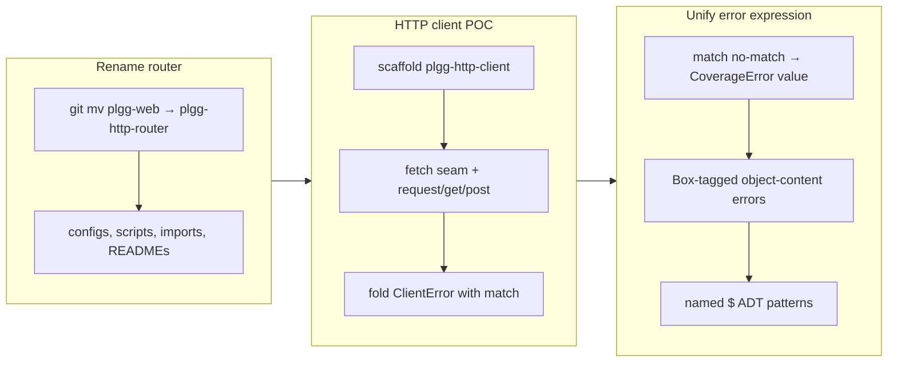

## 1. Overview

This branch turns the experimental server-side HTTP work into a symmetric client/server pair and unifies plgg's error story around `match`. It renames `plgg-web` to `plgg-http-router`, adds a new `plgg-http-client` typed HTTP client that reuses the router's HTTP model, then reshapes the whole error vocabulary — core `Exceptionals`, router `HttpError`, and client `NetworkError` — into `Box`-tagged ADTs with structured object content, each foldable by a named `$` pattern. The `match` combinator's own non-exhaustive failure path was also made consistent with its type-level contract.

**Highlights:**

1. Renamed `plgg-web` → `plgg-http-router` (history-preserving `git mv`, zero `plgg-web` references in live code)
2. New `plgg-http-client` POC: typed `request`/`get`/`post`/`put`/`patch`/`del` over a single `fetch` seam, errors as values
3. `match`'s no-case-matched runtime path now returns a `CoverageError` value instead of a bare `Error` (closes gap #8)
4. One `Box`-tagged, object-content error vocabulary end-to-end, with named `$` ADT patterns (`networkError$`, `notFound$`, `invalidError$`, …) replacing inline tag strings
5. Core `Error` classes gained a `Box` face (`__tag` + structured `content`) while keeping `extends Error` for the throw seam

## 2. Motivation

The presentation layer needed a typed way to call the server, and the cleanest shape was a client symmetric with the router: same plgg-native HTTP model, failures as values, platform types confined to one seam. Building that POC surfaced a deeper inconsistency — plgg modeled errors two incompatible ways (class-based `Exceptionals` vs `Box` tagged unions), and only `Box` unions fold through `match`. Dogfooding `match` against the client's `ClientError` made the gap concrete: the most common core error (`InvalidError`) could not be matched by tag, and `match`'s own no-match path returned an untyped `Error` that contradicted its type-level `CoverageError`. The branch therefore set out to make one object-content, `Box`-tagged error expression that `match` eliminates exhaustively, without sacrificing the throwable `extends Error` seam.

## 3. Changes

The work moved left-to-right: first a pure rename to make the router's name symmetric with the coming client; then the client POC, whose `ClientError` fold exposed the error-modeling gap; then two error-unification tickets that closed `match`'s runtime/type split and gave every error vocabulary a `Box`-tagged, object-content, `$`-pattern face.

### 3-1. Rename `plgg-web` → `plgg-http-router` ([c7156f0](https://github.com/qmu/plgg/commit/c7156f0))

Pure, behaviour-preserving rename of the server-side router package via `git mv` (history preserved), updating package/config/script/import/README references. Scoped to this branch; `.workaholic/` history intentionally retains the old name.

### 3-2. Create `plgg-http-client` — typed HTTP client POC ([ae27f31](https://github.com/qmu/plgg/commit/ae27f31))

New monorepo package reusing the router's HTTP model, exposing `request` plus `get`/`post`/`put`/`patch`/`del` returning `PromisedResult<HttpResponse, ClientError>`, with `fetch`/`Request`/`Response` confined to one seam (`toFetchRequest`/`fromFetchResponse`) and a `decodeJsonBody` helper. A non-2xx status is a valid response; only transport failure folds to `NetworkError`. (Followed by [90d7b8b](https://github.com/qmu/plgg/commit/90d7b8b), which folded `ClientError` with `match` in the example.)

### 3-3. Unify `match`'s non-exhaustive runtime path with `CoverageError` ([e998464](https://github.com/qmu/plgg/commit/e998464))

`match`'s no-case-matched fallthrough now returns `coverageError(a)` — structurally the declared `CoverageError<A>` — instead of a bare `Error`, so runtime and type contract agree. Added the `coverageError` constructor and `isCoverageError` guard; closes gap #8 from the match type-completeness analysis.

### 3-4. Give plgg errors a `Box`-tagged, object-content face with ADT patterns ([a38d363](https://github.com/qmu/plgg/commit/a38d363))

Core `Exceptionals` (`BaseError`/`InvalidError`/`Exception`/`SerializeError`/`DeserializeError`), router `HttpError`, and client `NetworkError` all gained non-enumerable `__tag` literals and structured object `content`, so each folds exhaustively through `match`. Every variant exports a named `$` pattern (`invalidError$`, `notFound$`, `networkError$`, …), and `DeserializeError` joined the `PlggError` union. `extends Error` and JSON output are preserved.

## 4. Outcome

A symmetric client/server HTTP pair on plgg, and a single error expression: `Box`-tagged ADTs with structured object content, eliminated by `match` exhaustively and matched via named `$` patterns rather than tag strings — while `Error` classes stay throwable at the seam. All suites pass (plgg 452, router 88, client 25) with coverage above the >90% gate, and all three packages build. See tickets 3-1…3-4 for specifics.

## 5. Historical Analysis

This branch is a direct continuation of PR #31 (`work-20260513-182057`). PR #31 curried `match` so tag handlers receive the narrowed box and introduced the type-level `CoverageError` brand, but left two seams open that this branch closed: the runtime no-match path still returned a bare `Error` (gap #8), and the class-based `Exceptionals` were not `match`-foldable. PR #31 also established the `HttpError` `Box` union as the worked example of a match-compatible error vocabulary — this branch extended that convention down into core and across the client, and adopted the existing `ok$`/`err$`/`none$` pattern-matcher idiom for the new `$` patterns. The `match` gap analysis (`src/plgg/docs/match-type-completeness.md`) from PR #31 was the live reference for gap #8.

## 6. Concerns

### Rename diverges the sibling experimental worktrees

- **Severity:** moderate
- **Description:** This branch renamed `src/plgg-web` → `src/plgg-http-router`, but the sibling POC worktrees (`plgg-view`, `plgg-sql`) branch off `main` and still reference `src/plgg-web`. Merging to `main` propagates the rename and forces those branches to reconcile it on their next merge (see [c7156f0](https://github.com/qmu/plgg/commit/c7156f0)).
- **How to Fix:** When `plgg-view`/`plgg-sql` next rebase onto `main`, resolve the `plgg-web`→`plgg-http-router` rename there; or coordinate a single rename pass across all worktrees.

### Error `content` shape change is breaking for HTTP error consumers

- **Severity:** moderate
- **Description:** `HttpError` and `NetworkError` variants changed `content` from strings/arrays to structured objects (`{ message }`, `{ path }`, `{ allowed }`). Any consumer reading `e.content` as a string breaks; all in-repo readers were updated, but this is a shape change to the (experimental) HTTP vocabularies (see [a38d363](https://github.com/qmu/plgg/commit/a38d363) in `src/plgg-http-router/src/Http/model/HttpError.ts`).
- **How to Fix:** Acceptable for an UNSTABLE POC; document the object-content convention in each package README before any stabilization.

### Every plgg error now satisfies `isBox`

- **Severity:** low
- **Description:** Adding `__tag`+`content` to `BaseError` makes all plgg errors structurally `Box` values. Safe today because `isOk`/`isErr`/`isSome` check specific tags and the getters are non-enumerable, but future `isBox`-based logic must account for errors being boxes (see [a38d363](https://github.com/qmu/plgg/commit/a38d363) in `src/plgg/src/Exceptionals/BaseError.ts`).
- **How to Fix:** Keep error tags distinct from structural tags; rely on the existing specs (incl. `NominalDatum`/serialization) to catch regressions.

### (carried from PR #31) Match type-level gaps remain open for future fixes

- **Severity:** moderate
- **Description:** This branch closed gap #8 (runtime no-match → `CoverageError` value), but the gap analysis (`src/plgg/docs/match-type-completeness.md`) still lists open gaps: duplicate atomic patterns, non-final `otherwise`, mixed pattern families, foreign discriminant tags, and heterogeneous return types.
- **How to Fix:** Sequence follow-up tickets by invasiveness and value; pin each with `match.completeness.spec.ts`.

### (carried from PR #31) plgg dist rebuild required after core changes

- **Severity:** moderate
- **Description:** Sibling packages consume plgg core via a `dist/` that is never committed. After any core change, `npm run build` in `src/plgg` is required or downstream tsc/vitest reports missing exports — re-encountered repeatedly on this branch.
- **How to Fix:** Add a pretest hook that rebuilds plgg, or a CI step that builds plgg before downstream tests.

### (carried from PR #31) `mapErr` requires explicit parameter type annotations

- **Severity:** low
- **Description:** `mapErr`'s callback type cannot be inferred from pipe position, forcing `mapErr((e: InvalidError) => …)` annotations (`src/plgg/src/Disjunctives/Result.ts`).
- **How to Fix:** Document near the `mapErr` export; flag unannotated lambdas in review.

### (carried from PR #31) Binary request support adds a parallel `bytes` field

- **Severity:** low
- **Description:** `HttpRequest` carries binary bodies in a parallel `bytes: Option<Uint8Array>` rather than widening `body`; callers must remember to check it (now in `src/plgg-http-router/src/Http/model/HttpRequest.ts`).
- **How to Fix:** Keep the text default dominant; consider a tagged-union request builder if handlers need to switch on body kind.

### (carried from PR #31) Route table compilation trades 404/405 speed for `Allow` ordering

- **Severity:** low
- **Description:** The compiled route table cannot reproduce registration order for the 405 `Allow` header, so the error path falls back to a linear scan (now in `src/plgg-http-router/src/Routing/usecase/dispatch.ts`).
- **How to Fix:** Documented trade-off; add a separate methods-per-path index if error-path performance ever matters.

### (carried from PR #31) `Uint8Array` not directly assignable to `BodyInit`

- **Severity:** low
- **Description:** The generic `Uint8Array<ArrayBufferLike>` does not unify with `BodyInit`; the seam copies into a standalone `ArrayBuffer` (now in `src/plgg-http-router/src/Http/usecase/toNativeResponse.ts`).
- **How to Fix:** Reach for the `ArrayBuffer` copy rather than a cast; documented seam-level quirk.

## 7. Successful Development Patterns

- Reusing the router's HTTP model in the client (rather than redefining it) kept client/server symmetric and made the `fetch` seam a mirror image of the server seam — the model is shared, only the seam direction differs.
- Adding the `Box` face to existing `Error` classes via **non-enumerable getters** (not fields) kept `isBox` classification the only behavioral change — `JSON.stringify`/enumeration were untouched — and the full existing suite (incl. serialization/`NominalDatum` specs) proved containment.
- Adopting the established `ok$`/`err$`/`none$` `$`-pattern idiom for the new error variants gave ADT-style matching (`[networkError$(), …]`) without inventing new machinery — call sites name the variant instead of spelling tag strings.
- Confining `fetch`/`Request`/`Response` to a single seam module, with a runnable `example.ts` per package, kept the platform boundary auditable and gave each POC a smoke test.

## 8. Release Preparation

**Verdict**: Ready for release (experimental POC)

### 8-1. Concerns

- This is UNSTABLE/experimental POC work; the HTTP error `content` shape change and the `plgg-web` rename diverge the sibling POC worktrees (see Section 6).
- No code-level blockers: no TODO/FIXME or secrets in new code; tsc clean; all suites pass; coverage above the >90% gate.

### 8-2. Pre-release Instructions

- None beyond standard. No version bump performed (these packages carry `0.0.x` POC versions and the tickets explicitly deferred versioning/publishing).

### 8-3. Post-release Instructions

- When `plgg-view`/`plgg-sql` next merge from `main`, reconcile the `plgg-web` → `plgg-http-router` rename and the object-content error shape.
- Consider a follow-up to address the carried-over `match` gaps and the plgg dist-rebuild ergonomics.

## 9. Notes

The branch name `plgg-http-client` is not a `work-*` pattern, so context auto-detection reports "unknown"; this is drive work (four archived tickets under `.workaholic/tickets/archive/plgg-http-client/`). The error-unification ticket took three review passes (string→object content, HTTP-vocabulary expansion, then `$` ADT patterns) — captured as a working-style note: agree the design with the maintainer before coding.
