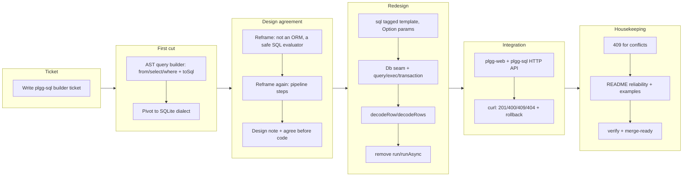

## 1. Overview

This branch adds `src/plgg-sql`, a new POC package that expresses **database work
as pipeline steps** on top of [plgg](../../src/plgg/). It is deliberately *not*
an ORM and *not* a query-builder AST: it provides a small set of data-last steps
— build safe SQL, run it, run it in a transaction, map rows to types — that drop
straight into a plgg `proc`/`pipe` chain. Because those steps share the same
`Result`/`Option`/`PromisedResult` vocabulary as a [plgg-web](../../src/plgg-web/)
HTTP handler, a database step and a web step are interchangeable links in one
pipe: `request → validate → query → map → response` is a single chain.

**Highlights:**

1. A `sql` tagged-template builder producing a `Box<"Sql">` value with
   injection-safe, `Option`-typed parameters (`None` = SQL `NULL`) and fragment
   splicing for composable clauses.
2. A `Db` driver **seam** plus data-last `query`/`exec`/`transaction` steps and
   `decodeRow`/`decodeRows` mappers — the library imports no driver; errors are
   values (`SqlError`/`InvalidError`); transactions are commit-on-`Ok`,
   rollback-on-`Err`.
3. A runnable, end-to-end proof that the package composes with plgg-web: a tiny
   HTTP API where every handler is one `proc` chain, verified over real HTTP
   against an in-memory `node:sqlite` database.

## 2. Motivation

The plgg project is growing a family of primary plugins (plgg-web for HTTP
routing, an HTTP client, and now plgg-sql for the database layer) that should all
speak **one compatible pipeline vocabulary**, so an application composes HTTP and
database work in the same `pipe`/`proc` chain rather than switching paradigms at
the persistence boundary. plgg-sql is the database vertex of that vocabulary: a
safety layer between "I want to run this SQL" and "give me back validated, typed
objects," with the real driver left outside as a seam. It dogfoods plgg
throughout (`Box`, `cast`, `Option`, `proc`) and adds no runtime dependency
beyond plgg.

## 3. Journey

The path was not straight. An initial AST query-builder and a follow-on "SQL
evaluator" were both built and then discarded once the real intent surfaced
through review: plgg-sql should be **pipeline steps that compose with the HTTP
handler**, using core's `proc` (the async `cast`) as the composition primitive.
Once that was agreed up front, the redesign, the integration proof, and the
housekeeping went quickly.

## 4. Changes

### 4-1. Add ticket for plgg-sql builder ([fde570d](https://github.com/qmu/plgg/commit/fde570d))

The implementation ticket. Its Discussion section records the two design
revisions (SQLite-first, then the reframe to a safe evaluator) that preceded the
final pipeline-steps design.

### 4-2. Add plgg-sql package ([06ac7d6](https://github.com/qmu/plgg/commit/06ac7d6))

Scaffolds the package (package.json, tsconfig split, vite lib build, barrels) and
the first implementation, with `sh/{tsc,test}-plgg-sql.sh` wired into the
monorepo aggregate scripts. This was the pre-redesign cut.

### 4-3. Redesign plgg-sql as composable pipeline steps ([b0d1612](https://github.com/qmu/plgg/commit/b0d1612))

The core redesign: replaced the standalone evaluator (`run`/`runAsync`) with the
`Db` seam and data-last `query`/`exec`/`transaction` steps that compose in a
`proc` chain. `Sql` params became `Option`-typed (`None` = SQL `NULL`), removing
all raw `null`/`undefined` from library code. Added `decodeRow`. 100% coverage.

### 4-4. Add runnable plgg-web + plgg-sql integration example ([5961717](https://github.com/qmu/plgg/commit/5961717))

`example-web.ts`: a real users API where each handler is one `proc` chain mixing
plgg-web steps (`param`/`jsonResponse`) with plgg-sql steps. Also fixed
plgg-web's `package.json` `exports` to carry a `types` condition so TS consumers
resolve its declarations under NodeNext.

### 4-5. Housekeeping: tighten error mapping and docs ([b137fc5](https://github.com/qmu/plgg/commit/b137fc5))

Mapped unique/constraint violations to 409 Conflict (was a blanket 500); README
gained a reliability-guarantees section and an ordered guide to both examples;
removed stale pseudo-code from `example.ts`.

## 5. Outcome

A working, merge-ready POC. `tsc` is clean, 23 vitest specs pass at 100% coverage
(statements/branches/functions/lines, threshold 91), the es/cjs/dts build
succeeds, and both examples run: `example.ts` demonstrates the DB pipeline
(create/validate/rollback/list) and `example-web.ts` serves an HTTP API that
returns 201/400/409/404 with a duplicate-key insert correctly rolled back. The
package depends only on `plgg`; `node:sqlite` (a Node builtin) and `plgg-web`
appear solely in examples.

## 6. Historical Analysis

plgg-sql follows the precedent set by plgg-web: a from-scratch, dogfooding POC
that keeps platform/driver types at a seam and expresses everything inward in
plgg types. The decisive enabler was discovering that core already ships `proc`
(Flowables/proc.ts) — an async, `Result`-aware composition pipeline. That removed
any need to invent new combinators: HTTP, DB, and client steps all chain through
the same `proc`, which is exactly the "compatible vocabulary" goal. The fix to
plgg-web's `exports` is a small packaging correction every TS consumer of
plgg-web benefits from.

## 7. Concerns

1. **409 detection is heuristic.** The web example classifies a conflict by
   matching "constraint" in the SQLite error message. A production layer should
   carry a driver error code on `SqlError` instead. Documented as such.
2. **Transaction begin-failure edge.** If `begin()` itself rejects, the catch
   path attempts a `rollback()` on a transaction that never opened. Acceptable
   for the POC; worth hardening with a real driver.
3. **plgg-web change rides this branch.** A one-key `exports` fix to plgg-web is
   included here because the integration example needs it; it is unrelated to
   plgg-sql proper.

## 8. Ideas

- Dynamic identifier safety (quoting table/column names) so they can be
  parameterized without injection risk — currently only literal values bind.
- `UPDATE`/`DELETE` ergonomics and a batch/`many` helper.
- A typed `SqlError` with a driver-agnostic category (e.g. `Conflict`) so error
  mapping is robust rather than message-based.
- Concrete driver adapters (a real async Postgres pool) to exercise the seam
  beyond `node:sqlite`, and eventual multi-dialect rendering.

## 9. Performance

### 9-1. Pace Analysis

One ticket across ~7.7 hours of wall-clock (much of it review/design dialogue),
five commits. The implementation itself was fast once the design was agreed; the
elapsed time was dominated by two false starts that were rebuilt.

### 9-2. Decision Review

The clearest lesson: for non-trivial library work, agree on the design — ideally
the concrete call site — **before** writing code. Two complete implementations
(an AST builder, then an evaluator) were discarded before the pipeline-steps
design was confirmed. The turning point was studying plgg-web and plgg core on
request and finding `proc`, which made the right shape obvious. Verifying value by
a runnable demonstration (the curl'd HTTP API), rather than by assertion, was
what finally confirmed the design.

## 10. Release Preparation

### 10-1. Concerns

UNSTABLE/experimental POC. Not published. Public surface is small and stable
(`sql`, `query`, `exec`, `transaction`, `decodeRow`, `decodeRows`, `Db`,
`ExecResult`, `SqlError`, `Sql`, `SqlValue`, `SqlParam`).

### 10-2. Pre-release Instructions

Run `sh/npm-install.sh`, then `npm run build` in `src/plgg` (plgg-sql resolves
plgg via its built `dist`). `sh/test-plgg-sql.sh` must be green.

### 10-3. Post-release Instructions

None — not published. To run the integration example, build plgg-web first
(`npm run build` in `src/plgg-web`).

## 11. Notes

The branch is a worktree off `main`. `node:sqlite` requires Node 22+ (developed
on Node 24). The package's only runtime dependency is `plgg`; `plgg-web` is a
dev-only dependency used solely by `example-web.ts`.
