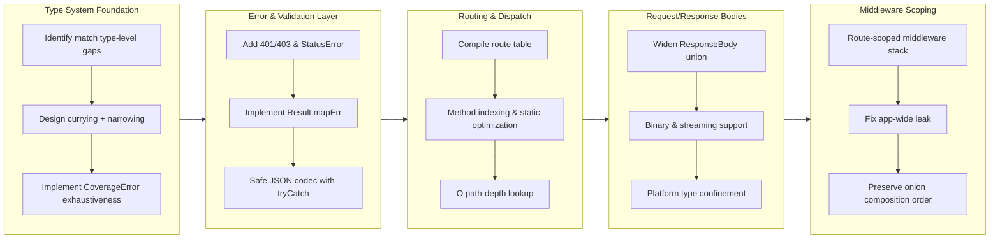

## 1. Overview

This branch strengthens plgg's type system and extends the experimental `plgg-web` package with five missing mechanisms. The `match` combinator was curried so tag handlers receive the narrowed box and exhaustiveness is checked via `CoverageError`, while `plgg-web` gained 401/403 HTTP error vocabulary, `Result.mapErr` with a safe JSON codec, an O(path-depth) compiled route table, binary/streaming bodies, and scoped group middleware that ends an app-wide leak.

**Highlights:**

1. Curry `match` so tag handlers receive the narrowed box with typed `.content`, enabling sound union folding and `CoverageError` exhaustiveness checking
2. Add `HttpError` 401/403 and a generic `statusError` to close the auth/permission failure-vocabulary gap
3. Compile the route table (method index + static exact-map + dynamic walk) for O(path-depth) dispatch instead of O(routes × depth)
4. Support binary (`Uint8Array`) and streaming request/response bodies, with platform stream types confined to the seam
5. Scope sub-app middleware to its group, eliminating leaks where a guard mounted on `/api` ran app-wide

## 2. Motivation

The work addresses foundational gaps in plgg's type safety and plgg-web's HTTP semantics and performance. The `match` currying emerged from needing to fold payload-carrying `Box` unions with proper exhaustiveness checking — a type-level constraint that single-call inference could not satisfy. In parallel, building a realistic `POST /users` example exposed five plgg-web gaps: auth failures had no first-class representation, validation errors were discarded at the response boundary, route dispatch had no fast path, binary payloads were impossible, and mounted middleware leaked app-wide. Both efforts follow plgg's principle of expressing invariants in types and plgg-web's commitment to confining platform concerns (streams, `BodyInit`) to seam layers. plgg-web remains an explicitly UNSTABLE study package; this is experimental work in progress.

## 3. Changes

Development progressed through coordinated phases. First, type-level analysis revealed `match`'s exhaustiveness blindness; currying plus TAG narrowing fixed it with `CoverageError`. Next, auth vocabulary (401/403) and error mapping (`Result.mapErr`, JSON codec) bridged validation to HTTP responses. Route dispatch then gained a compiled static-map and method index for O(path-depth) scaling. Binary bodies followed, extending `ResponseBody` and confining `ReadableStream`/`BodyInit` to seams. Finally, route-scoped middleware stacks eliminated leaks where mounted guards ran globally.

### 3-1. Identify and Propose Type-Level Completeness Fixes for `match` ([394f186](https://github.com/qmu/plgg/commit/394f186))

Documented eight type-level completeness gaps in the `match` combinator (false negatives, false positives, and design constraints) with concrete, sequenced fix proposals in `src/plgg/docs/match-type-completeness.md`, establishing a remediation roadmap without changing runtime behavior.

### 3-2. Give `match` tag/icon handlers the narrowed box and fix `never` coverage ([49a960c](https://github.com/qmu/plgg/commit/49a960c))

Curried `match` to `match(value)(...cases)` so each tag handler receives the narrowed `Box` (with typed `.content`), and fixed exhaustiveness (`never`) coverage for atomic and array-content variant unions — the two highest-impact fixes from the gap analysis.

### 3-3. Scope `route()`-mounted middleware to its group ([54df2f3](https://github.com/qmu/plgg/commit/54df2f3))

Gave each `Route` a scoped middleware stack so `route(base, sub)` binds a sub-app's `use()` middleware to its own routes instead of merging into the parent's global stack, ending the leak where a guard on `/api` ran for every route while preserving onion order.

### 3-4. Compile the plgg-web route table ([cda70c3](https://github.com/qmu/plgg/commit/cda70c3))

Replaced the per-request linear scan with a compiled, method-indexed table — an O(1) exact-map for static paths plus a registration-order dynamic walk for `:param`/`*` — memoized on the routes array, preserving match semantics byte-for-byte (including `Allow` ordering on the cold 404/405 path).

### 3-5. Extend `HttpError` with 401/403 and a generic status failure ([6d969cc](https://github.com/qmu/plgg/commit/6d969cc))

Added `Unauthorized` (401), `Forbidden` (403), and a generic `statusError(status, message)` to the `HttpError` union with matching fold cases, so handlers express auth/permission failures as error values rather than faking them as success responses.

### 3-6. plgg core: `Result.mapErr` (+ eliminator) and a safe JSON codec ([5045f36](https://github.com/qmu/plgg/commit/5045f36))

Added `mapErr` (error-channel map) and `matchResult` (case eliminator) to core `Result`, plus `decodeJson`/`encodeJson` returning `Result`, so a plgg-web POST handler now carries the real `InvalidError` message into a 400 instead of a hard-coded string.

### 3-7. Support binary / streaming request and response bodies ([daadcdb](https://github.com/qmu/plgg/commit/daadcdb))

Widened the response body to a `SoftStr | Bytes | Stream` union and added a request `bytes` field, with `bytesResponse`/`streamResponse` builders, content-type sniffing, `Content-Length` for finite bodies, and chunked streaming — keeping the text path unchanged and all platform types at the seam.

## 4. Outcome

- Identified and documented 8 type-level completeness gaps in the `match` function (false negatives, false positives, and design constraints) with concrete fix proposals, enabling future incremental remediation
- Fixed the `match` function by currying it (`match(value)(...cases)`) to enable sound handler-argument narrowing and correct exhaustiveness checking for atomic/array-content variant unions
- Extended `HttpError` vocabulary with `Unauthorized` (401) and `Forbidden` (403) variants plus a generic `statusError` constructor, eliminating the need to fake auth failures as success responses
- Added `mapErr` and `matchResult` combinators to core `Result`, plus `decodeJson`/`encodeJson` codec functions, bridging validation failures into HTTP responses with full error messages
- Compiled the plgg-web route table into a method-indexed structure with `O(1)` exact-match lookup for static paths and a registration-order-preserving dynamic walk for `:param`/`*` routes, eliminating full linear scans per request
- Extended plgg-web request/response models to support binary (`Uint8Array`) and streaming bodies, with all platform types confined to the seam (Http/usecase, Serving/usecase)
- Scoped group middleware to mounted sub-apps only, preventing global leakage while preserving onion-layer ordering and state threading

## 5. Historical Analysis

The `match` function type machinery has been a focus across two tickets: the first produced a comprehensive gap analysis identifying 8 distinct type-level inconsistencies; the second implemented two of the highest-impact fixes (handler narrowing via currying, atomic/array-content coverage). The currying decision emerged from diagnosis work revealing that TypeScript's per-call inference model cannot simultaneously infer the matched value's type and use that type to narrow the handler argument in a single positional call — a fundamental constraint requiring structural change. Prior work in this codebase established strict TypeScript enforcement (no `as`/`any`/`@ts-ignore`) and type-driven design principles; both the gap analysis and the fix inherited these constraints fully. The route compilation pattern (precompute structure to avoid per-request scans) mirrors classical compiler IR optimization; plgg-web's registration-order precedence tiebreaker shows that even during refactoring, correctness and backwards compatibility must be held byte-for-byte (a principle also seen in the middleware scoping fix). The plgg core additions (`Result.mapErr`, JSON codec) and the http-error vocabulary extension are natural complements to the type-safety work — they let callers express failures structurally without discarding information.

## 6. Concerns

### Match type-level gaps remain open for future fixes

- **Severity:** moderate
- **Description:** The gap analysis (`src/plgg/docs/match-type-completeness.md`) identified 8 type-level issues across `match`; this branch shipped fixes for two (handler narrowing and atomic/array-content coverage). Remaining gaps include duplicate atomic patterns, non-final `otherwise` placement, mixed pattern families, foreign discriminant tags, and heterogeneous return types — all of which currently compile but represent either unsoundness (false negatives) or over-restriction (see [394f186](https://github.com/qmu/plgg/commit/394f186) in `src/plgg/docs/match-type-completeness.md`).
- **How to Fix:** Sequence follow-up tickets by invasiveness and value; prioritize false-negative gaps before false positives. Use `match.completeness.spec.ts` to pin each fix's scope and prevent regressions.

### `mapErr` requires explicit parameter type annotations

- **Severity:** low
- **Description:** The `mapErr` combinator's callback parameter cannot be inferred from the pipe position because the callback type depends on the `Result`'s error channel, which is not known until the curried function is applied. This forces every `mapErr((e: InvalidError) => ...)` call to annotate the error type explicitly (see [5045f36](https://github.com/qmu/plgg/commit/5045f36) in `src/plgg/src/Disjunctives/Result.ts`).
- **How to Fix:** Document this near the `mapErr` export; expect reviewers to flag unannotated lambdas in code review.

### plgg dist rebuild required after core changes

- **Severity:** moderate
- **Description:** plgg-web consumes plgg core via a symlink that resolves to `dist/` (never committed). After any change to plgg core (e.g., adding `mapErr`, `decodeJson`), `dist/` must be rebuilt with `npm run build` in `src/plgg`, or plgg-web's tsc/vitest reports "module has no exported member" for valid source (see [5045f36](https://github.com/qmu/plgg/commit/5045f36) in `src/plgg/package.json`).
- **How to Fix:** Add a pretest hook in plgg-web that rebuilds plgg, or document the rebuild step in the ticket template for plgg-core changes; consider a CI check that rebuilds plgg before running plgg-web tests.

### Route table compilation trades 404/405 speed for `Allow` ordering fidelity

- **Severity:** low
- **Description:** The compiled route table uses a per-method map for fast lookups, which cannot reproduce route-registration order for the `Allow` header on a 405. To preserve byte-for-byte equivalence, the error path deliberately falls back to the original linear scan (see [cda70c3](https://github.com/qmu/plgg/commit/cda70c3) in `src/plgg-web/src/Routing/usecase/dispatch.ts`).
- **How to Fix:** This is a documented trade-off, not a bug. If error-path performance ever matters, add a separate methods-per-path index decoupled from route order and document the behavioral change.

### Binary request support adds a parallel `bytes` field rather than widening `body`

- **Severity:** low
- **Description:** Binary request support was added as a separate `bytes: Option<Uint8Array>` field rather than widening `HttpRequest.body` to a union, because handlers read `body` as `SoftStr` (e.g., `decodeJson(c.req.body)`) and widening would force every handler to narrow. This preserved the text path with zero churn but introduces a parallel field callers must remember to check (see [daadcdb](https://github.com/qmu/plgg/commit/daadcdb) in `src/plgg-web/src/Http/model/HttpRequest.ts`).
- **How to Fix:** Keep the text-body default dominant (documented in the type comment); if future handlers need to switch on body kind, consider a tagged-union request builder to reduce parallel-field mistakes.

### `Uint8Array` not directly assignable to `BodyInit` under current lib types

- **Severity:** low
- **Description:** The stdlib's generic `Uint8Array<ArrayBufferLike>` does not unify with the concrete `BodyInit` union, even though `new Request(url, { body: arrayBuffer })` is fine. The workaround copies the view into a standalone `ArrayBuffer` at the seam — the same pattern `serve.ts`'s `collectBody` already uses (see [daadcdb](https://github.com/qmu/plgg/commit/daadcdb) in `src/plgg-web/src/Http/usecase/toNativeResponse.ts`).
- **How to Fix:** When hitting this error in the future, reach for the `ArrayBuffer` copy rather than a cast; documented as a seam-level quirk.

## 7. Successful Development Patterns

- **Document-then-optimize for hot paths**: Before optimizing dispatch, the existing match semantics (registration-order precedence between static and `:param` routes) were captured precisely with tests; the compiled table then carried each route's registration index and picked the lower index across static and dynamic hits, preserving byte-for-byte equivalence while gaining the fast path.
- **Currying to decouple inference rounds**: When a single call expression cannot infer a type used both as a callback parameter and as a constraint on the first argument (as with `match`'s handler narrowing), currying into two call expressions gives two separate inference passes — a structural fix, not a workaround.
- **Scoped middleware via per-route field inheritance**: Attaching middleware to routes and composing at dispatch via `[...global, ...route.middlewares]` makes scope structural — each route carries exactly the guards that apply to it, nested mounts accumulate by prepending the enclosing stack, and onion order is preserved with no leaks or gaps.
- **Negative type tests via const binding + `expect`**: Without `@ts-expect-error`, type-level behavior is pinned using `const _x: Cond = true` followed by `expect(_x).toBe(true)` — satisfying the no-escape-hatches constraint, giving the assertion a runtime/coverage footprint, and keeping it visible in test output.
- **Confine platform types to the seam**: Domain models (`HttpRequest`, `HttpResponse`, `ResponseBody`) stay free of `Uint8Array`/`ReadableStream`/`BodyInit`/Node streams; conversions live only in `Http/usecase` and `Serving/usecase`, keeping the domain portable and platform changes localized.
- **Add a parallel field instead of widening a load-bearing type**: When a value must support new kinds (binary bodies) but existing consumers read the old scalar type, adding a parallel field (`bytes`) keeps the dominant path unchanged at zero migration cost — a pragmatic alternative to a breaking union widening.

## 8. Release Preparation

**Verdict**: Ready for release

### 8-1. Concerns

- None — changes are safe for release. Build is clean (`tsc` for plgg / plgg-web / example all pass), tests green (plgg 446, plgg-web 87), coverage above the >90% gate, no TODO/FIXME or secrets in new code, working tree clean.

### 8-2. Pre-release Instructions

- None — standard process applies. (Note: this is experimental WIP on the UNSTABLE `plgg-web` package; no version bump was performed and no npm publish is implied.)

### 8-3. Post-release Instructions

- None — no special post-release actions needed.

## 9. Notes

This is experimental work in progress. `plgg-web` is an explicitly UNSTABLE study package built from scratch on plgg; the additions here are exploratory and the public surface may still change. The one plgg-core change (`Result.mapErr`/`matchResult`, `decodeJson`/`encodeJson`) is additive and backward-compatible. Reviewers should treat API churn and the unstable status as expected rather than as release blockers.
