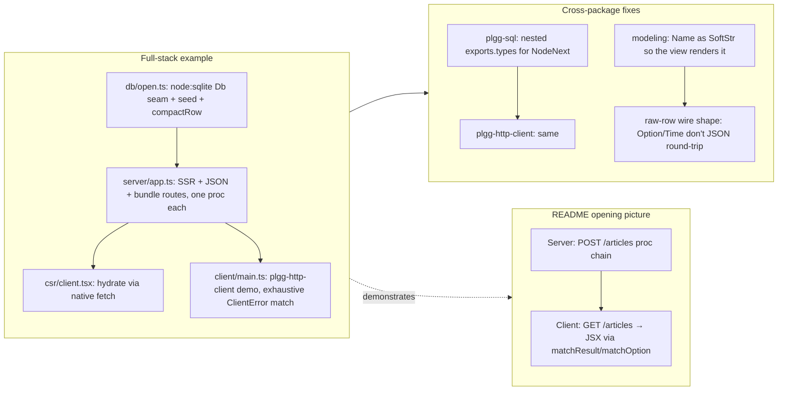

## 1. Overview

This branch sits on top of the merged `plgg-http-client` + `plgg-sql` + `plgg-view` POCs and answers the question those POCs implied: *what does it look like when all four packages meet in one expression?* Two artifacts:

1. A real full-stack `src/example` package that runs end-to-end: `plgg-http-router` serves SSR HTML rendered by `plgg-view` from rows fetched through `plgg-sql`, the browser hydrates the same VNode tree, and a `plgg-http-client` node script consumes the same JSON API.
2. A new opening picture on the root `README.md` — a paired server `POST /articles` `proc` chain and a client `GET /articles` `pipe` whose `matchResult` branches *into JSX* — so the first thing a reader sees is what "web development as one pipeline" actually means in code.

## 2. Motivation

The previous report cycle landed three sibling POCs in close succession but each lived in its own runnable example. A reader following the project structure had to mentally compose them; the integration seams (raw-row wire shape, nested `exports.types` for NodeNext, `Name` as `SoftStr` so the view can render it without unwrapping a box) were unverified. The branch's job was to actually combine them and fix what didn't connect, then promote the combined picture from "example file you might find" to "first thing the README shows."

## 3. Changes

### Tickets completed (1)

1. **Full-stack `example` combining plgg-view + plgg-sql + plgg-http-client (+ router)** — extended `src/example` into one end-to-end demo: `plgg-http-router` server renders `plgg-view` SSR pages backed by a `plgg-sql` (`node:sqlite`) database, the browser hydrates from the JSON API, and a `plgg-http-client` node script consumes the same API. Fixed the cross-package seams the demo surfaced (nested `exports.types` on `plgg-sql` + `plgg-http-client` for NodeNext, raw-row wire shape so `Option`/`Time` survive JSON, `Name` as `SoftStr` so the view renders it without unwrapping, CSR uses native `fetch` to keep `node:http` out of the browser bundle). 10/10 example tests pass over real `:memory:` SQLite + happy-dom CSR; `plgg-sql` 23/23 and `plgg-http-client` 25/25 unaffected by the exports change.

### Beyond the ticket

- **`README.md`** — replaced the abstract project-structure-first opening with a "Web development as one pipeline" section. Server snippet: one `proc` chain reading body → `decodeJson` → `asNewArticle` → stamp id+createdAt → `transaction(db, …)` wrapping INSERT + read-back → `jsonResponse(article, 201)`, with `mapErr(toHttpError)` once at the edge. Client snippet: `pipe(await proc(get, decodeJsonBody(asArticles)), matchResult((e) => match(e)([networkError$(), …], [otherwise, …]), (articles) => <ul>{articles.map(…)}</ul>))`, with `matchOption` deciding the per-article `<em>` memo inline. The closing paragraph names what the picture shows: one vocabulary (`pipe`/`proc`/`match`/`matchResult`/`matchOption`) reaching from the database into the rendered view.

## 4. Outcome

- `src/example` is now a real combined demo, not a partial sample: `npm run build && npm run serve` and `npm run client` exercise all four packages against a seeded SQLite.
- Integration seams that would have bitten a third consumer are fixed at the source packages, not papered over in the example.
- The root `README.md` opens with a picture a reader can mentally execute; the rest of the document (Project Structure, Core Concepts, Module Organization) follows as detail rather than as the entry point.

## 5. Historical Analysis

The previous branch (`plgg-http-client`) landed three POCs symmetric in shape but unverified in combination. This branch's pattern — *land the POCs separately, then write the combined demo that forces the seams to actually meet* — is the same one [[plgg-view]] and [[plgg-sql]] followed individually. Promoting the combined demo into the README opening is new: prior cycles documented each POC in its own sub-package README and left the root unchanged.

## 6. Concerns

- The README's client snippet imports `render` from `plgg-http-router/client` and `VNode` from `plgg-view`; both subpath imports work in the example but the README does not exercise them, so a future rename here would silently drift.
- `asNewArticle`, `asArticle`, `asArticles`, `toHttpError`, `newId`, `now`, `db` appear in the README without local definitions — they are conventional plgg cast/refine compositions and the surrounding prose points to `src/plgg-sql/example-web.ts` and `src/example/` for the runnable forms, but a careful reader will notice the implicit imports.
- The fullstack example uses `Math.random`-style identifier generation indirectly; production code would key off a UUID library.

## 7. Successful Development Patterns

- **Pictures over enumerations.** The first README iteration of the section enumerated every `HttpError` variant in the client `match`; the second used `switch` on `response.status.content`; the third uses `matchResult` whose error arm is a two-arm `match` (`networkError$` + `otherwise`) and whose success arm is JSX. The third reads.
- **Branch into JSX, not into side effects.** Earlier drafts of the client snippet showed `showFieldError`/`offerRetry`/`navigate` as the leaves of the `match`; those leaves do not survive review because they are fake. Returning `VNode` from `matchResult` and `matchOption` makes the same code real.
- **One `mapErr` at the edge.** The server `proc` chain ends with `.then(mapErr(toHttpError))`; nothing inside the chain branches on transport concerns. This is also the pattern used in [[plgg-sql]]'s `example-web.ts` and now reads as the convention.
