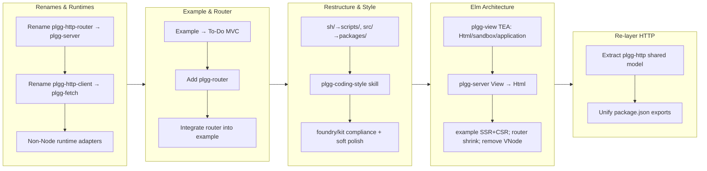

## 1. Overview

This branch modernized the plgg TypeScript monorepo end to end: it renamed the HTTP packages for clarity (plgg-http-router→plgg-server, plgg-http-client→plgg-fetch), replaced plgg-view's passive VNode/JSX runtime with a minimal Elm Architecture (a typed `Html<Msg>` tree plus pure `sandbox`/`application` runtimes and SSR `renderToString`), and re-layered the HTTP packages by extracting their shared model into a new neutral `plgg-http`. Along the way it added a pure SPA path toolkit (plgg-router), restructured the repo (`sh/`→`scripts/`, `src/`→`packages/`), codified the house style as a `plgg-coding-style` skill, and brought every package into compliance with it. `scripts/check-all.sh` is green end-to-end at every milestone.

**Highlights:**

1. Replaced plgg-view's passive VNode/JSX runtime with a minimal Elm Architecture — typed `Html<Msg>`, pure `sandbox`/`application` runtimes, and SSR `renderToString` — and migrated plgg-server's View to it.
2. Extracted the shared HTTP model into a new neutral `plgg-http` package so plgg-fetch and plgg-server become true peers (neither imports the other).
3. Renamed the HTTP packages (plgg-http-router→plgg-server, plgg-http-client→plgg-fetch) and added non-Node runtime adapters (Bun/Deno/Workers).
4. Added plgg-router (a pure SPA path toolkit) and reshaped the example into an SSR+CSR To-Do app driven by one TEA program.
5. Restructured the repo layout (`sh/`→`scripts/`, `src/`→`packages/`), authored a `plgg-coding-style` skill, made plgg-foundry/plgg-kit compliant, and unified `package.json` exports.

## 2. Motivation

The work began from three accumulating tensions. First, naming: the HTTP packages still carried their `plgg-web`-era names, and the client depended on the server purely to reuse the HTTP model — a peer importing a peer, against the repo's dependency doctrine. Second, the view layer: plgg-view was a passive VNode/JSX tree with no state or event model, forcing the example to hand-wire delegated DOM events and a refresh loop; the Elm Architecture (one immutable `Model`, all change as `Msg` data, the view a pure function) fits plgg's ethos — pure functions, immutable data, errors and events as values — far better. Third, consistency: as the monorepo grew past a handful of packages, style and structure drifted, and CLAUDE.md's one-line "no `as`/`any`" rule needed an explicit, auditable rubric. Each of these was addressed structurally rather than patched, and the largest change (the view rewrite) was deliberately phased so every commit stayed green and bisectable.

## 3. Changes

Work proceeded in five themes: clarifying the HTTP packages' names and portability; growing the example and adding a client router; restructuring the repo and codifying the coding style; the headline replacement of the passive view layer with a minimal Elm Architecture (phased across six green milestones, with SSR+CSR demonstrated from one program); and finally re-layering the HTTP packages so the shared model lives below both in a new `plgg-http`, plus an exports-style unification.

### 3-1. Rename `plgg-http-router` → `plgg-server` ([1cb827f](https://github.com/qmu/plgg/commit/1cb827f))

Renamed the server package and all references to its domain-clear name, preserving git history via `git mv`.

### 3-2. Rename `plgg-http-client` → `plgg-fetch` ([65bfa55](https://github.com/qmu/plgg/commit/65bfa55))

Renamed the client package symmetrically, establishing the plgg-server/plgg-fetch naming pair.

### 3-3. Rewrite `src/example/` as a real To-Do app with classic MVC layout ([9bb788b](https://github.com/qmu/plgg/commit/9bb788b))

Replaced the toy example with a To-Do CRUD app in a classic MVC layout exercising the full server + SQL + client-fetch round-trip.

### 3-4. Support non-Node runtimes via per-runtime adapter subpaths ([369e693](https://github.com/qmu/plgg/commit/369e693))

Split the runtime-coupled server code into `./node`/`./bun`/`./deno` adapter subpaths so the core entry stays runtime-neutral and Workers/Deno-Deploy consume `toFetch` directly.

### 3-5. Add plgg-router — a lightweight SPA client-side router ([a7b3dcc](https://github.com/qmu/plgg/commit/a7b3dcc))

Added a client-side router built on plgg-view, sharing plgg-server's `Segment`/`:param`/`*` path vocabulary by parallel definition rather than import.

### 3-6. Integrate plgg-router into the example To-Do app ([ce46640](https://github.com/qmu/plgg/commit/ce46640))

Wired list + detail routes into the example, replacing manual location handling with the router's `popstate`/link-interception loop.

### 3-7. Rename repo-root `sh/` → `scripts/` and `src/` → `packages/` ([05b024a](https://github.com/qmu/plgg/commit/05b024a))

Restructured the repo to a conventional monorepo layout, updating every path token across scripts, configs, and tsconfig `paths`.

### 3-8. Add a project-local Claude Code skill capturing plgg's coding style ([b799027](https://github.com/qmu/plgg/commit/b799027))

Authored the `plgg-coding-style` skill — type-driven design, expression-style pipelines, Option/Result, exhaustive match, the no-escape-hatch rule — as an auditable rubric for the codebase.

### 3-9. Make plgg-foundry skill-compliant ([97a28eb](https://github.com/qmu/plgg/commit/97a28eb))

Removed `as` casts, `throw`, and mutable state from plgg-foundry to bring it in line with the coding-style skill.

### 3-10. plgg-kit: offline test coverage + skill-compliant provider constructors ([9990f68](https://github.com/qmu/plgg/commit/9990f68))

Added offline (mocked) test coverage and rewrote the LLM provider constructors to the plgg style.

### 3-11. Skill-compliance soft polish across packages ([60ef437](https://github.com/qmu/plgg/commit/60ef437))

Applied behavior-preserving style polish across packages (missing matchers, ternaries→match, duplicated constructors, literal-null handling).

### 3-12. Replace plgg-view with a minimal Elm Architecture ([a8d35bc](https://github.com/qmu/plgg/commit/a8d35bc))

The headline change, phased across six green commits: a typed `Html<Msg>` tree with hyperscript builders (no JSX), pure `sandbox`/`application` runtimes, SSR `renderToString`, plgg-server's View migrated to `Html`, the example rewritten to demonstrate SSR+CSR from one program, plgg-router shrunk to a pure path toolkit, and the legacy VNode/jsx-runtime removed.

### 3-13. Extract the shared HTTP model into a neutral `plgg-http` package ([bf45ee6](https://github.com/qmu/plgg/commit/bf45ee6))

Moved the runtime-neutral HTTP model (Method/HttpStatus/HttpRequest/HttpResponse/HttpError) out of plgg-server into a new `plgg-http`; plgg-server re-exports it and plgg-fetch consumes it, severing the plgg-fetch→plgg-server edge.

### 3-14. Unify `package.json` exports style across non-core packages ([b3a7d1e](https://github.com/qmu/plgg/commit/b3a7d1e))

Converted the non-core packages to the canonical `.`-keyed `exports` shape (plgg-foundry also regained its missing `types` conditions).

## 4. Outcome

The branch delivered a coordinated modernization across the monorepo. The HTTP packages were renamed for clarity and re-layered so the shared HTTP model lives in a new neutral `plgg-http` that both plgg-server and plgg-fetch build on — removing the peer-to-peer import edge. The passive VNode/JSX view layer was replaced clean-slate with a minimal Elm Architecture (typed `Html<Msg>`, pure `sandbox`/`application` runtimes, SSR `renderToString`), the example now demonstrates SSR + CSR from a single pure program, and plgg-router was reduced to a pure path toolkit the runtime consumes. The repo was restructured to `scripts/`/`packages/`, a `plgg-coding-style` skill now encodes the house conventions, plgg-foundry and plgg-kit were brought into compliance, and `package.json` exports were unified. Every phase landed green; `scripts/check-all.sh` (build all packages in dependency order, then tsc + vitest per package) passes end-to-end. See tickets 3-12 (Elm Architecture) and 3-13 (plgg-http) for the architectural details.

## 5. Historical Analysis

The branch built directly on its own recent precedents. The two HTTP renames applied the procedure first established by the `plgg-web → plgg-http-router` rename, executed twice more here. The plgg-router addition explicitly chose *parallel definition* of the path vocabulary (cloning `Segment`/`compilePattern` rather than importing plgg-server's), and the plgg-http extraction is the documented complement of that decision: *parallel-define small clones; extract-below large shared vocabularies*. The Elm Architecture rewrite superseded the example's earlier router-driven `loadTodos`/`render` refresh loop — the exact hand-wiring TEA removes. The `plgg-coding-style` skill was authored only after the foundry/kit audits surfaced concrete violations, so the rubric was grounded in real findings rather than written speculatively. Throughout, the phasing discipline (keep every commit green and bisectable) was carried forward from the multi-phase rename and runtime-adapter tickets.

## 6. Concerns

### Binary request support adds a parallel `bytes` field rather than widening `body` (carried from PR #31)

- **Severity:** moderate
- **Description:** `HttpRequest` (now in `packages/plgg-http/src/Http/model/HttpRequest.ts` after the extraction in [bf45ee6](https://github.com/qmu/plgg/commit/bf45ee6)) carries a separate `bytes: Option<Uint8Array>` field alongside `body: SoftStr` rather than widening `body` to a union — so callers must remember to check the parallel field.
- **How to Fix:** Keep the text-body default dominant (documented in the type comment); if future handlers need to switch on body kind, introduce a tagged-union request builder to remove the parallel-field footgun.

### `mapErr` requires explicit parameter type annotations (carried from PR #31)

- **Severity:** moderate
- **Description:** `mapErr`'s callback parameter can't be inferred from the pipe position (the error channel isn't known until the curried function is applied), forcing every `mapErr((e: InvalidError) => …)` call site to annotate the error type (see `packages/plgg/src/Disjunctives/Result.ts`).
- **How to Fix:** Document the inference limitation near the `mapErr` export and expect reviewers to flag unannotated lambdas.

### Match type-level gaps remain open (carried from PR #31)

- **Severity:** moderate
- **Description:** `packages/plgg/docs/match-type-completeness.md` still lists Gaps 1–7 as open (duplicate atomic patterns, non-final `otherwise`, mixed pattern families, foreign discriminant tags, heterogeneous returns) — each compiles today but represents either a false negative or over-restriction.
- **How to Fix:** Sequence follow-up tickets by invasiveness; prioritize false-negative (unsound) gaps first, pinning each fix with `match.completeness.spec.ts`.

### plgg dist rebuild required after core changes (carried from PR #31)

- **Severity:** moderate
- **Description:** Every package consumes plgg core via a symlink resolving to `dist/` (never committed). After any core change, `dist/` must be rebuilt or dependent tsc/vitest reports "module has no exported member" for valid source — no workspace or pretest-rebuild automation exists.
- **How to Fix:** Add a pretest hook that rebuilds plgg in dependent packages, or adopt npm workspaces; at minimum, keep the rebuild step in ticket templates.

### Route table compilation trades 404/405 speed for `Allow` ordering fidelity (carried from PR #31)

- **Severity:** moderate
- **Description:** `packages/plgg-server/src/Routing/usecase/dispatch.ts` uses a compiled per-method table for the success path but deliberately falls back to a linear registration-order scan on the 405/404 cold path to preserve `Allow` header ordering.
- **How to Fix:** If error-path performance ever matters, add a separate methods-per-path index decoupled from registration order and document the behavioral change.

### `Uint8Array` not directly assignable to `BodyInit` (carried from PR #31)

- **Severity:** moderate
- **Description:** The stdlib's generic `Uint8Array<ArrayBufferLike>` doesn't unify with the concrete `BodyInit` union, so `packages/plgg-server/src/Http/usecase/toNativeResponse.ts` copies the view into a standalone `ArrayBuffer` at the seam.
- **How to Fix:** Keep the `ArrayBuffer` copy (never an `as` cast); document it as a seam-level lib-types quirk.

### TEA minimum has no effects/hydration (new)

- **Severity:** low
- **Description:** The minimal Elm Architecture ([a8d35bc](https://github.com/qmu/plgg/commit/a8d35bc)) is deliberately `sandbox` + full re-render with no `Cmd`/`Sub`, no vdom diffing, and no hydration — so an HTTP-backed app can't be written purely yet, the client takeover re-renders from `init` (SSR markup replaced, not reused), and every update re-attaches listeners.
- **How to Fix:** These are named follow-ups: a `Cmd`/effect seam for HTTP and programmatic navigation, vdom diffing for efficiency, and true hydration. Track as a follow-up epic when an HTTP-backed TEA app is needed.

### `.workaholic/specs/infrastructure.md` counts drift (new)

- **Severity:** low
- **Description:** The infrastructure doc still describes "four packages / twenty scripts"; the repo is now ten packages and ~40+ scripts. The path tokens were updated during the restructure but the inventory counts and diagrams were not.
- **How to Fix:** A small doc-refresh ticket to update the inventory table and mermaid diagrams. Non-blocking (reference doc, not enforcement).

## 7. Successful Development Patterns

- **Phased commits preserve bisectability** — the largest change (the view rewrite) was split into six phases (TEA core → application runtime → server View migration → example rewrite → router shrink → legacy removal), each green, with an approval gate between phases instead of one monolithic refactor. No later work was needed to untangle it.
- **Parallel-define small clones, extract-below large shared vocabularies** — plgg-router *cloned* the ~150-line path `Segment` machinery (peers don't import peers), while the large, identical HTTP model was *extracted below* both packages into plgg-http. The same doctrine yields opposite, correct answers depending on size and drift risk.
- **A coding-style skill as an auditable rubric** — writing the conventions down explicitly let the whole codebase be audited at once, surfacing accumulated violations in foundry/kit and giving the soft-polish pass a concrete checklist rather than ad-hoc judgement.
- **One pure `view`, two render targets** — keeping `view(model): Html<Msg>` the single source of truth let SSR (`renderToString`) and CSR (`sandbox`) be demonstrated from one program, and made the isomorphism testable (the same `view(init)` drives both the server string and the client DOM).
- **Re-export to keep a migration backward-compatible** — having plgg-server re-export the moved HTTP model from plgg-http meant zero server-internal call-site churn during the extraction; only the dependency graph changed, which kept the diff reviewable.
- **Verify the real artifact, not just types** — the SSR+CSR example was confirmed by actually running the server and curling `/` and `/main.js`, not only by passing tsc/vitest — catching the mount-point and bundle-serving details a type check can't.

## 8. Release Preparation

**Verdict**: Ready for release

### 8-1. Concerns

- None — changes are safe for release. `scripts/check-all.sh` is green end-to-end; the new source contains no TODO/FIXME/secrets; the package renames and internal re-layering are not user-blocking. The carried/forward-looking items in section 6 are tracked follow-ups, not release blockers.

### 8-2. Pre-release Instructions

- None — standard process. (Note: there is no root version to bump; packages are independently versioned at `0.0.1`, and CLAUDE.md defines no version-management step.)

### 8-3. Post-release Instructions

- None — no special post-release actions needed.

## 9. Notes

A few changes on this branch landed as direct requests rather than tickets and so have no subsection in section 3: the SSR+CSR example demonstration ([9f8f442](https://github.com/qmu/plgg/commit/9f8f442)), the cross-package consistency/docs pass ([0f13665](https://github.com/qmu/plgg/commit/0f13665)), and a small prettier fixup ([144aab1](https://github.com/qmu/plgg/commit/144aab1)). The new `plgg-http` package is the only structural addition reviewers should look at first; everything else is a rename, a clean-slate replacement of an experimental view layer, or behavior-preserving consistency work.
