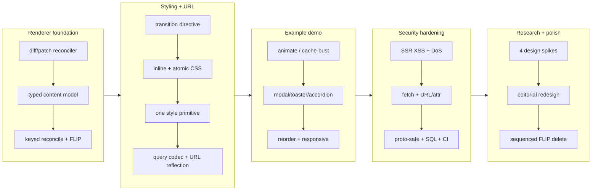

## 1. Overview

This branch grew `plgg-view` from a minimal renderer into a micro-interaction-capable Elm-Architecture view library, drove the example To-Do app from a bare list into a feature-rich demo (modal, toaster, accordion, reorder), hardened the HTTP/SQL/CI surface against a security review, scoped the renderer's next runtime primitives as research spikes, and finished with an editorial visual + motion overhaul. It is the accumulation of ~2 weeks of work across the whole monorepo, landed ticket-by-ticket.

**Highlights:**

1. A focus-safe diff/patch renderer with keyed reconciliation, FLIP movement, and a declarative enter/exit/size motion lifecycle.
2. A single styling primitive (atomic `style_`) with SSR `<head>` CSS extraction, plus model→URL reflection and a typed query codec.
3. Six security fixes from a full review (SSR XSS, request DoS, fetch credential leak, URL/attr sanitization, prototype-safe lookups, SQL brand).
4. Four research/design spikes recommending the renderer's next primitives (effects/`Cmd`, ref/post-paint, event decoders, reversible size).
5. An editorial redesign (warm palette, flat UI, refined easing tokens) and a reworked, sequenced FLIP-delete.

## 2. Motivation

The library exists to make sequenced micro-interactions feel right "by design" on a single immutable Elm model — the failure mode that motivated it was column reveals glitching under React Motion. Reaching that meant first making the renderer reconcile by identity (so the *right* node animates), then giving it a motion vocabulary, then proving the vocabulary against real components in the example. Building those components surfaced exactly where the runtime stops (effects, refs, richer events, height transitions), which became deliberate research rather than ad-hoc hacks. A parallel security review of the from-scratch HTTP/SQL stack produced a focused hardening pass, and direct visual iteration on the demo drove the final palette/motion polish.

## 3. Changes

The branch moved in five arcs: build a correct keyed/FLIP renderer; give it a styling + URL system; prove it in the example; harden the stack after a security review; then scope the next primitives and polish the look and motion. Non-ticketed commits on the branch carry the reorder demo ([36b80ef](https://github.com/qmu/plgg/commit/36b80ef)), a dts-surfaced type-error fix ([1197806](https://github.com/qmu/plgg/commit/1197806)), and the editorial redesign + motion overhaul ([38fd91a](https://github.com/qmu/plgg/commit/38fd91a)).

### 3-1. Redesign the plgg-view client renderer as a diff/patch reconciler ([eca3ef4](https://github.com/qmu/plgg/commit/eca3ef4))

Replaced full re-render with a focus-safe, O(changes) diff/patch reconciler — the foundation everything else builds on.

### 3-2. Add a development Docker workload for the example ([011151f](https://github.com/qmu/plgg/commit/011151f))

A `workloads/development` image to run the example demo from a clean state.

### 3-3. Typed content-model constraints ([ccc343b](https://github.com/qmu/plgg/commit/ccc343b))

`Html<Msg, T>` tag-branding so child/arity restrictions are machine-checkable and agent-legible.

### 3-4. Declarative enter/exit transition directive ([f644a7b](https://github.com/qmu/plgg/commit/f644a7b))

`transition`/`fadeIn`/`fadeOut`/`slideIn` over a `Motion`/`Frame` model and an injectable WAAPI `Play` seam.

### 3-5. plgg-router bidirectional typed query codec ([754aa75](https://github.com/qmu/plgg/commit/754aa75))

`serializeQuery` + `QueryCodec` for round-trip-safe URL query state.

### 3-6. Model→URL reflection seam ([c671bb4](https://github.com/qmu/plgg/commit/c671bb4))

`toUrl`/`historyMode` so the model projects into the address bar (nuqs-style), no imperative URL setter.

### 3-7. Demo enter/exit transitions on todo items ([bc23e52](https://github.com/qmu/plgg/commit/bc23e52))

Wired the example `<li>` with fade enter/exit to exercise the directive.

### 3-8. Type-driven inline-style utilities ([180a49e](https://github.com/qmu/plgg/commit/180a49e))

Tailwind-style atoms (`p`, `bg`, `text`, …) as typed `Styles`, and restyled the example.

### 3-9. Atomic CSS extraction ([7fadb26](https://github.com/qmu/plgg/commit/7fadb26))

`css()` + `:hover`/`:focus` variants folded into a content-hashed sheet.

### 3-10. SSR `<head>` CSS injection ([4166039](https://github.com/qmu/plgg/commit/4166039))

Critical CSS inlined into the SSR document; demo hover/focus.

### 3-11. Unify styling into one primitive ([d850b13](https://github.com/qmu/plgg/commit/d850b13))

Collapsed the `style_`/`css` split into a single styling primitive.

### 3-12. Keyed child reconciliation + FLIP ([c5cb39f](https://github.com/qmu/plgg/commit/c5cb39f))

`key()` identity so reuse/move/insert/delete act on the right nodes; survivors FLIP; deferred-removal exit lifecycle.

### 3-13. Cache-bust the example client bundle ([556d000](https://github.com/qmu/plgg/commit/556d000))

Versioned `/main.js?v=` + no-cache headers so fresh SSR never pairs with stale client JS.

### 3-14. Responsive (mobile-friendly) example ([3c39d3e](https://github.com/qmu/plgg/commit/3c39d3e))

Viewport meta in the SSR document + a wrapping toolbar (verified already satisfied during the drive).

### 3-15. Escape CSS to close a `</style>` SSR XSS ([f1a6e7d](https://github.com/qmu/plgg/commit/f1a6e7d))

`escapeCss` at the `renderCssRule` chokepoint so author `decl()` data can't break out of the `<style>` block/element.

### 3-16. Bound request bodies + node timeouts ([2df878a](https://github.com/qmu/plgg/commit/2df878a))

`maxBodyBytes` (413 over the cap) + socket/header/request timeouts on the node adapter — the HIGH-severity DoS fix.

### 3-17. Stop auto-following redirects in fetch seams ([b5fdbb8](https://github.com/qmu/plgg/commit/b5fdbb8))

`redirect: "manual"` in `postJson` + plgg-fetch, surfaced as a typed `RedirectError`, so auth headers can't leak cross-redirect.

### 3-18. Sanitize URL schemes, reject `on*` attrs, validate SSR tags ([1dd80fb](https://github.com/qmu/plgg/commit/1dd80fb))

Shared `safeUrl`/`safeAttrValue`/`isSafeTag` enforced identically in SSR and the client.

### 3-19. Fix shell injection in start-pull-request workflow ([98c3e52](https://github.com/qmu/plgg/commit/98c3e52))

`LABELS`/`ASSIGNEES` referenced as quoted shell vars (not expression interpolation), unused `id-token` dropped, gems pinned.

### 3-20. Prototype-safe request map lookups ([38700d3](https://github.com/qmu/plgg/commit/38700d3))

`Object.hasOwn`-guarded accessors so a never-sent key (`constructor`/`__proto__`) returns `none()`, not an inherited function.

### 3-21. Harden Sql brand + placeholder invariant ([392a954](https://github.com/qmu/plgg/commit/392a954))

A module-private `Symbol` brand (forged box rejected) and a placeholder==param invariant upheld by construction.

### 3-22. Research: ref / post-paint hook ([d33f70a](https://github.com/qmu/plgg/commit/d33f70a))

Recommends a `ref` Attribute variant; defers the command/task route behind effects.

### 3-23. Research: effects & subscriptions ([bb01985](https://github.com/qmu/plgg/commit/bb01985))

Recommends staged Elm `Browser.element` (`Cmd` then `Sub`), effects-as-data, `sandbox` stays pure.

### 3-24. Research: event payload + preventDefault model ([e8b4859](https://github.com/qmu/plgg/commit/e8b4859))

Recommends typed event decoders + `custom` (prevent/stop) beside the existing helpers.

### 3-25. Research: reversible size-transition lifecycle ([e22e70e](https://github.com/qmu/plgg/commit/e22e70e))

Recommends a CSS-recipe `disclosure` helper (no JS size animator; `Motion` stays opacity+transform).

## 4. Outcome

`plgg-view` now reconciles by identity with FLIP movement and a coherent enter/exit/size + sequenced-delete motion lifecycle, styled through one atomic primitive with SSR-extracted critical CSS and model→URL reflection. The example demonstrates modal, toaster, accordion, click-reorder, filter/search-to-URL, and responsive layout on that engine. The from-scratch HTTP/SQL/CI surface passed a security review with six fixes landed and tested. The renderer's remaining frontier (effects, refs, richer events, height transitions) is scoped with concrete API recommendations. The whole monorepo type-checks and its suites pass; the example is live behind the cloudflared tunnel.

## 5. Historical Analysis

The renderer/motion arc is self-referential: each ticket's Related History points at the prior one (diff-patch → typed content → keyed/FLIP → transition orchestration), and the keyed-reconcile work alone took six in-ticket revisions to converge on the deferred-removal lifecycle — institutional memory that directly informed this branch's later FLIP-delete rework. The security pass reused the project's established `HttpError`/`Result`/`Box`-brand vocabulary rather than introducing new patterns. The research spikes lean on the same precedents (the injectable `Play` seam as the model for an effects interpreter; the URL reflection as the "render-time effect interpreted by the runtime").

## 6. Concerns

### `tsc-plgg.sh` only type-checks the plgg core package

- **Severity:** moderate
- **Description:** The canonical typecheck only runs `tsc` in `packages/plgg`, so per-package type errors slip through every "tsc clean" gate — three real errors (a non-exhaustive `ClientError` match, `Object.hasOwn` under an older lib, spec index-access) reached commits and were only caught by the dts build (see [1197806](https://github.com/qmu/plgg/commit/1197806)).
- **How to Fix:** Make `scripts/tsc-plgg.sh` typecheck every package (or have CI run `scripts/build.sh`, whose dts step does), so the typecheck gate covers the whole monorepo.

### plgg-server / plgg-fetch vendor a copy of plgg-view at build time

- **Severity:** moderate
- **Description:** `plgg-server` bundles a copy of `plgg-view`'s `collectCss`, so a `plgg-view` change leaves stale vendored code until `plgg-server` is rebuilt — invisible to `tsc`, surfacing only at runtime (it emitted a `.undefinedundefined{}` rule into SSR for keyed elements; see [c5cb39f](https://github.com/qmu/plgg/commit/c5cb39f) and the example serving path).
- **How to Fix:** Document/automate the cross-package rebuild order (a change to a re-exported `plgg-view` fold requires rebuilding `plgg-server`/`plgg-fetch`), e.g. a `build:affected` step or a watch that rebuilds dependents.

### Renderer motion changes unverified in a real browser

- **Severity:** moderate
- **Description:** The FLIP-delete rework (out-of-flow fade + delayed survivor slide + container-height close) and the refined easing tokens were validated by unit tests and the bundle, but not by pixels — this sandbox has no Chrome, so visual QA was the developer's by reloading the tunnel (see [38fd91a](https://github.com/qmu/plgg/commit/38fd91a) in `packages/plgg-view/src/Program/usecase/render.ts`).
- **How to Fix:** Run a headless-browser pass (Playwright/Chromium) over add/delete/reorder/expand to lock the motion behavior, ideally as a visual or DOM-timeline assertion in CI.

### Renderer runtime primitives remain unimplemented

- **Severity:** low
- **Description:** Auto-dismiss timers, focus/scroll, keyboard shortcuts/drag, and true height auto-grow are not expressible — the example uses manual dismiss, a CSS grid-rows accordion, and click-reorder as stand-ins (see [bb01985](https://github.com/qmu/plgg/commit/bb01985), [d33f70a](https://github.com/qmu/plgg/commit/d33f70a), [e8b4859](https://github.com/qmu/plgg/commit/e8b4859), [e22e70e](https://github.com/qmu/plgg/commit/e22e70e)).
- **How to Fix:** Open implementation tickets from the four research recommendations (effects/`Cmd` first — it unblocks the others), then replace the example's stand-ins.

### Carried-over concerns from PRs #31 / #37 remain active

- **Severity:** low
- **Description:** 14 carry-overs (deduped: binary-request parallel path, `mapErr` param-type annotations, match type-level gaps, route-table 404/405 trade-off, `Uint8Array`→`BodyInit`, the dist-rebuild requirement, TEA-has-no-effects, infrastructure spec count drift) target the HTTP/router/match core and the effects gap — areas this branch did not remediate.
- **How to Fix:** Re-judge them on the next branch that touches those areas; the effects-related ones (`tea-minimum-has-no-effects-hydration`, `plgg-dist-rebuild`) now have design direction from the research spikes and the concerns above.

## 7. Successful Development Patterns

- Ticket-first then drive, with a per-ticket approval gate, kept a 25-ticket branch coherent — each change is one reviewable commit with a Final Report capturing the non-obvious insight (e.g. the respond-then-destroy ordering for 413, the symbol-brand-over-structural-tag choice).
- A single shared chokepoint per cross-cutting rule (one `escapeCss` in `renderCssRule`; one `safeAttrValue` for SSR + client) makes the safe path provable and prevents SSR/CSR drift — far more robust than re-validating at each sink.
- Proving the renderer against real components in the example (modal/toaster/accordion) surfaced the exact missing primitives, which became scoped research with concrete API recommendations instead of ad-hoc hacks — building the demo *is* the requirements discovery.
- Converging on the deferred-removal lifecycle through iterative, empirically-probed revisions (then reworking it again here for the fade+slide feel) shows motion is an element-lifecycle concern layered on the vDOM, orthogonal to the render strategy.
- The dts build catching what the scoped typecheck missed is a reminder to make the verification gate cover the whole artifact, not a convenient subset.

## 8. Release Preparation

**Verdict**: Ready for release (with visual QA recommended)

### 8-1. Concerns

- Renderer motion is unit/bundle-verified but not browser-verified from this environment (see §6) — recommend a quick visual pass on the live demo before/after merge.
- No version bump performed: CLAUDE.md has no Version Management section and there is no root manifest; per-package versions were left as-is.

### 8-2. Pre-release Instructions

- Reload the live demo (https://plgg-example.qmu.dev/) and sanity-check add / delete / reorder / expand / modal motion.
- Ensure a clean build from scratch: `bash scripts/build.sh` then `cd packages/example && npm run build` (dist is gitignored; consumers rebuild).

### 8-3. Post-release Instructions

- None — no migrations or runtime config changes. The cloudflared tunnel serves the example on port 3001 (env-configurable `PORT`).

## 9. Notes

The example dev server is env-port-configurable (`PORT`, default 3000) to match the tunnel ingress (3001). Library `dist/` is gitignored, so cross-package changes require rebuilding dependents (see §6). The four research tickets are recommendations only — no renderer code shipped from them; implementation awaits follow-up tickets.
