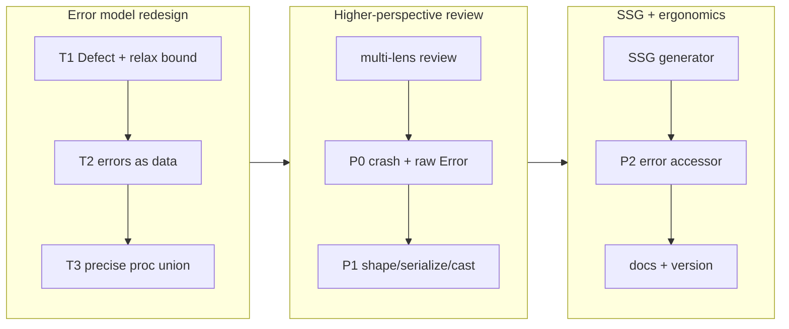

## 1. Overview

This branch redesigned plgg's error model from the ground up and built a static
site generator on the result. Error *classes* (`BaseError`/`Exception`/…) were
replaced with pure tagged `Box` data, a single `Defect` bottom was introduced
for unexpected throws, and the `Result` effect family was made generic over the
error type so `proc` now infers the **precise** per-step error union instead of
erasing to `unknown`. A higher-perspective multi-lens review then hardened the
new foundation, and the SSG feature shipped proc-native on top of it.

**Highlights:**

1. Errors are now pure tagged data (`Box` unions), not `Error` subclasses — the no-class house rule is finally universal.
2. `proc` infers the exact error union (`E₁ | … | Defect`), locked by a type-level assertion.
3. New `plgg-server/ssg` static site generator: crawl routes via `handle`, write directory-index HTML, `node:fs` confined to one seam.
4. Review-driven fixes: a `printPlggError` infinite-loop crash, `bind`/`tryCatch` minting raw `Error`, and a `Defect` cause that vanished through JSON.
5. Net **−5** pre-existing `as` casts removed; zero escape hatches added across ~100 migrated call sites and 8 packages.

## 2. Motivation

The work began from a single friction point: `proc`'s error channel was
hard-fixed to `Error`, so a domain error like `SsgError` could not flow through
it and the SSG feature would have had to hand-thread every pipeline. Tracing
that constraint revealed it was not a `proc` quirk but the whole `Result`
effect family bounding `E extends Error` — which forced every domain error to
be an `Error` subclass, which forced the one class hierarchy plgg otherwise
forbids. With the repo as its own only consumer, the breaking redesign was
worth taking: model errors as data, give the effect family a precise error
channel, and let the SSG feature — the original request — be born on the better
foundation rather than retrofitted onto it.

## 3. Changes

The work split into three arcs: a three-commit breaking error-model redesign
(additive core → data migration → precise inference), a multi-lens review that
surfaced and fixed real foundation defects, and the SSG feature plus an
ergonomic accessor and docs. Each ticket landed independently `check-all`-green.

### 3-1. Error core: Defect + toError/panic + relax the bound ([64fe714](https://github.com/qmu/plgg/commit/64fe714))

Additive, backward-compatible foundation: added the `Defect` bottom type and the
`toError`/`panic` interop seam, and dropped the `E extends Error` constraint from
`Procedural`/`proc`/`tryCatch`/`conclude` (keeping the `Error` default for zero
churn). Unblocks the migration without a flag day.

### 3-2. Migrate error model to tagged Box data ([eaaec19](https://github.com/qmu/plgg/commit/eaaec19))

The breaking commit (109 files): `InvalidError`/`SerializeError`/`DeserializeError`
became `Box` unions, `BaseError`/`Exception` were deleted (`Defect` replaces
`Exception`), `PlggError`/`isPlggError`/`printPlggError` were reimplemented over
data, and ~85 `InvalidError` + 6 `Exception` sites plus 6 downstream packages
(incl. `plgg-sql`'s `SqlError`) were migrated.

### 3-3. Infer precise proc error union ([c9ecc6e](https://github.com/qmu/plgg/commit/c9ecc6e))

Reworked `proc`'s ~20 overloads to infer each step's raw return type and
decompose it into success + error, so `proc(a, f1, f2, …)` yields
`Result<…, E₁ | … | Defect>` instead of `unknown`. A type-level assertion in
`proc.spec.ts` locks the inference against regression. Zero escape hatches.

### 3-4. Fix printPlggError cycle + bind/tryCatch raw Error ([b717ed3](https://github.com/qmu/plgg/commit/b717ed3))

Two P0s from the review: `printPlggError` now guards a sibling cycle with a
`WeakSet` (was a `RangeError` crash); `bind` and `tryCatch` stop minting raw
`Error` (default `Defect`), and `tryCatch`'s four `as` casts were removed by
restructuring its overloads.

### 3-5. Harden error model: shape guard, serializable cause, cast throws ([c3027fc](https://github.com/qmu/plgg/commit/c3027fc))

Three P1s: `isPlggError` now checks payload shape (not just tag membership); a
shared serializable `Cause` (`{ name, message, stack }`) replaces the raw `Error`
that collapsed to `{}` through `JSON.stringify`; and `cast` captures an
unexpected step throw into an `InvalidError` cause instead of flattening it.

### 3-6. Add SSG static site generation ([4669f60](https://github.com/qmu/plgg/commit/4669f60))

A new `plgg-server/ssg` generator: for each explicit path it synthesizes a GET
request, runs `handle` (so routing + middleware execute and output equals live
SSR), and writes directory-index HTML. Built proc-native on the new foundation
(`renderPath` infers `Result<SsgPage, SsgError | Defect>`); `node:fs` confined to
one seam behind the new `./ssg` entry. Strict failure, path-traversal guard,
runnable demo.

### 3-7. Add PlggError message accessor and matchPlggError ([787f215](https://github.com/qmu/plgg/commit/787f215))

Ergonomics: `plggErrorMessage`, `matchPlggError` (the `$`-matchers' first real
callers), and `resultErrorMessage` replace the `result.content.content.message`
double-hop; the library message-builders in `Vec`/`Dict`/`ReadonlyArray` were
routed through the accessor.

## 4. Outcome

The error-model redesign is fully landed and the entire monorepo is green
(`check-all.sh`: all 8 packages build and test — plgg 465, view 115, server 86,
router 39, http 32, fetch 27, sql 25, kit 12, foundry 6, example 25). Errors are
now uniform tagged data with a precise, inferable error channel through `proc`;
the no-class rule is universal; and the SSG feature the branch set out to deliver
ships on that foundation. The redesign was breaking but in-repo only — every call
site was migrated in the same branch, and the diff added zero `as`/`any`/`ts-ignore`
while removing five pre-existing casts.

## 5. Historical Analysis

The SSG feature composes primitives shipped on the archived
`work-20260531-003055` branch (the pure `renderToString`/`collectCss` fold and
`htmlDocument`/`pageResponse` SSR head-injection) — SSG is their build-time
consumer, not new rendering machinery. The error redesign has no direct
precedent; it reverses a long-standing assumption (errors as `Error` subclasses)
that the rest of the codebase had quietly grown around, which is why its blast
radius spanned every package's error paths.

## 6. Concerns

### Shared "boundary error" primitive not yet factored

- **Severity:** moderate
- **Description:** `Defect`, `SqlError`, and (by the same pattern) the existing `HttpError`/`ClientError` each independently re-implement the shape `Box<Tag, { message, cause }>` plus a hand-rolled `toXxxError(cause)` doing the same `instanceof Error ? …` lift (see [c3027fc](https://github.com/qmu/plgg/commit/c3027fc) in `packages/plgg/src/Exceptionals/Cause.ts` and `packages/plgg-sql/src/Db/model/Db.ts`). This is structural cloning that will replicate once per package owning a boundary error.
- **How to Fix:** Factor a shared core primitive — a tagged `{ message, cause: Option<Cause> }` constructor plus a single `liftThrow(tag)(cause)` helper — and let `Defect`/`SqlError`/`HttpError` be one-line specializations. The `Cause` type added this branch is the seed.

### Defect is invisible in precise downstream error channels

- **Severity:** moderate
- **Description:** `proc` now injects `Defect` into every chain's inferred error union, but precise downstream channels (e.g. `plgg-sql` returning `SqlError`, handlers annotated `HttpError`) do not surface `| Defect`, so an unexpected throw is carried at runtime under a type that claims to exclude it (see [c9ecc6e](https://github.com/qmu/plgg/commit/c9ecc6e) in `packages/plgg/src/Flowables/proc.ts`).
- **How to Fix:** Decide and encode the reconciliation: either each boundary maps `Defect` into its domain error via a `recoverDefect`/normalizer step, or the handler types must include `| Defect`. Make the bottom error visible in the types that claim to be precise.

### Existing specs still read error content by hand

- **Severity:** low
- **Description:** The P2 accessor (`plggErrorMessage`/`resultErrorMessage`) routed library code off the `result.content.content.message` double-hop, but ~40 existing spec sites still reach two `.content` levels by hand (see [787f215](https://github.com/qmu/plgg/commit/787f215)). New code should use the accessor; the specs were deliberately not churned.
- **How to Fix:** Opportunistically migrate spec reads to the accessor when touching those files; do not bulk-churn.

### SSG v1 is intentionally minimal

- **Severity:** low
- **Description:** `generateStatic` takes an explicit `paths` list only — no static-route auto-discovery, no per-pattern param expander, and no lenient skip-and-report mode (a single bad route fails the whole build). plgg-view does not hydrate, so SSG output is first-paint/SEO only (see [4669f60](https://github.com/qmu/plgg/commit/4669f60) in `packages/plgg-server/src/Ssg/`).
- **How to Fix:** Add `staticPaths(app)` auto-discovery of fully-`Static` GET routes, a param expander, and an opt-in lenient mode as follow-up tickets when a real site needs them.

### Version bump covers only plgg and plgg-server

- **Severity:** low
- **Description:** Downstream packages (`plgg-sql`/`plgg-foundry`/`plgg-kit`/`plgg-http`/`plgg-fetch`) were migrated to the new error model but their `package.json` versions were not bumped, so a consumer pinning those packages gets new error-shape behavior without a version change.
- **How to Fix:** Decide a monorepo versioning policy (bump-all on a cross-cutting core change, or adopt workspaces/changesets) before the next publish.

> **Note:** ~20 carry-over concerns from PRs #31/#37/#40 (HTTP `bytes` field,
> `mapErr` annotation inference, `match` type-level gaps, route-table 404/405
> trade-off, `Uint8Array`→`BodyInit`, the plgg dist-rebuild requirement,
> plgg-view vendoring, TEA effects/hydration, renderer primitives, motion visual
> QA, `tsc-plgg.sh` core-only typecheck, infra doc count drift) remain **active**
> — this branch targeted the error model and SSG, not those areas, so none were
> remediated. They persist as files in `.workaholic/concerns/` for re-judging on
> a branch that touches them. The `tsc-plgg.sh` core-only-typecheck concern was
> acutely felt this branch (downstream errors were caught only by running each
> package's `tsc` script by hand).

## 7. Successful Development Patterns

- Sequencing a breaking change as **additive-first** (T1 dropped the constraint but kept the `Error` default, so it landed green with zero call-site churn) made the later breaking commit a clean, mechanical migration rather than a flag day.
- Driving the ~100-site mechanical migration off **compiler errors** (convert the core types, then let `tsc` enumerate every break) plus a delegated subagent that iterates `check-all` to green — with a hard no-`as`/`any` rule — kept a foundation-wide change correct and escape-hatch-free.
- A **higher-perspective multi-lens review** (type-soundness, correctness, ergonomics, design-altitude, completeness) with adversarial verification caught defects the green build hid: a printer that crashes on a cycle, combinators silently re-minting the `Error` the redesign was deleting.
- Splitting the monolithic error ticket into **three independently-green commits** (core / migration / inference) and isolating the hard TypeScript metaprogramming (precise `proc` inference) in its own commit kept the risky part from destabilizing the mechanical parts.
- Pinning the `proc` inference win with a **type-level assertion** (`Equal`/`Expect`) ensures a future refactor cannot silently collapse the channel back to `unknown` while every runtime test still passes.

## 8. Release Preparation

**Verdict**: Ready for release

### 8-1. Concerns

- None that block release — `check-all.sh` is green (all 8 packages build and test), the diff adds no `as`/`any`/`ts-ignore`, and no TODO/FIXME or secrets were introduced. The Concerns above are forward-looking, not release blockers.

### 8-2. Pre-release Instructions

- Rebuild all dists (`scripts/build.sh` or `check-all.sh`) so the new `plgg-server/ssg` entry and the rebuilt `plgg` dist are present before publishing.

### 8-3. Post-release Instructions

- None — no migrations or env changes.

## 9. Notes

This is a breaking change to plgg's error model, justified because plgg is its
own only consumer (no external dependents). Consumers constructing or reading
plgg errors must use the data constructors (`invalidError({ message })`, `defect(message, cause?)`)
and read a failed `Result`'s message at `result.content.content.message` (or via
the new `plggErrorMessage`/`resultErrorMessage` accessors).
