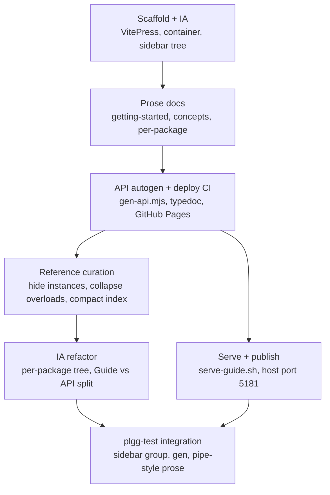

## 1. Overview

This branch built `packages/guide/` — a VitePress documentation site that is the official user guide for the entire plgg family (plgg core plus plgg-http, plgg-router, plgg-server, plgg-fetch, plgg-view, plgg-sql, plgg-foundry, plgg-kit, plgg-test, and the `example` tutorial). It pairs hand-written narrative — a getting-started on-ramp, a Core concepts set (Option, Result, pipe/cast/proc, match, tagged `Box` data, validation, async, composition), and per-package conceptual prose — with a fully auto-generated API reference produced from each package's source and TSDoc via TypeDoc. The site is built, deployed to GitHub Pages by a dedicated CI workflow, and served on this host at port 5181 behind the cloudflared tunnel (`plgg-guide.qmu.dev`).

The work was driven by 20 tickets. After the initial scaffold-and-content arc, most of the effort went into curating the auto-generated reference (hiding implementation-detail instance objects, collapsing variadic-overload noise, condensing it into a compact signature index) and reshaping the information architecture (merging the separate Packages and API-reference trees into one group per package, then splitting each into parallel Guide and API-reference children). The branch finally added a plgg-test section documenting the separately-shipped pipe-style redesign.

**Highlights:**
1. A containerized VitePress site under `packages/guide/` (own `package.json`, `"type": "module"`, `.vitepress/config.ts` defining the full sidebar IA), with dead-link-on-build acting as a self-verifying check that the whole IA resolves.
2. Self-maintaining API reference: `scripts/gen-api.mjs` runs TypeDoc per package (typedoc-plugin-markdown + typedoc-vitepress-theme, shared `typedoc.base.json`) into gitignored `api/<pkg>/` output, with a symbol-count assertion guaranteeing no public symbol is silently dropped.
3. A compact signature-index reference: a fence-aware post-process strips the ceremony `#### Type Parameters/Parameters/Returns` sub-tables and regroups every symbol under its source-derived category (Atomics…Functionals), shrinking the plgg page ~2.6x (8204 → 3140 lines) while staying comprehensive.
4. Curation upstream of generation: ~112 backing instance objects (`*Castable`, `*Functor`, `*Monad`, …) marked `@internal`, and the ~20 variadic overloads of `pipe`/`cast`/`proc`/`flow` collapsed to one representative signature each.
5. A per-package sidebar tree (`plgg`, `plgg-http`, `plgg-router`, … `example`) where each package exposes parallel **Guide** (prose) and **API reference** (generated, with per-category leaves for multi-category packages) children.
6. Deploy CI (`.github/workflows/deploy-guide.yml`) that builds all package dists in dependency order then publishes the guide to GitHub Pages, plus `scripts/serve-guide.sh` and `workloads/guide/` for one-command local serving on host port 5181 (matching the tunnel).

## 2. Motivation

plgg had grown into a family of roughly ten standalone packages, each with only a `README.md`. There was no navigable, cross-package home that taught the shared ethos (Option-not-null, Result-not-throw, data-last pipelines, exhaustive `match`) once and let each package link back to it instead of re-explaining the basics, and no complete API reference that stayed in sync with the source. A README per package gives no top-level information architecture and no way to separate hand-written conceptual prose from an exhaustive, generated symbol reference.

The branch answers this with a single VitePress site that fixes an information architecture up front (so content grows against a stable tree), curates a high-quality reference auto-generated from source/TSDoc (comprehensive but scannable, never drifting), and is deployable as a real public artifact at `plgg-guide.qmu.dev` via the existing cloudflared tunnel — turning a memorized `docker compose` invocation into a discoverable `scripts/serve-guide.sh` wrapper and a CI-published site.

## 3. Changes

The work proceeded as a scaffold-then-fill initiative: an IA-first foundation, narrative and per-package prose, generated reference + CI, then several rounds of reference curation and IA refinement, and finally the plgg-test addition. Each ticket was paired with an implementation commit per the drive pattern.

### 3-1. Scaffold, IA, and the narrative on-ramp ([8792aa9](https://github.com/qmu/plgg/commit/8792aa9), [e6887a9](https://github.com/qmu/plgg/commit/e6887a9))

Split the initiative into 8 dependency-ordered tickets and stood up `packages/guide/` as a VitePress project — its own `package.json` (the first repo package needing `"type": "module"`, since VitePress 1.x is ESM-only), a `.vitepress/config.ts` carrying the full sidebar IA as the contract every later ticket fills in, a landing `index.md`, a `contributing/conventions.md` rule that samples come from real/tested code, and a dev container. Then wrote the getting-started page and the Core concepts set (tagged `Box` data, Option, Result, pipe/cast/proc, match, validation, async, composition) — the conceptual layer per-package pages link back to instead of re-teaching the basics.

### 3-2. Per-package conceptual prose ([a905c54](https://github.com/qmu/plgg/commit/a905c54), [53f05ee](https://github.com/qmu/plgg/commit/53f05ee), [0c8fda9](https://github.com/qmu/plgg/commit/0c8fda9), [3f7f863](https://github.com/qmu/plgg/commit/3f7f863), [afbdc95](https://github.com/qmu/plgg/commit/afbdc95))

Documented the plgg core in two parts — values & effects and structures, errors & abstracts — then the HTTP stack (plgg-http, plgg-router, plgg-server, plgg-fetch), plgg-view (TEA architecture, typed `Html`, SSR) with the `example` tutorial, and the data & AI packages (plgg-sql, plgg-foundry, plgg-kit). Each page teaches what a package is, how its vocabulary is organized, and a few representative examples.

### 3-3. API auto-generation and deploy CI ([79be0ab](https://github.com/qmu/plgg/commit/79be0ab))

Added `scripts/gen-api.mjs`, a shared `typedoc.base.json`, and typedoc + typedoc-plugin-markdown + typedoc-vitepress-theme devDeps. The generator runs TypeDoc per package against its own source/tsconfig into `api/<pkg>/`, merging per-package sidebars into `api/typedoc-sidebar.json`; `npm run build` wires `docs:api` before `vitepress build`, and `config.ts` loads the generated sidebar with a graceful dev fallback plus a `DOCS_BASE`-driven base for Pages. The generated `api/<pkg>/` subtrees are gitignored. `.github/workflows/deploy-guide.yml` builds all package dists in dependency order, generates and builds with `DOCS_BASE=/plgg/`, and publishes via `actions/deploy-pages` — independent of the CalVer release pipeline.

### 3-4. README alignment ([eb332af](https://github.com/qmu/plgg/commit/eb332af), [d80befd](https://github.com/qmu/plgg/commit/d80befd))

Fixed a stale `match` example in the plgg README (curried form) and aligned the plgg-foundry README with its shipped API, keeping the canonical READMEs honest as source material for the guide.

### 3-5. Curating the generated reference ([4bbea0d](https://github.com/qmu/plgg/commit/4bbea0d), [d5fb31b](https://github.com/qmu/plgg/commit/d5fb31b), [a4e67e5](https://github.com/qmu/plgg/commit/a4e67e5), [b744a5c](https://github.com/qmu/plgg/commit/b744a5c), [934a2de](https://github.com/qmu/plgg/commit/934a2de))

A run of reference-quality tickets attacked the "long article" problem. First condensed and curated the reference and refocused the per-package guidance pages on concepts/organization rather than enumerating every symbol. Then marked ~112 backing instance objects (`*Castable`, `*Refinable`, `*Functor`, `*Monad`, …) `@internal` so `excludeInternal` drops them while keeping the derived public functions, and collapsed the ~20 variadic overloads of `pipe`/`cast`/`proc`/`flow` to one signature each (plus `disableSources` to drop GitHub "Defined in" lines). Finally turned the reference into a compact signature index: a fence-aware post-process in `gen-api.mjs` strips the `#### Type Parameters/Parameters/Returns` sub-tables and regroups each symbol under its source-derived category (Atomics…Functionals), guarded by a lossless symbol-count assertion (`Other = 0` across all 9 packages; plgg page 8204 → 3140 lines).

### 3-6. Str-over-SoftStr teaching ([92b5dae](https://github.com/qmu/plgg/commit/92b5dae))

Reframed the guide to actively recommend the branded `Str`/`asStr` over the bare `SoftStr` primitive, adding a "Prefer `Str` for strings" section explaining that `SoftStr`'s verbose name is a deliberate nudge away from it, and switching user-modelled examples in getting-started, validation, and structures-errors. Shipped-API mentions of `SoftStr` (e.g. `Dict<string, SoftStr>` header maps, `InvalidError.message`) were audited and left accurate.

### 3-7. Per-package sidebar IA and Guide/API split ([2ab1cc8](https://github.com/qmu/plgg/commit/2ab1cc8), [709b679](https://github.com/qmu/plgg/commit/709b679))

Merged the two separate top-level groups (Packages prose, API reference) into one top-level group per package, reversing the earlier deliberate-separation decision (an accepted breaking IA change). `gen-api.mjs` now emits one file per category under `api/<pkg>/` plus a landing, and a nested per-package sidebar JSON; `config.ts` builds the tree from a `PACKAGE_GROUPS` descriptor via pure `packageGroup`/`apiReferenceNode` helpers. A follow-up then split each group into parallel **Guide** and **API reference** children (adding a symmetric `guideNode` helper) so a package's prose is a first-class visible item, not just a clickable group header.

### 3-8. Serving and publishing the guide ([cd31ab8](https://github.com/qmu/plgg/commit/cd31ab8), [3bb366b](https://github.com/qmu/plgg/commit/3bb366b))

Added `scripts/serve-guide.sh`, a thin house-style wrapper around `docker compose -f workloads/guide/compose.yaml up --build`, so the run path is discoverable via `menu.sh` rather than memorized. Then moved the published host port from 5173 to **5181** everywhere (compose, script banner, README) — leaving the container-internal 5173 — to match the cloudflared tunnel route `plgg-guide.qmu.dev → localhost:5181` and avoid the `csnet-poc.qmu.dev` collision on 5173.

### 3-9. plgg-test integration ([bd52bfb](https://github.com/qmu/plgg/commit/bd52bfb), [9eebdce](https://github.com/qmu/plgg/commit/9eebdce), [d867316](https://github.com/qmu/plgg/commit/d867316), [5f912a5](https://github.com/qmu/plgg/commit/5f912a5))

Added plgg-test to the guide — a sidebar group, API generation entry, and a prose page — then filled the page with real example code. When the separately-shipped pipe-style plgg-test redesign landed (branded `Assertion = Result`, data-last matchers `check`/`all`/`toBe`, value-carrying narrowing `shouldBeOk`/`okThen`; no fluent `expect().toBe()` chain), the guide prose was rewritten to show it, and `gen-api.mjs` was hardened to compile TypeDoc through a transient tsconfig that excludes `*.spec.ts` so the API reference never depends on test-spec type health. A final refresh synced the guide to the completed redesign (tsc-clean, parity 465/0). The pipe-style redesign itself was shipped on a separate branch (PR #42) and reaches this branch via the merge of `origin/main`; this branch's contribution is the guide documentation of it.

## 4. Outcome

This branch shipped `packages/guide/` — the first navigable, cross-package documentation surface for the whole plgg family: a VitePress site combining hand-written concept prose (getting-started, core values/effects, structures/errors, the HTTP stack, plgg-view, data/AI) with an auto-generated, per-package API reference, plus its own GitHub Pages deploy CI (`.github/workflows/deploy-guide.yml`) and a serve workload published on host port 5181 to match the existing `plgg-guide.qmu.dev` cloudflared tunnel. It documents the pipe-style `plgg-test` redesign that arrived separately from main (PR #42) rather than changing it. Verification is green and stated as fact: after merging origin/main, `tsc-plgg.sh` passes, the plgg suite is **465 passed / 0 failed**, plgg + plgg-test both build clean, and the tree is clean at 0 behind / 36 ahead of main. Because the only library-source touches are two README corrections (`eb332af` fix plgg README `match` example; `d80befd` align plgg-foundry README), the runtime blast radius is **zero** — everything else is VitePress config, Markdown, and one small generator (`packages/guide/scripts/gen-api.mjs`). The no-`as`/`any`/`ts-ignore` rule held trivially: the guide carries no library TypeScript, only config, prose, and an ESM build script.

## 5. Historical Analysis

Documentation for plgg has, until now, lived as scattered per-package `README.md` files accreted across a long line of experimental branches: the `plgg-sql`, `plgg-view`, and `plgg-http-client` POC worktrees each shipped their own README, and the error-model redesign of `work-20260617-002003` reworked yet another corner of the prose. Each was correct in isolation but invisible to the next reader — there was no way to move from "what is a `Result`" to "how does the HTTP stack compose pipes" without grep-walking the tree. This branch consolidates that surface: the hand-written concept pages supersede the narrative portions of those READMEs, while the generated reference (`api/<pkg>/`) replaces the per-package symbol dumps with a single uniform, dependency-ordered index spanning `plgg`, `plgg-http`, `plgg-router`, `plgg-view`, `plgg-server`, `plgg-fetch`, `plgg-sql`, and `plgg-foundry`.

The work also records the *design intent* the READMEs only implied. The drive sequence visibly iterated toward this: early tickets scaffolded the container and concept pages (`20260617213957`–`20260617214003`), then a curation arc (`20260618102232` condense/curate, `20260618154727` hide instance objects, `20260618171635` collapse variadic-overload noise, `20260618175227` compact signature index) fought TypeDoc's verbosity down to a scannable signature index, and `20260618171259` prefer-Str-over-SoftStr carried a house preference from MEMORY into the docs themselves. The final two tickets (`20260623140058`, `20260623151023`) settled the guide-vs-reference split per package. The READMEs remain as package-local entry points; the guide is now the canonical cross-package map that none of the prior branches could offer.

## 6. Concerns

### plgg-test self-test suite is not runnable and not CI-gated

**Severity:** moderate

**Description:** `scripts/test-plgg-test.sh` fails locally with `Cannot find module .../packages/plgg-test/src/index.js` because plgg-test's own `test` script runs `tsc --noEmit`, so no JS is emitted for the specs to import. This is pre-existing (not introduced here) and **not** CI-gated: `.github/workflows/run-tests.yml` builds plgg-test only to make it available, then runs *plgg's* tsc/test/coverage — it never executes plgg-test's self-tests. So the test framework that this branch documents has no green signal of its own. Surfacing it in the guide raises its visibility without closing the gap.

**How to Fix:** give plgg-test a real test target — emit JS (or run vitest against source) before importing specs — and add a CI step that runs `scripts/test-plgg-test.sh` so the documented framework is itself verified. Treat as a follow-up, not a release blocker for this docs branch.

### Generated API reference depends on pre-built dists and gen-api.mjs (build-order fragility)

**Severity:** moderate

**Description:** `packages/guide/scripts/gen-api.mjs` runs TypeDoc against each package's own `index.ts`, resolving cross-package types through the `file:` `dist` symlinks. It therefore *requires* every package to be built first, in dependency order — the deploy CI hardcodes that order (`plgg plgg-http plgg-router plgg-view plgg-kit plgg-server plgg-fetch plgg-sql plgg-foundry` in `.github/workflows/deploy-guide.yml`) and the generator comment points at `workloads/development/Dockerfile`. A stale or missing dist yields a silently incomplete reference rather than a hard failure. This is the documentation-side echo of the long-standing dist-rebuild fragility (the `31-/37-plgg-dist-rebuild-required-after-core` and `40-tsc-plgg-sh-only-type-checks` carry-overs): the same "dist must be rebuilt by hand / by an out-of-band ordered loop before anything resolves" hazard, now load-bearing for docs accuracy too.

**How to Fix:** drive the dist build from a single canonical ordered build script shared by `tsc-plgg.sh`, the dev Dockerfile, and the deploy CI, and have `gen-api.mjs` assert each expected `dist` exists (fail loudly) before generating, so a missing build breaks the build instead of quietly thinning the reference.

### The guide is a second dependency island

**Severity:** low

**Description:** `packages/guide/` carries its own `package.json` (`@plgg/guide`, with `typedoc`, `typedoc-plugin-markdown`, `typedoc-vitepress-theme`, `vitepress`) and its own lockfile/`node_modules`, separate from the library packages. It is a distinct dependency surface to keep patched and version-aligned (TypeDoc must track the TypeScript the packages compile against, or the generated signatures drift), and it widens the sovereignty/supply-chain footprint the rest of the monorepo deliberately keeps narrow.

**How to Fix:** pin and periodically audit the guide's devDependencies; document that TypeDoc/TypeScript must move together; consider folding the guide into a workspace so its lockfile is governed alongside the packages rather than independently.

### Deploy and tunnel operational coupling (host port 5181 + cloudflared)

**Severity:** low

**Description:** Reachability of the guide depends on an out-of-band binding: `workloads/guide/compose.yaml` must publish host port **5181** to match the `plgg-guide.qmu.dev → localhost:5181` cloudflared route (ticket `20260619063054`), with the container-internal port left at 5173. The port is hardcoded, the tunnel config lives outside the repo (`~/.cloudflared/config.yml`), and 5173 also collides with `csnet-poc.qmu.dev` — so the operation-policy "keep it reachable" guarantee rests on a convention no machine check enforces. Separately, deploy-guide.yml publishes to GitHub Pages independently of the CalVer release pipeline, which is intentional but means docs can ship ahead of/behind the code they describe.

**How to Fix:** keep the published-port invariant asserted in one place (compose + a smoke check that 5181 answers), and document the tunnel mapping next to the workload so the host/tunnel/container port relationship is discoverable without the operator's local config.

> **Note:** This is a documentation-only branch, so the ~24 carry-over concerns from PRs #31/#37/#40/#41 remain **active and untouched** — none are remediated here. They cluster into library-runtime themes that no docs change can resolve: HTTP/binary handling (binary-request parallel path, `Uint8Array`→`BodyInit` assignability), the error/type model (`mapErr` requiring explicit annotations, `match` type-level gaps, `Defect` invisible downstream, no shared boundary-error primitive, specs still reading error content), routing (route-table 404/405 trade-off), the renderer/TEA line (TEA minimum lacking effects/hydration, renderer runtime primitives unimplemented, motion changes unverified, SSG v1 intentionally minimal), supply-chain/process (plgg-server/plgg-fetch vendoring, version bump covering only plgg + one package, workaholic spec count drift). Two are **tangentially relevant here** and reinforced by section 6: `31-/37-plgg-dist-rebuild-required-after-core` and `40-tsc-plgg-sh-only-type-checks` — the guide's `gen-api.mjs` now depends on the same hand-/CI-ordered dist build those concerns flag, extending that fragility from "tests" to "docs accuracy." They persist and should be fixed at the source (one canonical ordered build) rather than worked around per consumer.

## 7. Successful Development Patterns

- **Separated hand-written concept prose from auto-generated reference.** Concept pages explain *why* and stay stable; `api/<pkg>/` is regenerated from source by `gen-api.mjs`, so signatures never drift from the code and authors never hand-maintain symbol lists.
- **Iterated the reference toward a compact signature index to beat TypeDoc noise.** The curation arc (`20260618102232` condense, `20260618154727` hide instance objects, `20260618171635` collapse variadic overloads, `20260618175227` compact signature index) post-processes TypeDoc output down to heading + signature + one-line summary per symbol — comprehensive but scannable, with `@internal`/`exclude` upstream deciding what is public.
- **Drive ticket-per-increment cadence kept each page independently landable.** Twenty small tickets, one concern (scaffold, then a page, then a curation pass, then the port/sidebar settling) meant every guide page could be reviewed and committed on its own without a big-bang docs drop.
- **Taught the *why*, not just the API.** Carrying the Str-over-SoftStr preference into the guide (`20260618171259`) and documenting the pipe-style `plgg-test` design encodes house reasoning where readers will actually find it, instead of leaving it implicit in code or memory.
- **Deferred build artifacts to gitignore + CI regeneration.** Only `api/index.md` is tracked; `api/*/` and `api/typedoc-sidebar.json` are gitignored and rebuilt by the deploy CI — no generated churn in review diffs, and the published reference is always freshly derived from built dists.
- **Kept docs delivery decoupled from the release pipeline.** `deploy-guide.yml` publishes on any `packages/**` push to main, independent of the CalVer release flow, so documentation follows the code on its own cadence without gating or being gated by library releases.

## 8. Release Preparation

**Verdict**: Ready for release

### 8-1. Concerns

- None block release. The branch is documentation-only for the library (two README corrections aside), the plgg suite is green (465/0), plgg + plgg-test build clean, the merge with `main` is conflict-free, and the diff adds no `as`/`any`/`ts-ignore` and no TODO/FIXME or secrets. The Concerns in §6 are forward-looking; the plgg-test self-test gap is pre-existing and not introduced here.

### 8-2. Pre-release Instructions

- None required to merge. Merging to `main` triggers `deploy-guide.yml`, which builds all package dists in dependency order, regenerates the API reference, and publishes the guide to GitHub Pages — the generated `api/<pkg>/` is intentionally not committed, so the published reference is derived fresh from built dists.
- No library version bump is warranted (docs + two README fixes only); leave the CalVer release pipeline to its CI-owned cadence and do not cut a manual release for this branch.

### 8-3. Post-release Instructions

- Confirm the `deploy-guide.yml` run succeeded and that `plgg-guide.qmu.dev` (host port 5181 via the cloudflared tunnel) renders the new site, including the per-package Guide/API split and the plgg-test page.

## 9. Notes

- The guide's build artifacts — `api/<pkg>/`, `api/typedoc-sidebar.json`, `.vitepress/cache/`, `.vitepress/dist/`, `node_modules/` — are gitignored and regenerated by `gen-api.mjs` + the deploy CI; only the hand-written `api/index.md` is tracked. Do not commit generated output.
- The pipe-style `plgg-test` redesign was shipped on a separate branch and merged to `main` via PR #42; it reaches this branch through the `origin/main` merge. This branch's contribution is the guide's documentation of it, not the redesign.
- During `/report` prep, a stray locally-generated copy of the guide that had leaked onto a sibling branch was relocated out of the way; it is not part of this branch's diff.
