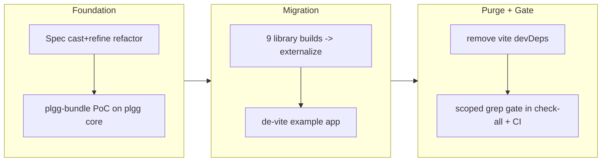

## 1. Overview

This branch eliminates **direct vite** from the plgg monorepo, replacing it with an in-house minimal bundler (`plgg-bundle`) across every library build and the `example` app, and closes with a scoped grep gate that proves direct vite is gone. It mirrors the just-completed vitest→plgg-test sovereignty arc: build the tool, prove it on real packages, migrate one at a time, then purge and gate. A small spec-example refactor (idiomatic `cast`+`refine`) rides along as the first ticket.

**Highlights:**

1. New zero-new-dependency `plgg-bundle` package — a pure-TypeScript minimal bundler (graph walk + registry emit + per-file `.d.ts` via `tsc`), reusing the already-present `typescript`; no native-binding tool.
2. All 10 library builds migrated off `vite build` to `plgg-bundle` using an **externalize** dist contract (each bundle ships its own source; deps imported at runtime, derived from `package.json`).
3. `example` de-vited entirely — app-mode source-inlining bundle, an in-house `node:http` dev server with `fs.watch` rebuild, and SSR moved off `tsx` to native Node type-stripping.
4. Direct vite purged repo-wide with a fail-able `scripts/gate-vite.sh` enforced in both `check-all` and CI; lockfiles regenerated free of the rolldown native binding (the fragility that started this).
5. The four `validateX` teaching specs rewritten as idiomatic caster-gated `cast`+`refine` pipelines with every assertion preserved verbatim.

## 2. Motivation

A recent CI break traced to vite's `rolldown` darwin-only native binding skewing the lockfiles and failing the Deploy Guide on the linux runner — the same class of vendor fragility the project already retired once by replacing vitest with the in-house plgg-test. vite was the next direct dependency to shed. The constraint that shaped the work: **net dependency reduction** — shedding vite must not add new dependencies (a first PoC that added `terser` + `@microsoft/api-extractor` was rejected for exactly this), and no native-binding bundler may be reintroduced. The guide's VitePress (transitive vite) is intentionally out of scope; this is the elimination of *direct* vite.

## 3. Changes

The work followed the proven build-tool → prove → migrate-per-package → purge sequence. The bundler was proven on plgg core first (byte-shape dist parity), then rolled out to every library under an externalize contract decided by three-agent review, then the example app was de-vited with its own app-bundle target and dev server, and finally direct vite was removed and locked out by a fail-able gate. Two genuine blockers surfaced and were root-caused mid-stream: a rejected dependency design (reversed to zero-new-deps) and a non-deterministic build (a torn-read of shared dist under concurrent rebuilds, fixed by atomic publish).

### 3-1. Refactor spec validateX examples to caster-gated cast+refine pipelines ([49bd283](https://github.com/qmu/plgg/commit/49bd283))

Rewrote the four Atomics teaching examples (`validateUserId`, `validatePrice`, `validateEmail`, `validateBinaryData`) from imperative `if (isErr) return` checks into single expression-style `pipe(asX(input), chainResult(v => cast(v, refine(...), ...)))` pipelines — caster gates the boundary, refines compose on the trusted brand. All 465 assertions preserved verbatim.

### 3-2. Add the in-house plgg-bundle foundation and prove it reproduces plgg core dist ([b3d9590](https://github.com/qmu/plgg/commit/b3d9590))

Stood up `packages/plgg-bundle` — a zero-new-dependency, plain-TypeScript (no plgg runtime dep, so it bootstraps from a clean checkout) minimal bundler — and proved on plgg core that it reproduces the vite dist contract (filenames, dual ESM+CJS, 356 named exports, per-file `.d.ts` tree) with `plgg-test` green against the in-house-built dist.

### 3-3. Migrate every library build from vite to the in-house plgg-bundle ([d77ce03](https://github.com/qmu/plgg/commit/d77ce03))

Cut over all 10 library packages from `vite build` to `plgg-bundle` using the **externalize** contract (externals derived from each `package.json`'s dependencies + `/^node:/`, never inlined), preserving the styleEntry/ssgEntry case-collision renames; root-caused and fixed a ~33% flaky build (shared-dist torn read → atomic `dist.stage` publish) before landing.

### 3-4. Replace example's vite dev server, SSR serve, and app bundle with in-house tooling ([3626c1d](https://github.com/qmu/plgg/commit/3626c1d))

De-vited the private `example` package: a new `plgg-bundle` app-mode target inlines siblings from source into a single self-contained `dist/main.js`, a minimal `node:http` dev server with `fs.watch` serves CSR with rebuild-on-change, and `serve:ssr` moved off `tsx` to `node` native type-stripping (dropping another native-binding tool).

### 3-5. Purge direct vite repo-wide, repoint CI/publish, add the scoped no-vite gate ([555ca55](https://github.com/qmu/plgg/commit/555ca55))

Removed `vite` + `vite-plugin-dts` from all library devDeps, regenerated lockfiles free of rolldown, repointed CI/publish to the bundler, removed the deploy-guide `rm -f package-lock.json` workaround (switching its loop to `npm ci`), and added `scripts/gate-vite.sh` — a fail-able, guide-scoped gate run by both `check-all` and the run-tests CI workflow.

### 3-6. Fix Deploy Guide CI: drop stale lockfile before npm install ([62abfac](https://github.com/qmu/plgg/commit/62abfac))

Carried-in hotfix (pre-trip) that patched the rolldown native-binding CI break by dropping the stale lockfile before install — the temporary workaround that ticket 3-5 was finally able to remove at its source.

## 4. Outcome

Direct vite is fully eliminated from the plgg monorepo. Every library and the example app now build through `plgg-bundle`, a pure-TypeScript in-house bundler that adds **zero new dependencies** (it reuses the already-pinned `typescript`) and carries no native binding — directly retiring the rolldown failure mode that broke CI. `scripts/gate-vite.sh` proves direct vite is gone and fails CI if it returns. The guide's transitive VitePress is intentionally retained (scoped out of the gate), making "direct vite eliminated" a precise, enforced claim. Full `scripts/check-all.sh` is green across all 12 suites; the library dist contract intentionally changed (manifest-faithful externalized bundles), which is safe under the project's breaking-changes-OK, single-consumer stance.

## 5. Historical Analysis

This is the second movement of an explicit dependency-sovereignty arc. [work-20260624-135934.md](work-20260624-135934.md) replaced the external vitest runner with the in-house plgg-test framework using the exact pattern reused here: build the in-house tool, validate it against the real thing, migrate per-package under green gates, then a final grep gate proving the old dependency is purged. The rolldown CI break documented in ticket 3-6 was the proximate trigger. The externalize-vs-inline decision echoes the standard library/application boundary (libraries externalize declared deps; only the leaf app bundles), which is why inlining was reserved for the example app in 3-4.

## 6. Concerns

### Published library bundles are unminified and non-tree-shakeable

- **Severity:** moderate
- **Description:** the externalize migration drops minification (no minifier dependency, by design) and the registry-style emit is opaque to downstream tree-shaking, so the npm-published `plgg` artifact is materially larger (~3-4×) for external consumers (see [d77ce03](https://github.com/qmu/plgg/commit/d77ce03) in `packages/plgg-bundle/src/domain/usecase/emitBundle.ts`). Intra-monorepo `file:` consumers are unaffected (they re-bundle).
- **How to Fix:** track as a publish-time concern — add an optional minify/tree-shake pass for the published `plgg` build only, or accept the size (consumers re-minify). Decide before the next CalVer publish.

### Export surface discovered by executing the built bundle

- **Severity:** moderate
- **Description:** `plgg-bundle` discovers a package's ESM export names by executing its freshly-built CJS bundle in `node:vm` (`packages/plgg-bundle/src/vendors/runner.ts`); under the externalize contract this reads sibling dists at build time, which is what produced the shared-dist torn-read flake (fixed by atomic publish, but the execute-to-discover coupling remains). See [d77ce03](https://github.com/qmu/plgg/commit/d77ce03).
- **How to Fix:** derive the export surface statically from the entry's emitted `.d.ts` / parsed module graph instead of executing the bundle, removing build-time runtime resolution entirely (DEPENDENCY-LOG gap #2).

### Deploy-guide workaround removal is only confirmable post-merge

- **Severity:** moderate
- **Description:** ticket 3-5 removed the deploy-guide `rm -f package-lock.json` workaround and switched the loop to `npm ci`, but `deploy-guide.yml` runs **post-merge only** (push to `main`), so its real-push green can't be confirmed before merge (see [555ca55](https://github.com/qmu/plgg/commit/555ca55) in `.github/workflows/deploy-guide.yml`). It was proven safe locally (clean `npm ci && npm run build` builds with zero rolldown/native-binding error).
- **How to Fix:** at ship time, watch the post-merge `Deploy Guide` run and confirm `https://qmu.github.io/plgg/` renders; if it fails, revert the workaround removal (the rollback is the prior commit).

### Warm-rebuild dist swap has a microsecond absence window

- **Severity:** low
- **Description:** the atomic-publish fix uses a two-rename dance on warm rebuilds, leaving a microsecond window where a package `dist` is briefly absent (loud ENOENT fail, never a torn/silent read); the cold/CI path is a single rename with zero window (see [d77ce03](https://github.com/qmu/plgg/commit/d77ce03) in `packages/plgg-bundle/src/domain/usecase/build.ts`).
- **How to Fix:** if warm-rebuild concurrency ever bites in practice, close it fully with a symlink-swap publish; not worth it now (cold/CI is the gated path).

### ~40 long-standing carry-over concerns remain active (unrelated to this branch)

- **Severity:** low
- **Description:** the carry-over judge assessed the full `.workaholic/concerns/` corpus (PRs 31/37/40/41/46 — HTTP/router/`match`/renderer/SSG/error-model/versioning/`tsc-plgg.sh`-scope items) and found all **still_active**: this build-tooling-only branch touches none of those domains. They are preserved verbatim in `.workaholic/concerns/` as the institutional ledger, not reproduced here to avoid burying this branch's own concerns.
- **How to Fix:** address in domain-specific future branches; the persistent ones (monorepo versioning policy, `tsc-plgg.sh` checking only `packages/plgg`, dist-rebuild automation, `infrastructure.md` count drift) are the most actionable.

## 7. Successful Development Patterns

- **Reuse the already-pinned compiler instead of adding a build dependency** — `plgg-bundle` transpiles via `typescript`'s own `ts.transpileModule`, which is a devDep of every package already, so the bundler adds zero new dependencies and never drifts from the type-checker's resolution. The strongest realization of "shed a dep without adding deps."
- **A bootstrap build tool must not depend on the library it builds** — writing `plgg-bundle` in plain TypeScript (no plgg runtime import) dissolved a clean-checkout chicken-and-egg by construction; the repo's plgg-test launcher set the precedent that process-entry tooling may sit outside the house FP idiom.
- **Derive externals from the manifest, not a hand-maintained list** — computing each package's externals from its `package.json` dependencies (+ `/^node:/`) makes the bundle faithful to the declared graph by construction and fails loud on an undeclared import, eliminating a whole class of drift.
- **Root-cause flaky builds with a controlled concurrency experiment** — proving the build was deterministic against a *stable* sibling dist (20/20, 30/30) but failed only with a *concurrent rebuilder* (6/25) isolated the true cause (torn read of shared dist) after a first misdiagnosis (npx), turning "it passed N times" into a mechanism-level fix (atomic publish).
- **A gate is only worth its fail-test** — `gate-vite.sh` was validated by injecting each violation type (devDep, config, import) and confirming it exits non-zero, then reverting; a gate that can't be shown to fail proves nothing.

## 8. Release Preparation

**Verdict**: Ready for release (with a post-merge confirmation step)

### 8-1. Concerns

- The deploy-guide workaround removal (`npm ci`, no lockfile drop) is confirmable only post-merge (deploy-guide.yml is post-merge only). Proven safe locally; must be watched on the first post-merge run.
- Published-bundle size regression (unminified/non-tree-shakeable) is a publish-time concern for the next CalVer `plgg` release, not a merge blocker.

### 8-2. Pre-release Instructions

- Ensure the PR's `run-tests` CI is green (it now runs `gate-vite.sh` and the `npm ci` + bundler build) — this is the pre-merge confirmation, since the deploy-guide itself only runs post-merge.

### 8-3. Post-release Instructions

- After merge to `main`, watch the `Deploy Guide` workflow run for the merge commit (`gh run list --workflow=deploy-guide.yml` → `gh run watch <id>`) and confirm `https://qmu.github.io/plgg/` renders. If it fails on a lockfile/native-binding error, revert ticket 3-5's workaround removal.
- Releases remain CI-owned CalVer; do not publish a GitHub Release manually.

## 9. Notes

This branch was produced by a queue-execute `/trip` (three-agent QA: Constructor implements + internal tests, Architect reviews, Planner E2E) driving the pre-existing 5-ticket queue, plus the carried-in rolldown hotfix. The trip's design rationale and per-ticket decision log live under `.workaholic/trips/queue-20260626-221353/` (`plan.md` records the moderated forks: the spec `cast`-contradiction → Option D, the bootstrap chicken-and-egg → plain-TS, inline-vs-externalize → externalize, and the dependency-design reversal to zero-new-deps). The vendor-neutrality decision log is finalized in `packages/plgg-bundle/DEPENDENCY-LOG.md`. The decision to retain the guide's transitive VitePress (scope this as *direct* vite elimination) was explicitly confirmed with the requester. Architect also noted, out of scope: the repo `engines` floor `>=22.6` is optimistic for stable native type-stripping (`>=22.18`).

## Deployment Evidence

- **When:** 2026-06-27T19:49:54+09:00
- **Target:** run-tests CI (pre-merge readiness, deploy-on-merge)
- **Method:** clean-runner CI: gate-vite + build + tsc + tests + coverage
- **Status:** pass
- **Observed:** run 28286964144 success on clean ubuntu runner; gate-vite passed, plgg+plgg-test built (typescript resolves after the bootstrap fix), tsc/tests/coverage all green
