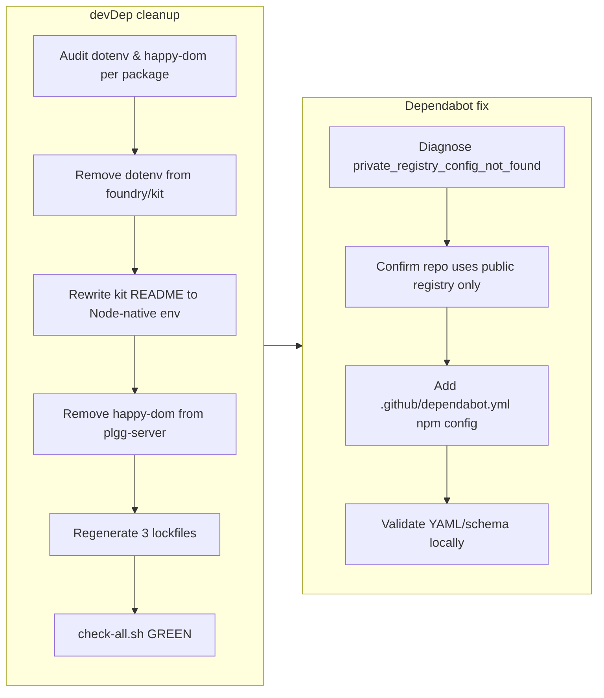

## 1. Overview

This branch reinforces the repo's vendor-neutrality / smaller-better posture by removing unused `dotenv` and `happy-dom` devDeps, then unblocks Dependabot security updates by adding `.github/dependabot.yml` to work around GitHub's failing `automatic-github-packages-auth` experiment. Both changes are Config-only — no runtime source was touched — and the full `scripts/check-all.sh` suite stayed green across all 13 packages.

**Highlights:**

1. Removed two unused devDeps — `dotenv` (plgg-foundry/plgg-kit) and `happy-dom` (plgg-server) — shedding dead weight against the repo's vendor-neutrality posture
2. Rewrote the plgg-kit README env example to Node-native `process.loadEnvFile()` / `--env-file`, dropping the last reason `dotenv` was mentioned
3. Diagnosed and fixed Dependabot's `private_registry_config_not_found` abort by adding an explicit npm-ecosystem `.github/dependabot.yml`
4. Scoped the dependency audit per-package rather than repo-wide, preserving `happy-dom` where it is genuinely used (plgg-view, plgg-test, example)
5. Validated the new `dependabot.yml` schema locally; the post-merge server-side run will unblock the stalled happy-dom security PR(s)

## 2. Motivation

The repo's core posture is vendor-neutrality and "smaller is better" — unused dependencies, even devDeps, are dead weight that widen the supply-chain surface for no benefit. At the same time, Dependabot's security-update job had been failing: GitHub's `automatic-github-packages-auth` experiment injected a phantom `npm.pkg.github.com` credential into a repo that never uses GitHub Packages, aborting before it could open the blocked happy-dom security PR. Fixing both in one branch tightens dependency hygiene and restores the automated security-update signal the repo relies on.

## 3. Changes

The branch proceeded in two streams. First, a focused devDep audit: `dotenv` was dead weight in foundry/kit (only referenced in a README snippet, since superseded by Node 24's native env-file support), and `happy-dom` was unused in plgg-server — but verified as genuinely used in plgg-view/plgg-test/example, so the removal was scoped to plgg-server only. Lockfiles were regenerated and `scripts/check-all.sh` confirmed green. Second, the Dependabot diagnosis: the failing job is GitHub-managed (not in `.github/workflows/`), so it was diagnosed via `gh run view --log-failed`; an explicit `package-ecosystem: npm` declaration over `directories: ["/packages/*"]` short-circuits the auth experiment without needing any `.npmrc`/registries block.

### 3-1. Remove unused dotenv and happy-dom leftover devDeps ([2d0297a](https://github.com/qmu/plgg/commit/2d0297a))

Removed the unused `dotenv` devDep from plgg-foundry and plgg-kit (rewriting the kit README env example to Node-native APIs) and the unused `happy-dom` devDep from plgg-server, then regenerated the three affected lockfiles. The removal was deliberately scoped per-package — `happy-dom` is retained in plgg-view, plgg-test, and example where it is used via the `@vitest-environment` pragma.

### 3-2. Add .github/dependabot.yml npm config to unblock Dependabot security updates ([ba279e1](https://github.com/qmu/plgg/commit/ba279e1))

Added `.github/dependabot.yml` declaring `package-ecosystem: npm` over `directories: ["/packages/*"]` on a weekly schedule. The explicit npm declaration routes Dependabot to the public registry and short-circuits the `automatic-github-packages-auth` experiment that was aborting security updates with `private_registry_config_not_found`, enabling security and version update PRs across all 13 workspaces.

## 4. Outcome

- Removed unused `dotenv` devDep from plgg-foundry and plgg-kit (only referenced in a kit README example); replaced the example with Node-native `process.loadEnvFile()` / `--env-file` (Node 24 native support)
- Removed unused `happy-dom` devDep from plgg-server (no imports, no test pragmas); retained in plgg-view, plgg-test, and example where legitimately used
- Regenerated `package-lock.json` files for plgg-foundry, plgg-kit, and plgg-server to flush the deps from the lock graph
- Created `.github/dependabot.yml` configuring the npm ecosystem with `directories: ["/packages/*"]` and a weekly schedule
- Unblocked the Dependabot security-update job by explicitly declaring `package-ecosystem: npm`, short-circuiting the failing `automatic-github-packages-auth` experiment
- Enabled future security and version update PRs across all 13 `packages/*` workspaces; full `scripts/check-all.sh` stayed green

## 5. Historical Analysis

Two threads of prior work inform this branch:

1. **ci-workflow-shell-injection** first introduced Dependabot as the repo's chosen dependency-inspection mechanism (for the `github-actions` ecosystem) and deferred action-SHA pinning to a follow-up — establishing both the tooling choice and the deferred github-actions scope this branch consciously leaves for later.
2. **The vite purge / vendor-neutrality line** established the repo's posture of shedding unused dependencies (smaller-better, fewer supply-chain surfaces) and confirmed the per-package `package.json` + lockfile layout that this branch's devDep removal and the new Dependabot `directories: ["/packages/*"]` glob both rely on.
3. **The happy-dom removal scope** was settled within this same branch: the removal ticket confirmed plgg-server's declaration was unused while view/test/example genuinely depend on it.

The recurring pattern: vendor decisions are made explicitly and documented at the boundary, and Dependabot is the sanctioned mechanism to keep verifying dependencies remain sound over time.

## 6. Concerns

### 45 long-standing carry-over concerns (carried from PRs #31, #37, #40, #41, #46, #47)

- **Severity:** moderate
- **Description:** This branch touched only Config (removed devDeps, added `.github/dependabot.yml`) and did not modify runtime code, the build pipeline, the type system, or the renderer, so none of the pre-existing carry-overs were resolved. They remain untouched, grouped by theme: (1) type-system gaps (match type-level exhaustiveness, `mapErr` parameter-type annotations); (2) HTTP body types (`Uint8Array` ↔ `BodyInit` assignability); (3) router compilation trade-offs (404/405 selection); (4) renderer/TEA runtime (effects hydration, runtime primitives, motion verification); (5) build pipeline (dist rebuild atomicity, `tsc-plgg.sh` scope); (6) plgg-server/plgg-fetch vendoring surface; (7) error boundaries (defect visibility, shared error primitive); (8) workaholic specs/infrastructure doc-count drift. See `.workaholic/concerns/` for the full set.
- **How to Fix:** Track them in the backlog without blocking this minimal Config-only change; prioritize by impact/effort when type-system and renderer work is next scheduled.

### happy-dom removal requires per-package verification

- **Severity:** moderate
- **Description:** The happy-dom removal was scoped to plgg-server only (zero imports, no test pragmas). A naive repo-wide grep gate for "zero happy-dom anywhere" would false-positive on the legitimate happy-dom users in plgg-view, plgg-test, and example (which use it via the `@vitest-environment happy-dom` pragma) (see [2d0297a](https://github.com/qmu/plgg/commit/2d0297a) in `packages/plgg-server/package.json`).
- **How to Fix:** Any future verification script (CI gate or developer lint) must scope dependency checks per package (e.g. grep `packages/plgg-server/` only for happy-dom absence), never repo-wide. Document this scoping rule in the CI policy.

### Dependabot config is verifiable only server-side

- **Severity:** moderate
- **Description:** `.github/dependabot.yml` can be validated locally for YAML/schema correctness, but the real proof that it clears the `private_registry_config_not_found` failure requires a post-merge Dependabot run on GitHub — local checks cannot exercise the GitHub-managed security-update flow (see [ba279e1](https://github.com/qmu/plgg/commit/ba279e1) in `.github/dependabot.yml`).
- **How to Fix:** Do not treat the Dependabot failure as resolved until a post-merge run shows green and the blocked happy-dom security PR(s) open; use `gh run view --log-failed` on the Dependabot runs to diagnose any recurrence.

### github-actions ecosystem deferred

- **Severity:** low
- **Description:** The ci-workflow-shell-injection ticket recommended adding `package-ecosystem: github-actions` for action-SHA pinning. This branch's `.github/dependabot.yml` covers npm only, intentionally deferring the github-actions ecosystem to avoid scope creep (see [ba279e1](https://github.com/qmu/plgg/commit/ba279e1) in `.github/dependabot.yml`).
- **How to Fix:** Open a follow-up ticket to add `package-ecosystem: github-actions` to `.github/dependabot.yml` with a schedule/versioning strategy (deferred from ci-workflow-shell-injection).

### Dependabot may open several duplicate PRs on first run

- **Severity:** low
- **Description:** Enabling version updates across 13 `packages/*` workspaces means the first weekly run may open several PRs bumping the same dependency (e.g. happy-dom) across multiple packages. This is expected behavior, not a failure (see [ba279e1](https://github.com/qmu/plgg/commit/ba279e1) in `.github/dependabot.yml`).
- **How to Fix:** No fix needed. If PR volume becomes unwieldy, add Dependabot grouping rules in a follow-up.

## 7. Successful Development Patterns

- **Scoped verification for dependency removals** — when removing a dep from a multi-package monorepo, confirm removal with a package-scoped grep over the targeted packages only, allowing legitimate uses elsewhere to remain. This prevented a false "remove happy-dom everywhere" conclusion (the dep is genuinely used in view/test/example). Seen in [2d0297a](https://github.com/qmu/plgg/commit/2d0297a).
- **Minimal explicit config over implicit discovery** — when a tool's failing default behavior can be overridden, prefer the thinnest explicit declaration that routes around it. An explicit `package-ecosystem: npm` was sufficient to take the public-registry path; no `.npmrc` or `registries:` block was needed, keeping the config thin and self-documenting. Seen in [ba279e1](https://github.com/qmu/plgg/commit/ba279e1).
- **Diagnose GitHub-managed services via their own logs, not CI workflows** — Dependabot's security-update job is GitHub-managed and absent from `.github/workflows/`. It was diagnosed via `gh run view --log-failed`, then fixed with repo-side config (`.github/dependabot.yml`). The same approach applies to any GitHub-managed service. Seen in [ba279e1](https://github.com/qmu/plgg/commit/ba279e1).

## 8. Release Preparation

**Verdict**: Ready for release

### 8-1. Concerns

- None — changes are safe for release. (The branch is Config-only; `scripts/check-all.sh` was green across all 13 packages.)

### 8-2. Pre-release Instructions

- None — standard release process applies.

### 8-3. Post-release Instructions

- Confirm the Dependabot run after merge no longer aborts with `private_registry_config_not_found` and opens npm update PRs against the `/packages/*` directories — `.github/dependabot.yml` is only fully verifiable server-side once GitHub re-runs Dependabot on the merged default branch.
- Confirm CI (`scripts/check-all.sh`) is green on the merged result. The branch's pre-merge GREEN was recorded against a base predating the plgg-db-migration package (merged to main via PR #48); the devDep removals don't touch that package, but the combined post-merge tree has not itself been verified.

## 9. Notes

This branch is a small Config/housekeeping pair (devDep cleanup + Dependabot enablement) with no runtime impact. The doc-drift signal that flagged `scripts/test-plgg-db-migration.sh` as "removed" is a false positive from a stale merge-base (those scripts were added to `main` by PR #48 after this branch's base; the three-dot PR merge will not delete them).

## Deployment Evidence

- **When:** 2026-06-29T11:25:59+09:00
- **Target:** guide (deploy-on-merge)
- **Method:** pre-merge readiness: scripts/check-all.sh on branch caught up with main
- **Status:** pass
- **Observed:** 13/13 packages green, 0 failed (gate-vite ok, all dists built, all suites pass incl plgg-db-migration 75 passed). Production docs + Dependabot confirmation are post-merge.

## Deployment Evidence

- **When:** 2026-06-29T11:29:59+09:00
- **Target:** guide (GitHub Pages, post-merge)
- **Method:** post-merge promotion check (guide.md Verify): Deploy Guide run + site HTTP probe
- **Status:** pass
- **Observed:** Deploy Guide run 28344822306 for merge commit f06fbba concluded success; https://qmu.github.io/plgg/ returns HTTP 200 and renders. run-tests on main (push) also succeeded.
