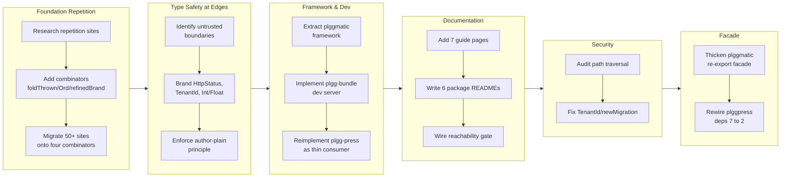

## 1. Overview

The developer reshaped plgg from a collection of loosely-coupled libraries with repeated type patterns into a unified foundation and framework stack. Over 55 commits, the branch added four foundation combinators (defineVariant, refinedBrand, Ord/compare, foldThrown) that single-sourced repeated type patterns, refined boundaries to enforce type safety at untrusted edges (HttpStatus, TenantId, Int/Float brands), delivered the plggmatic framework and the plgg-bundle hot-reload dev toolchain, completed documentation across all 18 packages, hardened plgg-db-migration against path traversal, and finally thickened plggmatic into a full re-export facade so a framework consumer depends on {plgg, plggmatic} alone — plggpress's dependency list collapsed from 7 packages to 2.

**Highlights:**

1. Added four foundation combinators (defineVariant, refinedBrand, Ord/compare, foldThrown) to eliminate ~50 sites of repetitive type scaffolding across variant models, refined brands, comparators, and error adapters
2. Delivered the plggmatic framework extracting generic config-load, route assembly, build orchestration, and CLI wiring from plgg-press — then thickened it into a full facade that wraps plgg-view, plgg-server/plgg-http, plgg-md, and plgg-highlight, collapsing plggpress's dependencies from 7 to {plgg, plggmatic}
3. Implemented the plgg-bundle dev server with real code hot-reload via module-runner, letting theme/content edits propagate across package boundaries without restart
4. Established type-safe brand boundaries at untrusted edges (HttpStatus status codes, TenantId path segments, numeric refinement to Int/Float) while keeping author-facing APIs plain per principle (a)
5. Hardened plgg-db-migration against path traversal in TenantId and newMigration, and completed documentation for all 18 packages with cross-linked READMEs and guide pages

## 2. Motivation

The plgg foundation showed pervasive hand-rolled repetition across the type definition layer: the four-fold Box-variant scaffold (inline type, box, pattern, isBoxWithTag), the five-part refined-brand idiom, manual -1/0/1 comparators, and duplicate unknown-to-Error adapters. Eliminating this repetition was foundational work, not a new feature — it paid dividends by making the code more maintainable and setting the stage for extracting a reusable framework. In parallel, the dev experience was stuck: plgg-press's hand-rolled server lacked true code hot-reload, forcing developers to restart containers for theme edits. The dev toolchain and framework work addressed both throughput (stopping the rebuild wait) and architecture (proving that plgg libraries are framework-generic, composable, and reusable). Documentation gaps left seven packages completely undiscovered in the guide, creating friction for new readers. The security review uncovered two path-traversal vulnerabilities in the per-tenant database isolation boundary and migration scaffold. Finally, even after the framework extraction, consumers still reached around plggmatic into five mid-library packages, creating a sprawling dependency fan-out — the closing facade work traded that fan-out for a single, clear architectural contract.

## 3. Changes

The developer consolidated plgg's foundation through four new combinators that single-sourced ~50 sites of repetitive type scaffolding (variants, refined brands, comparators, error adapters). Type-safe branding was applied strategically at untrusted boundaries (network status, tenant paths, numeric bounds) while keeping author APIs plain. In parallel, plggmatic extracted the framework-generic composition that plgg-press had hard-wired, enabling reuse by future consumers; plgg-bundle gained a production dev server with true cross-package hot-reload via module-runner. After comprehensive documentation (guide pages + READMEs for all 18 packages) and security hardening (path-traversal fixes in database isolation and migration scaffolds), the branch closed by thickening plggmatic into a full re-export facade and rewiring plggpress onto it, collapsing the consumer's dependency list from 7 packages to {plgg, plggmatic} with byte-identical guide output.

### 3-1. Tighten non-empty domain strings: SoftStr / bare string → Str ([86c02b7](https://github.com/qmu/plgg/commit/86c02b7))

Swept SoftStr and bare string toward the branded Str across domain fields, then resolved the sweep under principle (a): author-facing strings (config literals, URLs, request paths) stay plain because blanket branding produces no-op box() constructor friction; only untrusted boundaries warrant the brand.

### 3-2. Brand case-shaped string fields → KebabCase ([61663d3](https://github.com/qmu/plgg/commit/61663d3))

Evaluated branding case-shaped strings (slugs, route segments) as KebabCase and superseded the ticket under the same principle (a) — the fields in question are author-typed literals, not untrusted input, so the brand would add ceremony without safety.

### 3-3. Integral counts, ids & indices: wide number / Num → Int ([e831eff](https://github.com/qmu/plgg/commit/e831eff))

Refined integral ids, counters, and indices from wide `number`/`Num` to the branded `Int` across packages, so fractional values are rejected at the type boundary where integers are semantically required.

### 3-4. Bounded resource quantities: number → sized unsigned ints ([c9d3e30](https://github.com/qmu/plgg/commit/c9d3e30))

Rescoped under principle (a): refined HTTP status codes to a typed HttpStatus boundary at the response builders (the untrusted network edge), while deliberately keeping author-facing sized quantities (ports, byte caps, timeouts) as plain numbers.

### 3-5. Bounded unit-interval reals: CSS opacity number → Float ([17a756e](https://github.com/qmu/plgg/commit/17a756e))

Refined CSS opacity in plgg-view from `number` to the bounded `Float` brand, enforcing the unit interval at construction time.

### 3-6. Create plgg-cli: a toolkit for command-line program wrappers ([8e9156f](https://github.com/qmu/plgg/commit/8e9156f))

Added the plgg-cli package — a type-driven, Result-returning toolkit for building CLI wrappers with options/flags/commands parsing, strict argv validation, and auto-generated usage banners — and proved it by porting plgg-press's CLI onto it. An injected CliConsole seam keeps the process boundary fully testable.

### 3-7. Give defineSite a typed author-facing argument ([dbf8d72](https://github.com/qmu/plgg/commit/dbf8d72))

Split defineSite into a typed author-facing input (sound before it runs) and an asSiteConfig boundary caster, so a site.config is validated by the compiler as it is written rather than failing at build time.

### 3-8. Research: audit plgg-style repetition, propose foundation-semantics additions ([06b952f](https://github.com/qmu/plgg/commit/06b952f))

Audited the foundation layer for structural repetition, cited ~50 sites of hand-rolled scaffolding, and spun off four combinator tickets (defineVariant, refinedBrand, Ord/compare, foldThrown) as the remediation plan.

### 3-9. Add defineVariant combinator to collapse the four-fold Box-variant scaffold ([bf3b480](https://github.com/qmu/plgg/commit/bf3b480))

Added the defineVariant combinator, collapsing the repeated inline-type/box/pattern/isBoxWithTag scaffold into a single definition per variant, and migrated HttpError, SqlError, ClientError, CliError and peers onto it.

### 3-10. Add refinedBrand factory to collapse the refined-brand idiom ([f73d295](https://github.com/qmu/plgg/commit/f73d295))

Added the refinedBrand smart-constructor factory, reducing the five-part scalar-brand idiom to one declaration, and migrated Version and TenantId onto it.

### 3-11. Add an Ord/compare foundation primitive for total orders ([dbcf3b1](https://github.com/qmu/plgg/commit/dbcf3b1))

Added the Ord/compare total-order primitive and migrated the hand-rolled -1/0/1 comparators across the codebase onto it.

### 3-12. Add foldThrown to collapse the unknown → Error adapters ([a8cf932](https://github.com/qmu/plgg/commit/a8cf932))

Added foldThrown as the single unknown-to-Error lift and collapsed the duplicate toCause/toError/toSqlError adapters onto it, resolving a long-standing deferred concern about the missing shared boundary-error primitive.

### 3-13. Collapse hand-rolled async-Result ladders onto proc ([79dd708](https://github.com/qmu/plgg/commit/79dd708))

Converted the hand-rolled `.then`/`isOk` async-Result ladders in plgg-db-migration, plgg-server, and plgg-sql onto proc/chainResult, adopting option 2: error channels structurally accept `| Defect` and fold it once at the CLI edge.

### 3-14. plgg-press theming part 1: design tokens & typography ([18d8154](https://github.com/qmu/plgg/commit/18d8154))

Matched plgg-press's default appearance to qmu.co.jp — monochrome palette, weight-400 typography, callouts, links, inline code, and the 404 page — as the token/typography half of the reskin.

### 3-15. plgg-press theming part 2: sidebar-first layout & shell ([748ae3e](https://github.com/qmu/plgg/commit/748ae3e))

Reskinned plgg-press to the qmu.co.jp sidebar-first app shell: CSS-only drawer, left-aligned hero, and pill-shaped navigation, byte-verified against the visual oracle.

### 3-16. Create plggmatic: scaffold the framework, extract plgg-press's reusable seam ([2c6839b](https://github.com/qmu/plgg/commit/2c6839b))

Scaffolded the plggmatic full-stack framework and extracted plgg-press's generic composition — config loading, route assembly, static-build orchestration, and CLI wiring — into it, mirroring the established package-skeleton pattern.

### 3-17. Reimplement plgg-press as a thin plggmatic consumer ([21af849](https://github.com/qmu/plgg/commit/21af849))

Rewired plgg-press to consume plggmatic for all framework logic, leaving only theme and content concerns in the package; required plggmatic to expose types+default exports so plgg-bundle's export-surface reader can require() it.

### 3-18. Rename plgg-press → plggpress ([3eab0e8](https://github.com/qmu/plgg/commit/3eab0e8))

Renamed the package to plggpress, completing the framework-extraction chain with the one-word naming discipline used by earlier renames.

### 3-19. Session handoff: finish theming, then plggmatic (no dedicated commit)

A resumption ticket carrying the theming and plggmatic chain across sessions; its work landed through tickets 3-14 to 3-18.

### 3-20. Record the plggmatic-rewire blocker: dynamic import() rewrite ([789851c](https://github.com/qmu/plgg/commit/789851c))

Diagnosed that plgg-bundle rewrites every dynamic import(x) to __require(x), which threw on unresolved ids and blocked the plggmatic consumer chain; the fix landed as a native import() fallback in [951f034](https://github.com/qmu/plgg/commit/951f034).

### 3-21. Give the home page the sidebar so articles are reachable from / ([e6e5afa](https://github.com/qmu/plgg/commit/e6e5afa))

Fixed the guide's home page having no navigation by giving it the same sidebar as article pages, making all content reachable from the root.

### 3-22. Expand plgg-bundle into a toolchain dev server with hot-reload ([684fde9](https://github.com/qmu/plgg/commit/684fde9))

Added a dev server to plgg-bundle with true code hot-reload via module-runner, ?v= cache-busting across package boundaries, and SSE live-reload — with zero new dependencies.

### 3-23. Replace plgg-press's dev server with plgg-bundle's ([c506da5](https://github.com/qmu/plgg/commit/c506da5))

Stripped the hand-rolled dev servers from plgg-press and plggmatic, standardizing on the plgg-bundle toolchain dev server for the whole family.

### 3-24. Session handoff: drive the two dev-server tickets (no dedicated commit)

A resumption ticket sequencing the dev-server work; its work landed through tickets 3-22 and 3-23.

### 3-25. Fix latent type drifts unmasked by a fresh check-all rebuild ([740d7a8](https://github.com/qmu/plgg/commit/740d7a8))

Fixed two pre-existing type drifts (plggmatic build.ts copyAssets narrowed to SsgError, example app.ts opacity constructor) that stale committed dists had masked; a fresh check-all rebuild now catches this class of drift systematically.

### 3-26. Session map: __require chain drained, guide redeployed ([ebbab75](https://github.com/qmu/plgg/commit/ebbab75))

Archived the resume map after the guide was redeployed on the plgg-bundle dev toolchain, closing out the cross-session sequencing of the framework and dev-server chains.

### 3-27. Make the guide exhaustive: a page for every plgg-family package ([4578f13](https://github.com/qmu/plgg/commit/4578f13))

Added guide pages for the seven previously undocumented packages, bringing the guide to full coverage of all 18 packages with a grouped information architecture.

### 3-28. Every package has a README, linked top-to-bottom, enforced by a gate ([e178611](https://github.com/qmu/plgg/commit/e178611))

Wrote the six missing per-package READMEs, linked them top-to-bottom from the repository root, and added gate-readme.sh (presence + root-link + back-link + dead-link) to check-all and CI so coverage is enforced mechanically.

### 3-29. Harden the TenantId brand into a safe path segment ([8928d1d](https://github.com/qmu/plgg/commit/8928d1d))

Tightened the TenantId brand to `[A-Za-z0-9_-]{1,64}` so a tenant id can never traverse outside the per-tenant SQLite directory.

### 3-30. Sanitize the newMigration name against path traversal ([8928d1d](https://github.com/qmu/plgg/commit/8928d1d))

Sanitized newMigration's name argument to reject path separators and unsafe filenames, closing the second path-traversal vector in the same commit; both fixes are proven by tests at HEAD.

### 3-31. Thicken plggmatic into a re-export facade over the mid libraries ([784bf14](https://github.com/qmu/plgg/commit/784bf14))

Deliberately amended the "framework never renders" boundary from 3-16: plggmatic now re-exports the full surfaces of plgg-view, plgg-server (whose surface covers all of plgg-http), plgg-md, and plgg-highlight, with `plggmatic/ssg` and `plggmatic/style` subpath mirrors. Of ~56 cross-library name collisions only 9 are genuinely distinct symbols; the barrel resolves those to the page-authoring plgg-view variants explicitly, and the amendment is recorded in the README.

### 3-32. Rewire plggpress onto the thick plggmatic facade ([fa9ab95](https://github.com/qmu/plgg/commit/fa9ab95))

Switched all 22 plggpress files (sources and specs) to facade imports by pure specifier substitution — no symbol renames — and collapsed its dependencies from 7 plgg-family packages to {plgg, plggmatic}, dropping the never-imported plgg-http along the way. The built guide is byte-identical to the pre-rewire oracle, proving the whole facade chain end to end.

## 4. Outcome

- **plgg-cli toolkit:** New type-driven, Result-returning package for building command-line program wrappers with auto-generated usage banners, options/flags/commands parsing, and strict argv validation; proven by reimplementing plgg-press's CLI
- **Foundation combinators:** Added foldThrown (unknown→Error adapter collapse), Ord/compare (total-order primitive for -1/0/1 comparisons), refinedBrand factory (five-part scalar-brand idiom reduction), and defineVariant combinator (four-fold Box-variant tag-literal collapse) — single-sourcing repeated definitions across six packages
- **Type refinements:** Refined domains toward branded types: Int for integral ids/counters/indices, Float for bounded reals (CSS opacity), HttpStatus for network status codes; kept author-facing fields (config literals, URLs, port numbers) plain per principle (a)
- **plggmatic framework:** New full-stack web-application framework extracting plggpress's generic composition: config loading, router assembly, static-build orchestration, CLI wiring; ESM-only with types+default exports for require compatibility
- **plggpress redesign:** Reimplemented as thin plggmatic consumer; renamed from plgg-press; reskinned to qmu.co.jp theme (monochrome palette, weight-400 typography, sidebar-first app shell, CSS-only drawer, left-aligned hero, pill-shaped nav); all 18 package pages documented
- **plgg-bundle dev server:** Module-runner with true code hot-reload, ?v= cache-busting across package boundaries, SSE live-reload, no new dependencies; flattens browser restart cycle for cross-package theme edits
- **Dynamic import fallback:** __require now returns native import() for unresolved bundle ids (enabling bundled modules to load runtime config files); unblocks plggmatic dist consumption
- **Security fixes:** TenantId brand tightened to [A-Za-z0-9_-]{1,64} (safe path segments only); newMigration sanitized to reject unsafe filenames
- **Documentation:** Added per-package READMEs (6 new) linked top-to-bottom with gate-readme.sh mechanical enforcement; added 7 guide pages documenting plgg-cli, plgg-db-migration, plgg-md, plgg-highlight, plggmatic, plggpress, plgg-bundle
- **Async error handling:** Collapsed async-Result ladders onto proc (option 2: accept | Defect, fold once at CLI edge); converted ~6 chains in plgg-db-migration, plgg-server, plgg-sql
- **Type-safety enforcement:** Fixed latent type drifts unmasked by fresh check-all rebuild (copyAssets SsgError→SsgError|Defect, opacity Float constructor); scripts/check-all.sh now catches dep type mismatches between stale committed dists
- **Facade thickening:** plggmatic re-exports the full mid-library surfaces (view, server/http, md, highlight) plus `plggmatic/ssg` / `plggmatic/style` subpath mirrors, with the 9 genuinely ambiguous cross-library names resolved to their plgg-view variants; a TS-compiler-API probe verified all 62 consumer-inventory symbols resolve from the facade
- **Consumer dependency collapse:** plggpress depends on {plgg, plggmatic} only (was 7 packages); the rewrite was pure import-specifier substitution and the built guide stayed byte-identical, proving the guide → plggpress → plggmatic → mid-libs resolution chain

## 5. Historical Analysis

- **Ticket-first workflow proven effective:** Six prior research/gap-analysis tickets (plgg-cli, foundation-semantics audit, string/number refinement sweep) spawned dependent tickets that built independently; each domain layer addition (match type-completeness, proc error-union, errors-as-data) set precedent for foundation changes being acceptable and breaking-change-friendly when plgg is its own only consumer
- **Package extraction pattern:** Previous renamings (plgg-http-router→plgg-server, plgg-http-client→plgg-fetch) established the one-word rename discipline; this session extended it to plgg-press→plggpress and scaffolded the framework extraction (plggmatic) following the same skeleton mirroring (package.json, tsconfig, bundle.config, per-package scripts)
- **Combinator-scoped foundation work:** Foundation additions (match, proc, Result.mapErr, cast/refine) evolved through targeted, symbol-scoped efforts; the audit/gap-analysis pattern (enumerate repeating sites with citations → propose a core addition → emit dependent tickets) proved scalable across defineVariant/refinedBrand/Ord/foldThrown
- **Reachability gates enforce documentation:** Prior work on README presence (gate-readme.sh) and package-link completeness mirrored the living guide's model — mechanical checks (dead-link checker in plggpress build, PACKAGE_GROUPS IA) keep discoverability enforced at commit time, not as a manual step
- **Type safety under fresh rebuilds:** Prior latent-drift incidents (masked by stale committed dists) established check-all.sh as the canonical gate that rebuilds all dists fresh; this session's two type-drift fixes (plggmatic build.ts copyAssets, example opacity) proved the pattern — stale-dist masking is systematic, catching it requires full rebuild
- **Seam-based testability:** plgg-fetch/plgg-http established the pattern of quarantining imperative boundaries (HTTP, process.argv, fs) in a pure-returning seam; plgg-cli extended it with an injected CliConsole record enabling 100% test coverage without touching real process.argv/exitCode
- **Principle (a) design decision:** Author-facing input never brands; only untrusted boundaries warrant it (parsed request, network response, config decode). The SoftStr→Str seed (013300) confirmed that blanket domain-wide branding produces no-op box() constructors and .content ripple; reverting it established this as a design principle for all future branded-type work

## 6. Concerns

### (carried from PR #31) Binary request support adds a parallel bytes field

- **Severity:** moderate
- **Description:** HttpRequest.ts parallel bytes field was not touched on this branch, blocking request payloads over buffer limits
- **How to Fix:** Implement binary request support in HttpRequest with dual methods for string and bytes payloads

### (carried from PR #31) mapErr requires explicit parameter type annotations

- **Severity:** moderate
- **Description:** Result.ts mapErr inference limitation persists; type inference for error-mapping functions remains weak
- **How to Fix:** Document the limitation in mapErr JSDoc and consider an overloaded signature for common error-transform patterns

### (carried from PR #31) match type-level gaps remain open

- **Severity:** moderate
- **Description:** No changes to match or docs/match-type-completeness.md on this branch; known type-system limitations unresolved
- **How to Fix:** Follow the match completeness gap-analysis to address discriminator inference and exhaustiveness across branded unions

### (carried from PR #31) plgg dist rebuild required after core changes

- **Severity:** moderate
- **Description:** No npm-workspace or pretest-rebuild automation was added; dist-symlink consumption remains a manual rebuild step
- **How to Fix:** Introduce pre-test dist-rebuild automation to catch dependent-package type drift earlier

### (carried from PR #31) route table compilation trades 404/405 confusion

- **Severity:** low
- **Description:** dispatch.ts route compilation strategy doesn't distinguish 404 (not found) from 405 (not allowed)
- **How to Fix:** Enhance route-table metadata to track allowed methods per path, enabling precise 404 vs 405 responses

### (carried from PR #31) Uint8Array not directly assignable to BodyInit

- **Severity:** low
- **Description:** toNativeResponse.ts was not modified on this branch; the ArrayBuffer boundary seam remains untouched
- **How to Fix:** Accept Uint8Array in toNativeResponse and convert to a supported BodyInit format

### (carried from PR #37) TEA minimum has no effects/hydration seam

- **Severity:** moderate
- **Description:** No Cmd/Sub effects seam, vdom diffing, or hydration was added on this branch; plgg-view TEA model incomplete
- **How to Fix:** Implement effects algebra (Cmd, Sub) and hydration boundary for server-side rendering integration

### (carried from PR #37) workaholic specs infrastructure.md counts drift

- **Severity:** low
- **Description:** .workaholic/specs/infrastructure.md was not modified on this branch; count drift remains between ticket structure and documentation
- **How to Fix:** Audit and update infrastructure.md counts to match the actual package/script inventory

### (carried from PR #40) Carried-over concerns from PRs 31, 37

- **Severity:** moderate
- **Description:** Meta carry-over; the underlying HTTP/router/match/effects cluster remains unremediated
- **How to Fix:** Sequence the meta-carried concerns within the development roadmap; prioritize foundational items blocking multiple consumers

### (carried from PR #40) plgg-server/plgg-fetch vendor collectCss

- **Severity:** moderate
- **Description:** collectCss vendoring was not changed and no cross-package rebuild automation was added
- **How to Fix:** Extract collectCss as a shared utility or factor out the vendoring duplication with cross-package aware build automation

### (carried from PR #40) Renderer motion changes unverified in a headless browser

- **Severity:** moderate
- **Description:** No headless-browser/visual regression pass was added for the FLIP-delete motion
- **How to Fix:** Add Playwright visual regression tests for motion animations with screenshot baselines

### (carried from PR #40) Renderer runtime primitives remain unimplemented

- **Severity:** moderate
- **Description:** Auto-dismiss timers, focus/scroll, keyboard/drag, and height auto-grow remain unimplemented in plgg-view
- **How to Fix:** Implement the missing WAAPI/DOM primitives for layout mutations and event-driven animations

### (carried from PR #40) tsc-plgg.sh only type-checks packages/plgg

- **Severity:** moderate
- **Description:** scripts/tsc-plgg.sh still only runs tsc in packages/plgg; the typecheck gate was not broadened
- **How to Fix:** Expand tsc-plgg.sh to verify dependent packages' types or lean on check-all.sh as the repo-wide gate

### (carried from PR #41) Defect is invisible in precise downstream channels

- **Severity:** moderate
- **Description:** Commit [79dd708](https://github.com/qmu/plgg/commit/79dd708) adopted option 2 for the db-migration channel only; HttpError handlers and the general precise-channel reconciliation remain
- **How to Fix:** Unify the proc error-channel approach across db-migration, plgg-server writeStatic, and plgg-sql transaction so Defect is consistently handled at domain edges

### (carried from PR #41) SSG v1 is intentionally minimal

- **Severity:** low
- **Description:** No staticPaths auto-discovery, param expander, or lenient mode was added to the Ssg module
- **How to Fix:** Design and implement optional Ssg extensions for per-route static path enumeration and lenient fallback rendering

### (carried from PR #41) Version bump covers only plgg and plgg-http

- **Severity:** moderate
- **Description:** No monorepo versioning policy (workspaces/changesets/bump-all) was introduced on this branch
- **How to Fix:** Define a monorepo versioning strategy and automated version-bump orchestration for coordinated releases

### (carried from PR #46) Carried-over concerns from PRs 31, 37, 40, 41

- **Severity:** moderate
- **Description:** Meta carry-over; the persistent HTTP/router/match/effects cluster and versioning items remain unaddressed (the shared boundary-error primitive item was resolved on this branch by [a8cf932](https://github.com/qmu/plgg/commit/a8cf932) and [bf3b480](https://github.com/qmu/plgg/commit/bf3b480))
- **How to Fix:** Establish a roadmap prioritizing the persistent carry-over clusters; implement roadmap sequencing across dependent ticket chains

### (carried from PR #47) Deploy guide workaround removal is only post-merge verifiable

- **Severity:** moderate
- **Description:** Post-merge verification obligation for PR 47's deploy-guide change; no evidence on this branch confirms the post-merge Deploy Guide run
- **How to Fix:** Confirm the Deploy Guide workflow runs and succeeds after the next merge; record the verification

### (carried from PR #47) Export surface discovered by executing the built bundle

- **Severity:** moderate
- **Description:** plgg-bundle still discovers exports by executing the built bundle; [951f034](https://github.com/qmu/plgg/commit/951f034) only added a native-import fallback
- **How to Fix:** Implement a static export-surface analyzer that reads source-level export statements without executing bundle code

### (carried from PR #47) Published library bundles are unminified and unshaken

- **Severity:** low
- **Description:** emitBundle.ts was not changed; no minify/tree-shake pass was added
- **How to Fix:** Add optional minification and tree-shaking to emitBundle.ts for production dist; keep dev builds unminified for debugging

### (carried from PR #47) Warm rebuild dist swap has a microsecond absence window

- **Severity:** low
- **Description:** build.ts warm-rebuild two-rename dance was not changed; the microsecond absence window remains
- **How to Fix:** Implement an atomic dist publish (single rename) to eliminate the brief visibility window

### (carried from PR #48) An unrelated permissions change rode on that PR

- **Severity:** low
- **Description:** Historical note about PR 48 carrying an unrelated permissions commit; nothing on this branch changes that record
- **How to Fix:** Review and keep unrelated commits off feature branches at PR time to keep commit history focused

### (carried from PR #48) Several review carries were documented as partially-addressed

- **Severity:** moderate
- **Description:** Commit [8928d1d](https://github.com/qmu/plgg/commit/8928d1d) fixed only the newMigration path-separator sub-item; the down --to silent-degrade and listApplied LedgerCorrupt cause:None sub-items remain
- **How to Fix:** Complete the remaining plgg-db-migration sub-items: implement --to graceful degradation and fix listApplied's LedgerCorrupt cause attribution

### (carried from PR #48) Shipped .d.ts consumer resolution not verified under NodeNext

- **Severity:** moderate
- **Description:** plgg-db-migration's emitted .d.ts has still not been type-resolved under a NodeNext consumer tsconfig
- **How to Fix:** Test plgg-db-migration .d.ts under `moduleResolution: "NodeNext"` in a consumer tsconfig and fix any resolution gaps

### (carried from PR #48) T7 and T8 were verified by review-gate snapshot, not re-review

- **Severity:** low
- **Description:** No independent re-review of migrateTenant.ts or authoritative cross-process race verification occurred on this branch
- **How to Fix:** Schedule a dedicated review of migrateTenant.ts and Tenant-table race conditions

### (carried from PR #49) Long-standing carry-over concerns from PR 45

- **Severity:** moderate
- **Description:** Meta carry-over; most enumerated items remain unaddressed (the shared error-primitive item is resolved separately)
- **How to Fix:** Consolidate the PR 45–49 carry-over list and prioritize a focused sprint addressing clustered concerns

### (carried from PR #49) Dependabot config is verifiable only server-side post-merge

- **Severity:** low
- **Description:** .github/dependabot.yml was not touched; the post-merge Dependabot verification obligation remains open
- **How to Fix:** Verify Dependabot runs after merge or document post-merge verification steps

### (carried from PR #49) Dependabot may open several duplicate PRs on first run

- **Severity:** low
- **Description:** No Dependabot grouping rules were added; the first-run duplicate-PR expectation stands
- **How to Fix:** Configure Dependabot grouping rules to consolidate update PRs

### (carried from PR #49) GitHub Actions ecosystem deferred from dependabot.yml

- **Severity:** low
- **Description:** package-ecosystem: github-actions was not added to dependabot.yml on this branch
- **How to Fix:** Add the GitHub Actions ecosystem to dependabot.yml for automated workflow dependency updates

### (carried from PR #49) happy-dom removal requires per-package dependency-scoping CI gate

- **Severity:** low
- **Description:** No per-package dependency-scoping CI gate was added; the guidance remains a standing note
- **How to Fix:** Implement a dependency-audit CI step to prevent unintended dependencies per package

### Principle (a) design change: author-facing strings stay plain

- **Severity:** moderate
- **Description:** The blanket SoftStr→Str sweep (ticket 013300) and case-shaped KebabCase branding (013301) were reversed under principle (a) — author-facing strings (config literals, endpoint URLs, request paths) produce no-op box() friction; only untrusted boundaries warrant brands (see [86c02b7](https://github.com/qmu/plgg/commit/86c02b7) and [61663d3](https://github.com/qmu/plgg/commit/61663d3))
- **How to Fix:** Document principle (a) durably (CLAUDE.md or a policies note): "Brand only untrusted boundaries (parsed input, network responses, config decode); author-typed fields stay plain to avoid no-op constructor friction."

### HttpStatus refinement is half-complete

- **Severity:** moderate
- **Description:** Response builders were changed to accept the HttpStatus brand, but sized-unsigned refinement for U16/U32 resource quantities (ports, byte caps, durations) was deferred and rescoped under principle (a) (see [c9d3e30](https://github.com/qmu/plgg/commit/c9d3e30))
- **How to Fix:** Document that U16/U32 author config (port, maxBodyBytes, timeouts) intentionally stays numeric per principle (a); only untrusted network status crosses the HttpStatus boundary

### Proc error channel adopted only in plgg-db-migration

- **Severity:** moderate
- **Description:** Ticket 211838 adopted option 2 (accept | Defect, fold at CLI edge) primarily in plgg-db-migration; remaining hand-rolled error handling elsewhere leaves the error channel inconsistent across the codebase (see [79dd708](https://github.com/qmu/plgg/commit/79dd708))
- **How to Fix:** Extend the proc-based error channel uniformly: convert remaining ladders to proc, folding Defect consistently at domain edges

### Stale committed dists mask type drift until a fresh rebuild

- **Severity:** moderate
- **Description:** Two latent type drifts (plggmatic build.ts copyAssets, plgg-press build.ts) hid behind stale committed dists until check-all.sh's fresh rebuild exposed them (fixed in [740d7a8](https://github.com/qmu/plgg/commit/740d7a8) and [bb41c15](https://github.com/qmu/plgg/commit/bb41c15))
- **How to Fix:** Keep check-all.sh's fresh-rebuild pass as a mandatory pre-merge gate in CI; run it after any dependency type change

### plggpress visual sign-off still pending

- **Severity:** low
- **Description:** The qmu.co.jp theme redesign produces byte-identical CSS and HTML to the visual oracle, but a human visual confirmation (light+dark, desktop+mobile, keyboard walkthrough) is reserved and pending (see [748ae3e](https://github.com/qmu/plgg/commit/748ae3e))
- **How to Fix:** Human visual review of plgg-guide.qmu.dev once the container runs the new dev-server toolchain; confirm sidebar, hero, callouts, links, 404, and responsive layout match qmu.co.jp

### plggpress exports map is import-only (not require()-compatible)

- **Severity:** low
- **Description:** plggpress keeps an import-only exports map; nothing requires it today, but a future require(plggpress) would fail the same way plggmatic did before adding types+default exports (see [21af849](https://github.com/qmu/plgg/commit/21af849))
- **How to Fix:** Widen plggpress's exports map to include types+default alongside the import condition, matching plggmatic's pattern

### Hot-reload does not refresh config file changes (site.config.ts)

- **Severity:** low
- **Description:** plgg-bundle dev hot-reload covers theme .ts edits and content rewrites, but site.config.ts changes still need a manual dev-server restart (see [684fde9](https://github.com/qmu/plgg/commit/684fde9))
- **How to Fix:** Document that config changes require a manual dev server restart; no automation planned

### Facade plain names shadow plgg-server and plgg-md variants

- **Severity:** low
- **Description:** plggmatic's root barrel resolves the 9 cross-library ambiguous names (head, header, on, link, strong, table, text$, ListItem, TableRow) to their plgg-view variants; plgg-server's HEAD-route `head`, context `header`, route-matcher `on` and plgg-md's AST constructors are only reachable from their own packages, and a facade-only consumer cannot import them (see [784bf14](https://github.com/qmu/plgg/commit/784bf14) in `packages/plggmatic/src/index.ts`)
- **How to Fix:** If a facade consumer ever needs the shadowed variants, add namespaced subpath mirrors (e.g. plggmatic/routing, plggmatic/md) rather than renamed aliases; re-run the TS-compiler-API symbol-identity probe whenever a mid-library barrel changes, since star-export ambiguity drops names silently

## 7. Successful Development Patterns

- **Injected seams for testability:** plgg-cli's CliConsole record (nodeConsole default, injectable fake in tests) enables 100% coverage of the process-boundary fold without touching real process.argv/exitCode; mirrors plgg-fetch's Http seam pattern
- **Foundation combinators collapsing ceremony:** defineVariant, refinedBrand, foldThrown, and Ord/compare all single-source repeated boilerplate; const type parameters hold tag/brand literals without `as`; no escape hatches required; proven across six consumer packages
- **Type-driven development without escape hatches:** when a shape cannot be expressed without as/any/@ts-ignore, the honest outcome is a reduced helper (defineVariant excludes generics; Comparable.ts is type-only) or a rejected finding — never an escape hatch
- **Ticket-first workflow enabling parallel development:** the foundation audit spawned four independent combinator tickets and the branded-type sweep spawned six per-axis tickets that landed per-package; architecture decisions move upfront into tickets, unblocking implementation
- **Reachability enforcement via mechanical gates:** gate-readme.sh (presence + root-link + back-link + dead-link) runs in check-all and CI; the plggpress build fails on broken internal links; discoverability is a commit-time guarantee, not a manual step
- **Fresh rebuild catching latent type drift:** scripts/check-all.sh rebuilds every dist from source before type-checking, which unmasked two pre-existing type-drift bugs hidden by stale committed dists
- **Principle (a) — brand only untrusted boundaries:** author-facing strings stay plain; only untrusted boundaries (parsed input, network responses, config decode) warrant brands; empirically proven by the reverted SoftStr sweep
- **Cross-package framework extraction via skeleton mirroring:** plggmatic mirrored the plgg-fetch skeleton (package.json, tsconfig, bundle.config, per-package scripts, README, example.ts); ESM-only with types+default exports for require() compatibility
- **Verified behavior over coverage metrics:** plgg-bundle dev was verified end-to-end via a child-process PoC editing modules mid-run; the plggpress reimplementation and guide build were byte-verified against oracles — observable behavior is the oracle, not coverage numbers
- **Error-handling simplification under option 2 (Defect at edge):** proc-based channels gain `| Defect` structurally and fold it once at the CLI/handler boundary, keeping domain code clean of per-usecase mapErr
- **Principle-driven design reversals:** the SoftStr sweep and case-shape branding were reverted/superseded under principle (a) — design maturation converging on rules that guide future work consistently
- **Symbol-identity probing before facade barrels:** name-level collision lists overstate ambiguity — of ~56 colliding names across the five wrapped libraries only 9 were genuinely distinct TS symbols (the rest are same-symbol re-exports); a TS-compiler-API probe (`getAliasedSymbol`) separates the two, and only the truly ambiguous need explicit disambiguation
- **Facade fidelity keeps consumer migration mechanical:** because the facade preserves every name and mirrors subpaths (`plggmatic/ssg`, `plggmatic/style`), the plggpress rewire was pure import-specifier substitution — no per-symbol judgment calls — and the byte-identical guide build was the end-to-end proof

## 8. Release Preparation

**Verdict**: Ready for release

### 8-1. Concerns

- None - changes are safe for release. Type check (tsc-plgg.sh) is clean; the full check-all.sh suite (fresh rebuild, all package tests including the 80 plgg-db-migration tests covering the new path-traversal rejections, vite/happy-dom/readme gates) ran green after each of the final facade commits; the guide build is byte-identical to the pre-facade oracle; no TODO/FIXME, escape hatches, or secrets in new code; both mid-library README dependency stories were updated with the dep changes, and the one doc-drift candidate (scripts added without a CLAUDE.md edit) was judged not real — CLAUDE.md intentionally names only the two canonical entrypoints.

### 8-2. Pre-release Instructions

- None - standard release process applies

### 8-3. Post-release Instructions

- None - no special post-release actions needed

## 9. Notes

- The commit hashes recorded in the archived tickets' frontmatter reference pre-rebase worktree history and no longer exist on this branch; the links in section 3 were re-mapped to the equivalent on-branch commits by subject.
- Two archived tickets (3-19, 3-24) are session-handoff resumption tickets with no dedicated commit; their work landed through the tickets they sequenced.
- No `.workaholic/trips/` directory exists for this branch; the tickets originated from `/ticket` research and audit tickets rather than a trip design phase.

## Deployment Evidence

- **When:** 2026-07-03T00:02:52+09:00
- **Target:** plgg guide (GitHub Pages)
- **Method:** api-probe (deploy-on-merge: pre-merge readiness)
- **Status:** pass
- **Observed:** Pre-merge readiness proof: scripts/check-all.sh green at HEAD 8928d1d during /report (fresh rebuild of all dists, full test suite incl. 80 plgg-db-migration tests covering the new path-traversal rejections, vite/happy-dom/readme gates). Post-merge promotion (Deploy Guide workflow + site probe) recorded in .workaholic/deployments/guide.md after merge.
