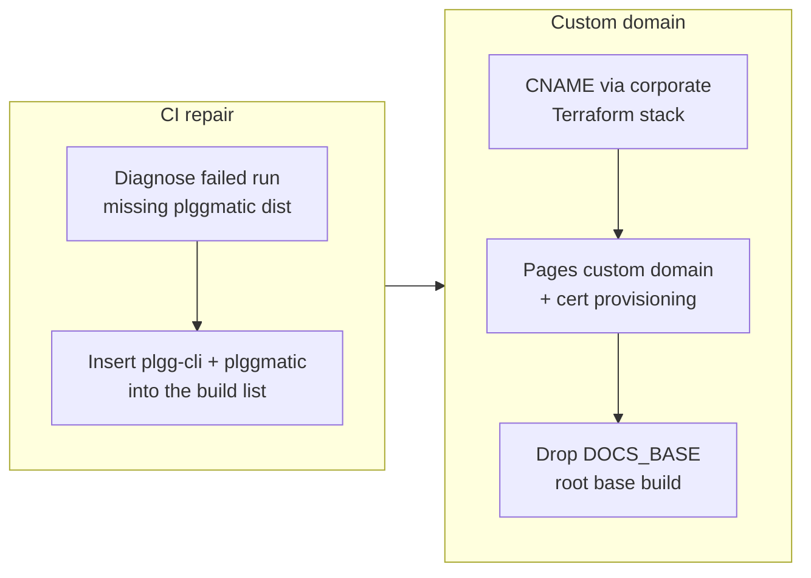

## 1. Overview

A two-ticket hotfix-and-enhancement branch riding directly on PR #51's merge: it repairs the Deploy Guide CI failure that PR #51's post-merge deploy exposed (the workflow's hard-coded dist build list never built plggmatic, which plggpress now needs), and moves the guide onto its first-party custom domain plgg.qmu.co.jp (DNS Terraform-managed in the corporate repository, GitHub Pages custom domain, root base path).

**Highlights:**

1. Deploy Guide workflow builds plgg-cli and plggmatic before plggpress, fixing the post-merge deploy failure of PR #51 (run 28607344216)
2. The guide's canonical URL becomes https://plgg.qmu.co.jp/ — DNS via the corporate repo's new Terraform stack, Pages custom domain set, DOCS_BASE removed (site serves at the domain root; qmu.github.io/plgg redirects)

## 2. Motivation

PR #51's facade rewire made plggmatic a build-order prerequisite of plggpress. Locally, check-all.sh builds every package, so all gates stayed green — but deploy-guide.yml keeps its own hard-coded copy of the dependency topology, and on the clean CI runner plggpress's bundle step failed to find plggmatic/dist, leaving the docs site stale (deploy-pages only swaps on success). While repairing that, the developer also wanted the guide off the vendor-coupled qmu.github.io/plgg URL and onto plgg.qmu.co.jp, with the DNS record managed as IaC in the corporate repository's existing Terraform conventions rather than by dashboard edits.

## 3. Changes

The developer first root-caused the failed Deploy Guide run to the workflow's hard-coded build list predating the facade rewire, and fixed the list with a mechanical dependency-order proof. The custom-domain work then landed across two repositories: the corporate repo gained a Terraform stack managing the whole qmu.co.jp zone (all 15 records imported drift-free) including the new plgg CNAME, and this repo switched the Pages configuration and build base so the site serves at the domain root.

### 3-1. Build plggmatic before plggpress in the Deploy Guide workflow ([b8c2986](https://github.com/qmu/plgg/commit/b8c2986))

Inserted plgg-cli and plggmatic into deploy-guide.yml's dist build loop before plggpress, verified mechanically that every listed package's plgg-family dependencies build earlier in the list, and recorded the failed run's root cause in the deployment contract. Third instance of the clean-runner masking class: local gates build everything, CI's hard-coded list doesn't.

### 3-2. Serve the guide at plgg.qmu.co.jp ([f5d8889](https://github.com/qmu/plgg/commit/f5d8889))

Moved the guide to its custom domain: DNS landed via the corporate repo's new infra/terraform/cloudflare-dns/ stack (zone imported drift-zero, CNAME plgg → qmu.github.io, DNS-only), the Pages custom domain was set via gh api (certificate provisioning; HTTPS enforcement follows issuance), and deploy-guide.yml no longer sets DOCS_BASE — the site builds at the root base, verified locally (33 pages, zero old-base links).

## 4. Outcome

- **Deploy Guide CI repaired:** the workflow's build list now satisfies every dependency edge among its packages; the fix's own merge re-triggers the deploy and re-lands PR #51's docs content
- **First-party docs URL:** https://plgg.qmu.co.jp/ is canonical; the vendor URL redirects; the base path moved from /plgg/ to /
- **Zone under IaC:** qmu.co.jp DNS is Terraform-managed in the corporate repository (15 records, drift-zero plan), so this and future records are code, not dashboard state

## 5. Historical Analysis

- **Clean-runner masking precedent:** the plgg-bundle and plgg-highlight node_modules install steps in this same workflow were earlier instances of "green locally, broken on the clean runner"; this branch adds the third (build-order) and strengthens the case for deriving CI order from package.json topology
- **Deploy-on-merge contract:** the deployment contract formalized during PR #51's ship (Procedure/Confirmation structure) is what made this failure visible and its remediation recordable in one place
- **Vendor-neutrality policy applied:** the custom domain bounds the exit cost from GitHub Pages exactly as the design-pillar policy prescribes; the DNS record itself follows the IaC practice (corporate repo's workloads-equivalent `infra/` convention)

## 6. Concerns

### 74 standing deferred concerns carried (PRs #31–#51)

- **Severity:** moderate
- **Description:** The active corpus in `.workaholic/concerns/` (53 pre-#51 items plus 21 extracted from PR #51's story) was re-judged for this branch: nothing here touched their areas, so all 74 remain active as passive institutional memory. The corpus files are the source of truth; they are not re-enumerated in this story.
- **How to Fix:** Judge again on the next substantial branch; consider a consolidation sprint for the oldest clusters (versioning policy, tsc-plgg.sh scope, renderer runtime, match type-gaps)

### Deploy Guide's hard-coded build list is a second copy of the dependency topology

- **Severity:** moderate
- **Description:** The workflow list must be hand-maintained in dependency order; any future package.json dep change can break CI while every local gate stays green, and only the post-merge clean runner reveals it (see [b8c2986](https://github.com/qmu/plgg/commit/b8c2986) in `.github/workflows/deploy-guide.yml`)
- **How to Fix:** Derive the build order from package.json topology in one canonical runner (per the command-scripts policy) used by both check-all.sh and the workflow

### HTTPS enforcement and proxied-mode follow-ups for plgg.qmu.co.jp

- **Severity:** moderate
- **Description:** `PUT /pages` with a cname silently reset `https_enforced` to false; it must be re-enabled once GitHub issues the certificate (post-ship step). The Cloudflare record stays DNS-only until then; flipping to proxied later is optional (see [f5d8889](https://github.com/qmu/plgg/commit/f5d8889) in `.workaholic/deployments/guide.md`)
- **How to Fix:** After the cert issues: `gh api -X PUT repos/qmu/plgg/pages -F https_enforced=true`; record it in the deployment contract; only then consider the orange-cloud flip

### Degraded window between cname flip and root-base deploy

- **Severity:** low
- **Description:** Setting the Pages custom domain immediately redirects qmu.github.io/plgg to the new domain while the served artifact still bakes the /plgg/ base, so internal links 404 until this branch's deploy lands — an unavoidable, short window (see [f5d8889](https://github.com/qmu/plgg/commit/f5d8889))
- **How to Fix:** Nothing retroactive; for future domain changes, flip the cname and merge the base change back-to-back (as done here)

## 7. Successful Development Patterns

- **Mechanical gate for a hand-maintained list:** a one-shot script validating the workflow's build order against every package.json turned "looks right" into a checkable pre-merge criterion
- **Cross-repo ticket handoff:** the DNS half lived in the corporate repo as its own ticket (in Japanese, per that repo's rules) with an explicit dependency edge back to this repo's ticket; each repo's gate stayed self-contained and the handoff was a single verifiable fact (`dig` answer)
- **Incident → ticket → fix without bypassing process:** even under a broken-deploy incident, the ticket-first flow held (branch, ticket with policies and gate, implementation, approval), keeping the audit trail coherent

## 8. Release Preparation

**Verdict**: Ready for release

### 8-1. Concerns

- None - the branch changes one workflow file and deployment/ticket metadata; no package code changed (tsc/test surfaces untouched); the local root-base guide build is green with zero old-base links; the remaining verification (Deploy Guide run green, site 200+TLS, 301 redirect, https_enforced) is the ship's own post-merge confirmation

### 8-2. Pre-release Instructions

- None - standard ship process applies (deploy-on-merge; the workflow-file change itself triggers the deploy)

### 8-3. Post-release Instructions

- After the Deploy Guide run succeeds and the certificate issues: re-enable HTTPS enforcement (`gh api -X PUT repos/qmu/plgg/pages -F https_enforced=true`) and record the confirmation in `.workaholic/deployments/guide.md`

## 9. Notes

- The DNS half of the custom-domain work lives in the corporate repository (branch work-20260703-022248, ticket 20260703022248): a new `infra/terraform/cloudflare-dns/` stack managing the whole qmu.co.jp zone. This story only covers the plgg side.
- The ticket-2 archive commit also swept in auto-generated `.workaholic/*/index.md` files produced by plugin tooling; they are metadata, not hand-written content.
