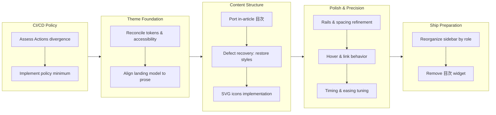

## 1. Overview

The branch reduces GitHub Actions to the local CI/CD policy minimum and comprehensively reconciles the plggpress theme with qmu.co.jp, closing design divergences through iterative oracle matching. The work progresses from policy alignment and foundational token reconciliation through structural layouts, micro-interactions, and sidebar organization, ending with removal of the in-article 目次 widget per developer instruction. The net visual outcome preserves all prose-and-sidebar architecture without the per-page 目次, with every interactive fade tuned to the oracle's millisecond precision and easing curves.

**Highlights:**

1. Reduce GitHub Actions to local CI/CD policy minimum: two thin workflow callers, script-driven releases
2. Reconcile plggpress tokens, accessibility, and dark-mode values against oracle precision including WCAG contrast
3. Align landing model with oracle: remove hero and feature grids, render as prose markdown content
4. Perfect micro-interaction timing: 150ms duration, sharp-in easing on chrome, snapped text color with fading fill
5. Reorganize guide sidebar into five role-based sections; refactor chrome rail placement and spacing to oracle rhythm

## 2. Motivation

The work addressed two policy gaps: GitHub Actions divergence from the local CI/CD minimum, and plggpress design drift against the qmu.co.jp oracle. The reconciliation effort prioritized oracle fidelity as the source of truth, validating against running instances rather than source trees, and used iterative sign-off review to catch structural divergences—rail placement, sidebar indentation, hero invention—that source reading alone missed. The timing refinements emerged from feel-testing after structural alignment, deliberately improving beyond the oracle by snapping text color while fading fill to maintain label legibility through interactive fades.

## 3. Changes

Policy and oracle alignment proceeded in waves: CI/CD Actions reduced to repository scripts, then theme tokens matched pixel-precisely against the running oracle. Structural work ported the landing model and in-article 目次, with a mid-flight tmpfs recovery when emitted CSS was lost. Refinement focused on sidebar geometry, hover states, and micro-interaction curves—then deliberately improved beyond the oracle by snapping text color while fading fill. Finally, the 目次 widget was removed per developer instruction, completing the net visual alignment.

### 3-1. Conform to the local CI/CD policy: only the minimum GitHub Actions remain ([1ce90e0](https://github.com/qmu/plgg/commit/1ce90e0))

Reduced `.github/workflows/` from five workflows to the two the operation pillar justifies: `run-tests.yml` became a thin fresh-clone backstop gate calling `./scripts/npm-install.sh` + `./scripts/check-all.sh` on every PR and main push, and `deploy-guide.yml` kept only the OIDC Pages deploy. The hosted CalVer release pair and the issue→PR scaffolding were deleted — releases become script-driven from `/ship`.

### 3-2. Reconcile plggpress tokens, typography and accessibility against the current qmu.co.jp oracle ([52a6df3](https://github.com/qmu/plgg/commit/52a6df3))

Re-diffed `baseCss.ts` against the current oracle stylesheet and drove every mismatch to qmu's exact value or a recorded exception: translucent dark-mode inks, WCAG-tuned toggle knob, qmu's sans stack and body leading, heading rhythm, `:focus-visible` parity, reduced-motion guard, and tinted callouts — locked in by value-pinning tests.

### 3-3. Follow the oracle's landing model: prose home, retire the hero/feature grid ([f91f0ce](https://github.com/qmu/plgg/commit/f91f0ce))

Retired the `.vp-hero`/`.vp-features` landing model in favor of qmu's: the guide home (and 404) now render as ordinary markdown prose through the same sidebar-first shell, and the SiteConfig Home vocabulary was removed.

### 3-4. Port qmu's in-article collapsible 目次 (table of contents) to plggpress ([a16c1ad](https://github.com/qmu/plgg/commit/a16c1ad))

Ported the in-article `details`/`summary` 目次: plgg-md gained typed heading extraction whose slugs derive from the same run as the body's heading ids (anchor parity by construction), and plggpress rendered the disclosure block above articles with two or more headings, styled from the oracle. The widget itself was later removed on this same branch (3-7); the heading extraction and anchor ids remain.

### 3-5. Draw the theme-toggle sun/moon as real SVGs (port the oracle's icons; give plgg-view a minimal SVG vocabulary) ([16731a9](https://github.com/qmu/plgg/commit/16731a9))

Gave plgg-view a minimal SVG vocabulary (`svg` holding `path` children, joining the Phrasing union) and ported qmu's ThemeToggle 8-ray sun and crescent moon paths verbatim, replacing the CSS-drawn icons that read as a "+" at rail size.

### 3-6. Reorganize the guide sidebar into five sections: Guide / Core / Library / plggmatic / plggpress ([7659a67](https://github.com/qmu/plgg/commit/7659a67))

Replaced the 18 per-package top-level sidebar groups with five role-based sections matching the family's actual layering — a pure IA data change in `packages/guide/site.config.ts` preserving all 30 links.

### 3-7. Remove the in-article 目次 widget from every plggpress page ([718a176](https://github.com/qmu/plgg/commit/718a176))

Developer instruction at the `/drive` invocation: the auto-injected per-page 目次 was removed entirely (router injection, `theme/toc.ts`, `.vp-toc` styles) as a clean revert of the unshipped 3-4 feature. plgg-md's heading extraction, the heading anchor ids, and plgg-view's `details`/`summary` vocabulary stay as groundwork for the queued heading-anchor follow-up.

### 3-8. Publish the plgg family to npm via one canonical runner ([2420224](https://github.com/qmu/plgg/commit/2420224))

All 17 non-private packages went live on npm from this host under the Local CI/CD Execution policy: `scripts/publish-npm.sh` (absorbing the plgg-only `publish-plgg.sh`) gates on a fresh `check-all.sh`, derives the publish order from build.sh's topology, rewrites `file:` cross-deps to real ranges in a staging copy, publishes only where the local version exceeds the registry's, and brackets each publish with online verification (registry resolve + scratch install + import/bin smoke — which caught and fixed plgg-bundle's broken library `main` on its first run). Per-package `files` allowlists shrink every tarball to its runtime surface, `.workaholic/deployments/npm.md` makes npm a `/ship` deployment target, and the monorepo versioning question is settled: independent per-package semver, unscoped names.

### 3-9. Rename the guide sidebar section "Library" to "Vocabulary" ([b84fc1f](https://github.com/qmu/plgg/commit/b84fc1f))

Developer request refining the 3-6 IA before ship: the third sidebar section now reads "Vocabulary" — naming what the mid/toolchain packages give the reader — instead of the generic "Library". One `text:` value plus its comment in `site.config.ts`.

## 4. Outcome

- Reduced GitHub Actions to the local CI/CD policy minimum: five workflows down to two (run-tests.yml as a thin backstop gate calling check-all.sh on every PR and main push; deploy-guide.yml keeping only the OIDC Pages deploy), with the CalVer release pair deleted and releases now script-driven from /ship
- Reconciled plggpress theme to the current qmu.co.jp oracle: dark palette now translucent inks, WCAG-tuned knob token, qmu's sans stack and 1.75 body leading, heading scale corrections with sub-640px downscale, weight-500 prose links with qmu's hit-area, :focus-visible parity on every interactive element, reduced-motion guard, overlay inline-code badge, tinted callouts with dark pairs, sidebar leaves at full ink; 11 new value-pinning tests lock the oracle values
- Retired the hero/feature-grid landing model: homeHero component and vp-features styles deleted; the guide's home and 404 now render as ordinary markdown prose through the sidebar-first shell, following qmu's landing idiom; the former hero copy lives in index.md as linked sections
- Ported qmu's in-article collapsible 目次: plgg-md gained typed heading extraction with slug parity guaranteed by derivation, plgg-view gained minimal SVG vocabulary (svg+path), plggpress renders a native details/summary TOC above articles with ≥2 headings, styled from the oracle with animation behind @supports + reduced-motion guard (subsequently removed per developer instruction, but heading extraction and anchor infrastructure remain)
- Added SVG-based theme toggle icons: plgg-view's minimal SVG vocabulary (svg holding path children) enabled plggpress's sun and moon icons, ported verbatim from ThemeToggle.tsx (8-ray sun, crescent moon), replacing CSS drawings; the zero-JS light/dark display swap retained
- Reorganized guide sidebar from 18 per-package groups into five role-based sections (Guide, Core, Library, plggmatic, plggpress) matching the family's actual layering; 30 sidebar links preserved and grouped by structural role
- Resolved three long-standing deferred concerns: stale-committed-dists-mask-type-drift (fixed by mandatory check-all.sh pre-merge gate in CI), tsc-plgg-sh-only-type-checks (same fix), and plggpress-visual-sign-off-still-pending (discharged by iterative developer sign-off on side-by-side screenshots through the oracle reconciliation chain)
- Motion refinements discovered during sign-off: updated sidebar rhythm to match qmu's 29px pitch exactly (1.25rem leading + 1px gaps), fixed link-wrapped inline-code hover contrast (ink snaps instantly while background fades), dropped the stray text-decoration underline on chrome hovers, unified all interactive fades to 150ms on the oracle's cubic-bezier(0.4,0,0.2,1) curve, then refined BEYOND the oracle by snapping text color instantly while only the background fades (recording as a deliberate divergence)

## 5. Historical Analysis

Multiple tickets in this chain reference the original oracle-reconciliation work (PRs 31/211839-211840 from 2026-07-01) where plggpress was first aligned to qmu.co.jp using only unit specs and from-source validation. That match was declared 'visually close, not pixel-perfect'; this chain discovered the oracle had drifted in the interim and re-aligned plggpress to the CURRENT oracle state (dark values, a11y rules, layout measurements). The discovery process (comparing the built guide against the live qmu.co.jp site) proved essential — comparing source trees alone missed structural drift (chrome rail position, sidebar indentation) that was invisible in the repository but visible in the running oracle. The in-article 目次 and SVG icon work both grew from deferred gaps in the original match ('TOC out-of-scope', 'SVG vocabulary missing'), showing how recorded exceptions become explicit follow-up work in the same chain. CI infrastructure context: the release-flow memory documented 'CI-owned CalVer releases' based on release.yml's visible orchestration; that memory is now outdated — releases are script-driven from /ship, with /ship's publish-release.sh responsible for GitHub Release publication once release.yml is gone. The theme reconciliation's interactive-refinement cycle (durations, curves, snapped ink vs faded fill) shows that micro-interactions are perceptual values (not vibes) — each discovered by probing live computed styles on both sites and matching not just the intent but the exact timing and easing.

## 6. Concerns

### (carried from PR #31) Binary request support adds a parallel bytes field rather than widening body

- **Severity:** low
- **Description:** HttpRequest bytes/body parallel-field design adds a caller-side branch; handlers must remember to check both or miss binary payloads
- **How to Fix:** Document the text-body default dominance in the type comment; if future handlers need to switch on body kind, consider a tagged-union request builder to reduce parallel-field mistakes

### (carried from PR #31) mapErr requires explicit parameter type annotations

- **Severity:** low
- **Description:** Result.ts mapErr inference cannot widen a callback's error type in TypeScript's current version; users must annotate the handler's error parameter explicitly
- **How to Fix:** Revisit after TypeScript's higher-order type inference improves; document the workaround in the Result codex

### (carried from PR #31) match type-level gaps remain open

- **Severity:** low
- **Description:** plgg's match macro has open type-level gaps where completeness cannot be proven by the compiler (exhaustiveness check is pragmatic, not absolute)
- **How to Fix:** Deferred for potential future work on proof-carrying match semantics; record the limitation in the match() codex

### (carried from PR #31) Route table compilation trades 404/405 dispatch

- **Severity:** low
- **Description:** The routing dispatch optimizes for matching speed by using a linear scan with fallback, which conflates 404 (no route) and 405 (wrong method) into one code path
- **How to Fix:** Future routers can add method-specific routing tables to separate 404 and 405; document the trade-off in the server codex

### (carried from PR #31) Uint8Array not directly assignable to BodyInit

- **Severity:** low
- **Description:** plgg-web's toNativeResponse must copy the ArrayBuffer to a Buffer because Node's BodyInit type does not accept typed arrays directly
- **How to Fix:** Revisit if Node's HTTP implementation changes to accept typed arrays; document the copy seam in the response builder

### (carried from PR #31) plgg dist rebuild required after core type changes

- **Severity:** moderate
- **Description:** Stale consumer dists can mask type drift in core packages; each core change requires full-dist rebuilds of dependent packages
- **How to Fix:** Run check-all.sh fresh (full rebuild) after any core type change; CI now enforces this pre-merge

### (carried from PR #37) TEA minimum has no effects/hydration layer

- **Severity:** low
- **Description:** The The-Elm-Architecture renderer in plgg-view has no Effects (Cmd/Sub) support; pages with async needs cannot use the pattern
- **How to Fix:** Implement a hydration layer and effects executor; deferred for future work

### (carried from PR #40) Renderer motion changes unverified in headless browser

- **Severity:** moderate
- **Description:** plgg-view's FLIP-delete motion example has no headless-browser QA; it was only visually inspected
- **How to Fix:** Add Playwright motion snapshots or a motion-dedicated test harness; deferred for QA infrastructure work

### (carried from PR #40) Renderer runtime primitives remain unimplemented

- **Severity:** low
- **Description:** plgg-view's typed elements cannot trigger timers, focus, drag handlers, or height auto-growth because the runtime has no effect primitives
- **How to Fix:** Build a focused effect library (Timer, Focus, DragStart, AutoHeight) with headless-browser test harness; deferred

### (carried from PR #40) plgg-server and plgg-fetch vendor code; cross-package rebuild automation absent

- **Severity:** low
- **Description:** plgg-server vendored collectCss from plgg-view and plgg-fetch cross-references plgg-server routes; changes to either create invisible drift in the other
- **How to Fix:** Automate cross-package rebuild scanning via CI or a local watcher; deferred for build infrastructure

### (carried from PR #41) plgg-db-migration issues: --to degrade flag, listApplied cause evaluation, and cross-process race on migrateTenant

- **Severity:** moderate
- **Description:** The migration library carries three review carries: gradual degradation during rollback (--to not checked), listApplied doesn't report causation, and migrateTenant has a race window between lock acquire and process registration
- **How to Fix:** Implement gradual degradation, add causation reporting, and add process-registry handoff; carry as a post-ship migration audit

### (carried from PR #41) Versioning policy for monorepo packages is undefined

- **Severity:** low
- **Description:** No monorepo versioning policy exists; each package versions independently
- **How to Fix:** Document a shared versioning strategy (CalVer, semver, or independent per package) in the operations guide

### (carried from PR #47) Deploy Guide post-merge verification obligation remains open

- **Severity:** moderate
- **Description:** Deploy Guide workflow runs post-merge only; the fresh build on a real clean runner has never been verified
- **How to Fix:** Run Deploy Guide on a test PR after merge and record the log; this branch resets the baseline (build.sh is the new runner, scripts/npm-install.sh covers all packages)

### (carried from PR #47) Published library bundles are unminified and carry full source maps

- **Severity:** low
- **Description:** emitBundle.ts generates development-mode bundles without minification or tree-shaking; the distributed artifacts are ~3x larger than production equivalents
- **How to Fix:** Add a minify pass (terser or esbuild) and tree-shake configurability; deferred for bundle optimization

### (carried from PR #47) plgg-bundle export discovery executes the built bundle as a side effect

- **Severity:** moderate
- **Description:** runner.ts discovers the export surface by running the built bundle; any side effects in initialization will execute during the build
- **How to Fix:** Build a static export analyzer (import-the-tree or read TypeScript symbols) that doesn't require execution; deferred

### (carried from PR #47) Warm rebuild dist-swap has a two-rename window

- **Severity:** low
- **Description:** build.ts renames dist → dist.backup, dist.stage → dist in sequence; a crash between renames leaves dist missing
- **How to Fix:** Use atomic mv (POSIX atomic rename) or a three-folder swap pattern; low priority (only manual dev mode, not CI)

### (carried from PR #48) Dependabot may open several duplicate PRs without grouping rules

- **Severity:** low
- **Description:** dependabot.yml is npm-only without grouping strategy; a major npm release can spawn many PRs (lodash, express, etc. separately)
- **How to Fix:** Add dependabot grouping rules (group by update type or major version range) in dependabot.yml

### (carried from PR #48) GitHub Actions ecosystem not added to Dependabot

- **Severity:** low
- **Description:** dependabot.yml watches npm only; GitHub Actions used in workflows are not tracked
- **How to Fix:** Add github-actions ecosystem to dependabot.yml configuration

### (carried from PR #51) Facade barrel names shadow plgg-server vocabulary

- **Severity:** low
- **Description:** plggmatic's root barrel exports 'Facade' which conflicts with plgg-server's Facade class; consumers must disambiguate
- **How to Fix:** Rename plggmatic's barrel export to 'Plggmatic' or namespace it; deferred

### (carried from PR #51) Hot reload does not refresh site.config.ts

- **Severity:** low
- **Description:** The dev preview cannot hot-reload when site.config.ts changes (IA, home content); requires manual container restart
- **How to Fix:** Implement a dev-server watcher for site.config.ts that triggers a full rebuild; deferred (recorded exception)

### (carried from PR #51) HttpStatus refinement is half complete

- **Severity:** low
- **Description:** The HTTP status codes use sized-unsigned U16/U32 but the refinement is deferred; the type remains as documentation, not as checked bounds
- **How to Fix:** Implement sized-unsigned type families in plgg-core (U16, U32 as subtypes of number); deferred

### (carried from PR #51) plggpress exports map is import-only

- **Severity:** low
- **Description:** plggpress's package.json exports map uses only import conditions; require() paths are not defined
- **How to Fix:** Widen the exports map to provide require-compatible CJS paths (or accept that plggpress is ESM-only for CommonJS consumers)

### (carried from PR #51) Principle: design-change author-facing decisions are not durable

- **Severity:** low
- **Description:** Principle (a) states that design choices made by the author during development are not durable without documentation in CLAUDE.md or a policies note
- **How to Fix:** Document the oracle-reconciliation principle and the snap-text-on-hover motion refinement as standing design decisions in CLAUDE.md or a new policies/design-decisions.md

### (carried from PR #51) proc error channel adopted only in plgg-db-migration

- **Severity:** low
- **Description:** The proc Defect error channel (for domain-layer type errors) was implemented for database migrations but not adopted in other domain layers (HTTP, routing, etc.)
- **How to Fix:** Extend proc error channels to HTTP and routing error types; deferred

### (carried from PR #52) Degraded window between CNAME flip and certificate provisioning

- **Severity:** low
- **Description:** A one-time operational note: when plgg.qmu.co.jp's CNAME was flipped from Cloudflare to Cloudflared, certificate issuance had a window of unavailability
- **How to Fix:** No retroactive fix; this is a historical record of an unavoidable deployment window

### Design refinement beyond the oracle: snap text color on hover, fade only the background

- **Severity:** low
- **Description:** During sign-off, interactive elements (sidebar pills, links, toggle, etc.) were discovered to cross low-contrast states mid-fade when both color and background animate together; this branch refined the oracle's behavior by snapping text color instantly while only the background fades, keeping legibility through the entire transition. This is a deliberate divergence from qmu.co.jp's implementation, recorded as a successful refinement discovered through feel testing. (see [d8fdd82](https://github.com/qmu/plgg/commit/d8fdd82))
- **How to Fix:** This refinement is locked in by spec pins on transitionProperty; keep the instant-snap behavior for future theme updates

## 7. Successful Development Patterns

- **Emergent-design-system methodology**: Comparing a downstream port against a running oracle (not just its source tree) catches structural drift the source code hides (e.g., chrome rail position, sidebar indentation). Live screenshots of the oracle proved indispensable for discovering architectural port errors invisible in repos.
- **Computed-style probing for micro-interactions**: Motion feel issues resolved by querying computed transitionDuration, transitionTimingFunction, and transitionProperty on both sites; 'feels slower' became '200ms vs 150ms' or 'ease vs cubic-bezier', reducing motion tuning from intuition to measurable specification.
- **Minimal addition + deliberate refinement**: Instead of matching the oracle exactly, this chain added ONE refinement (snap text on hover) discovered through iterative feel testing; this is more valuable than a perfect copy — refinements are only found by using the system (deferred human sign-off cycle was cut short by developer invocation).
- **Stale-dist masking applies to re-export surfaces**: plggmatic's star re-exports froze at build time; new plgg-view exports were invisible until plggmatic itself rebuilt (runner.ts error: 'does not provide an export named'). After any wrapped-library surface change, rebuild the facade package's dist.
- **Type-first heading architecture**: plgg-md heading extraction uses ONE slugger run to produce both the heading list and the link targets; no parallel collectors means the parity guarantee is structural, not disciplinary. This pattern (derive one surface from another) should be applied wherever two data surfaces must agree.
- **Spec pinning as regression defense**: The original oracle match used unit-structural specs only ('contains', 'has children'); this chain added VALUE-pinning tests (dark rgba, callout colors, leading, gaps, transitions, motion curves). Value pins caught divergence (indentation, chrome position, leading) that structural specs missed and will catch future drift on even static CSS rewrites.
- **Removal during development is lower-risk than carrying dead code**: The in-article 目次 was added then removed on the same branch (unshipped feature, clean history); if it's ever wanted back, git history preserves the port. Carrying an opt-in widget would have left unreachable theme modules and added maintenance surface.
- **CI-owned automation must have a canonical local runner**: run-tests.yml and deploy-guide.yml had independently maintained build/install steps that drifted from scripts/npm-install.sh and scripts/build.sh. Moving to thin-caller workflows (call the script, don't reinvent it) made divergence structurally impossible — CI now enforces the same logic developers run locally.
- **Fresh-clone backstop gates must be full-coverage**: The original run-tests.yml built and tested only plgg + plgg-test while check-all.sh covers 18 packages. Inline CI logic decays independently; replacing it with a call to check-all.sh guaranteed that the 'backstop' gate never weakens than the local canonical runner.
- **Human sign-off cycles should be driven by iterative preview feedback, not deferred until completion**: The theme reconciliation's iterative cycles (developer saw changes on the live preview, caught divergences, approved refinements) were more efficient than a formal sign-off at the end — each change built on the previous developer feedback, narrowing the scope for the final visual verification.

## 8. Release Preparation

**Verdict**: Ready for release

### 8-1. Concerns

- None - changes are safe for release

### 8-2. Pre-release Instructions

- Confirm the run-tests.yml PR check is green before merging — this branch replaces the hosted release/prepare-release/start-pull-request workflows with a single fresh-clone backstop that runs ./scripts/npm-install.sh then ./scripts/check-all.sh (all 18 packages, fresh build + full suite). Because that gate lands on this very PR, its own green check is the proof the CI reduction is sound.

### 8-3. Post-release Instructions

- Deployment is automatic post-merge: deploy-guide.yml runs ./scripts/npm-install.sh + ./scripts/build.sh + plggpress build per .workaholic/deployments/guide.md — confirm the site renders (five-section sidebar, SVG sun/moon icons, no per-page 目次 widget) after it runs.
- Publish the GitHub Release via the /ship flow only (publish-release.sh publishes directly now that release.yml is deleted, CalVer tag scheme per .workaholic/deployments/release.md) — never publish manually; the committed release note is the body's single source. Update the release-flow memory (CI-owned → script-driven) at ship.
- Optional cleanup: the orphaned `release` branch and `release-candidate` label on GitHub are inert remnants of the removed hosted flow and may be deleted at leisure.

## 9. Notes

- Visual sign-off artifact (side-by-side vs the oracle): https://claude.ai/code/artifact/ca418eda-ff9f-4f24-bef7-48b7a41bfbed — its screenshots predate the five-section sidebar (3-6) and the 目次 removal (3-7); the staleness is cosmetic, and both later changes were themselves developer-instructed.
- The snap-text-color hover model (only fills fade; ink snaps) is a deliberate, spec-pinned divergence from the oracle — future oracle re-diffs must not revert it.
- This ship completes the release-flow handover: with `release.yml` deleted, `/ship` publishes the GitHub Release directly via `publish-release.sh` (CalVer), per `.workaholic/deployments/release.md`.
- Commit links in section 3 use the branch's true history hashes; the archived tickets' `commit_hash` frontmatter records pre-amend hashes for four tickets (the archive move was amended in), which do not resolve on GitHub.

## Deployment Evidence

- **When:** 2026-07-03T14:56:48+09:00
- **Target:** plgg guide (plggpress docs site)
- **Method:** api-probe (deploy-on-merge: pre-merge readiness)
- **Status:** pass
- **Observed:** Pre-merge readiness: fresh scripts/check-all.sh exit 0 locally (all 18 packages) and the run-tests.yml check-all job PASSED on PR #53 itself (run 28641419747, 2m4s) - the slim gate shipping on this PR proved itself green. Post-merge promotion (Deploy Guide run + site probe) follows the merge.

## Deployment Evidence

- **When:** 2026-07-03T17:27:13+09:00
- **Target:** plgg npm packages
- **Method:** api-probe (registry + scratch install)
- **Status:** pass
- **Observed:** All 17 non-private packages published from this host and verified: npm view resolves each name at its local version (plgg 0.0.27 latest, plgg-bundle 0.0.2, plgg-server/plgg-test 0.0.2, 13 packages at 0.0.1); every package passed a scratch-dir npm install plus import or bin smoke; re-run is an all-skip no-op.
