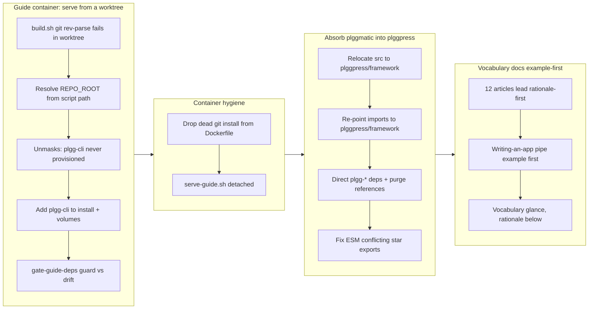

## 1. Overview

This branch began as a debugging session — `./scripts/serve-guide.sh` failed from a git worktree — and grew into a focused cleanup of the guide dev container, a structural refactor absorbing `plggmatic` into `plggpress`, and an example-first rewrite of the guide's Vocabulary articles. Six tickets, each driven and verified end-to-end (types, tests, coverage, and a live guide serving HTTP 200).

**Highlights:**

1. `scripts/build.sh` resolves the repo root from the script path instead of `git rev-parse`, so the guide container builds from a worktree (where `.git` is a gitdir pointer outside the mount).
2. Provisioned `plgg-cli` in the guide container and added `gate-guide-deps.sh`, a guard that stops the three provisioning lists (entrypoint installs / compose volumes / `build.sh`) from silently drifting.
3. Dropped the now-dead `git` install from the guide Dockerfile and switched `serve-guide.sh` to detached.
4. Absorbed `plggmatic` (now its own repository) into `plggpress/src/framework/`, making plggpress self-contained on the plgg family with direct deps.
5. Reorganized all 12 app-facing Vocabulary articles to lead with a runnable `pipe` example, then the vocabulary, then rationale — recorded as the page-structure convention.

## 2. Motivation

The trigger was concrete: the guide would not serve from a worktree. Fixing that (`git rev-parse` → path-derivation) unmasked a second, previously hidden failure — the container never provisioned `plgg-cli` — which in turn exposed a structural fragility: three hand-maintained package lists that drift apart with no guard. Each fix revealed the next layer, so the branch resolved the whole chain rather than the surface symptom.

In parallel, two owner-driven changes landed: `plggmatic` graduated to its own repository (so this repo should stop hosting it, with plggpress absorbing the framework it consumed), and the guide's Vocabulary articles should show a developer *what writing an app looks like* before any architecture prose. Both follow plgg's house style — Option/Result, data-last `pipe`, match by name, no escape hatches — and the repo's breaking-changes-OK stance (plgg is its own only consumer).

## 3. Changes

The container work proceeded as a chain: the `build.sh` fix let the build run, which surfaced the missing `plgg-cli`, whose fix motivated a guard so the drift can't recur. The absorb relocated plggmatic's `src/` under `plggpress/src/framework/` as git renames (history preserved), re-pointed ~20 import sites to the internal `plggpress/framework` facade, gave plggpress direct plgg-family deps, and purged every reference from scripts, the container, and docs. The docs pass fanned out one agent per article, each verifying its `pipe` example against the package's real exports.

## 4. Outcome

All six tickets are implemented, verified, and archived; the todo queue is empty.

- **plggpress**: `tsc` 0 errors, **110 tests pass**, coverage **96.7 / 97.0 / 96.5 / 96.7%** (all >90%).
- **Full `build.sh`** builds every dist including plggpress with its absorbed framework.
- **Guide container** rebuilt serves **HTTP 200** at home, `/packages/plggpress`, and `/packages/plgg-http`; the removed `/packages/plggmatic` returns **404**; container logs are error-free.
- **`gate-guide-deps.sh`** passes on the tree and fails on a deliberate list mismatch (verified by removing `plgg-cli` from installs).
- **Vocabulary**: all 12 articles lead example-first, every page serves 200, examples use only real exported symbols, and no rationale prose was lost (moved, not rewritten).
- `packages/plggmatic` is gone; only intentional "absorbed from former plggmatic" history notes remain.

## 5. Historical Analysis

The branch is continuous with the guide's recent lineage: the dev-container bind-mount fix and docker/podman resolution (`work-20260630-013457`), the serve-guide script and host port 5181 (`work-20260617-214017`), and the plgg-press → plggpress rename (`work-20260701-185044`). The `plgg-cli` toolkit it now provisions was introduced in `8e9156f`; the `build.sh` `git rev-parse` pattern it replaces dates to the sh→scripts migration (`work-20260528-143038`). The absorb reverses the direction of `2c6839b`/`21af849`, which had scaffolded plggmatic and reimplemented plggpress as its consumer — plggmatic having now graduated to its own repository.

## 6. Concerns

- **Facade disambiguation is a new plggpress maintenance point** (low). The absorbed `plggpress/src/framework/index.ts` re-exports the plgg stack via `export *`; names shared across plgg-view and plgg-server (`renderToString`, `collectCss`, plus the pre-existing `head`/`header`/`on`) need explicit disambiguating re-exports. Loading the barrel as source makes any new collision fail loudly at test time, so the risk is contained but real.
- **Pre-existing carry-over concerns from PRs 31–53 remain active** — their subjects (plgg core, plgg-server, plgg-fetch, plgg-view) were untouched by this branch, so they carry forward unchanged.

## 7. Successful Development Patterns

- **Root-cause the chain, not the symptom.** Each container fix deliberately surfaced the next hidden failure (`git rev-parse` → missing `plgg-cli` → list drift), and the branch resolved all three plus a guard against recurrence.
- **Demo-first on structural doc changes.** The Vocabulary reorg shipped `plgg-http` as a reviewable demo, took the owner's "pipe, example-first" correction, then fanned out the remaining 11 — avoiding an 11-article rework on an unreviewed template.
- **Verify against the real system.** Every doc example was checked against the package's actual exports; every code change was validated by rebuilding the guide container and curling it, not just by tests.
- **Lower-risk refactor shape, loudly guarded.** The absorb kept the framework facade internal (rather than splitting ~20 files into direct imports) because plggpress leans on collision-prone names the facade already resolves; a source-loaded barrel surfaces any future collision immediately.
