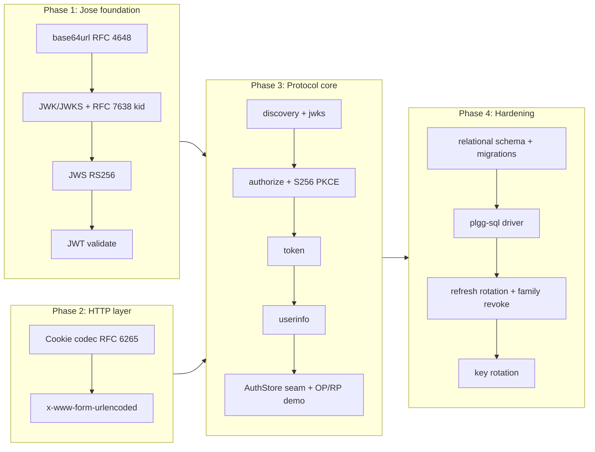

## 1. Overview

plgg-auth is a from-scratch OpenID Connect identity provider built on the plgg framework, delivered across four phases with zero third-party runtime dependencies (WebCrypto + Node built-ins only). It provides the full authorization-code flow with mandatory S256 PKCE, RS256 ID-token issuance, an app-supplied `AuthStore` persistence seam, and production hardening: a plgg-sql store driver over dbmate migrations, refresh-token rotation with family-revocation reuse detection, and signing-key rotation. All quality gates are green: 217 package specs, coverage 98.7/91.1/98.2/98.7 (statements/branches/functions/lines) above the 91 threshold, and `scripts/check-all.sh` passing on a fresh full rebuild.

**Highlights:**

1. **Vendor-neutral signing foundation** — the Jose layer (base64url, JWK/JWKS with RFC 7638 thumbprint `kid`s, JWS RS256, JWT validation) is built in-house on WebCrypto rather than a `jose`/`oidc-provider` dependency, keeping the stack zero-runtime-dep. Pinned to the RFC 4648/7515/7638 test vectors and cross-checked against `node:crypto`.
2. **AuthStore seam inversion** — the OP protocol logic is entry-point-independent; the app supplies the persistence via an `AuthStore` capability record (mirroring plgg-sql's `Db` seam). An in-memory driver and a plgg-sql driver pass an identical shared contract spec.
3. **Security boundary as a type** — `/authorize` folds into a pure `AuthorizeOutcome` union (`LoginRequired | RedirectToClient | LocalError`); the `LocalError` variant makes open-redirect prevention (never redirect to an unvalidated `redirect_uri`) a domain type, unit-testable without HTTP.
4. **App-owned authentication** — the OP never touches passwords or login HTML; it parks the pending request and redirects to an app-provided login route, which calls `completeAuthorization(subject, requestId)` to finish the protocol.
5. **Defense-in-depth via immutable history** — refresh-token rotation keeps a `rotated_from` lineage and reuse detection revokes the whole family; signing keys move through `active → retiring → retired` so pre-rotation ID tokens keep validating until their key ages out. Token values are stored only as SHA-256 hashes.

## 2. Motivation

plgg is a self-maintained framework and its own only consumer, so building a custom OIDC provider in-house — rather than procuring a third-party library — keeps the stack zero-dependency and vendor-neutral, a core architectural principle recorded in the phase-1 ticket as the justified deviation from default-to-procure. With a purpose-built provider, plgg apps can offer SSO to end-users without external service dependencies, while the library enforces defense-in-depth (finite token/key lifespans, family-revocation on refresh reuse, atomic single-use codes) and data minimization (userinfo serves only `sub` by default). The `AuthStore` seam lets apps plug their own persistence while the protocol stays pure; the four-phase split let the cryptographic foundation and the HTTP capabilities stabilize before the protocol core and persistence were layered on.

## 3. Changes

Delivered in four phases over ~11h: the Jose signing foundation (phase 1) unblocked the protocol core, the plgg-http cookie/form capabilities (phase 2) supplied the session cookie and token-endpoint body parsing, the OIDC core (phase 3) wired the endpoints over an app-supplied store, and persistence & hardening (phase 4) grounded it in a real relational database with refresh and key rotation.

### 3-1. Create `plgg-auth` package with the Jose domain layer ([042cffe](https://github.com/qmu/plgg/commit/042cffe))

Scaffolded the new `packages/plgg-auth` package and its `Jose/` domain: base64url (RFC 4648 §5), RSA JWK/JWKS with RFC 7638 thumbprint-derived `kid`s, RS256 JWS sign/verify (rejecting `alg: none` and downgrades before touching crypto), and JWT encode/decode/validate with an injected clock — all on WebCrypto, pinned to the RFC test vectors and cross-checked against `node:crypto`.

### 3-2. Add cookie codec and form decoding to plgg-http ([47a7b6b](https://github.com/qmu/plgg/commit/47a7b6b))

Added a typed `Set-Cookie` model (branded RFC 6265 name/value, a secure-by-default `sessionCookie` baseline, `SameSite=None`-requires-`Secure` guard), prototype-safe `parseCookies`/`getCookie`, and a pure `parseForm` x-www-form-urlencoded decoder to the neutral plgg-http package; plgg-server's `toNativeResponse` now emits one `Set-Cookie` header per cookie.

### 3-3. Implement the plgg-auth OIDC provider core ([43053a1](https://github.com/qmu/plgg/commit/43053a1))

Added the `Oidc/` domain: branded protocol models, an app-supplied `AuthStore` seam with atomic single-use `take*` operations, and `mountOidc` — a data-last `Web` transformer exposing discovery, `/jwks.json`, `/authorize` (authorization-code + mandatory S256 PKCE), `/token` (`client_secret_basic`/`post`/`none`), and `/userinfo`. Login is app-owned via a `completeAuthorization` seam; an in-memory store and a runnable in-process OP+RP demo ship alongside.

### 3-4. plgg-auth persistence and hardening ([0e7f9cd](https://github.com/qmu/plgg/commit/0e7f9cd))

Made the provider production-shaped: a schema-first dbmate migration (8 tables incl. refresh-token rotation lineage and signing-key lifecycle), a plgg-sql `sqlStore(db)` driver over the `Db` seam (atomic `take*` transactions, tokens stored only as SHA-256 hashes), the `refresh_token` grant with rotation and family-revocation reuse detection, and `rotateSigningKey`/`retireKeys` for key lifecycle. The demo gains a `--sql` mode. Along the way, removed a stray `"type": "module"` from plgg-db-migration (which had made it unimportable by TypeScript NodeNext consumers) and fixed a plgg-test coverage-merge bug.

## 4. Outcome

- Implemented plgg-auth as a production-ready OpenID Connect provider from the ground up, with zero third-party runtime dependencies (all crypto on WebCrypto).
- **Phase 1 (Jose)**: base64url codec, JWK/JWKS with RFC 7638 thumbprint `kid`, RS256 JWS with `alg:none` rejection, and JWT validation with an injected clock (RFC 7515/7519).
- **Phase 2 (HTTP)**: RFC 6265 cookie parse/serialize with a secure-by-default baseline, pure x-www-form-urlencoded decoding, and correct multi-`Set-Cookie` emission at the plgg-server seam.
- **Phase 3 (protocol)**: full authorization-code + S256 PKCE flow, RS256 ID-token issuance, the token endpoint (`client_secret_basic`/`post`/`none`), userinfo with Bearer auth, an in-memory `AuthStore` driver, and a runnable OP+RP demo.
- **Phase 4 (persistence)**: schema-first relational design (8 tables) with plgg-db-migration up/down migrations, a plgg-sql `AuthStore` driver with atomic single-use `take*`, refresh-token rotation with family-revocation on replay, and signing-key rotation with a retire window.
- **Incidental fixes**: removed a stray `"type": "module"` from plgg-db-migration (unblocked TS NodeNext consumers — this branch is its first); fixed a plgg-test coverage merge-across-dumps bug that was undercounting branch coverage.
- **Coverage**: every phase cleared the 91% gate; 85 + 52 + 162 + 217 specs across the phases, with RFC test vectors and `node:crypto` cross-checks and a full e2e round-trip demo.

## 5. Historical Analysis

The plgg-sql arc established the new-package scaffold and the driver-agnostic `Db` seam; this branch mirrors that seam in `AuthStore` (phase 3) with an in-memory driver and a testkit precedent (phase 4), and reuses plgg-sql's `sql`/`query`/`exec`/`transaction`/`decodeRows` for the SQL store. The plgg-http extraction as a neutral shared model made phase 2's cookie/form additions land there rather than coupling plgg-auth to plgg-server, and the earlier `HttpError` 401/403 vocabulary directly powers the `/token` and `/userinfo` responses. The "pure domain vocabulary first" branded-model discipline from plgg-db-migration's domain-models ticket shapes every model (`ClientId`, `RedirectUri`, `CodeVerifier`, refresh-token hashes). The "runnable example + documented adapter contract" deliverable shape from plgg-sql's demo ticket is replicated in the OP+RP demo and the `AuthStore` contract. The `take*` atomicity invariant echoes the same seam-owns-the-guarantee doctrine plgg-sql's `transaction` established.

## 6. Concerns

### Single-use code/pending semantics must remain atomic in any store driver

- **Severity:** urgent
- **Description:** The `AuthStore` seam defines `takeCode`/`takePendingRequest` as get-and-delete for single-use enforcement; the plgg-sql driver implements them with `db.begin()/commit()` wrapping SELECT+DELETE in one transaction (see [0e7f9cd](https://github.com/qmu/plgg/commit/0e7f9cd) in `packages/plgg-auth/src/Sql/sqlStore.ts`). Any future driver that splits this into two statements reintroduces code replay — a returned code stays redeemable if the delete fails or is omitted.
- **How to Fix:** The seam contract documents `take*` as atomic; audit any new store driver for a single-transaction SELECT+DELETE before shipping it.

### Private signing-key JWKs are stored as plaintext

- **Severity:** moderate
- **Description:** The plgg-sql driver stores the full RSA private JWK as plaintext JSON in `oidc_signing_keys.private_jwk`; at-rest encryption (KMS-wrapped or env-provided key) is deferred as an operator decision documented at the `sqlStore` boundary (see [0e7f9cd](https://github.com/qmu/plgg/commit/0e7f9cd) in `packages/plgg-auth/src/Sql/sqlStore.ts`).
- **How to Fix:** Before any production deployment, encrypt the `private_jwk` column with a key source outside the database; this is outside the library's shipped form but mandatory for real use.

### Expired-row reaping and key retirement are operator scheduling concerns

- **Severity:** low
- **Description:** `retireKeys` removes keys past their rotation window, and expired rows accumulate in `authorization_codes`/`refresh_tokens`/`sessions`; neither the library nor the demo schedule cleanup (no background timers in library code, by plgg principle). The provider functions correctly without it, but the database grows unbounded.
- **How to Fix:** The operator schedules periodic `retireKeys` and expired-row deletion; plgg-auth provides the usecases but not the scheduler.

### PostgreSQL and MySQL remain untested reference dialects

- **Severity:** low
- **Description:** The `sqlStore` driver and migrations are exercised against a real `node:sqlite`; Postgres and MySQL are reference dialects but unverified against a real engine, so dialect-specific transaction/JSON/row-decoding issues could surface at deployment.
- **How to Fix:** Before deploying on Postgres/MySQL, run the shared `AuthStore` contract suite against the target engine and fix any dialect-specific issues.

_The following long-standing concerns are carried forward from prior PRs (31–53); this branch did not touch their areas. Two prior concerns were **resolved** this branch — the plgg-db-migration `.d.ts` NodeNext consumer-resolution concerns (PR #48 / #51), fixed by making plgg-auth the first real NodeNext consumer and removing the stray `type:module` — and have been moved to the concern archive._

### (carried from PR #31) Binary request support adds a parallel `bytes` field

- **Severity:** low
- **Description:** see `.workaholic/concerns/31-binary-request-support-adds-a-parallel.md`
- **How to Fix:** see the deferred-concern file

### (carried from PR #31) mapErr requires explicit parameter type annotations

- **Severity:** low
- **Description:** see `.workaholic/concerns/31-maperr-requires-explicit-parameter-type-annotations.md`
- **How to Fix:** see the deferred-concern file

### (carried from PR #31) match type-level gaps remain open

- **Severity:** low
- **Description:** see `.workaholic/concerns/31-match-type-level-gaps-remain-open.md`
- **How to Fix:** see the deferred-concern file

### (carried from PR #31) plgg dist rebuild required after core changes

- **Severity:** low
- **Description:** see `.workaholic/concerns/31-plgg-dist-rebuild-required-after-core.md`
- **How to Fix:** see the deferred-concern file

### (carried from PR #31) route-table compilation trades 404/405 detail

- **Severity:** low
- **Description:** see `.workaholic/concerns/31-route-table-compilation-trades-404-405.md`
- **How to Fix:** see the deferred-concern file

### (carried from PR #31) Uint8Array not directly assignable to BodyInit

- **Severity:** low
- **Description:** see `.workaholic/concerns/31-uint8array-not-directly-assignable-to-bodyinit.md`
- **How to Fix:** see the deferred-concern file

### (carried from prior PRs 37–53) Remaining long-standing carry-over corpus

- **Severity:** low
- **Description:** The full set of ~76 further carried concerns from PRs 37, 40, 41, 46, 47, 48, 49, 51, 52, and 53 (TEA effects hydration, renderer runtime primitives, proc/Defect channel reach, plgg-bundle export-discovery, published-bundle minification, warm-rebuild dist swap, dependabot config/grouping, plggmatic facade shadowing, hot-reload config refresh, HttpStatus refinement, plggpress import-only exports, deploy-guide/HTTPS operational follow-ups, plgg-db-migration `--to`/`listApplied`/`migrateTenant` items, and the versioning-policy question) remain active and untouched by this branch. Each has its own file under `.workaholic/concerns/`.
- **How to Fix:** These are tracked individually in `.workaholic/concerns/` and re-carried by `/ship`; address them in the branches that own their areas.

## 7. Successful Development Patterns

- **Vendor neutrality with zero new runtime deps** — building the Jose layer on WebCrypto (present in every JS runtime) instead of a third-party `jose`/`oidc-provider` kept the stack zero-dependency; recording the rationale in the phase-1 ticket lets future decisions inherit the justification.
- **Seam-based architecture for swappable persistence** — `AuthStore` mirrors the plgg-sql `Db` seam: the app supplies the capability record, the library stays pure domain logic. A shared contract spec verified against both the in-memory and SQL drivers enabled test-driven development without a database.
- **Injected dependencies for determinism** — the clock is a parameter (never `Date.now()`), JWKS is fixture-supplied, and token entropy comes from `crypto.getRandomValues`; expiry and rotation specs run against a mutable clock, and a per-method `overrideStore(base, {m: boom})` testkit reaches every store-failure short-circuit.
- **Pure domain values as security boundaries** — the `AuthorizeOutcome` union makes open-redirect prevention a type, unit-testable without HTTP; distinct `OidcError`/`JoseError` kinds per failure let handlers emit exact OAuth codes and logs see root causes.
- **Single issuance path, multiple entry points** — `completeAuthorization` serves both the live-session fast path and the just-logged-in login-route path, so the two never diverge in session/nonce handling.
- **Append-only history for lineage** — refresh rotation stores `rotated_from` + status and key lifecycle appends status transitions rather than overwriting current-state, enabling reuse detection and grace-window serving of retiring keys.
- **RFC test vectors + cross-implementation checks** — base64url/JWS/thumbprint specs pin RFC 4648/7515-A.2/7638-§3.1 vectors and cross-verify against `node:crypto` in both directions, eliminating guesswork in the crypto.
- **Coverage-friendly error idioms** — heavy inline-arrow `matchOption` in error paths depresses block-branch coverage even when tested; `isSome` + early return is both clearer and coverage-friendly for linear validate-then-fail sequences.
- **Prototype-safe map construction from untrusted input** — the computed-key spread accumulation used by `parseCookies`/`parseForm` is safe by spec (only a literal `__proto__` sets a prototype), pinned by a pollution probe.
- **Runnable demos + in-process e2e** — the OP+RP `example.ts` drives the full round trip in one process (both in-memory and `--sql`), and in-process specs exercise every endpoint via `handle(app, req)`, catching architectural bugs unit tests miss.
- **Fix the tool when it lies** — the branch surfaced and fixed two real infrastructure bugs (plgg-db-migration's unimportable `type:module`, plgg-test's coverage merge), keeping the measurement honest rather than working around it.

## 8. Release Preparation

**Verdict**: Ready for release

### 8-1. Concerns

- No blocking concerns. All quality gates are green: `scripts/check-all.sh` passes on a fresh full rebuild of all packages; plgg-auth coverage is 98.7/91.1/98.2/98.7 (all above the 91 threshold); no `as`/`any`/`ts-ignore`.
- Non-blocking, documented for real deployments (see §6): private signing-key JWKs are stored plaintext (encrypt at rest before production); expired-row reaping and key retirement need operator scheduling; Postgres/MySQL are untested reference dialects.

### 8-2. Pre-release Instructions

- None — standard release process applies. plgg-auth ships new at 0.0.1; plgg-http 0.0.2, plgg-server 0.0.3, plgg-db-migration 0.0.2, and plgg-test 0.0.3 mark the changed packages.

### 8-3. Post-release Instructions

- Before any production OP deployment: encrypt the `oidc_signing_keys.private_jwk` column at rest, and schedule periodic `retireKeys` + expired-row reaping.
- If targeting Postgres or MySQL, run the shared `AuthStore` contract suite against the real engine first.

## Deployment Evidence

- **When:** 2026-07-04T01:54:47+09:00
- **Target:** plgg-auth release (guide deploy-on-merge + npm + GitHub Release)
- **Method:** api-probe (pre-merge readiness: scripts/check-all.sh)
- **Status:** pass
- **Observed:** scripts/check-all.sh green on a fresh full rebuild of all 21 packages at merge artifact 646fd99; plgg-auth coverage 98.7/91.1/98.2/98.7 above the 91 gate
