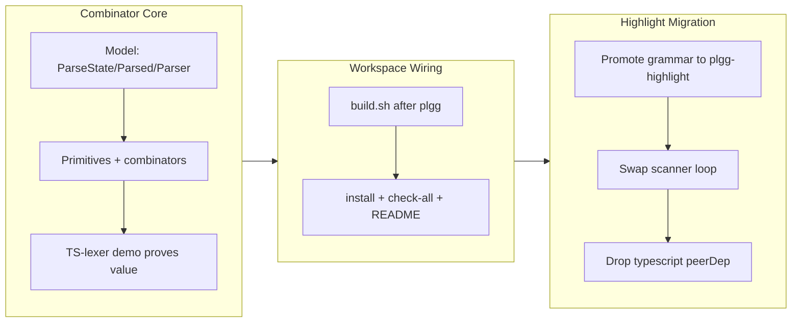

## 1. Overview

The branch creates `plgg-parser` — a zero-new-dependency generic parser combinator library built purely on plgg — and then uses it to remove the TypeScript compiler from `plgg-highlight`. The work proceeds in two stages: first the combinator core lands with its primitives, combinators, and a runnable TS-lexer demo proving value; then `plgg-highlight`'s `ts.createScanner` while-loop tokenizer is replaced by a plgg-parser TS grammar emitting the identical 9-variant token taxonomy, dropping `typescript` from the published highlight surface. The net outcome is an in-house parsing stack that highlights `<pre>`-wrapped TypeScript with our own primitives, with the stable `tokenize` contract and exact-source round-trip preserved throughout.

**Highlights:**

1. Create `packages/plgg-parser`: a data-last parser combinator library on plgg (Result/Option/Box/InvalidError), zero new runtime/peer dependencies
2. `Parser<A,S>` carries a threaded user-state slot S for context-sensitive grammars (regex-vs-division), composed with pipe/flow
3. Full combinator set + primitives with a TS-lexer demo proving exact round-trip, nested `${}` interpolation, and never-throw EOF degradation
4. Migrate `plgg-highlight` off `ts.createScanner` to a plgg-parser TS grammar emitting the same 9-variant `TokenKind`
5. Remove the last `typescript` dependency from the published highlight surface (peerDependency dropped; devDependency retained for tsc)

## 2. Motivation

`plgg-highlight` tokenized `<pre>`-wrapped TypeScript by driving the compiler's stateful `ts.createScanner`, carrying `typescript` as a peerDependency — a vendor dependency on precisely the kind of thing (a lexer) the family builds in-house. The vendor-neutrality policy makes a parser combinator library the obvious in-house replacement: it is the thing people npm-install, and this one is built purely on plgg with zero new dependencies. The work was deliberately split so the generic combinator core stays TypeScript-agnostic and replaceable (sacrificial-architecture), with the production TS grammar living beside its consumer. The demo-first sequencing (proactive-poc) proved the combinators could express the hard TS lexing edge cases before the consumer committed to the migration.

## 3. Changes

The library landed first with its full model, primitive, and combinator surface plus a spec/demo TS lexer, then was wired into the ordered workspace scripts and docs, and finally consumed by `plgg-highlight` to retire the scanner. Each stage kept the fresh-rebuild `check-all.sh` gate green. The pre-existing ticket-creation commit (5c1f32e) predates the implementation work.

### 3-1. Add plgg-parser: zero-dep parser combinator library ([a75c984](https://github.com/qmu/plgg/commit/a75c984))

New `packages/plgg-parser` depending on `plgg` only (`typescript` devDep for tsc, no peer). `Parser<A,S> = (ParseState<S>) => Result<Parsed<A,S>, InvalidError>`, data-last and composed with pipe/flow; `ParseState<S>` threads a user-state slot S for context-sensitive grammars, `parseError` builds on `InvalidError`. Primitives (`satisfy`/`literal`/`anyChar`/`eof`/char-classes/`succeed`/`fail`) and combinators (`map`/`andThen`/`seq`/`left`/`right`/`or`/`many`/`many1`/`optional`/`between`/`sepBy`/`sepBy1`/`lookahead`/`notFollowedBy`/`lazy`/`getUserState`/`setUserState`/`run`); `many`/`or` use documented iterative seams to avoid per-token recursion. A TS-lexer demo (spec/demo code under `src/Demo`, not exported from the root index) proves value: exact-source round-trip, nested `${}` template interpolation, regex-vs-division via the user-state slot, and unterminated-at-EOF degrading to Plain without throwing. 47 tests; coverage 98.8/93.8/97.7/98.8.

### 3-2. Wire plgg-parser into workspace build and docs ([92aa602](https://github.com/qmu/plgg/commit/92aa602))

`build.sh` builds plgg-parser right after `plgg` (its only dependency) and before `plgg-highlight` (the future consumer); `npm-install.sh` installs it after plgg; `check-all.sh` runs its 47-test suite inside the fresh-rebuild gate. The root README links the package in both the index and per-package section, and the archived ticket 20260704015133 frontmatter records effort/category.

### 3-3. Migrate plgg-highlight tokenizer to plgg-parser grammar ([1de1709](https://github.com/qmu/plgg/commit/1de1709))

`tokenize.ts`'s `ts.createScanner` while-loop is replaced by a plgg-parser TS-lexer grammar emitting the same 9-variant `Token`/`TokenKind`: keywords, identifiers, numbers (decimal with `_` separators, fraction, exponent, bigint `n`, `0x`/`0b`/`0o`), strings with escapes, templates with nested `${}` interpolation (a documented brace-depth seam), line/block comments, punctuation, and regex-vs-division disambiguated by a threaded last-significant-token user-state. The `(code)=>Token[]` signature, never-throw guarantee, and exact-source round-trip are all preserved (irregular input degrades to plain). New internal `Token/model/LexState.ts`. `package.json` drops `typescript` from peerDependencies and adds `plgg-parser` (`file:../plgg-parser`); `typescript` stays a devDependency for tsc. Legacy `tokenize.spec.ts` is kept byte-identical as the parity net, and a new `tokenize.edge.spec.ts` covers nested templates, regex-vs-division, unterminated-at-EOF, and numeric literals. 25 tests; coverage 98.7/93.8/93.2/98.7. Docs (package.json, bundle.config.ts, both READMEs, root README) updated off the scanner story.

## 4. Outcome

- Created `packages/plgg-parser`: a generic parser combinator library built purely on plgg primitives (Result/Option/Box/InvalidError), with zero new runtime or peer dependencies (typescript is a devDependency only, for tsc)
- `Parser<A,S> = (ParseState<S>) => Result<Parsed<A,S>, InvalidError>` — data-last functions composed with pipe/flow, where `ParseState<S>` threads a user-state slot S so context-sensitive grammars (regex-vs-division) can carry the last-significant-token context through the parse
- Full combinator surface: map/andThen/seq/left/right/or/many/many1/optional/between/sepBy/sepBy1/lookahead/notFollowedBy/lazy/getUserState/setUserState/run, plus primitives satisfy/literal/anyChar/eof/char-classes/succeed/fail; many/or use documented iterative seams to lex long inputs without stack growth
- A TS-lexer demo (spec/demo code inside plgg-parser, not exported from the root) proves value: exact-source round-trip, nested `${}` template interpolation, regex-vs-division via the user-state slot, and unterminated-at-EOF degrading to plain (never throws); 47 tests, coverage 98.8/93.8/97.7/98.8
- Replaced plgg-highlight's `ts.createScanner` while-loop with a plgg-parser TS grammar emitting the same 9-variant Token/TokenKind, preserving the `(code)=>Token[]` signature, the never-throw guarantee, and the exact-source round-trip; new internal Token/model/LexState.ts
- Removed the last `typescript` dependency from the published highlight surface: `typescript` dropped from peerDependencies (kept as devDependency for tsc), `plgg-parser` added to dependencies; legacy `tokenize.spec.ts` kept byte-identical as the parity net, new `tokenize.edge.spec.ts` added; 25 tests, coverage 98.7/93.8/93.2/98.7
- Wired plgg-parser low in the dependency stack: build.sh builds it right after plgg and before plgg-highlight; npm-install and check-all register it; root README and per-package docs link it
- Design deviation recorded: shipped `lookahead` + `notFollowedBy` (PEG predicates) instead of the ticket's `attempt` combinator — because a failed parser carries no state, backtracking is automatic, so `attempt` would be a no-op; it appeared only in the ticket's implementation-steps prose, not the checkable gate

## 5. Historical Analysis

plgg-highlight was created (ticket 20260630013503) around `ts.createScanner` precisely because no in-house parser existed; this branch removes that compromise now that plgg-parser does, closing a recorded exception from the scanner ticket's own history. The monorepo had already shipped three hand-rolled parsers before this — the scanner-based highlighter and plgg-md's block and inline parsers — each establishing the conventions (Result not throw, imperative seams only where documented, >90% coverage) that this library generalizes; the scaffolding pattern (package.json + tsconfig + plgg-test.config.json + bundle.config.ts, plus per-package runner scripts) was well-worn, so the new package followed plgg-highlight's template verbatim minus the typescript dependency. The demo-first split (combinator core proves value in a spec before the consumer migrates) is the proactive-poc policy applied literally, and the one-revertible-commit migration behind the stable `tokenize` contract is the sacrificial-architecture policy realized: if the grammar had proven unready, reverting 1de1709 would restore the scanner path without touching consumers. The regex-vs-division problem that motivated the user-state slot is the same context-sensitivity the scanner ticket flagged as the hard case, now solved with a threaded last-significant-token state rather than compiler machinery.

## 6. Concerns

### ~74 long-standing carry-over concerns from PRs #31–#53 remain active

- **Severity:** low
- **Description:** This branch is purely additive (a new library plus one behind-a-stable-contract migration) and resolves none of the roughly 74 long-standing concerns carried forward through PRs #31–#53 (Result/match type-level gaps, renderer effects/hydration gaps, plgg-db-migration audit items, bundle minification, Dependabot grouping, etc.). They remain active and unrelated to this branch.
- **How to Fix:** Continue tracking in `.workaholic/concerns/index.md`; address in the branches that own the relevant surfaces.

### plgg-parser demo & plgg-highlight grammar: cosmetic lexing limitations

- **Severity:** low
- **Description:** Non-ASCII / `\u`-escaped identifiers colour as `plain`, JSX/TSX is lexed generically, and regex character-classes are only partially handled. These are cosmetic — they never break the exact-source round-trip (every character still appears in exactly one token) — and match the lexical limits the scanner had here too. Recorded in `tokenize.ts` and the edge/demo specs.
- **How to Fix:** Extend the grammar with Unicode identifier classes and a dedicated JSX/TSX sub-grammar if richer classification is wanted; low priority since the round-trip and never-throw contracts hold regardless.

### Concrete-S pinning ergonomics for plgg-parser consumers

- **Severity:** low
- **Description:** The state-polymorphic `Parser<A,S>` requires S to be pinned to the grammar's concrete state at each leaf (direct annotation of a primitive to the concrete-S type) so the combinators can infer S; otherwise inference defaults S to `unknown` and fails contravariantly. This is documented in the demo and the context spec but is a usability sharp edge for future consumers.
- **How to Fix:** Consider a small helper that fixes S once for a grammar (a state-bound re-export of the primitives), or document the pinning idiom prominently in the package README; deferred as an ergonomic refinement.

### `attempt` combinator intentionally omitted

- **Severity:** low
- **Description:** The ticket's implementation-steps prose listed an `attempt` (backtracking) combinator. It was deliberately not shipped: because a failed parser returns no state, backtracking is already automatic, making `attempt` a no-op. `lookahead` + `notFollowedBy` (PEG predicates) were shipped instead. Flagged so a future reader does not "add the missing combinator".
- **How to Fix:** None — this is a deliberate design decision; keep the note in the code and this story so the omission is not mistaken for an oversight.

## 7. Successful Development Patterns

- **Demo-first proof of value (proactive-poc)**: The combinator core shipped with a runnable TS-lexer demo exercising the three hard edge cases (nested template interpolation, regex-vs-division, unterminated-at-EOF) before the consumer migrated. Proving the primitives could express the grammar in a spec de-risked the migration and validated the user-state design against the real problem.
- **Sacrificial-architecture behind a stable contract**: The migration is one revertible commit behind the unchanged `tokenize(code): Token[]` contract. The generic library stays TypeScript-agnostic; the production TS grammar lives with its consumer. If the grammar had proven unready, reverting 1de1709 restores the scanner without touching plggmatic/plggpress/guide.
- **Byte-identical legacy spec as a parity net**: `tokenize.spec.ts` was kept unchanged across the tokenizer rewrite, so its kind-tag sequences and exact-source round-trip assertions prove behavioral parity with the scanner by construction; new edge cases went into a separate `tokenize.edge.spec.ts` rather than editing the parity net.
- **Type-driven state threading for context-sensitivity**: Regex-vs-division was solved by threading a typed last-significant-token user-state through `ParseState<S>` rather than by ad-hoc mutable flags — the context-sensitive decision is a value in the parse state, not a side channel.
- **Fresh-rebuild gate catches stale-dist masking**: `check-all.sh` (full rebuild) was run after the dependency-type changes rippled into plgg-highlight and its downstream consumers, exit 0 twice, catching any drift that stale committed dists would otherwise hide.
- **Documented iterative seams instead of clever recursion**: `many`/`or` and the template brace-depth logic are implemented as explicit, commented imperative seams to lex multi-hundred-line `<pre>` blocks without stack growth, matching the grandfathered scanner-cursor exception rather than fighting the type system with recursive combinators.

## 8. Release Preparation

**Verdict**: Ready for release

### 8-1. Concerns

- None block release. The three new concerns are all low-severity and cosmetic or design-intentional; the ~74 carried concerns are pre-existing and unrelated to this additive branch.

### 8-2. Pre-release Instructions

- Confirm the `run-tests.yml` fresh-clone check (`./scripts/npm-install.sh` then `./scripts/check-all.sh`) is green on the PR — that gate builds the whole workspace fresh (including the new plgg-parser and the migrated plgg-highlight) and runs the full suite, so its own green check is the proof the addition and migration are sound.

### 8-3. Post-release Instructions

- Deployment is automatic post-merge: `deploy-guide.yml` rebuilds and serves the guide — confirm a highlighted TypeScript block still renders correct classified spans (an in-session spot-check against the built plgg-highlight dist already confirmed `/^h/i`→Regex in operator position, `name / 2`→division Punctuation, and a balanced `` `Hi, ${name}!` `` template, with exact round-trip).
- npm publish of the new `plgg-parser` package and the updated `plgg-highlight` happens via the `/ship` `publish-npm.sh` flow (topological order, `file:` cross-deps rewritten to real ranges, publish-where-newer), not manually.

## 9. Notes

- Verification: `scripts/check-all.sh` fresh rebuild exit 0 twice across the full workspace (incl. plggmatic/plggpress/guide/example); no `as`/`any`/`ts-ignore`, zero throws in domain code, Prettier printWidth-50 conformant. Coverage exceeds the >90% gate on all four metrics for both packages (parser 98.8/93.8/97.7/98.8; highlight 98.7/93.8/93.2/98.7).
- The TS-lexer demo stays inside plgg-parser as spec/demo code (`src/Demo`), not exported from the root index; the production TS grammar lives in plgg-highlight. The generic library never imports from any higher-stack package.
- `attempt` was intentionally omitted (stateless-failure backtracking makes it a no-op); `lookahead` + `notFollowedBy` ship instead. This is a deliberate design decision, not a gap.
- Commit links in section 3 use the branch's true history hashes; the pre-existing ticket-creation commit (5c1f32e) predates the implementation work and is mentioned only in passing.
- Ship-time: `origin/main` had diverged ~20 commits (plgg-auth added, plggmatic churn); the branch merged `origin/main` in ([454a223](https://github.com/qmu/plgg/commit/454a223)), resolved 3 doc conflicts (root README, concerns index), and re-passed a fresh `check-all` locally + in CI before merge. plgg-highlight was bumped to 0.0.2 ([68f5815](https://github.com/qmu/plgg/commit/68f5815)) so the migration reaches npm consumers.

## Deployment Evidence

- **When:** 2026-07-04T12:34:26+09:00
- **Target:** plgg GitHub Release (script-driven from /ship)
- **Method:** api-probe (gh release view)
- **Status:** pass
- **Observed:** `publish-release.sh` created release `2026.07.week1.release3` targeting merge commit 51d2088; `gh release view` resolves it at https://github.com/qmu/plgg/releases/tag/2026.07.week1.release3 with the committed release note as body (reason: created).

## Deployment Evidence

- **When:** 2026-07-04T12:35:00+09:00
- **Target:** plgg guide (Pages)
- **Method:** api-probe (workflow + site probe)
- **Status:** pass
- **Observed:** `Deploy Guide` run 28693676689 completed success on the merge push (1m26s); https://plgg.qmu.co.jp/ returns 200.

## Deployment Evidence

- **When:** 2026-07-04T12:56:00+09:00
- **Target:** plgg npm packages (script-driven from /ship)
- **Method:** api-probe (registry resolve + scratch install)
- **Status:** pass
- **Observed:** `plgg-parser@0.0.1` (new) and `plgg-highlight@0.0.2` published and resolve on the registry; a scratch-dir `npm install` (min-release-age overridden for the just-published artifacts) plus `require()` smoke shows `plgg-parser.run` is a function and the npm `plgg-highlight.tokenize` classifies `/re/g`→Regex with an exact round-trip. `plgg-test@0.0.3` and `plggmatic@0.1.0` (main's version-newer packages) also uploaded. NOTE: `publish-npm.sh` exited non-zero because `plggmatic`'s package.json defines a `publish` npm script (`npm run build && npm publish`) — `publish` is an npm lifecycle hook, so `npm publish` runs it AFTER upload, invoking `plgg-bundle` in the staging copy (no node_modules) → exit 127. The plggmatic tarball published regardless; the error is post-upload noise. Recorded as a concern for the plggmatic owner.
