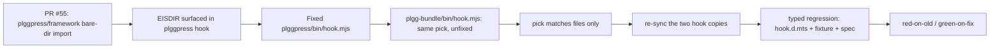

## 1. Overview

A one-ticket follow-up to PR #55: fix the latent twin of a bug that PR #55 already fixed in production. The plgg-bundle ESM loader hook (`bin/hook.mjs`) resolved a bare-directory self-alias to the directory itself — which Node then `read`s as a module and throws `EISDIR`. The fix makes resolution match files only (a directory falls through to its `index.ts`), re-syncs the two near-verbatim hook copies, and adds a typed regression test.

**Highlights:**

1. `plgg-bundle/bin/hook.mjs` `pick()` matches files only, so `plgg-bundle/<dir>` resolves to `<dir>/index.ts` instead of the directory (EISDIR guard).
2. The two near-verbatim hook copies (plgg-bundle + plggpress) are back in sync — plggpress's was fixed live in PR #55 (`4c3341b`); this closes the un-fixed original.
3. A typed regression spec proves it — red on the old `pick`, green on the fix — despite the hook being a plain `.mjs` under `allowJs:false`.

## 2. Motivation

PR #55 absorbed plggmatic into plggpress, which introduced the first bare-directory self-alias (`plggpress/framework`) and thereby surfaced this hook bug as an `EISDIR` crash of the guide's static deploy build. That was fixed in plggpress's copy of the hook. The plgg-bundle original — the copy every package builds through — carried the identical `pick()` and was left unfixed: latent only because no plgg-bundle consumer bare-imports a directory *yet*. Fixing it now removes a trap for the next such import and restores the "near-verbatim copy" invariant the two hook files are meant to hold. This is implementation-pillar hygiene: make a machine-checkable guard out of a failure that was previously invisible until runtime.

## 3. Changes

The `pick` helper gained an `isFile` guard (`existsSync(c) && statSync(c).isFile()`) so the raw `base` candidate matches only real files; a directory now resolves to `base/index.ts`. Because the hook must stay plain `.mjs` (it runs as Node's resolver before any type-stripping) and the package sets `allowJs:false` with `.spec.ts`-only discovery, the test needed a hand-written `bin/hook.d.mts` to type `resolve` without an escape hatch, a coverage-excluded `aliasDir/` fixture, and a spec driving `resolve()` directly.

## 4. Outcome

The ticket is implemented, verified, and archived; the todo queue is empty.

- Regression proven **red-on-old** (buggy `pick` → the directory test fails) and **green-on-fix**.
- The two hook copies' `pick`/`isFile` bodies are now **identical**.
- plgg-bundle: **83 tests pass**, coverage **99.8 / 94.3 / 98.8 / 99.8%** (all >90%).
- Fresh **`check-all.sh` green** across every package (plgg-bundle, plgg, plggpress, plgg-auth 217, …).

## 5. Historical Analysis

Directly continuous with PR #55 (`work-20260703-184443`), which introduced the first bare-directory self-alias and fixed the plggpress copy of the hook (`4c3341b`). The hook itself dates to the plgg-bundle dev-server/self-alias work; the "near-verbatim copy" split into plggpress's bin was made when plggpress gained its own CLI. This ticket reunifies the two after their PR-#55 divergence.

## 6. Concerns

- **No new deferred concerns.** Pure bug fix plus a regression guard; the common file-resolution path is unchanged and explicitly covered by a no-regression test.
- Standing note (not introduced here): the two hook files remain hand-maintained copies. If they drift again, extracting a single shared module is the durable fix — out of scope for this bugfix, worth a ticket only if the duplication recurs.

## 7. Successful Development Patterns

- **Chase the twin.** A production fix in one copy immediately motivated auditing its near-verbatim sibling, closing a latent crash before it could surface.
- **Make the invisible machine-checkable.** The bug was a runtime `EISDIR` with no test; the fix ships with a red/green regression that would have caught it, and re-establishes the copies-in-sync invariant as a verifiable condition.
- **Type the seam honestly.** Rather than reach for an escape hatch to test an untyped `.mjs` loader under `allowJs:false`, a hand-written `.d.mts` kept the test strict and `any`-free.
