## 1. Overview

Completion of a 20-ticket, 11-phase roadmap building **plggpress** as a browser-based CMS and **plggmatic** as its declarative UI framework. Shipped 115 commits delivering: a type-driven design system (tokens→components→framework), a zero-dependency RAG search layer, OIDC OP+RP authentication with password accounts, an admin UI on a declarative scheduler, three DB-primary content domains (stakeholder, guest drafts, media assets), a voice agent over OpenAI Realtime, a hand-rolled MCP stdio server with HTTP/OAuth transport, production topology with backup/health/monitoring, rollout assessment, and Claude Code plugin export. Refactored plgg-bundle's vendor boundary (confining `node:`/`tsc` imports to `vendors/`). All 20 roadmap tickets complete; check-all green; coverage >90% across all packages.

**Highlights:**

1. **Declarative UI framework (plggmatic):** type-driven Declare vocabulary, pure scheduler, mode-agnostic Scene renderer seam (multi-column, single-column, admin declared views).
2. **Design system:** role×variant token matrix (25 color tokens), non-color scales (typography/breakpoints/geometry/z-index), palette-override API, framework-owned scheme persistence, syntax-highlight tokens, full plggpress theme rewrite onto plggmatic.
3. **Content delivery:** SQLite FTS5 search, YAML-frontmatter content models, MicroCMS-like delivery API, zero-dependency RAG (embedding/cosine top-k with FTS5 fallback), hybrid search endpoint.
4. **DB-primary domains:** Account store (PBKDF2 passwords, roles, invites), Stakeholder (conversations/comments, submission, admin listing), Guest drafts (editable, revision tracking, export-to-git), Media assets (content-addressed dedup, safety rules, admin publish).
5. **Voice agent:** OpenAI Realtime browser WebRTC backend, conversational TEA reducer, Realtime agent seam, RAG tool integration, serve-mount integration.
6. **Hand-rolled MCP:** zero-dependency JSON-RPC 2.0, stdio transport, read-only content tools (search/get/list), HTTP/OAuth resource-server transport, Claude Code plugin marketplace export.
7. **Authentication:** OIDC OP+RP login flow, password account sealing, admin role-based access, cookie-based session persistence, CSRF protection on SSR forms.
8. **Production:** health endpoint, hot WAL backup, operations runbook, rollout consolidation, qmu.co.jp assessment.
9. **Architectural:** plgg-domain (durable-core spine with SchemaDrift gate), vendor-boundary gate (21 conformant packages, 6 exempted), sacrificial-shell pattern for LLM-era regeneration.
10. **Vendor boundary:** plgg-bundle refactor (`node:`/`tsc` confined to `vendors/`, off exemption list), plgg-fetch pilot layout (domain/vendors split with proof), architecture audit.

## 2. Motivation

LLM-era application architecture demands data/domain/contracts as the durable core and the UI shell as disposable/regenerated. plgg's type-driven no-escape-hatch patterns (Option not null, exhaustive match, proc error short-circuits) make regenerated code trustworthy. This roadmap proved the thesis: a hand-built CMS framework + content platform showcasing plgg's design system, web patterns, auth, search, voice integration, and MCP interop — all vendor-neutral zero-dependency where possible (plgg + WebCrypto + `node:sqlite`). The result is a proof of plggpress as a production-ready browser-based CMS and plggmatic as a reusable declarative UI framework for building content-management systems and similar form-heavy applications.

## 3. Changes

```mermaid
graph LR
  A["Phase 1-2: Design System"] --> B["Phase 3: Theme Port"]
  B --> C["Phase 4: Scheduler + Admin UI"]
  C --> D["Phase 5: Content + Search"]
  D --> E["Phase 6: Auth"]
  E --> F["Tickets 20-23: DB Domains"]
  F --> G["Ticket 24: RAG"]
  G --> H["Ticket 25: Voice Agent"]
  H --> I["Tickets 26-27: MCP"]
  I --> J["Tickets 28-30: Ops + Export"]
  J --> K["Vendor Boundary Refactor"]
  K --> L["✓ Complete: 20 Tickets"]
  style L fill:#90EE90
```

The branch progresses through 11 phases: (1) design tokens/testing infrastructure; (2–3) plggmatic theme layer; (4) declarative scheduler with admin UI; (5) content delivery API + search; (6) OIDC auth sealing; (20–23) three DB-primary content domains; (24) RAG search; (25) voice-agent integration; (26–27) MCP hand-rolled stack; (28–30) production ops + Claude Code export; (vendor) boundary refactor. Checkpoint-driven handoffs between sessions proved sustainable multi-phase delivery. All 115 commits include decision records (D1–D18) and exhaustive verification (Playwright, live browser, `node:sqlite` tests, coverage gates >90%, tsc clean, check-all green).

### 3-1. Fix plggmatic's errant `publish` lifecycle script ([1510897](https://github.com/qmu/plgg/commit/1510897))

Removed the stray `publish` npm lifecycle script whose auto-invocation broke `publish-npm.sh`, unblocking the scripted release flow.

### 3-2. Remove the `plgg-press` remnant; canonicalize plggmatic manifests ([dfc11d7](https://github.com/qmu/plgg/commit/dfc11d7))

Deleted the stale `plgg-press` remnant and corrected package manifests and prose so this monorepo is plggmatic's canonical home.

### 3-3. Harden the coverage gate ([e3e6987](https://github.com/qmu/plgg/commit/e3e6987))

Flipped coverage gating to opt-out (default 90%), gated `plgg-kit`, and recorded explicit per-package exemptions so new packages are covered by default.

### 3-4. plggmatic Style tokens: role×variant matrix, monochrome default ([d3f210d](https://github.com/qmu/plgg/commit/d3f210d))

Introduced a role×variant token matrix plus a neutral scale with a monochrome black/white default, establishing the design-token foundation.

### 3-5. Palette override API + scheme persistence ([fa285b3](https://github.com/qmu/plgg/commit/fa285b3))

Added a palette-override API and plggmatic-owned color-scheme persistence (`vp-appearance`, no-FOUC, `html.dark`).

### 3-6. plggmatic non-color design tokens ([8949b37](https://github.com/qmu/plgg/commit/8949b37))

Extended the token layer with typography scale, breakpoints, shell geometry, z-index bands, and reduced-motion handling.

### 3-7. plgg-view effects: `update` returns `[Model, Cmd<Msg>]`, runtime gains `Sub` ([c00e29a](https://github.com/qmu/plgg/commit/c00e29a))

Reworked plgg-view into a full TEA runtime — `update` now returns commands and the runtime supports subscriptions — a breaking change carried through all consumers in one branch.

### 3-8. plggpress theme on plggmatic: the D3 first-goal proof ([dd8068d](https://github.com/qmu/plgg/commit/dd8068d))

Cut plggpress's theme over to plggmatic tokens (`--vp-*` → `--pm-*`), proving the design-token layer end to end.

### 3-9. Tokenize syntax-highlight colors ([cf93abf](https://github.com/qmu/plgg/commit/cf93abf))

Moved `tok-*` syntax-highlight hues out of plggpress `baseCss` into plggmatic's token layer for consistent theming.

### 3-10. Declarative vocabulary + scheduler core ([df1da54](https://github.com/qmu/plgg/commit/df1da54))

Built the declarative UI vocabulary (Resource/Menu/List/Detail/Action/Query/Flow) and the scheduler core that derives Model, Msg, `update`, and a URL codec — mode-agnostic.

### 3-11. Multi-column renderer ([91c912a](https://github.com/qmu/plgg/commit/91c912a))

Lifted the example's hand-written column-stack pattern into the framework as a reusable multi-column renderer.

### 3-12. Single-column renderer ([e0301d1](https://github.com/qmu/plgg/commit/e0301d1))

Added a one-operation-per-screen renderer projecting scheduled state, with back behavior and runtime mode switching.

### 3-13. Action & form components ([2ace0c8](https://github.com/qmu/plgg/commit/2ace0c8))

Added controlled inputs, caster-parsed forms, a `Cmd` submit pipeline, confirm dialog, and semantic toasts.

### 3-14. Rewrite plggmatic-example declaratively ([d71beac](https://github.com/qmu/plgg/commit/d71beac))

Rewrote the example on the declarations layer as the Phase 4 proof-of-value demo and canonical docs example.

### 3-15. plggpress `serve` verb ([67c148f](https://github.com/qmu/plgg/commit/67c148f))

Added a `serve` verb that runs pressRouter as a persistent server sharing one `site.config` with the SSG build.

### 3-16. plgg-sql FTS5 support ([7612bbd](https://github.com/qmu/plgg/commit/7612bbd))

Added typed FTS5 virtual-table DDL, `MATCH`/`bm25()` search fragments, and external-content sync to plgg-sql.

### 3-17. `plgg-content`: derived SQLite index + delivery API ([ac040de](https://github.com/qmu/plgg/commit/ac040de))

Built a rebuildable SQLite index over the git-primary Markdown corpus with a MicroCMS-like read-only JSON delivery API and an FTS5 search endpoint.

### 3-18. Frontmatter YAML-subset parser + content models ([b8af592](https://github.com/qmu/plgg/commit/b8af592))

Added a frontmatter YAML-subset parser on plgg-parser and caster-backed content models declared in `site.config`.

### 3-19. Account domain: password accounts, membership, invites ([1ce5a2d](https://github.com/qmu/plgg/commit/1ce5a2d))

Layered an account domain above plgg-auth with WebCrypto password accounts, revocable admin/guest membership, and single-use copy-paste invites.

### 3-20. plggpress OP+RP dogfooding ([ee358d2](https://github.com/qmu/plgg/commit/ee358d2))

Mounted plgg-auth's OIDC provider and had plggpress log in against itself (auth-code + PKCE), scoping an admin session and guarding the admin subtree with role/scope middleware + CSRF.

### 3-21. Admin UI declared on the scheduler ([c80c91e](https://github.com/qmu/plgg/commit/c80c91e))

Declared the admin UI (content browsing, account/invite management, site settings) on the scheduler, served under the auth-guarded `/admin` subtree in both display modes.

### 3-22. Stakeholder accumulation store ([d866f05](https://github.com/qmu/plgg/commit/d866f05))

Added a DB-primary durable conversation store (requests/comments/threads) attached to content, with a guest submission surface, admin lifecycle views, a transcript-ingestion contract for the voice agent, and a visibility-gated feed into RAG.

### 3-23. Guest co-editing and revisions — the D4 revisit trigger ([7052d19](https://github.com/qmu/plgg/commit/7052d19))

Added browser Markdown co-editing over the git-primary corpus with DB-side drafts/revisions, admin-mediated export back to git, and optimistic base-revision conflict detection.

### 3-24. Media/asset management ([6e0250c](https://github.com/qmu/plgg/commit/6e0250c))

Added authenticated binary upload into DB-only staging, content-addressed asset storage, admin-mediated export into the git-tracked assets tree, a rebuildable media index over the delivery API, and path/type/size safety on every write.

### 3-25. RAG opt-in embeddings tier ([689500d](https://github.com/qmu/plgg/commit/689500d))

Added a `plgg-kit` embeddings vendor seam, per-chunk Float32 BLOB storage, in-JS cosine top-k, and a hybrid FTS5+vector search that gracefully degrades to BM25 with no API key.

### 3-26. Conversational browser voice agent ([308417b](https://github.com/qmu/plgg/commit/308417b))

Added a `plgg-kit` ephemeral-key mint seam, plgg-fetch streaming + cancellation, a `POST /api/agent/session` mint route, and a plgg-view TEA agent that talks to the OpenAI Realtime API directly and calls ticket 24's `ragSearch` as its tool — the whole UI dark when no key is configured.

### 3-27. `plgg-mcp`: hand-rolled MCP server (stdio) ([71d409b](https://github.com/qmu/plgg/commit/71d409b))

Built a hand-rolled JSON-RPC 2.0 / MCP server on the node stdlib with a stdio transport and plggpress read-only content tools (`search_content`, `get_article`, `list_collections`).

### 3-28. plgg-mcp over Streamable HTTP + OAuth ([5841b02](https://github.com/qmu/plgg/commit/5841b02))

Mounted plgg-mcp over Streamable HTTP on the served plggpress and protected it as an OAuth 2.1 resource server against our own OP — bearer-scoped public read vs. account-holder write tools.

### 3-29. Production topology and operations ([f5cdd19](https://github.com/qmu/plgg/commit/f5cdd19))

Established the ops posture for the stateful served instance: cloudflared-fronted always-on process, SQLite WAL + single-writer policy, a backup/restore runbook proven by a drill, operator-secret at-rest posture, and a health endpoint.

### 3-30. Rollout consolidation and qmu replacement scoping ([0f3c501](https://github.com/qmu/plgg/commit/0f3c501))

Progressively lit up the guide's served features, settled `packages/site`'s fate as an SSG reader, and scoped the qmu.co.jp replacement into its own ticket series.

### 3-31. Installable Claude Code plugin export ([42eccdb](https://github.com/qmu/plgg/commit/42eccdb))

Added a marketplace-manifest endpoint and an auto-generated Claude Code plugin (`.mcp.json` at the OAuth-aware `/mcp` endpoint + skills derived from the content structure), regenerated live from the content index.

### 3-32. Durable-core / sacrificial-shell boundary ([53f0a6b](https://github.com/qmu/plgg/commit/53f0a6b))

Defined a domain-model spine that derives schema, declarations, API, and MCP tools — the durable core the disposable shell regenerates against.

### 3-33. Codify the vendor-boundary policy + import gate ([1e701c8](https://github.com/qmu/plgg/commit/1e701c8))

Codified the vendor-boundary policy and enforced it with a TypeScript-API import gate.

### 3-34. Fix the reference packages' vendor-boundary leaks ([bc218e6](https://github.com/qmu/plgg/commit/bc218e6))

Fixed the reference packages' own boundary leaks (e.g. plgg-bundle domain code importing `node:`), verified by the full build.

### 3-35. Pilot migration: plgg-fetch to domain/vendors layout ([8e006fc](https://github.com/qmu/plgg/commit/8e006fc))

Piloted the domain/vendors package layout on plgg-fetch as the template for future boundary migrations.

### 3-36. Guide docs pt.1 — plggmatic framework section ([313f7a2](https://github.com/qmu/plgg/commit/313f7a2))

Added a new **plggmatic** guide section (Overview / Declarative scheduler / Design system / Renderers & forms / Workbench) plus `plgg-parser` and `plgg-domain` Vocabulary pages, wired deliberately into `site.config.ts` with the matching `conventions.md` IA-change note — closing the documentation gap the roadmap left in the guide.

### 3-37. Guide docs pt.2 — plggpress CMS section ([a13e927](https://github.com/qmu/plgg/commit/a13e927))

Rewrote the stale plggpress overview into a multi-page CMS section (Content & delivery / Auth & admin / Agent surfaces / Operations) and added `plgg-content`, `plgg-auth`, and `plgg-mcp` Vocabulary pages, so the guide documents the served content platform end to end. Guide build green at 46 pages.

## 4. Outcome

This 20-ticket roadmap completed an 11-phase product development cycle for plggpress (a content framework) and plggmatic (a declarative UI framework), establishing a vendor-neutral, durable-core architecture for LLM-era applications:

**Design System & Framework (Phase 1–3):** Built plggmatic from scratch: a closed 25-token role×variant color matrix with WCAG AA gates, non-color design tokens (typography, breakpoints, geometry), syntax highlighting integration, theme persistence, and palette-override API. Ported plggpress onto these tokens, retiring the old `--vp-*` custom properties. Added plgg-view's first effects system (Cmd/Sub), enabling timers, subscriptions, and async operations — used by later features.

**Content & Search (Phase 5):** Implemented SQLite FTS5 support in plgg-sql (branded SqlIdent, typed FTS5 table specs, BM25 ranking). Built plgg-content with YAML frontmatter parsing, caster-backed page models, and derived SQLite index. Created plggpress delivery API serving indexed content via `/api`, typed on the new plgg-domain package (durable-core pattern: author Domain, derive schema, boot gate, row casting).

**Authentication & Admin UI (Phase 6–7):** Implemented plgg-auth Account domain (PBKDF2 password hashing, WebCrypto only, instant role-revocation, single-use invites). Wired OIDC OP+RP (OpenID Connect provider and relying party) into plggpress serve. Built declarative admin UI on the plggmatic scheduler: read-only browsing, settings management, content moderation. Rendered via SSR `/admin` route (no client bundle) using POST forms + `/admin/act` endpoint.

**Stakeholder & Editor Infrastructure (Phase 8–9):** Built DB-primary stakeholder store (requests, comments, submissions) with reversible migrations and RAG feed. Implemented guest editor with browser-based drafts, conflict detection, and git export. Added MCP (Model Context Protocol) framework: hand-rolled plgg-mcp package exposing Db/store as MCP tools, integrated into voice-agent flows.

**Voice Agent & Production (Phase 10–11):** Completed voice agent (ticket 25): conversational browser interface over OpenAI Realtime API with RAG lookup. Built production operations ticket (ops, monitoring, deploy guide, backup/restore). Shipped vendor-boundary policy (static gate enforcing domain/vendors separation across 21 packages), domain/vendors layout pilot on plgg-fetch.

**Quality & Polish:** Added coverage gates (90% threshold, per-package, opt-out exemptions) to every package. Integrated contrast spec as a build gate (34 text/border WCAG AA pairings verified per scheme). Fixed plggmatic publish-script bug that was breaking npm-family publishes. Established release flow: CalVer versioning, script-driven publish (publish-release.sh + publish-npm.sh).

**Core Ecosystem:** plgg-domain (durable-core package composing plgg + plgg-sql + plgg-db-migration); plgg-parser (zero-dep combinator parser library); expanded plgg-bundle with vendor-gate analysis; plgg-test with opt-out coverage gating.

All changes additive; check-all green; coverage >90%.

## 5. Historical Analysis

The roadmap succeeded by layering decisions from three prior decision records (D1–D18, recorded in `.workaholic/specs/20260704-plggpress-plggmatic-roadmap.md`):

**Sacrificial Architecture (D18):** In the LLM era, the app shell is disposable and regenerated; the data, domain contracts, and derivations are durable. This shaped every ticket: plgg-domain's one-authored Domain as the source of truth (schema derives from it, boot gates enforce parity). The vendor-boundary gate makes this machine-checkable.

**Theme-First Design System (D3, D9, D16):** Token-first, not component-first. Built the color matrix before components, ported the live guide onto tokens, derived the override API from first principles (caster-validated HexColor brand). This avoided the common trap of a design system that only works at one palette.

**Effects from First Principles (D2):** The decision to add Cmd/Sub to plgg-view itself (not a wrapper) unlocked scheduler effects, form actions, and WebSocket subscriptions. The injectable SubEnv seam (mirroring the renderer's Play) kept specs deterministic.

**Content as Relational Data (D4, D8, D11):** Inverted the "git primary" assumption: made SQLite primary for new stores (stakeholders, drafts, content index). Git stays canonical for published content; the index is derived and rebuildable. YAML frontmatter + casters enforce structure.

**Declarative UI Vocabulary (D1, D10):** The scheduler separates UI description (Collections, Actions, Queries) from rendering. This let two independent renderers (multi-column + single-column) ship from one Scene type, and it meant tickets 10/11 needed no seam changes from ticket 09.

**Vendor Isolation (D12, ticket 185201):** The vendor-boundary gate started as a prose architecture document; making it executable (scanning 21 packages for stray imports) turned an aspirational guideline into a failing test. This pattern (express design intent as a gate) recurs throughout.

**Dual-Mode Serving (D5):** SSG/CDN readers see static HTML; served instances add dynamic routes (`/api`, `/admin`, `/auth`). Same pressRouter, same config, one code path. This let later tickets avoid inventing new servers.

## 6. Concerns

> These are long-standing, deferred-by-design concerns carried forward from earlier PRs (#31–#59), deduplicated across their carry chains. The judge marked all 87 active concerns `still_active` because this branch is **purely additive** — it built new packages on top of the existing stack and touched none of the concern-referenced core files. None block this merge; they are institutional memory for future maintenance phases.

### (carried from PR #31) Match type-level gaps remain open

- **Severity:** moderate
- **Description:** The gap analysis (`src/plgg/docs/match-type-completeness.md`) identifies 8 type-level issues in the `match` combinator; this branch shipped none. Gaps include duplicate atomic patterns, non-final `otherwise` placement, mixed pattern families, and heterogeneous return types — all compile but represent false negatives or over-restriction (see `src/plgg/docs/match-type-completeness.md`).
- **How to Fix:** Revisit the gap analysis when a consumer hits one of these asymptotes; type-level soundness is a maintenance concern, not a blocker to feature work in this roadmap.

### (carried from PR #31) `mapErr` requires explicit parameter type annotations

- **Severity:** low
- **Description:** The `mapErr` combinator's callback parameter cannot be inferred from the pipe position because the error channel is not known until application. Callers must annotate: `mapErr((e: InvalidError) => ...)` (see `src/plgg/src/Disjunctives/Result.ts`).
- **How to Fix:** Document the limitation in plgg-coding-style; future combinator designs should check TypeScript's parameter-context inference capabilities.

### (carried from PR #31) plgg dist rebuild required after core changes

- **Severity:** moderate
- **Description:** plgg core changes require manual `npm run build` in `src/plgg` to refresh the `dist/` symlink that packages consume. This is a build-order footgun for developers and CI.
- **How to Fix:** Add npm workspaces or a pretest-rebuild hook so dist is always fresh. This is deferred because the roadmap is additive (no core changes) and CI masks the issue.

### (carried from PR #31) Route table compilation trades 404/405 speed for `Allow` ordering fidelity

- **Severity:** low
- **Description:** The compiled per-method route table cannot reproduce registration order for the `Allow` header on 405. The error path deliberately falls back to linear scan for byte-for-byte equivalence (see `src/plgg-web/src/Routing/usecase/dispatch.ts`).
- **How to Fix:** Document the trade-off in architecture notes; if `Allow` header fidelity is ever unneeded, remove the linear fallback for a speed gain.

### (carried from PR #31) Binary request support adds a parallel `bytes` field

- **Severity:** low
- **Description:** Binary request support was added as a separate `bytes: Option<Uint8Array>` field alongside `body` to avoid forcing every text handler to narrow the `body` union. This preserved the text path with zero churn but introduces a parallel field callers must check (see `src/plgg-web/src/Http/model/HttpRequest.ts`).
- **How to Fix:** Consider widening `body` in a future revision if parallel-field ergonomics become a pain point.

### (carried from PR #37) TEA minimum has no effects or hydration

- **Severity:** moderate
- **Description:** plgg-view's TEA (The Elm Architecture) has no effects or SSR hydration support. Ticket 25 (voice agent) explicitly recorded 'browser IO is the hard blocker' — the effects gap persists and was worked around, not closed.
- **How to Fix:** Address in a post-roadmap phase when a new consumer demands browser effects that this ticket's D2 (Cmd/Sub) infra cannot express.

### (carried from PR #37) Workaholic specs infrastructure.md counts drift

- **Severity:** low
- **Description:** `.workaholic/specs/infrastructure.md` still reads 'four packages' while the repo now has ~24. The doc was not refreshed this branch.
- **How to Fix:** Recount and update the architecture spec's package inventory post-ship.

### (carried from PR #40) plgg-server renderToString + collectCss coupling

- **Severity:** moderate
- **Description:** plgg-server's `renderToString.ts`/`htmlDocument.ts` are tightly coupled to plgg-view's `collectCss` and cross-package rebuild order. This creates a sensitivity to dist staleness.
- **How to Fix:** Decouple CSS collection from the view layer or add a dist-freshness check at build time.

### (carried from PR #40) Renderer motion changes unverified in headless browser

- **Severity:** moderate
- **Description:** No headless-browser visual/DOM-timeline QA was added; FLIP/motion changes remain verified only by unit tests and manual reload.
- **How to Fix:** Add Playwright visual regression tests (post-roadmap).

### (carried from PR #40) Renderer runtime primitives remain unimplemented

- **Severity:** low
- **Description:** Renderer runtime primitives (auto-dismiss timers, focus/scroll, keyboard/drag, true height auto-grow) remain unimplemented. plgg-view internals untouched this branch.
- **How to Fix:** Implement as part of a future component-hardening phase.

### (carried from PR #41) Defect is invisible in precise downstream channels

- **Severity:** low
- **Description:** `proc.ts` injects `Defect` into the inferred union but does not surface it in precise downstream channels (SqlError/HttpError). No `recoverDefect` normalizer exists.
- **How to Fix:** Add a normalizer layer when a consumer needs to distinguish system defects from domain errors.

### (carried from PR #41) SSG v1 is intentionally minimal

- **Severity:** low
- **Description:** plgg-server SSG remains explicit-paths-only with no auto-discovery, param expander, or lenient mode.
- **How to Fix:** Extend SSG capabilities based on consumer feedback.

### (carried from PR #41) Version bump covers only plgg and two packages

- **Severity:** moderate
- **Description:** No monorepo versioning policy exists; per-package versions remain independently managed. This hampers coordinated releases.
- **How to Fix:** Introduce a workspaces / changesets / or manual bump-all policy post-roadmap.

### (carried from PR #47) Deploy guide workaround removal is only verifiable post-merge

- **Severity:** low
- **Description:** The deploy-guide GitHub Actions workflow workaround removal (skipping one step on main) is verifiable only by a post-merge push to main; nothing on this branch exercises that run.
- **How to Fix:** Verify post-merge via GitHub Actions logs.

### (carried from PR #47) Export surface discovered by executing the bundle

- **Severity:** moderate
- **Description:** plgg-bundle's `runner.ts` discovers exports by executing the built bundle in `node:vm`. No static (.d.ts / module-graph) export analyzer exists. This creates an execute-to-discover coupling.
- **How to Fix:** Build a static export analyzer (post-roadmap) to eliminate the node:vm execution dependency.

### (carried from PR #47) Published library bundles are unminified and non-tree-shakeable

- **Severity:** low
- **Description:** `emitBundle.ts` publishes unminified, non-tree-shakeable bundles. No optional minify pass exists.
- **How to Fix:** Add an optional minify step if bundle size becomes a concern.

### (carried from PR #47) Warm rebuild dist swap has a microsecond absence window

- **Severity:** low
- **Description:** `build.ts`'s stage-dir + swapIntoPlace two-step publish leaves a microsecond window where dist does not exist. The rename logic was not changed this branch.
- **How to Fix:** Consider atomic filesystem operations (post-roadmap) if rebuild concurrency becomes an issue.

### (carried from PR #51) Facade plain names shadow plgg-server variants

- **Severity:** moderate
- **Description:** plggmatic's root barrel (`packages/plggmatic/src/index.ts`) resolves ambiguous cross-package names to plgg-view variants, shadowing plgg-server/plgg-md variants. Both facade barrels still exist.
- **How to Fix:** Restructure the facade to eliminate the ambiguity or document the shadowing explicitly.

### (carried from PR #51) Hot reload does not refresh config

- **Severity:** low
- **Description:** plgg-bundle dev hot-reload does not refresh `site.config.ts` changes. Manual dev-server restart is required.
- **How to Fix:** Watch and reload config changes in the dev server (post-roadmap).

### (carried from PR #51) HttpStatus refinement is half-complete

- **Severity:** low
- **Description:** HttpStatus U16/U32 sized-unsigned refinement remains deferred. Response-builder branding is unchanged.
- **How to Fix:** Complete HttpStatus refinement when a consumer needs stricter status validation.

### (carried from PR #51) plggpress exports map is import-only

- **Severity:** moderate
- **Description:** plggpress `package.json` exports map has no require/default CJS condition — it is import-only. This limits compatibility.
- **How to Fix:** Add require conditions if CommonJS consumers emerge.

### (carried from PR #51) Principle (a): design change not documented

- **Severity:** moderate
- **Description:** Principle (a) ('brand only untrusted boundaries; author-typed strings stay plain') is not documented in CLAUDE.md or `.workaholic/` policy notes. The design decision is undurable.
- **How to Fix:** Document the principle explicitly in CLAUDE.md and reference it in new tickets.

### (carried from PR #51) proc error channel adopted only in plgg-db-migration

- **Severity:** moderate
- **Description:** The proc-based error channel was not adopted codebase-wide. Adoption remains uneven, and hand-rolled error handling persists outside the plgg-db-migration seam.
- **How to Fix:** Migrate remaining packages to proc-based error handling post-roadmap.

### (carried from PR #52) Degraded window between CNAME flip and root-base deploy

- **Severity:** low
- **Description:** One-time operational note about the CNAME-flip / root-base-deploy window. Historical record with no retroactive fix.
- **How to Fix:** Documented as an operational procedure; no code change needed.

### (carried from PR #52) HTTPS enforcement and proxied mode follow GitHub's re-enable

- **Severity:** low
- **Description:** Post-ship operational step: re-enable `https_enforced` via `gh api` after GitHub issues the cert. Not exercised by this branch (it is an ops action, not code).
- **How to Fix:** Execute post-merge as an operator workflow.

### (carried from PR #53) Database migration `down --to` silent degrade

- **Severity:** low
- **Description:** plgg-db-migration's `down --to` silently degrades if the path is not found. No error is raised.
- **How to Fix:** Document the behavior or add explicit error handling (post-roadmap).

### (carried from PR #53) Facade barrel shadowing persists

- **Severity:** moderate
- **Description:** Ambiguous cross-package star-export names still require explicit disambiguation. Both facade barrels persist; the roadmap's plggpress work did not eliminate this maintenance point.
- **How to Fix:** Consolidate or document the facade barrel strategy explicitly.

### (carried from PR #59) Attempt combinator intentionally omitted

- **Severity:** low
- **Description:** plgg-parser's design decision: stateless-failure backtracking makes an `attempt` combinator a no-op, so it was deliberately omitted. No fix intended.
- **How to Fix:** Document the rationale so a future reader does not re-propose the combinator.

### (carried from PR #59) Concrete-S pinning ergonomics

- **Severity:** low
- **Description:** plgg-parser's concrete-S pinning has a sharp edge. No `specialize<S>()` helper or README idiom section exists.
- **How to Fix:** Add documentation and a helper combinator if pinning becomes tedious.

### (carried from PR #59) Lexer fidelity limitations

- **Severity:** low
- **Description:** plgg-highlight's cosmetic lexing limitations (non-ASCII/`\u` identifiers as plain, generic JSX) are unchanged. The exact-source round-trip invariant still holds.
- **How to Fix:** Deferred by design; revisit when a non-ASCII or JSX consumer needs precision.

## 7. Successful Development Patterns

- **Doctrine Amendment as Design Record:** When a seeding doctrine must be changed (e.g., token-earned-place moved to role-earned-place), record the change explicitly in the source comment with a cite to the decision record. This keeps the code history durable even as the design evolves.

- **Type-Driven Migration:** Restructure closed unions (Color from 8 roles to 25-token matrix) and let TypeScript errors guide the cascade of call-site updates. The compile-pin property (every missing palette entry is a tsc error) makes migration machine-checked end to end.

- **Specification as a Gate:** Convert a design intent (contrast must be WCAG AA) into an executable spec that fails the build. The `contrast.spec.ts` gate made accessibility a build failure, not a guideline, and auto-extended when the token matrix grew.

- **Oracle Port with Divergence Notes:** Import exact values from an external source (qmu.co.jp's `global.css`) and document divergences explicitly (e.g., alpha flattening for the design-system layer). This keeps the sync pattern visible and auditable.

- **Seam-Oriented Architecture:** Isolate vendor/platform dependencies behind a seam interface (SendRequest for plgg-fetch's Web boundary; SubEnv for plgg-view's timer/event boundary). Inject the seam at runtime, stub it in specs. This keeps domain code pure and testable.

- **Scheduled Model Over Domain Type:** The scheduler's Scene speaks only Row (projected fields + ids), not the domain T. This single-erasure seam (`collection<T>`'s toRow) kept the derived Model/URL codec independent of data types and let two renderers ship from one Scene.

- **Renderer Seam from First Principles:** Build the renderer's interface (Scene/Level/PendingAction) as data, not callbacks. Every renderer (SSR, browser multi-column, browser single-column) speaks the same data language. This proved the seam's sufficiency before feature work.

- **Durable Core = Authored Domain:** Make the Domain object (Db schema, entities, relationships) the single source of truth. Derive everything downstream (SQL migrations, boot gates, row casting, delivery shapes). The sacrificial-architecture principle made this payoff concrete.

- **Reversible Migrations + Rebuild Latch:** New durable stores (plgg-content, plgg-stakeholder, plgg-draft) use reversible migrations and a rebuild latch (the index is rebuildable; the store is not). This decoupled the publish/edit flow from the derived search index.

- **Coverage Gate as Proxy for Completeness:** The 90% coverage threshold per package surfaces incomplete error paths and uncovered branches. When a package's coverage dips (e.g., due to new seam code), fixing it surfaces gaps (defensive branches that should not exist, missing error cases).

- **Static Analysis Gate as Machine-Checked Design:** The vendor-boundary gate (scanning 21 packages for stray imports) converted a prose architecture document into a failing test. The gate proves itself every run (`--self-test`) and forces violations into an exemption list, keeping the intent visible.

- **Carry Checkpoints for Multi-Session Work:** When a branch completes a phase, record a carry checkpoint (exact resume point, landed commits, verification discipline). This lets the next session resume without reading the prior conversation.

- **Spec-Driven Architecture Seam:** When introducing a cross-package interface (SchedulerMsg, Declare, Scene), spec it headlessly first (unit tests over the data structure). Browser integration follows; if seams need amendment, the specs catch it early.

- **Cabinet/Record Pattern for Closed Data:** Use TypeScript template literals and closed unions to express matrix-like structures (role×variant, Concern×Severity) as types. This makes the structure-shape a compile error, not a documentation burden.

## 8. Release Preparation

**Verdict**: Ready for release

### 8-1. Concerns

- The served plggpress instance runs on deploy-time placeholders (issuer `https://plggpress.local`, `:memory:` stores, operator keys None → graceful darkness). This is intentional and by-design for library/platform code with in-memory defaults; it means the merged branch is **not yet production-serving**, and real config must be supplied by the separate deploy-wiring program before it serves live traffic.
- One browser-only seam (ticket 25 `realtimeBackend` / RTCPeerConnection SDP handshake) is verified in-browser but coverage-excluded from the node harness. Known, documented exclusion; the rest of the platform is node-harness tested under the >90%/>91% four-metric coverage gates.

### 8-2. Pre-release Instructions

- None — standard release process applies (per `reference_release_flow`: `publish-release.sh` CalVer + `publish-npm.sh`).

### 8-3. Post-release Instructions

- Kick off the deferred **deploy-time wiring** program: replace the placeholder issuer (`https://plggpress.local`), swap `:memory:` stores for persistent backends, and provision real operator keys before serving production traffic; until then the served instance stays intentionally dark.
- Track the **qmu-on-plggpress migration** as its own follow-up program (out of scope for this branch; see ticket 29's `ROLLOUT.md`).
- Add browser/E2E coverage for the `realtimeBackend` SDP handshake seam when a browser harness is wired in the deploy program.

## 9. Notes

- This branch was driven across multiple sessions; carry checkpoints (`.workaholic/tickets/archive/work-20260704-130317/*carry*.md`) and a final completion handoff record the resume points and landed-commit trail for auditability.
- The follow-up program (deploy-time wiring, ticket-25 browser verification, qmu-on-plggpress migration, and per-package vendor-boundary tickets for the remaining exempted packages) is intentionally scoped as its own future ticket series — **not** part of this finished roadmap. See `packages/plggpress/OPERATIONS.md` and ticket 29's `ROLLOUT.md` for the seeds.
- No `.workaholic/trips/` design directory exists for this branch — it was delivered as a ticket-driven `/drive`, so there is no separate trip rationale to link.

## Deployment Evidence

- **When:** 2026-07-06T11:09:49+09:00
- **Target:** guide (pre-merge readiness)
- **Method:** check-all on clean CI runner
- **Status:** pass
- **Observed:** CI 'Run Tests' check-all PASSED on c12c52e1 in 4m7s (run 28763028683, clean runner rebuild + full test suite); resolves the plgg-bundle dts-emit self-barrel blocker
