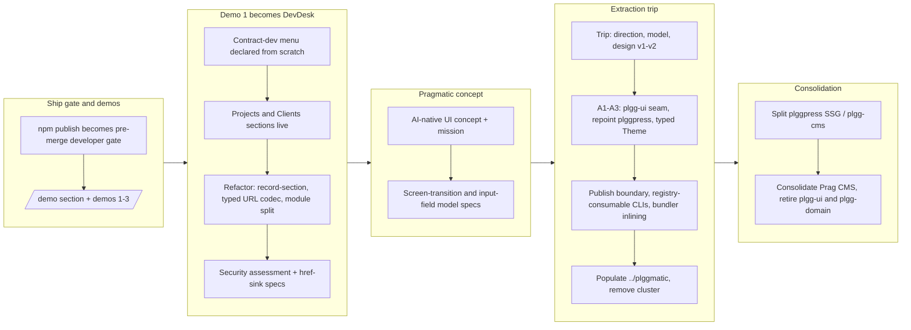

## 1. Overview

This branch matured the plggmatic demo story into a full business-management example app, then executed the plggmatic extraction cut: the engine and theme were split out, the Pragmatic design system moved to its own repository, plggpress was split into a slim SSG plus a dynamic CMS, and the temporary plgg-ui/plgg-domain package boundaries were retired into plgg-cms. Along the way npm publishing became a developer-driven pre-merge /ship gate, the run-from-source plgg CLIs became registry-consumable, and plgg-bundle learned to build standalone apps from published dependencies.

**Highlights:**

1. Extracted the plggmatic design system into its own repository (../plggmatic) via an Agent-Teams trip, leaving the reusable engine in the plgg family
2. Split plggpress into a slim SSG package and a new dynamic CMS package (plgg-cms), then consolidated Prag UI/content/domain into plgg-cms and retired the plgg-ui and plgg-domain package boundaries
3. Grew Demo 1 from a pane-alignment stub into DevDesk, a contract-dev business-management app with typed URL-state codec, pure update, module split, and a written security assessment
4. Made the run-from-source plgg CLIs (plgg-bundle, plgg-test, plggpress) registry-consumable and taught plgg-bundle to inline published dependencies for standalone app builds
5. Made npm publish a developer-driven, pre-merge, bump-only /ship gate and recorded the Pragmatic AI-native UI concept with screen-transition and input-field model specs

## 2. Motivation

The work started from two pressures. First, the plggmatic documentation site needed demos that prove each pillar of the framework in isolation, and PR #60 had shown that npm publishing could silently no-op at ship time — so publishing had to become an explicit developer gate. Second, as Demo 1 grew into a realistic business application, it became clear that the Pragmatic design system and the generic scheduler engine were two different products living in one monorepo. Rather than keep them entangled, the developer ran a design trip that framed the cut as a product decision: the guarantee-bearing engine stays as narrow plgg-family infrastructure, while the Pragmatic identity, design language, and DSL ambitions move to their own repository with an independent cadence. Executing that cut surfaced real infrastructure gaps — packages that only ran from monorepo source, a bundler that could not consume published dependencies — which were fixed on the way, and the final consolidation folded the transitional package boundaries back into plgg-cms so the public surface matches the intended product shape.

## 3. Changes

Work opened with the npm-publish ship gate and three pillar demos, then Demo 1 grew step by step into the DevDesk business app — menu, live sections, search flow, three-stage refactor, and a security assessment. The Pragmatic AI-native UI concept and its two model specs set the product frame, after which an Agent-Teams trip designed the extraction cut. Executing it took five tickets plus infrastructure work (publish boundary, registry-consumable CLIs, bundler dependency inlining) before the cluster left the monorepo, and the branch closed by consolidating the remaining packages into plgg-cms.

### 3-1. npm publish becomes a developer-driven, pre-merge gate ([bfe7518a](https://github.com/qmu/plgg/commit/bfe7518a))

Rewrote the npm deployment contract so `/ship` pauses before the merge whenever a package version was bumped, asks the developer to publish, and waits for confirmation — replacing the silent post-merge publish-if-newer step that no-opped on PR #60. `publish-npm.sh` was refined to preflight and target only bumped packages instead of walking every package.

### 3-2. Add a /demo section to the plggmatic site ([f3fa5f21](https://github.com/qmu/plgg/commit/f3fa5f21))

Added a `/demo` index catalog page plus three honest stub pages to the plggmatic documentation site, restarting the examples presentation around three numbered pillar demos while keeping the existing workbench and forms showcase cross-linked.

### 3-3. Demo 1 — pane alignment ([924247ad](https://github.com/qmu/plgg/commit/924247ad))

Filled the `/demo/1` slot with a runnable proof of the column/pane alignment primitives: a live three-pane layout the reader can fold and resize, composed by hand from the raw layout combinators without the scheduler.

### 3-4. Demo 2 — color scheme ([b4c58a98](https://github.com/qmu/plgg/commit/b4c58a98))

Filled the `/demo/2` slot with a runnable token-driven light/dark reschemer: the framework's own themeToggle wired to a grid of semantic-token swatches and components that all rescheme when the single `html.dark` class flips.

### 3-5. Demo 3 — scheduler query + derived URL codec ([b9633754](https://github.com/qmu/plgg/commit/b9633754))

Filled the `/demo/3` slot with the smallest deep-linkable `schedule(declare(...))` program, proving that the URL is the derived, canonical, total codec: query text, row selection, deep links, and history all flow through the derived codec with no hand-written parsing.

### 3-6. Replace Demo 1 with a contract-dev business-management menu ([d7ad9f81](https://github.com/qmu/plgg/commit/d7ad9f81))

Pivoted Demo 1 from the pane-alignment showcase into step one of a business-management system for a contract software-development company: an eight-section menu declared from scratch as pure data and rendered by the scheduler as navigation.

### 3-7. Bring the Demo 1 Projects section to life ([b3c687b2](https://github.com/qmu/plgg/commit/b3c687b2))

Made Projects a real section — filterable list, rich detail view, and a child drill to Milestones — all still pure declaration through `collection`, `query`, detail `field`s, and `child`, with no hand-written model, messages, or router.

### 3-8. Resume: build out the bizops demo ([ff7fe4d4](https://github.com/qmu/plgg/commit/ff7fe4d4))

Continued the buildout across several sessions: brought Clients to life, renamed the app to DevDesk, added an app-owned client register form, a light/dark toggle with navbar chrome, and refined navigation and column presentation.

### 3-9. Fix plgg documentation drift ([026c304e](https://github.com/qmu/plgg/commit/026c304e))

Aligned the public plgg documentation with the current implementation for the guide development workload, the plgg-highlight tokenizer migration, and public package import paths.

### 3-10. Verify and commit the Demo 1 section-navigation + search flow ([901230e8](https://github.com/qmu/plgg/commit/901230e8))

Resumption checkpoint that verified and committed a long interactive design pass: Demo 1's navigation reworked into a text-link sidebar with a per-section search → results → detail flow.

### 3-11. Collapse Demo 1's parallel record paths into one descriptor ([87db3117](https://github.com/qmu/plgg/commit/87db3117))

First refactor step: collapsed the fully parallel Client/Project code paths (types, mappers, form builders, ~14 doubled input message variants) into a single generic record-section descriptor and one section-parameterized field-input message.

### 3-12. Replace string-keyed URL helpers with a typed codec ([584a1cdb](https://github.com/qmu/plgg/commit/584a1cdb))

Second refactor step: replaced ~10 string-keyed URLSearchParams helpers and an ad-hoc boolean cascade with a typed URL-state codec — parse once into a discriminated view-stage union, print back to a Url, derive the view from an exhaustive match.

### 3-13. Split the Demo 1 monolith into modules with a pure update ([5ac36685](https://github.com/qmu/plgg/commit/5ac36685))

Third refactor step: split the 2000-line monolith into demo2-shaped concern modules, moved module-global mutable record collections into an encapsulated store so `update()` is pure, and extracted the inline CSS overrides into a named stylesheet.

### 3-14. Demo 1 security assessment ([9036ad3d](https://github.com/qmu/plgg/commit/9036ad3d))

Assessed Demo 1's security posture and recorded it durably: a written findings report checked into the repo plus colocated spec assertions pinning the href-sink and URL-param injection behavior, with a documented verdict per design-pillar security lens.

### 3-15. Give the scheduler Model-driven collection sources ([f3912838](https://github.com/qmu/plgg/commit/f3912838))

Added dynamic Sources to the scheduler so Demo 1's records live in the app Model, completing the pure-update goal the module-split ticket had to defer.

### 3-16. Specify Pragmatic's screen-transition model ([79de4cf6](https://github.com/qmu/plgg/commit/79de4cf6))

Specification ticket distilling how the next screen arises from data and situation rather than a hand-wired navigation graph — the testable properties that make transitions AI-generatable and AI-operable, feeding the future DSL.

### 3-17. Specify Pragmatic's input-field model ([60ab7f99](https://github.com/qmu/plgg/commit/60ab7f99))

Companion specification for the input half: how a field carries its function (control, validation, affordance) so a generating AI can assemble the right input and an operating agent can fill and submit it deterministically.

### 3-18. A1 — Scaffold plgg-ui and re-home the engine+theme tree ([d7f2f047](https://github.com/qmu/plgg/commit/d7f2f047))

First extraction step from the trip design: created `plgg-ui` and moved the plggmatic engine and theme tree into it byte-stable, with zero behavior change, establishing the reusable seam.

### 3-19. A2 — Repoint plggpress onto plgg-ui ([e2c6c627](https://github.com/qmu/plgg/commit/e2c6c627))

Rewired the consumers: pointed plggpress's import surfaces at `plgg-ui`, dropped the plggpress→plggmatic dependency, and reduced plggmatic to a thin facade.

### 3-20. A3 — Parameterize plgg-ui's theme as a typed Theme ([08aa2973](https://github.com/qmu/plgg/commit/08aa2973))

The answer to the "empty shell" risk: made the theme a typed, parameterized `Theme` value — plggpress passes its theme explicitly at its composition root, and plggmatic owns the design-language contract.

### 3-21. plgg-md: raw-HTML passthrough and injectable heading slugger ([841b1de5](https://github.com/qmu/plgg/commit/841b1de5))

Closed two verified gaps blocking the qmu.co.jp corpus migration to plggpress: raw-HTML passthrough in plgg-md and a site-suppliable heading slugger.

### 3-22. Resume: settle the plggmatic publish boundary ([8829d9b8](https://github.com/qmu/plgg/commit/8829d9b8))

Superseded ticket B's remaining work: settled which packages publish and how the extracted repository consumes them, bumping drifted closure packages for the extraction republish and recording the remaining blockers.

### 3-23. Split plggpress into a slim SSG + plgg-cms ([f3bb180a](https://github.com/qmu/plgg/commit/f3bb180a))

Separated the two concerns plggpress had grown: the static site generator stays slim, and the dynamic content/server CMS (admin UI, content API, auth) moved into the new `plgg-cms` package.

### 3-24. Make the run-from-source plgg CLIs registry-consumable ([e6218c9a](https://github.com/qmu/plgg/commit/e6218c9a))

Made plgg-bundle, plgg-test, and plggpress installable from the registry by relocating their run-from-source trees out of node_modules at install time, fixing the stale-cache bug by keying the relocation directory on install location.

### 3-25. Teach the app bundler published-dependency inlining ([8ebe84e9](https://github.com/qmu/plgg/commit/8ebe84e9))

Unblocked standalone app builds (extraction blocker 3): plgg-bundle's app target now consumes published dependencies instead of requiring monorepo source siblings.

### 3-26. B — Initialize and populate ../plggmatic ([38cb0eec](https://github.com/qmu/plgg/commit/38cb0eec))

Turned the empty sibling repository into the standalone Pragmatic design-system + showcase, consuming published plgg-family packages; the remaining publish-boundary work was carried into the resume ticket (3-22) that completed it.

### 3-27. C — Remove the plggmatic cluster from the monorepo ([540d2f36](https://github.com/qmu/plgg/commit/540d2f36))

Final extraction step: removed the plggmatic cluster (facade, example, site) from this monorepo, keeping the engine, and rewired the build/install/check scripts accordingly.

### 3-28. Consolidate Prag UI and Prag content into Prag CMS ([87b46fc9](https://github.com/qmu/plgg/commit/87b46fc9))

Collapsed the three-package Prag surface deliberately: `plgg-content` merged into `plgg-cms`, aligning the package boundary with the intended product boundary while preserving the SSG/CMS split.

### 3-29. Retire plgg-ui and plgg-domain package boundaries ([807a422c](https://github.com/qmu/plgg/commit/807a422c))

Closed the consolidation: moved the CMS admin UI runtime and declaration vocabulary into `plgg-cms`, the static theme primitives into plggpress, and deleted the old package docs, links, locks, and metadata so the guide no longer exposes the retired packages.

## 4. Outcome

- Made npm publishing a developer-driven, pre-merge, bump-only gate at `/ship` ([bfe7518a](https://github.com/qmu/plgg/commit/bfe7518a)), replacing a silent post-merge no-op that had shipped PR #60 with zero publish signal.
- Rebuilt the plggmatic documentation site's example section from scratch: a numbered `/demo` catalog ([f3fa5f21](https://github.com/qmu/plgg/commit/f3fa5f21)) plus three isolated-pillar demos — pane alignment ([924247ad](https://github.com/qmu/plgg/commit/924247ad)), color scheme ([b4c58a98](https://github.com/qmu/plgg/commit/b4c58a98)), and scheduler query/URL codec ([b9633754](https://github.com/qmu/plgg/commit/b9633754)).
- Pivoted Demo 1 into a full running "DevDesk" contract-development business app: an eight-section menu declared as pure data ([d7ad9f81](https://github.com/qmu/plgg/commit/d7ad9f81)), a live filterable Projects section with labelled detail records ([b3c687b2](https://github.com/qmu/plgg/commit/b3c687b2)), a live Clients section ([ff7fe4d4](https://github.com/qmu/plgg/commit/ff7fe4d4)), an app-owned client registration form, light/dark theming and navbar chrome, and a generalized per-section Add/Search flow driven entirely by URL params ([44dd4fc0](https://github.com/qmu/plgg/commit/44dd4fc0)) — every state deep-linkable.
- Hardened Demo 1 through a three-step refactor sequence once the interactive build-out stabilized: collapsed duplicated Client/Project code paths into one generic record-section descriptor ([87db3117](https://github.com/qmu/plgg/commit/87db3117)), replaced roughly ten string-keyed URL helpers with a typed `AppLayer` codec ([584a1cdb](https://github.com/qmu/plgg/commit/584a1cdb)), and split the resulting monolith into focused modules with the mutable record store isolated and documented ([5ac36685](https://github.com/qmu/plgg/commit/5ac36685)) — each step verified byte-identical against a frozen spec.
- Ran and recorded a formal security assessment of Demo 1 ([9036ad3d](https://github.com/qmu/plgg/commit/9036ad3d)): no findings, with the verdict and reasoning checked into the repo alongside new href-escaping regression specs.
- Fixed public plgg documentation drift ([026c304e](https://github.com/qmu/plgg/commit/026c304e)) — stale guide-dev/highlighter descriptions and broken guide example imports — and later taught the guide build to delete stale generated output before rebuilding, so removed package routes stop being servable ([6c6d84d9](https://github.com/qmu/plgg/commit/6c6d84d9)).
- Added plgg-md raw-HTML passthrough and an injectable github-slugger-compatible heading slugger ([841b1de5](https://github.com/qmu/plgg/commit/841b1de5)) to unblock the qmu.co.jp site's migration from Astro to plggpress.
- Wrote two Pragmatic DSL foundation specs: the screen-transition model ([79de4cf6](https://github.com/qmu/plgg/commit/79de4cf6)) and the input-field model ([60ab7f99](https://github.com/qmu/plgg/commit/60ab7f99)), both defining AI-generatable/AI-operable property sets that a later Pragmatic DSL will build on.
- Ran a full `/trip` Agent-Teams design session (`plggmatic-extraction-cut`) that settled a major architectural boundary question — the plggmatic engine+theme is generic plgg-family infrastructure and stays as a new package, `plgg-ui`, while the Pragmatic design-system identity, DSL, and showcase move to a new standalone `../plggmatic` repository — then executed the resulting ticket chain: extracted the engine into `plgg-ui` byte-stably ([d7f2f047](https://github.com/qmu/plgg/commit/d7f2f047)), repointed plggpress off plggmatic onto `plgg-ui` ([e2c6c627](https://github.com/qmu/plgg/commit/e2c6c627)), parameterized `plgg-ui`'s theme into a typed closed `Theme` so the extracted plggmatic package would not be an empty shell ([08aa2973](https://github.com/qmu/plgg/commit/08aa2973)), added a dynamic `Source` capability so Demo 1's `update()` could become pure ([f3912838](https://github.com/qmu/plgg/commit/f3912838)), settled the cross-repo publish boundary after fixing three registry-consumability blockers — CLI tools that ran from TypeScript source under `node_modules` ([e6218c9a](https://github.com/qmu/plgg/commit/e6218c9a)), drifted published package versions, and the app bundler's monorepo-only dependency discovery ([8ebe84e9](https://github.com/qmu/plgg/commit/8ebe84e9)) — ([38cb0eec](https://github.com/qmu/plgg/commit/38cb0eec), [8829d9b8](https://github.com/qmu/plgg/commit/8829d9b8)), and finally deleted the plggmatic/plggmatic-example/site packages from the monorepo ([540d2f36](https://github.com/qmu/plgg/commit/540d2f36)) once the standalone repo was verified green against published artifacts.
- Consolidated the post-extraction package graph twice more: split plggpress into a slim publishable SSG plus a new dynamic `plgg-cms` package ([f3bb180a](https://github.com/qmu/plgg/commit/f3bb180a)), folded the newly-independent `plgg-content` and `plgg-mcp` packages into `plgg-cms` ([87b46fc9](https://github.com/qmu/plgg/commit/87b46fc9)), and finally retired the `plgg-ui` and `plgg-domain` package boundaries entirely — moving the admin UI runtime and durable-domain core into `plgg-cms` and the static theme primitives into plggpress ([807a422c](https://github.com/qmu/plgg/commit/807a422c)) — so the live guide no longer exposes packages that are not the current product boundary.

**Metrics:** 29 tickets archived, roughly 65 commits on the branch, net package-graph churn of at least 8 packages added/removed/folded (`plgg-ui` created then retired, `plgg-cms` created, `plgg-content`/`plgg-mcp`/`plgg-domain`/`plggmatic`/`plggmatic-example`/`site` all removed from the monorepo), one full `/trip` planning session, and one new standalone external repository (`../plggmatic`).

## 5. Historical Analysis

- This branch continued a pattern from the story corpus of using `/trip` Agent-Teams sessions for consequential, hard-to-reverse architectural boundary decisions rather than deciding them inline during a single-agent `/drive`. The `plggmatic-extraction-cut` trip ran a full Planner/Architect/Constructor/Lead review cycle — including a round where the Planner requested revision on the first model because a neutral default theme would have handed Pragmatic's design language to the generic engine (an "empty shell" risk) — before any code was written, matching the `modular-monolith-first` policy's requirement that a separate-repo split be justified by an ADR.
- Package-boundary churn is a recurring theme across the whole concern corpus (carried-forward items dating back to PR #31 track plgg-server/plgg-fetch vendor coupling and a missing monorepo versioning policy). This branch is the culmination: it finally executed the extraction those earlier concerns anticipated, and then, within the same branch, partially reversed its own decision — retiring the freshly-created `plgg-ui` package boundary only days after creating it — once real consumption data (only plggpress plus one external repo) showed a standalone package wasn't earning its keep. The willingness to un-make a very recent decision once it stopped matching reality is consistent with this repo's stated preference for breaking changes over preserving structure for its own sake.
- The Demo 1 arc is a clear "prototype fast under active user review, then pay down debt before the next feature" cycle: roughly a week of interactive, developer-driven design iteration (menu, then Projects, then Clients, then forms, then theming, then a generalized search flow) was followed immediately by a three-ticket refactor sequence (dedupe, then a typed URL codec, then a module split) once the shape stabilized — each step protected by a frozen, byte-identical spec so restructuring could not silently change behavior.
- The npm-publish-gate ticket is a direct incident-response pattern: PR #60 merged with a silent publish no-op, and the very first ticket on this branch closed that gap by making the ship workflow ask-and-wait instead of fire-and-forget, echoing this repo's established habit of turning a dogfooding surprise into a same-branch process fix rather than a deferred concern.
- Registry-consumability surfaced three separate blockers in sequence during the extraction (TypeScript-source CLIs failing under `node_modules`, drifted published package versions, and a monorepo-only app bundler). Each was root-caused and fixed in the monorepo rather than worked around in the standalone repo, continuing this project's standing preference for treating build/publish flakiness as a real bug to fix at the source.

## 6. Concerns

### 89 standing deferred concerns carried (PRs 31–60)

- **Severity:** low
- **Description:** 89 of the 94 deferred concerns re-judged this cycle were verdicted `still_active`; the remaining 5 were resolved on this branch (see below) and are not carried forward. By bucket-of-record: PR #31 (6), PR #37 (8), PR #40 (4), PR #41 (3), PR #46 (15, mostly re-carries of the #31/#37/#40/#41 clusters), PR #47 (5), PR #48 (4), PR #49 (5), PR #51 (16), PR #52 (3), PR #53 (9), PR #55 (1), PR #59 (4), PR #60 (6). The clusters cover: plgg-http/plgg/match type-system limitations (binary-request bytes field, `mapErr` annotation requirements, match exhaustiveness gaps, the dist-rebuild requirement, the route-table 404/405 trade-off, the `BodyInit` copy seam — origin PR #31); renderer/TEA effects gaps and a plgg-server/plgg-fetch vendor coupling (origin PR #37/#40); SSG v1 minimalism and no monorepo versioning policy (origin PR #41); plgg-bundle export-surface/minify/warm-rebuild gaps and a post-merge deploy-guide verification obligation (origin PR #47); plgg-db-migration review carries (origin PR #48); Dependabot/CI config gaps (origin PR #49); plggpress facade disambiguation, hot-reload, HttpStatus refinement, an undocumented Principle (a), and limited proc error-channel adoption (origin PR #51, still live as of PR #55); ops CNAME/HTTPS re-enable follow-ups (origin PR #52); and plgg-parser/plgg-highlight design notes (origin PR #59). None of these domains were touched by this branch's work (the npm gate, the plggmatic demos, the plggmatic extraction, or the CMS package consolidation). Separately, 5 carried concerns were judged resolved this cycle: the facade-plain-names/facade-barrel shadowing concerns were resolved when the plggmatic cluster (and its root barrel) was removed from the monorepo ([540d2f36](https://github.com/qmu/plgg/commit/540d2f36)), and the plggpress-exports-map-is-import-only concern was resolved when the SSG/CMS split added a require-reachable default export condition ([f3bb180a](https://github.com/qmu/plgg/commit/f3bb180a)).
- **How to Fix:** No single fix — this is a maintenance backlog, not a defect. Continue re-judging it every `/ship` cycle; the full corpus lives under `.workaholic/concerns/*.md`. Consider periodically retiring the meta "N carry-over concerns" summary documents once their underlying items are fully resolved, so the corpus stops growing purely from re-stamping the same unresolved items cycle over cycle.

### npm-publish gate depends on the ship agent following prose, not an enforced mechanism

- **Severity:** moderate
- **Description:** The new developer-driven, pre-merge, ask-and-wait npm publish gate is encoded entirely in `.workaholic/deployments/npm.md`'s Procedure prose (see [bfe7518a](https://github.com/qmu/plgg/commit/bfe7518a)), relying on the `/ship` agent executing that prose literally every time. There is no first-class mechanism in the workaholic plugin itself that forces a pause-and-wait; a future change to the ship skill could silently drop the pause and reintroduce the exact silent-no-op failure this ticket was written to fix.
- **How to Fix:** Add a first-class developer-driven `confirmation_method` (or equivalent gate primitive) to the workaholic ship plugin itself, so the pause-and-wait behavior is enforced by the harness rather than by an agent correctly following documentation each time.

### plgg-cms coverage sits at a thin 90.5% margin above the gate

- **Severity:** moderate
- **Description:** The plggpress/plgg-cms split ([f3bb180a](https://github.com/qmu/plgg/commit/f3bb180a)) left plgg-cms at 90.5% function coverage, just above this repo's strict >90% threshold, with `server/pressServer.ts` and `media/assetExportFs.ts` coverage-excluded as composition/IO wiring per the established pattern. The margin is thin enough that a small future change could tip the gate red.
- **How to Fix:** Add targeted tests for plgg-cms's less-exercised branches to widen the margin, preferring `proc`-based short-circuiting over `isErr`-guard chains so the added tests don't themselves create uncoverable defensive branches.

### Demo 1's CSS overrides hard-couple to plgg-ui/plggmatic's `pm-*` class names by literal string match

- **Severity:** moderate
- **Description:** Demo 1's chrome styling targets framework `pm-*` class hooks by name rather than through an exported style API (flagged in [767cdd72](https://github.com/qmu/plgg/commit/767cdd72) and revisited during the module split in [5ac36685](https://github.com/qmu/plgg/commit/5ac36685), which extracted but did not remove the coupling). A future rename inside the engine (now split across plgg-cms and plggpress) would silently break the demo's styling with no compiler signal.
- **How to Fix:** Introduce a small, documented style-hook surface (exported class-name constants or stable CSS custom properties) that consumer apps import instead of literal `pm-*` selectors, so a class rename becomes a type/import error instead of a silent visual break.

### plgg-ui's package boundary was retired in-repo while an external repo may still depend on the published artifact

- **Severity:** moderate
- **Description:** The final ticket in this chain ([807a422c](https://github.com/qmu/plgg/commit/807a422c)) retired the `plgg-ui` package boundary, folding its UI runtime into plgg-cms and its static theme primitives into plggpress — reversing the extraction-era decision (recorded in [87b46fc9](https://github.com/qmu/plgg/commit/87b46fc9) and [8829d9b8](https://github.com/qmu/plgg/commit/8829d9b8)) to keep `plgg-ui` published specifically because plggpress and the standalone `../plggmatic` repository both consumed it. Now that `plgg-ui` has no source in this monorepo, there is no way to publish a fix or feature to it if `../plggmatic` (or any other external consumer) still needs one, and nothing in this repo's CI would notice that drift.
- **How to Fix:** Confirm whether `../plggmatic` still depends on the published `plgg-ui` package; if so, either keep a minimal published shim reachable from this repo or document `plgg-ui@<last-version>` as a frozen, unmaintained artifact and record the migration path for the standalone repo to absorb the runtime it needs directly.

### Registry-consumability blockers were fixed reactively, three times, with no preventive gate

- **Severity:** moderate
- **Description:** The plggmatic extraction hit three separate registry-consumability blockers in sequence — CLI tools that ran from TypeScript source and failed under `node_modules` ([e6218c9a](https://github.com/qmu/plgg/commit/e6218c9a)), plgg-family published versions that had drifted from the monorepo without a bump, and the app bundler's monorepo-only dependency discovery ([8ebe84e9](https://github.com/qmu/plgg/commit/8ebe84e9)) — each discovered only when the standalone repo's `check-all` was run against real published artifacts. Nothing in this monorepo's own CI would have caught any of the three earlier.
- **How to Fix:** Add a lightweight, periodic CI job that does a real `npm pack` plus fresh install plus `check-all` smoke of the core plgg CLIs (plgg-bundle, plgg-test, plggpress) outside the monorepo, so drift between monorepo source and published artifacts is caught automatically rather than only when the next cross-repo extraction stumbles on it.

### Demo 1 record data is in-memory only; it does not persist across reloads

- **Severity:** low
- **Description:** Clients and projects created through Demo 1's registration form live in module memory ([1edba619](https://github.com/qmu/plgg/commit/1edba619)) and reset on every page reload; there is no localStorage or session persistence.
- **How to Fix:** If the demo needs to survive reloads, add a localStorage-backed persistence layer behind the same dynamic `Source` seam added in [f3912838](https://github.com/qmu/plgg/commit/f3912838); otherwise leave it documented as an intentional demo-only limitation.

### Demo 2's pre-existing button contrast bug was worked around, not fixed

- **Severity:** low
- **Description:** Demo 2's shared `demoCss` pairs `.pm-btn-primary`'s fill (`primary-base`) with an ink color (`primary-text`) that renders invisibly in both schemes; rather than fixing the token pairing, the sample buttons that exposed the bug were simply dropped from the demo ([b4c58a98](https://github.com/qmu/plgg/commit/b4c58a98)).
- **How to Fix:** Fix the primary-button token pairing in the shared theme (now living across plgg-cms/plggpress) so a future consumer that re-adds a primary-button sample does not hit the same invisible-label bug.

## 7. Successful Development Patterns

- **Frozen-spec, byte-identical refactoring.** The three-step Demo 1 refactor (generic record-section descriptor, typed URL codec, module split) and the three-step plggmatic extraction (extract engine, repoint consumer, parameterize theme) each pinned a spec or a golden output snapshot and verified `git diff` was empty or output byte-identical before calling the step done. This let large structural changes land with confidence that behavior, not just types, was unchanged — a repeatable technique worth reusing on any future large refactor in this codebase.
- **Golden-snapshot-before-change.** For the theme parameterization step ([08aa2973](https://github.com/qmu/plgg/commit/08aa2973)), an independent CSS snapshot was captured from the pre-change dist *before* touching the emitters, then diffed byte-for-byte against the post-change output. Capturing the baseline before editing (rather than trusting the existing spec suite alone) guarded against a regression the exact-string specs might have missed.
- **Two-round `/trip` review before an irreversible boundary decision.** The `plggmatic-extraction-cut` trip ran Planner/Architect/Constructor through two full review rounds — the first round caught a real design flaw (a neutral default theme would have made the extracted plggmatic package an "empty shell") before any ticket was written — then paused for explicit developer approval before decomposition into tickets. Spending the review cycles up front on a hard-to-reverse package split caught a costly mistake at the cheapest possible point.
- **Explicit ticket dependency chaining with a hard pause.** The five-ticket extraction chain (A1→A2→A3→B→C) was decomposed with `depends_on` links and a developer-approval gate between planning and building, so no ticket could be driven out of order and the developer had one clear checkpoint to stop the whole migration before code changed.
- **Reusing the coverage-exclusion pattern instead of inventing new tests for pure wiring.** When plgg-cms split off, its thin composition/wiring files (`serve`/`authWeb`/`bootstrapAuth`, `cli.ts`) were coverage-excluded following the monorepo's existing pattern rather than writing artificial tests just to satisfy the gate — keeping the coverage signal meaningful.
- **Proving cross-repo correctness against real published artifacts, not local file-links.** The publish-boundary ticket deliberately repinned the standalone `../plggmatic` repo to actually-published npm versions and ran its own `check-all` against them, rather than trusting a locally patched or file-linked verification — this is precisely what surfaced the three registry-consumability blockers early, before they could reach an external consumer.
- **Treating a "no findings" security assessment as a first-class deliverable.** Demo 1's security assessment ([9036ad3d](https://github.com/qmu/plgg/commit/9036ad3d)) was checked into the repo as a durable report with per-lens verdicts and new regression specs, even though the outcome was "no findings" — preserving the reasoning so a future change that adds a server/auth surface knows to re-run the assessment.
- **Live-browser verification paired with automated tests on nearly every commit.** Across the whole Demo 1 build-out and the extraction, almost every commit's Verify section paired a green automated test run with an explicit browser-driven check (deep links, theme toggle, console errors) — catching visual/interaction issues (like the invisible active-nav pill and invisible primary-button label) that a passing test suite alone would not have caught.

## 8. Release Preparation

**Verdict**: Ready for release

### 8-1. Concerns

- None - changes are safe for release

### 8-2. Pre-release Instructions

- None - standard release process applies

### 8-3. Post-release Instructions

- None - no special post-release actions needed

## 9. Notes

The extraction tickets (3-18 through 3-20, 3-26, 3-27) originate from the `plggmatic-extraction-cut` Agent-Teams trip; the design rationale behind them — direction, model v1/v2, design v1/v2, and the review trail that converged on one `plgg-ui` package with a parameterized typed Theme — lives in [.workaholic/trips/plggmatic-extraction-cut/designs/](../trips/plggmatic-extraction-cut/designs/). Each extraction ticket's Trip Origin links back to that design.

Note on commit links: the archived tickets' recorded `commit_hash` values predate history amendments; the links in section 3 point at the commits actually on this branch.
