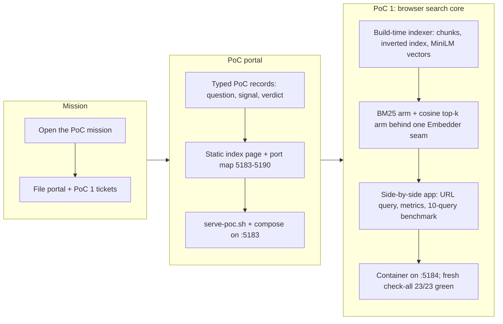

## 1. Overview

This branch opened the `plggpress-technical-confidence-poc-portal` mission and delivered its first two artifacts in one overnight drive: the PoC portal — a static index app recording the six-PoC confidence-collection plan with the fleet's `*.qmu.dev` hostname/port allocation — and PoC 1, a browser-side benchmark that pits a from-scratch BM25 full-text index against MiniLM vector RAG on the real plgg guide corpus. Both ship as private packages served from their own containers (ports 5183/5184), wired into the repository's README, build, and check-all gates.

**Highlights:**

1. PoC 1 measures the plggpress vision's open search decision with real numbers: on the 38-file guide corpus (178 chunks, ~118 KB), the from-scratch full-text index costs 252 KB / 19 ms to build, while MiniLM embeddings cost 1.4 MB (5.7× the corpus) / ~11 s — with query-time model download/init deliberately kept visible as a metric
2. The PoC portal records the six-PoC plan (question, confidence signal, status, verdict) as typed data and allocates the fleet's ports/hostnames (5183–5190, `plgg-poc*.qmu.dev`)
3. Both arms run fully locally: build-time chunk embedding uses the same local MiniLM model the browser loads, so no API key is needed and the corpus never leaves the machine (the OpenAI-shaped network embedder ships as a key-gated, honestly-degraded alternative)
4. A single generic `scripts/serve-poc.sh <workload>` runner and a Dockerfile-less compose recipe (stock node:22-slim running TypeScript entrypoints against the repo mount) serve the whole fleet

## 2. Motivation

The plggpress vision (SSG + Browser RAG for both Writer and Reader) carries several open technical risks — browser search, an embedded reader agent, a realtime voice writer, agent file-editing over hot reload, generated central configuration, and non-tree classification. Rather than committing the production architecture on opinions, the developer opened a mission to collect confidence through a fleet of small, discardable PoCs, each on its own port behind its own cloudflared hostname, indexed by one portal so every open question, running proof, and verdict stays reviewable in one place. The first technical question tackled is the vision's own stated fork: "browser-side vector DB RAG only when its full scratch cost is affordable — or indexed full-text search on the browser side." PoC 1 answers it with measurements on the real corpus instead of argument.

## 3. Changes

The night drive ran the two tickets in dependency order: the portal first (it allocates the ports and records the plan), then PoC 1 on the allocated slot. Everything was implemented, measured, verified (typecheck, smoke specs, gates, container probes, a headless-browser pass over the FTS arm), and committed autonomously; the two developer-owned steps — applying the cloudflared ingress and judging the canned-query results into a recorded verdict — were left as explicit morning actions.

### 3-1. PoC portal: the plggpress confidence-collection index app + port/hostname map ([c6dede31](https://github.com/qmu/plgg/commit/c6dede31))

Built `packages/plgg-poc-portal` (private): the six-PoC plan as typed, invariant-checked records rendered by one pure view to a fully static page — no client bundle, since SSG plus plgg-view's style atoms proved sufficient. Added the fleet's allocation map (portal :5183, PoC 1 :5184, 5185–5190 reserved), the generic `scripts/serve-poc.sh` runner, and a Dockerfile-less compose workload.

### 3-2. PoC 1 — browser search core: indexed full-text search vs vector RAG on the guide corpus ([25306ea0](https://github.com/qmu/plgg/commit/25306ea0))

Built `packages/plgg-poc1-search` (private): a build-time indexer chunks the guide by heading path and emits a JSON inverted index plus locally-computed MiniLM chunk embeddings; the browser runs a from-scratch BM25 arm and a cosine top-k arm (ranking core copied verbatim from plgg-cms's pure `similarity.ts`) behind one `Embedder` seam, in a plgg-view app with a URL-held query, side-by-side panes, a measured metrics table, and a ten-query benchmark. The `@huggingface/transformers` dependency is confined to `src/vendors/` with a decision log; the app degrades gracefully to FTS whenever the model or embeddings are unavailable.

## 4. Outcome

This branch launched the `plggpress-technical-confidence-poc-portal` mission and shipped its first two PoCs:

- **PoC portal** (`packages/plgg-poc-portal`): a static, SSG-only browser app (plgg-server `generateStatic`, zero client bundle) that lists all six planned PoCs as typed data — question, confidence signal, status, verdict, and `*.qmu.dev` link — so the fleet's open technical questions and their resolutions stay reviewable in one place. Serves on host port 5183 via `workloads/poc-portal/compose.yaml` and the new generic `scripts/serve-poc.sh <workload>` runner.
- **PoC 1 — browser search core** (`packages/plgg-poc1-search`): moves plggpress's two existing server-side search arms (FTS5/BM25 and network-embedder RAG) into the browser and measures them head-to-head on the real plgg guide corpus (38 files, 178 heading-path chunks, ~118 KB). Build-time indexer emits `fts.json` (~252 KB, ~19 ms build) and `embeddings.json` (MiniLM 384d vectors, ~1.4 MB, ~11 s build); a plgg-view app renders a URL-held query box, side-by-side FTS/RAG panes, a measured metrics table, and 10 canned benchmark queries. Serves on host port 5184.
- Both packages are private, typecheck-and-smoke-gated (not the full >90% coverage bar), and wired into README/build-order/check-all so the fleet stays part of the consolidated local gates; `scripts/check-all.sh` ran fully green (fresh rebuild, 23/23) with both packages included.
- Combined: 24 plgg-test specs green across the two packages, 100% statement coverage on their pure cores (tokenizer, BM25 ranking, inverted-index build, cosine/topK, portal fleet-data invariants), zero `as`/`any`/`ts-ignore` escape hatches, `gate-vendor-boundary` green with the MiniLM/transformers.js dependency confined to `src/vendors/` and no exemption needed.
- Real-browser (headless chromium) verification confirmed asset loading and FTS-arm ranking end-to-end for PoC 1; the RAG arm's in-browser model initialization needs live-browser confirmation (see Concerns).

## 5. Historical Analysis

Both tickets deliberately reuse rather than re-derive prior plggpress work, and the pattern that recurs across the branch's history is "serve behind the existing cloudflared tunnel using the established workload/compose precedent, extend rather than fork it":

- The portal's serving shape (`workloads/<name>/compose.yaml` behind the `qmu-dev` cloudflared tunnel) is the same pattern established for plggpress's server-side production topology ([20260704143028-production-topology-and-operations.md](.workaholic/tickets/archive/work-20260704-130317/20260704143028-production-topology-and-operations.md)), and its port allocation (5183 onward) directly follows the concrete precedent and the 5173 collision documented when the guide was given its own host port ([20260619063054-guide-host-port-5181.md](.workaholic/tickets/archive/work-20260617-214017/20260619063054-guide-host-port-5181.md)).
- The portal's role assumes the current package split between plggpress-as-SSG and plgg-cms-as-dynamic-CMS ([20260709110456-split-plggpress-ssg-and-plgg-cms.md](.workaholic/tickets/archive/work-20260706-120449/20260709110456-split-plggpress-ssg-and-plgg-cms.md)) — the portal targets whichever package later PoC integrations land in.
- PoC 1 is explicitly framed as the browser-side benchmark of already-shipped server-side ancestors, not a re-derivation: the zero-dep embeddings tier and in-JS cosine top-k with hybrid degrade-to-BM25 ([20260704143024-rag-embeddings-and-search.md](.workaholic/tickets/archive/work-20260704-130317/20260704143024-rag-embeddings-and-search.md)), the FTS5/BM25 baseline and its query-sanitizer lessons ([20260704143015-plgg-sql-fts5-support.md](.workaholic/tickets/archive/work-20260704-130317/20260704143015-plgg-sql-fts5-support.md)), and the guide-corpus chunking/heading-path model it mirrors at build time ([20260704143016-plggpress-content-index-and-delivery-api.md](.workaholic/tickets/archive/work-20260704-130317/20260704143016-plggpress-content-index-and-delivery-api.md)). Reusing `cosineSimilarity`/`topK` verbatim from `plgg-cms` (rather than adding a runtime dependency for 30 pure lines) follows directly from that lineage.

The recurring theme: when a new speculative surface (PoC fleet) needs infrastructure, the branch reached for the smallest extension of an already-proven serving/port/dependency pattern instead of inventing a new one, keeping the sacrificial PoC code isolated while its infrastructure stays uniform with the rest of the monorepo.

## 6. Concerns

### 97 standing deferred concerns carried (PRs 31–61)

- **Severity:** low
- **Description:** The deferred-concern judge re-evaluated 97 previously-deferred concerns spanning PRs 31 through 61 (plgg-http/plgg core matching and dist-rebuild, plgg-server/plgg-fetch vendoring, plgg-view renderer runtime, proc Defect channel, monorepo versioning, deploy-guide CI and plgg-bundle export/minify, plgg-db-migration, dependabot/happy-dom scoping, guide Pages HTTPS ops, plggpress facade disambiguation, plgg-parser/plgg-highlight design, and plgg-cms/plgg-ui/plggmatic demo and registry concerns). All 97 were judged `still_active` and zero were resolvable by this branch: work-20260711-035119 is purely additive (two new private PoC packages, a mission, tickets, workload compose files, and README/check-all wiring) and its `git diff main..HEAD` touches none of the core packages or domains those concerns target.
- **How to Fix:** No action from this branch. Continue carrying these forward; see `.workaholic/concerns/` for the individual entries, and resolve each the next time a change actually lands in its target domain (plgg-http, plgg-server, plgg-view, plgg-bundle, plgg-db-migration, etc.).

### RAG arm's in-browser model init unverified outside a real browser

- **Severity:** moderate
- **Description:** PoC 1's vector-RAG arm loads a MiniLM embedding model via ONNX/WASM (`@huggingface/transformers` from a CDN) to embed queries client-side. Headless chromium's `--virtual-time-budget`/`--dump-dom` harness could not drive the WASM module init to completion — probes isolated the stall to the model's `pipeline()` initialization itself (the identical call completes in Node), not to this app's code — so only the FTS arm was confirmed ranking end-to-end in the automated headless run ([25306ea0](https://github.com/qmu/plgg/commit/25306ea0), `packages/plgg-poc1-search/src/vendors/`). The app shows its designed loading/failed states meanwhile and FTS stays fully functional (graceful degradation), so nothing is silently broken, but the RAG arm's actual behavior in a real browser remains unconfirmed.
- **How to Fix:** Open `https://plgg-poc1.qmu.dev/` in a real (non-headless) browser or a Playwright interactive session, confirm the RAG arm completes model init and returns ranked results, and record that verdict — including the vector arm's from-scratch cost estimate — on the portal's PoC 1 record (`packages/plgg-poc-portal/src/pocs.ts`) as the ticket's designated morning gate.

### cloudflared ingress for the PoC hostnames is not yet live

- **Severity:** moderate
- **Description:** Both `plgg-poc.qmu.dev` → :5183 (portal) and `plgg-poc1.qmu.dev` → :5184 (PoC 1) are prepared as ingress lines in each package's README for the developer to apply to `~/.cloudflared/config.yml`, per the workaholic system-safety rule that agents never edit host/system config directly ([c6dede31](https://github.com/qmu/plgg/commit/c6dede31), `packages/plgg-poc-portal/README.md`; [25306ea0](https://github.com/qmu/plgg/commit/25306ea0), `packages/plgg-poc1-search/README.md`). Until the developer applies the tunnel change, both qmu.dev URLs 404 at the edge, so the tickets' browser-based approval gates cannot be exercised yet even though the containerized workloads answer correctly on localhost.
- **How to Fix:** Apply the prepared ingress lines to `~/.cloudflared/config.yml` (and any needed DNS route), then confirm both hostnames resolve to their containers before treating either ticket's gate as fully closed.

### CDN model load is an external runtime dependency of the PoC page

- **Severity:** low
- **Description:** The RAG arm's embedding model (~25 MB) loads via a dynamic `import(variable)` from a CDN at page runtime rather than being bundled, keeping the shipped client bundle at ~225 KB ([25306ea0](https://github.com/qmu/plgg/commit/25306ea0), `packages/plgg-poc1-search/src/vendors/`). This is a deliberate, visible trade-off for a discardable PoC, but it does mean the RAG arm's availability depends on a third-party CDN being reachable at request time — a dependency the portal's design otherwise avoids (data sovereignty: corpus and index stay client-side, but the model itself does not).
- **How to Fix:** Leave as-is for the PoC (the measured cost is the point of the exercise); if the RAG arm is ever promoted past PoC status, revisit whether the model should be self-hosted or pinned to a specific CDN version to avoid an unpinned external runtime dependency.

### embeddings.json is 5.7x the corpus size

- **Severity:** low
- **Description:** The build-time embeddings asset for the RAG arm is ~1.4 MB against a ~118 KB source corpus (178 chunks), i.e. roughly 5.7x — this ratio is itself the affordability datum the plggpress vision's "vector RAG only when its full scratch cost is affordable" question asks for ([25306ea0](https://github.com/qmu/plgg/commit/25306ea0), `packages/plgg-poc1-search/dist/index/embeddings.json`). Because the ratio is per-chunk (dimensions × chunk count), it will only grow as the guide corpus grows, unlike the FTS index which scales more gently.
- **How to Fix:** No fix needed now; carry this ratio into the portal's recorded verdict for PoC 1 so any later production-integration decision is measured against a corpus-size-scaled projection, not just today's absolute numbers.

### Portal's verdict data is hand-edited typed data

- **Severity:** low
- **Description:** The PoC portal's fleet record (`packages/plgg-poc-portal/src/pocs.ts`) is hand-edited typed data rather than derived from anything automatic; its own smoke specs enforce invariants like unique ports and the `pocConsistent` verdict rule, but every future PoC ticket must remember to update this file as its final step to keep the mission's confidence-collection index accurate ([c6dede31](https://github.com/qmu/plgg/commit/c6dede31), `packages/plgg-poc-portal/src/pocs.ts`).
- **How to Fix:** Keep treating the `pocConsistent` smoke check as a required gate on every future PoC ticket's Final Report step, since it is the only mechanical safeguard against the record silently drifting from reality as the fleet grows to six-plus entries.

## 7. Successful Development Patterns

- **SSG + style-atoms as a complete zero-bundle UI path**: the portal ships with no client bundle at all — plgg-view's `sx.style_` atoms compile to `Css` attributes that `htmlDocument` folds into one inline `<style>`, so a fully-styled static page needs no stylesheet asset and no client runtime. This worked because the portal's only interactions are links, so the ticket's original CSR-entry sketch was correctly recognized as dead weight once the actual UI surface was known — a reminder that a plan should flex when a simpler implementation satisfies the same requirement (URL-held state, in this case satisfied trivially by plain anchors).
- **Dockerfile-less containers for host-built TypeScript entrypoints**: both PoC workloads run directly on a stock `node:22-slim` image with the repo bind-mounted and no Dockerfile or in-container `npm install`, because the artifact is host-built and the server code uses only Node built-ins. This is the cheapest possible container recipe and worked precisely because it was reserved for cases matching that constraint — the guide's heavier Dockerfile remains necessary only when a container must resolve its own `file:` dependency graph, so the pattern is a genuine narrowing rather than a shortcut taken everywhere.
- **Dynamic `import(variable)` as a CDN passthrough that keeps costs measurable**: plgg-bundle passes a dynamic `import(variable)` straight through to the native runtime untouched (and skips TypeScript module resolution since the specifier isn't static), which let the ~25 MB embedding model load from a CDN at runtime while the client bundle itself stayed at ~225 KB. The reason this worked well is that it kept the actual cost of the heavy dependency visible and measured in the metrics table, rather than hidden inside a bundle size that would otherwise obscure the very affordability question the PoC exists to answer.
- **One shared model constant, asserted before ranking**: chunk and query vectors are stamped with the same embedding-model id from one shared constant, and ranking refuses to run — with an explained state — if that assertion fails. This mattered because a silent cross-space cosine similarity produces plausible-looking but meaningless scores; encoding the invariant as a runtime assertion (rather than trusting convention) turns a subtle correctness bug into an impossible-to-miss failure mode, and the ticket flagged this as a pattern every future plggpress RAG integration should copy.
- **Sequential per-chunk embedding time treated as its own first-class build metric**: rather than only reporting final asset sizes, the indexer recorded build time (~11 s for 178 chunks) alongside byte sizes in `metrics.json`. Treating build latency as a measured output (not an afterthought) is what let the Final Report state the affordability trade-off in concrete, corpus-scaled numbers instead of qualitative impressions.
- **Night-drive work with an explicit developer-owned step carved out**: both tickets' Quality Gates explicitly separated what the agent could verify (typecheck, smoke specs, containerized localhost serving, headless browser checks) from what only a live human-in-a-browser session could confirm (the qmu.dev URLs behind cloudflared, and the RAG arm's WASM model init, which headless chromium's virtual-time harness cannot drive to completion). Naming that boundary up front in the ticket — rather than discovering it mid-implementation — let the agent finish everything it legitimately could overnight and hand off a precise, bounded morning gate instead of an ambiguous "please review."

## 8. Release Preparation

**Verdict**: Ready for release

### 8-1. Concerns

- OPENAI_API_KEY mentions in the diff are documented env-var reads, never committed credentials — the network embedder is key-gated by design.
- doc-drift candidates were judged false positives: CLAUDE.md names only the canonical runners generically (per-package scripts follow the existing convention and are wired into check-all), and docs/ is unrelated to these private packages.
- PoC 1's verdict is deliberately unrecorded pending developer judgment; the RAG arm's in-browser model init awaits a real-browser check. Live-verification follow-ups, not code defects — the app degrades to designed states.

### 8-2. Pre-release Instructions

- None - standard release process applies

### 8-3. Post-release Instructions

- Apply the cloudflared ingress for `plgg-poc.qmu.dev` (:5183) and `plgg-poc1.qmu.dev` (:5184) — developer-applied by design, prepared in the portal README; not a merge blocker for private packages.
- Confirm the PoC 1 RAG arm live in a real browser at https://plgg-poc1.qmu.dev/ and record the verdict (with the vector arm's from-scratch cost estimate) on the portal — the mission's acceptance gate for item 3.

## 9. Notes

This branch was implemented end-to-end by an autonomous overnight `/drive night` run (per-ticket gates auto-approved by the batch authorization; whole-night report delivered for morning review). The two developer-owned follow-ups are deliberately outside the shipped scope: applying the `plgg-poc.qmu.dev`/`plgg-poc1.qmu.dev` ingress lines (prepared in the portal README) and recording PoC 1's verdict on the portal after judging the benchmark in a real browser — the latter flips mission acceptance item 3.

## Deployment Evidence

- **When:** 2026-07-11T12:14:59+09:00
- **Target:** plgg npm packages
- **Method:** api-probe
- **Status:** pass
- **Observed:** PREFLIGHT run: nothing to publish — both new packages (plgg-poc-portal, plgg-poc1-search) are private; no version bumped past the registry.

## Deployment Evidence

- **When:** 2026-07-11T12:14:59+09:00
- **Target:** plgg guide (deploy-on-merge)
- **Method:** api-probe
- **Status:** pass
- **Observed:** Pre-merge readiness: fresh scripts/check-all.sh green (23/23 scripts, strict tsc, full suites) run tonight on this tree with both PoC packages wired in; post-merge promotion check follows the merge.

## Deployment Evidence

- **When:** 2026-07-11T12:17:29+09:00
- **Target:** plgg guide (post-merge promotion)
- **Method:** api-probe
- **Status:** pass
- **Observed:** Deploy Guide run 29137713974 for merge c95e8028 succeeded; https://plgg.qmu.co.jp/ HTTP 200 valid TLS; qmu.github.io/plgg 301-redirects to canonical.
