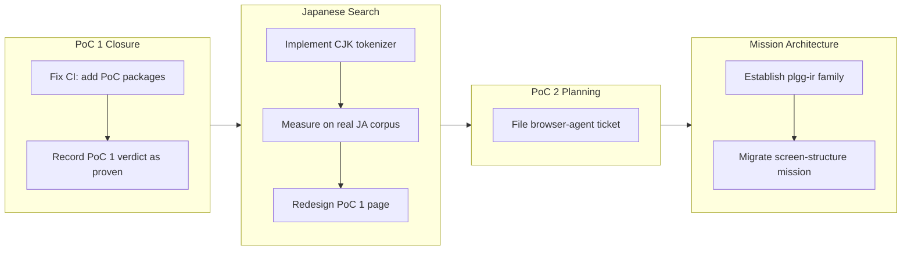

## 1. Overview

This branch completed the PoC 1 work stream by fixing the fresh-clone CI failure, recording the measured verdict in the portal, and adding live Japanese search with measured CJK tokenization. It then pivoted to mission-level architecture: establishing the plgg-ir package family as a durable, typed intermediate-representation toolchain for LLM agents, and migrating plggmatic's screen-structure design mission to its own repository.

**Highlights:**

1. Recorded PoC 1's verdict as proven: BM25 full-text search matches vector RAG quality on the real guide corpus at ~1/5 the payload (fts.json 252 KB vs embeddings.json 1.4 MB)
2. Added a measured CJK tokenizer (Intl.Segmenter + character bigram) and live Japanese search to PoC 1, measured on the vendored real qmu.co.jp Japanese corpus
3. Fixed the red-main fresh-clone CI by adding the two PoC packages to npm-install.sh, encoding the scaffold-time lesson for every future package
4. Established the build-the-plgg-ir-package-family mission: a three-package typed S-expression IR toolchain (syntax / language / manifest) with its full design rationale
5. Migrated the plggmatic screen-structure mission to qmu/plggmatic with cross-repo pointers, and filed the PoC 2 reader-side browser-agent ticket

## 2. Motivation

The branch addressed two convergent needs: completing the exploratory PoC work stream and consolidating the growing body of mission-level design work. The initial focus on PoC 1 revealed a structural CI masking problem — fresh-clone tests failed where warm local builds hid missing dependencies — demonstrating the value of the clean-runner backstop. Recording PoC 1's measured verdict made the CJK caveat concrete and actionable, and the follow-up tokenizer work turned that caveat into measured numbers with a working Japanese search. The subsequent mission work (the plgg-ir family and the plggmatic migration) positioned the ecosystem for statically verifiable, AI-generated domain expressions, with each design thread tracked in the repository where it will actually be driven.

## 3. Changes

Work began with PoC 1 completion: fixing CI breakage that masked fresh-clone failures and recording the measured verdict in the portal. Japanese search implementation introduced Intl.Segmenter-based CJK tokenization measured side-by-side against character bigrams on the real qmu.co.jp corpus — the Segmenter arm reaches bigram-quality retrieval at ~60% of the bigram index size with zero dependencies. The journey then pivoted toward mission-scale architecture: establishing the three-package plgg-ir family (syntax/language/manifest) as a typed IR for AI-generated domain expressions, and migrating plggmatic's screen-structure design work to its own repository with cross-repo integration pointers.

### 3-1. Resume: fix red-main CI (npm-install.sh misses the two PoC packages) ([6ab9687b](https://github.com/qmu/plgg/commit/6ab9687b))

The fresh-clone `Run Tests` backstop was red on main because `scripts/npm-install.sh`'s hand-maintained install loop never gained the two new PoC packages, so a clean clone had no `@types/node` for them (TS2688). Added both packages in dependency order, restoring the merge gate and encoding the durable lesson: every new package joins `npm-install.sh` at scaffold time.

### 3-2. Record the PoC 1 verdict: mark poc1 "proven" in the portal data ([7269afc3](https://github.com/qmu/plgg/commit/7269afc3))

Flipped the portal's single source of truth (`pocs.ts`) for poc1 from `building` to `proven` with the agreed verdict text: BM25 full-text search matches vector RAG on the real guide corpus at ~1/5 the payload and none of the ~25 MB embedding-model tax, with the English-only tokenizer named as the known cost. The `pocConsistent` data invariant made a half-done edit impossible.

### 3-3. PoC 1 CJK tokenizer, measured, + live Japanese search ([48e9a7bf](https://github.com/qmu/plgg/commit/48e9a7bf))

Extended the from-scratch tokenizer with two selectable CJK strategies (Intl.Segmenter words, character bigrams), threaded the strategy through index build and query — stored in the index itself so the two can never mismatch — and measured all three arms on the vendored real qmu.co.jp Japanese corpus (none/segmenter/bigram = 2,906/21,427/34,776 tokens). Shipped a dedicated live Japanese search box, a page redesign, a Japanese-language explainer, and Cache-Control no-store on the PoC dev servers.

## 4. Outcome

- **Fixed the red-main CI backstop:** both PoC packages join the fresh-clone install loop; `Run Tests` is green again.
- **PoC 1 concluded as proven** in the portal's source of truth, with the measured payload comparison (fts.json 252 KB vs embeddings.json 1.4 MB) recorded verbatim and the `pocConsistent` invariant holding.
- **Japanese search works and is measured:** the Segmenter arm reaches bigram-quality retrieval at ~60% of the bigram index size with zero dependencies (Intl.Segmenter is a platform built-in); a live JA query (情報セキュリティ) returns correct hits on the real corpus.
- **Scaffold hygiene closed:** both PoC packages gained their missing `.prettierrc.json`; PoC dev servers send `Cache-Control: no-store`.
- **plgg-ir mission established** with 12 acceptance criteria and the full 43-section design rationale preserved in `design.md` — the three-package family (plgg-ir-syntax / plgg-ir-language / plgg-ir-manifest) for restricted, typed, statically verified S-expression IRs.
- **Screen-structure mission migrated** to qmu/plggmatic (where its tickets will be driven), with the engine-home blocker recorded and a resumption ticket queued there; the ai-native-ui mission's remaining items are annotated as delegated.
- **PoC 2 queued:** the reader-side browser-agent ticket (grounding via PoC 1's proven BM25 arm, dev-server session seam for LLM access) sits in the todo queue as the mission's next step.

## 5. Historical Analysis

**Structural masking of package scaffolding gaps:** gitignored `node_modules/`, a hand-maintained install loop, and a `check-all.sh` that assumes dependencies are present mean any new package that skips `npm-install.sh` passes every warm local run and only fails hosted fresh-clone CI. This is the same "only clean-runner CI catches the masking" failure mode recorded for plgg-bundle's runner dependencies; the durable rule is to add each new package to `npm-install.sh` at scaffold time, alongside README, `check-all.sh`, and its `test-*.sh`.

**Data invariants as safety mechanisms:** the portal's `pocConsistent` invariant (a concluded PoC carries a verdict; a building one carries none) turned a wrong-shaped edit into a test failure rather than a silent bug — the same type-driven discipline the house style applies to code, applied to record data.

**Reproducibility via vendored fixtures:** rather than reading `../qmu-co-jp` (outside the repo, invisible to container builds and fresh-clone CI), the Japanese corpus sample was vendored as a committed fixture, trading a small footprint for determinism — consistent with how the PoC portal treats `pocs.ts` as the durable record.

## 6. Concerns

### (carried from PRs #31–#62) 102 standing deferred concerns remain active

- **Severity:** moderate
- **Description:** This branch touched only the two PoC packages, `scripts/npm-install.sh`, and `.workaholic` knowledge files. The 102 still-active concerns from PRs #31–#62 target plgg-web Http + Result combinators, plgg-sql, plggmatic/renderer, plggpress/auth, plgg-bundle, and plgg-parser/plgg-highlight — none of which changed here, so every flagged pattern is untouched. See the roll-forward indices `.workaholic/concerns/61-89-standing-deferred-concerns-carried-prs.md` and `.workaholic/concerns/62-97-standing-deferred-concerns-carried-prs.md`.
- **How to Fix:** Address them as their target areas are worked on in future PRs; they carry forward unchanged.

### Corpus 'bytes' metric uses character count, not UTF-8 bytes

- **Severity:** low
- **Description:** The corpus size metric uses string `.length` (character count), not UTF-8 bytes — a pre-existing convention shared with the English metric, so the JA payload KB understates on-disk size (see [48e9a7bf](https://github.com/qmu/plgg/commit/48e9a7bf) in `packages/plgg-poc1-search`).
- **How to Fix:** Document the metric as character-count-based or switch both corpora to UTF-8 byte measurement; low urgency since the relative Segmenter-vs-bigram comparison is unaffected.

### Pre-existing PoC source not fully prettier-50-clean

- **Severity:** low
- **Description:** Both PoC packages' pre-existing source predates their new `.prettierrc.json` and is not fully printWidth-50 clean; the one-time format pass was deferred because prettier was resource-starved by a concurrent session, and neither the gap nor its absence from CI is gated (see [48e9a7bf](https://github.com/qmu/plgg/commit/48e9a7bf) in `packages/plgg-poc1-search`, `packages/plgg-poc-portal`).
- **How to Fix:** Run a one-time `prettier --write` over both packages' existing `src/` when host resources allow, and consider a `prettier --check` in the package test gates.

### DSL division of labor between plgg-ir and the screen-structure mission

- **Severity:** moderate
- **Description:** The new plgg-ir mission and the migrated screen-structure mission (qmu/plggmatic) both describe a restricted Lisp for the plgg ecosystem. The recorded division — plgg-ir owns the generic language toolchain, screen-structure owns plggmatic's dialect and runtime semantics — has not yet been tested by an actual ticket on either side (see [d77c26c9](https://github.com/qmu/plgg/commit/d77c26c9) in `.workaholic/missions/build-the-plgg-ir-package-family/mission.md`).
- **How to Fix:** When the first plgg-ir ticket and the screen-structure DSL-v1 ticket are cut, explicitly partition which forms, reader, and checker live in plgg-ir versus what stays plggmatic-side, and annotate both missions with the outcome.

### Cross-repo acceptance check-off has no automated seam

- **Severity:** moderate
- **Description:** The ai-native-ui mission's two remaining acceptance items are delegated to the screen-structure mission now living in qmu/plggmatic; no workflow seam records cross-repo completion, so checking them off depends on a manual changelog line here when the plggmatic-side work lands (see [b7b51e75](https://github.com/qmu/plgg/commit/b7b51e75) in `.workaholic/missions/plggmatic-ai-native-ui-toward-a-dsl/mission.md`).
- **How to Fix:** Adopt a documented check-off ceremony: when the qmu/plggmatic mission delivers its DSL v1 or WebMCP prototype, append the cross-repo changelog line and tick the delegated items in the same session.

## 7. Successful Development Patterns

- **Data invariants as self-checking design:** the `pocConsistent` invariant (concluded ⇔ verdict present) made a half-done verdict edit a test failure instead of a silent bug — encoding record-keeping constraints as data invariants extends the house type-discipline to content.
- **Storing the strategy in the index prevents mismatch by construction:** persisting the CJK tokenization strategy inside `FtsIndex` makes it impossible to build under one strategy and query under another — an invariant expressed in the data shape rather than in documentation.
- **Vendored fixtures make measurements reproducible:** committing a representative sample of the real qmu.co.jp corpus lets container builds and fresh-clone CI reproduce the measurement without out-of-repo paths.
- **Side-by-side measured comparison as the proof artifact:** rendering all three tokenizer arms (0 / 21k / 34k tokens) with live queries on one page gave the developer direct evidence to judge the trade-off — the comparison itself is the PoC's deliverable.
- **Structural lessons encoded as durable tickets:** the npm-install.sh masking lesson was written into the resumption ticket as a scaffold-time rule rather than left to commit-message decay.
- **Carry tickets preserve session-local discovery:** the resumption ticket preserved PoC 2's discovery facts (browser-runnable plgg-kit, the ephemeral-key seam, the voiceAgent TEA template) so the next session need not re-discover them; the PoC 2 ticket was filed directly from that record.

## 8. Release Preparation

**Verdict**: Ready for release

### 8-1. Concerns

- None - changes are safe for release

### 8-2. Pre-release Instructions

- None - standard release process applies

### 8-3. Post-release Instructions

- None - no special post-release actions needed

## 9. Notes

Beyond the three archived tickets, this branch carries three knowledge commits: [1f7617e1](https://github.com/qmu/plgg/commit/1f7617e1) filed the PoC 2 reader-side browser-agent ticket into the todo queue (Ticket C of the resumption ticket's decisions); [d77c26c9](https://github.com/qmu/plgg/commit/d77c26c9) created the `build-the-plgg-ir-package-family` mission with its full design document; and [b7b51e75](https://github.com/qmu/plgg/commit/b7b51e75) migrated the `plggmatic-screen-structure-model-semantics` mission to the qmu/plggmatic repository (branch `work-20260711-205409` there adopts it with an engine-home acceptance item and a resumption ticket). One deferred concern from PR #62 (embeddings payload ratio) was judged resolved by this branch's verdict commit and archived.
