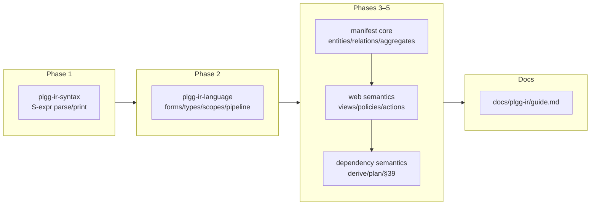

## 1. Overview

This branch delivered the entire `build-the-plgg-ir-package-family` mission in one drive: three new packages (`plgg-ir-syntax`, `plgg-ir-language`, `plgg-ir-manifest`) implementing all five design phases, the §39 end-to-end acceptance scenario green, every one of the mission's 12 acceptance items ticked, and a comprehensive guide under `docs/`. The family is the safe semantic boundary the sacrificial-architecture pillar calls for: an LLM agent emits a restricted, typed, Lisp-style Domain Manifest, and the toolchain statically verifies it — syntax, forms, names, types, relations, aggregates, query scope, authorization, dependencies — and normalizes it into a deterministic canonical IR for consumers such as plggmatic.

**Highlights:**

1. `plgg-ir-syntax`: position-aware S-expression parsing/printing on plgg-parser with recovery-based coded diagnostics and the property-tested round-trip law `parse(print(parse(x))) = parse(x)` (43 tests, 100% coverage)
2. `plgg-ir-language`: the reusable static framework — nominal/parameterized semantic types, typing-rules-as-functions, kinded scopes with two-phase declare/analyze so forward references resolve, idempotent normalization with a canonical serializer, collision-checked dialect composition (62 tests, 100% coverage)
3. `plgg-ir-manifest`: the full Domain Manifest dialect — entities through views, policies, actions, and derivations — with the design's layered boundary diagnostics and deny-by-default authorization as compile errors (70 tests)
4. The §39 scenario compiles end to end: clients/projects/tasks/invoices with authorization, aggregate scope enforcement, a derived task count, and canonical-output fixpoint — plus the three §39 rejections proven as diagnostics
5. Dependency semantics with a machine-checked graph: circular derivations are compile errors, derived fields are not writable, and consumers read update ordering from `derivedUpdateOrder`/`updatePlanFor` instead of hand-writing it
6. A comprehensive end-to-end guide at `docs/plgg-ir/guide.md` (grammar, framework concepts, full vocabulary, diagnostic-code table, safety-principle enforcement map, known deviations)

## 2. Motivation

The mission exists to separate probabilistic AI generation from deterministic Web-system behavior. plggmatic and its siblings need a durable, reviewable artifact between "what the LLM meant" and "what the system does" — one where unknown vocabulary is a compile error, domain types stay distinct from storage types, authorization is denied unless declared, and update ordering is derived from declared dependencies rather than written by hand. The prior branch had established the mission and its 43-section design rationale; this branch turned that design into working, tested packages. Because the family is also the foundation the qmu/plggmatic screen-structure DSL should evaluate building on, landing it with full coverage and a canonical-determinism guarantee was the prerequisite for every downstream consumer decision.

## 3. Changes

The five phases were implemented strictly bottom-up, each package landing with >90% coverage, monorepo wiring (build.sh dependency order, npm-install.sh, check-all.sh, its own test script, README linking), a green vendor-boundary gate (all three conformant unexempted), and a fresh full `check-all` before commit.

### 3-1. plgg-ir-syntax: S-expression parsing/printing with source positions ([d9712ef8](https://github.com/qmu/plgg/commit/d9712ef8))

The family's lowest layer, built on plgg-parser's combinators (the user-state slot doubles as the lexical diagnostics accumulator). A closed, regular grammar — symbols, finite numbers with exponent form, `true`/`false`, strings with a five-escape set, lists, `;` comments — parses into `Box`-union `Sexp` trees where every node carries a half-open `SourceRange`. Malformed input recovers and accumulates coded diagnostics (`syntax.*`), never throws. The canonical printer is deterministic (atoms-only lists inline; otherwise head-line atoms plus indented children) and the round-trip law holds under a seeded 100-case property corpus. Also cut the five phase tickets from the mission's design.md §38 and linked them into the mission.

### 3-2. plgg-ir-language: the reusable static language framework ([ec098e2c](https://github.com/qmu/plgg/commit/ec098e2c))

The machinery every restricted IR dialect is made of, defining no domain vocabulary itself: `SemType` (primitives, nominal domain types where `customer-id ≠ organization-id`, parameterized `(money JPY) ≠ (money USD)`), operator registries whose typing rules are plain closed functions (`fixedSignature` for the common case; `Money<C> × Percentage → Money<C>` as branching — no unification engine), kinded scope bindings, and `FormDef<N>` with a two-phase declare/analyze split so forward references resolve — the one deliberate extension over the approved design sketch, required by design §14's forward-referencing entities. Diagnostics accumulate across every operand and pass; expansion is depth-bounded; normalization is idempotent with a canonical serializer; `compose` rejects registry collisions. A toy dialect in the specs proves closed vocabulary, domain-type distinctness, the polymorphic money rule, and both canonical properties. The `Sexp`/`Token` guards in plgg-ir-syntax were strengthened to narrow in `filter` positions.

### 3-3. plgg-ir-manifest: the Domain Manifest core dialect ([35506bdc](https://github.com/qmu/plgg/commit/35506bdc))

The domain layer's first slice: the versioned `(plgg-ir 1 (module ...))` root with entities, fields (types/columns/validation), cross-field invariants, relations with target/cardinality/inverse verification (three inverse failure shapes, each with a related location), and aggregates with root/member existence, membership uniqueness, and member-root relatedness. Validation conditions and invariants type-check to boolean against the entity's own fields. The stable-ordering canonical normalizer sorts clause lists by rank then printed text while never reordering expression operands. The design §7 example compiles end to end; equivalent sources produce byte-identical canonical text. A `hasHead` companion to `isClause` was added after discovering that a narrowing predicate false-narrows an already-`ListExp` value to `never` in dispatch chains.

### 3-4. Web-system semantics: views, queries, policies, actions ([8f3c63d1](https://github.com/qmu/plgg/commit/8f3c63d1))

The largest phase. A typed relation-path model (crossed-prefix tracking; four root namespaces: entity aliases, `input` field bags, `actor.<f>` carrying nominal type `<f>`, projection aliases) lets the whole layer reuse the framework checker by pre-binding dotted paths as plain scope bindings. Views get subjects with typed parameters (a parameter named `p` carries nominal type `p`), optional aggregate scope, queries (`where`/`authorized-by`/`include`/`lookup`), and a closed layout vocabulary whose child order is preserved verbatim. The design §14 layered diagnostics work exactly as specified: a structurally reachable path is rejected as `relation-not-loaded` (listing available paths — the §35 example message), `aggregate-boundary`, or `not-exposed`. Policies type-check to boolean over the actor plus the entity graph; actions carry typed validated input, subject-field effects with assignability checks, and postconditions; **an action with effects and no policy is a compile error** (deny-by-default, §36.1). Module-wide cross-reference verification handles forward navigation targets, parameter completeness and types, and every policy/action reference.

### 3-5. Dependency semantics and the §39 acceptance scenario ([c2d1461f](https://github.com/qmu/plgg/commit/c2d1461f))

Fields gain `(derive ...)` (count / sum-children / typed expression) and `(materialize (consistency ...))`, resolved in a dedicated module stage over the full entity graph so derivations may reference entities declared later. `materialize` requires `derive`; derivations type-check against their field; effects writing a derived field are rejected (one source of truth); an `immediate` materialization whose dependencies leave the owner's aggregate is rejected. Kahn layering over the dependency graph serves double duty: never-ready nodes are the circular-derivation compile error, and the layer order is the consumer-facing `derivedUpdateOrder`/`updatePlanFor` planning API (the §13 chain `order-item change → total → tax` is proven in tests, including membership-change seeds). The full §39 scenario — four entities, aggregate, two policies, three views, the guarded edit action, a derived task count — compiles into the canonical IR, canonical output is a compile fixpoint, and the deny-by-default and aggregate-boundary rejections hold.

### 3-6. The comprehensive plgg-ir guide ([1696ae90](https://github.com/qmu/plgg/commit/1696ae90))

`docs/plgg-ir/guide.md`: a single end-to-end reference written against implemented behavior — pipeline, lexical grammar table, framework concepts, the complete manifest vocabulary with working examples, the full diagnostic-code table, the update-planning API, a design-§36 safety-principle enforcement map, known deviations, and verification commands. Linked from the root README family group and the manifest README.

## 4. Outcome

- **The mission is functionally complete:** all five phases implemented, all 12 acceptance items ticked in the mission file, `§39` green, 175 tests across the three packages (43 + 62 + 70), coverage 100/100/≥92% per package against the >90% gate.
- **The safe semantic boundary exists:** unknown vocabulary at any level is a compile error; domain types stay distinct from storage; authorization is denied unless declared; boundaries (query scope, projection, aggregate) are crossed only explicitly; derived values have one source of truth and machine-derived update order.
- **Canonical determinism is guaranteed and property-tested:** equivalent sources produce byte-identical canonical text and compiling canonical output is a fixpoint — the substrate for caching, diffing, hashing, and LLM correction loops.
- **The monorepo integration is complete and gated:** dependency order in build.sh (which the npm publish flow derives from — the three packages will first-publish at the next release), install/check-all/test scripts, README hierarchy green, vendor boundary conformant unexempted (20 conformant / 5 exempted of 25), and five consecutive fresh `check-all` runs green across the branch.
- **Documentation is three-layered plus one comprehensive guide:** package READMEs per layer and `docs/plgg-ir/guide.md` end to end.
- The unrelated PoC 2 ticket remains queued (different mission, out of this drive's scope).

## 5. Historical Analysis

**The framework's declare/analyze split was the load-bearing decision.** Design §14's example has `client` targeting `project` before it is declared; a single-pass scope thread cannot resolve it. Making two-phase analysis a framework primitive (declare collects bindings, analyze runs with the full scope) meant the manifest dialect — and its later derive resolution, which reuses the same "resolve over the full graph in a later stage" shape — needed no framework changes across three phases of vocabulary growth.

**Type-predicate false-narrowing is a recurring TypeScript trap in dispatch chains.** `isClause(name)` as a `exp is ListExp` predicate narrows correctly in `filter`, but in an if/else dispatch over an already-narrowed `ListExp`, its false branch narrows the value to `never`. The `hasHead` (boolean) / `isClause` (narrowing) split resolved it once and prevented recurrence through phases 4 and 5.

**Coverage discipline shaped the code, not just the tests.** The house rules from earlier work (no isErr-guard chains, no dead index guards under `noUncheckedIndexedAccess`) drove concrete idioms here: slice-pairing instead of indexed access, `matchOption`/`matchResult` folds whose arms are all reachable, and total fold seeds that are evaluated-but-unreachable expressions rather than uncovered branches. The three packages hit the >90% gate on first full runs — 100% for the two lower layers.

**Verification over the built model beats verification during parsing.** Every §16.5–16.9 rule (inverses, aggregates, navigation refs, dependency cycles) is a pure function over the completed `Module`, not logic interleaved with parsing. That made the layered §14 diagnostics straightforward (the path resolver records crossed prefixes; scope checks consult the query's loaded set afterwards) and kept each rule independently testable.

## 6. Concerns

### (carried from PRs #31–#63) 107 standing deferred concerns remain active

- **Severity:** moderate
- **Description:** This branch added three new packages, scripts wiring, docs, and mission records; the standing concerns from PRs #31–#63 target plgg-web/plgg-sql/plggmatic/plggpress/plgg-bundle/plgg-parser/plgg-highlight and PoC operational items, none of which changed here. One is materially advanced: the "DSL division of labor between plgg-ir and the screen-structure mission" concern's plgg-ir half is now exercised by five real tickets — the generic toolchain stands alone and hosts the manifest dialect without leaks — while the plggmatic-side evaluation remains open.
- **How to Fix:** Address them as their target areas are worked on; the division-of-labor concern closes when qmu/plggmatic's DSL v1 ticket decides whether to build its reader/checker on this family.

### Policy bodies are not checked against their attached subject

- **Severity:** moderate
- **Description:** A policy's `allows` condition is type-checked once over the actor plus every declared entity (so any policy body is fully verified), but the use site — `authorized-by`, `authorize`, `access` — only verifies the policy exists. A policy written over `project.*` attached to entity `client` compiles; the mismatch surfaces only at consumer interpretation time.
- **How to Fix:** Record each policy's referenced entity roots during checking and verify at every use site that the attached subject is among them (or is reachable from them).

### `has-role` takes a string literal, deviating from design §10

- **Severity:** low
- **Description:** Design §10 sketches `(has-role actor project-manager)` with a bare symbol; the implementation requires `(has-role actor "project-manager")` because bare role symbols would be unresolvable names under the closed-vocabulary expression checker. LLM prompt vocabularies must teach the string form.
- **How to Fix:** Either keep the string form and note it in prompt templates, or add a `role` nominal-literal convention (like parameters' name-is-type) in a later phase and migrate.

### Guide-site pages for the family are not wired

- **Severity:** low
- **Description:** The mission's "three-layer documentation published" item is satisfied by the three package READMEs plus `docs/plgg-ir/guide.md`; the plggpress-built guide site (`packages/guide`) has no plgg-ir pages, so the documentation is repo-local rather than on plgg.qmu.co.jp.
- **How to Fix:** Add guide-site pages sourcing from the same content when the family stabilizes (post-plggmatic-consumer), keeping the READMEs as the source of truth.

### Circular-derivation diagnostics name the whole unresolvable set

- **Severity:** low
- **Description:** Kahn layering reports every derived field that never becomes ready — the strongly-connected cycle members *and* anything downstream of them — as "part of (or depends on) a derivation cycle", rather than isolating the minimal cycle.
- **How to Fix:** If minimal-cycle reporting proves valuable for LLM correction loops, add an SCC pass (Tarjan) over the derived-field graph to separate cycle members from dependents.

### The analyzeManifest ↔ analyzeAction module cycle is benign but fragile

- **Severity:** low
- **Description:** `analyzeAction` imports `analyzeInputFields` from `analyzeManifest`, which imports `parseAction` back. All references are inside function bodies so ESM/bundler evaluation is safe today, but a future top-level use of either import would break at load time.
- **How to Fix:** Extract the shared field-building machinery (`parseFieldDecl`, `analyzeInputFields`, validation parsing) into its own module both can import.

## 7. Successful Development Patterns

- **Design-before-code at the framework seam:** the ticket-mandated core-typing sketch (approved via one preview question) meant the riskiest generics (`FormDef<N>`, `AnalysisContext<N>`) were settled before bulk implementation; three later phases consumed them unchanged.
- **A toy dialect as the framework's proof:** testing plgg-ir-language with a throwaway `def`/`check` dialect proved every framework feature without leaking manifest vocabulary downward — the boundary test ("could a different dialect be built on this?") executed literally.
- **Pre-binding dotted paths instead of extending the checker:** resolving `task.project.client` paths into ordinary scope bindings before `checkExpr` runs let the entire web layer reuse the framework checker untouched — no framework change across the two biggest phases.
- **One total fold serving verification and planning:** Kahn layering yields both the cycle diagnostic (never-ready nodes) and the topological update order consumers read — one function, no drift between the error and the plan.
- **Fixture worlds shared across rejection tests:** the §14 client/project/task/invoice world and §13 order world are string templates each spec composes with one extra form, so every rejection test reads as "the world plus exactly this mistake".
- **Design-document examples as acceptance fixtures:** §7, §11, §12, §13, §14, §35, and §39 examples were transcribed near-verbatim into specs, keeping the implementation honest to the design and making drift visible as test diffs.

## 8. Release Preparation

**Verdict**: Ready for release
