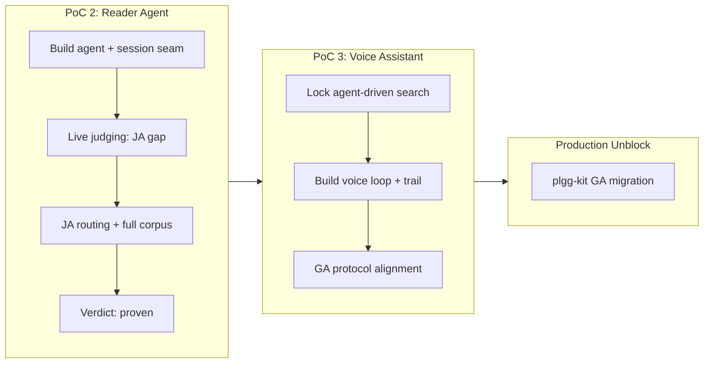

## 1. Overview

This branch delivers three interconnected milestones: PoC 2 proves reader-side browser-embedded agents with server-confined keys and grounded cited answers over English and Japanese corpora; PoC 3 proves writer-side Realtime voice assistants with agent-driven full-text search through visible tool-call loops; and the plgg-kit alignment to the GA Realtime protocol (client_secrets mint, session.type, transcription config, event naming) unblocks both for production use.

**Highlights:**

1. PoC 2 reader agent: BM25 browser-local grounding, side-by-side citations with corpus routing (EN/JA), vocabulary-mismatch finding accepted by design — verdict recorded **proven** on the portal
2. PoC 3 writer voice assistant: ephemeral-key mint seam, WebRTC agent loop with agent-driven `search_docs` tool calling, visible keyword-variation trail — judged live with a real microphone and verdict recorded **proven** on the portal; the PoC-first duplicate minter retired onto plgg-kit's GA `minterFromConfig`
3. plgg-kit GA migration: `realtimeKeyMinter` + `asEphemeralKey` aligned to the GA shape (top-level `value`/`expires_at`), mint endpoint moved to `client_secrets` — a production 502 caught before any deploy
4. GA protocol alignment measured live: `session.type` required, `audio.input.transcription` (not `input_audio_transcription`), `response.output_audio_transcript.done`
5. Japanese grounding over the FULL qmu.co.jp corpus (168 articles → 2,038 chunks), script-routed retrieval, answers in the question's language

## 2. Motivation

The mission progresses through live acceptance gates: PoC 2's vocabulary-mismatch finding (exact-term BM25 gaps — ドキュメンテーション vs the corpus's 文書化) became the acceptance criterion for PoC 3 — prove the agent resolves it by driving repeated keyword tool calls with model-generated variations. Live PoC 3 development then surfaced GA drift in the plgg-kit minter (retired endpoint 404, changed reply shape), which would have broken every production voice route; this branch routes all three streams through their acceptance gates and unblocks the downstream consumer code.

## 3. Changes

Reader PoC 2 was accepted with the vocabulary-mismatch design finding → that locked agent-driven search as PoC 3's thesis → live voice development exposed GA endpoint/shape drift in plgg-kit → the minter was fixed and the protocol aligned → the agent-driven keyword loop was completed over a live Realtime WebSocket, with Japanese grounded answers confirmed end-to-end.

### 3-1. PoC 2 — reader-side embedded browser agent ([c8921b1c](https://github.com/qmu/plgg/commit/c8921b1c))

New private package `plgg-poc2-agent`: browser-local BM25 retrieval reusing PoC 1's proven FTS modules through one relative-import seam over the real guide corpus, a node serve entry holding `OPENAI_API_KEY` that answers `POST /api/answer` via plgg-kit `generateObject` (honest 404 + upfront `/api/health` when keyless), citation mapping from model source numbers to chunk ids with hallucinated numbers dropped, a side-by-side answer/evidence UI with cited chunks marked and heading-path links into the live guide, and a canned proof set. A live-acceptance follow-up rendered exchanges newest-first ([c0d08207](https://github.com/qmu/plgg/commit/c0d08207)).

### 3-2. Japanese grounding for PoC 2 ([53e17c42](https://github.com/qmu/plgg/commit/53e17c42))

The developer's first live question was Japanese and retrieved nothing — the reader's language was never in the index. Added a second shipped index (PoC 1 Ticket B's segmenter tokenization), script-routed retrieval (`hasCjk`), per-corpus citation link bases (qmu.co.jp vs the guide), answer-in-question's-language instructions, and Japanese canned questions.

### 3-3. Full qmu.co.jp article corpus ([fe4ba4d2](https://github.com/qmu/plgg/commit/fe4ba4d2))

Grep proved the vendored JA corpus held only 11 pillar index pages and not one article body — the agent was honestly refusing over a too-thin corpus. The index build now prefers the full site checkout (168 articles → 2,038 chunks, ja-fts.json ≈ 2.3 MB, the shipping cost stated honestly) with the vendored fallback for clean checkouts, and the exact-term vocabulary-mismatch limit (文書化 retrieves; ドキュメンテーション misses) was reproduced live and RECORDED as PoC data rather than patched over.

### 3-4. PoC 2 verdict recorded as proven ([949bf31c](https://github.com/qmu/plgg/commit/949bf31c))

The portal record flipped to `proven` with a verdict capturing what was judged (grounded cited side-by-side answers in EN and JA, key confinement) and the accepted limit plus its production resolution: the agent will DRIVE the search itself through repeated keyword tool calls — exactly the loop PoC 3 exercises. Mission acceptance ticked (4/9).

### 3-5. PoC 3 — writer-side voice assistant ([a7419536](https://github.com/qmu/plgg/commit/a7419536))

New private package `plgg-poc3-voice`: a server mint seam (`POST /api/session`) issuing short-lived Realtime keys, a browser WebRTC seam templated on plgg-cms's `realtimeBackend` (mic in, audio out, `oai-events` channel configured with instructions + the `search_docs` tool), a pure agent core (event decoder, script-routed BM25 tool executor, instruction assembly carrying the OPEN document), a TEA program with an on-page tool-call trail, and full fleet wiring at host 5186. A live-start follow-up aligned the session with the GA protocol ([eda2e4a0](https://github.com/qmu/plgg/commit/eda2e4a0)); a headless WebSocket run then completed the ENTIRE agent-driven loop — the model called `search_docs` with its own keywords and answered in grounded Japanese — proving the PoC's core thesis at protocol level before any microphone.

### 3-6. plgg-kit Realtime GA migration ([3fa43cb7](https://github.com/qmu/plgg/commit/3fa43cb7))

PoC 3 measured live that OpenAI retired the pre-GA `/v1/realtime/sessions` mint endpoint (404) and that the GA `client_secrets` reply carries `value`/`expires_at` at the top level. `realtimeKeyMinter` now posts the GA session envelope, `asEphemeralKey` decodes the GA shape and rejects the retired wrapper (fail-closed both directions), and `pressServer`'s wired endpoint constant moved — the production voice route would have 502'd on its first real deploy.

### 3-7. PoC 3 verdict recorded as proven; duplicate minter retired ([e674de39](https://github.com/qmu/plgg/commit/e674de39))

The developer judged PoC 3 live (microphone in a real browser at plgg-poc3.qmu.dev) and reported proven: voice conversation about the open document in Japanese, answers grounded by the model driving `search_docs` with its own keyword variations, standing key confined to the server. The portal record flipped to `proven`, the fleet-consistency spec now pins poc1–poc3 as the proven set, mission acceptance ticked (5/9), and `serve.ts`'s PoC-first duplicate `mintGrant` was deleted in favor of plgg-kit's `minterFromConfig` — verified by a live mint through the recreated container (200 `{value, expiresAt}`).

## 4. Outcome

- Delivered two major PoCs for the plggpress mission: PoC 2 (reader-side browser agent with grounded, cited answers via a server session seam) and PoC 3 (writer-side voice assistant with agent-driven search tool-calling over the Realtime API)
- Built new packages `plgg-poc2-agent` and `plgg-poc3-voice` with full fleet wiring (npm-install, check-all, test scripts, workload compose, portal records)
- Proved Japanese-language grounding with Intl.Segmenter tokenization and full qmu.co.jp corpus indexing (168 articles, ~2.3 MB ja-fts.json)
- Demonstrated agent-driven keyword tool-calling as the accepted resolution of the exact-term BM25 vocabulary mismatch (the model generates keyword variations rather than user phrasing needing to match the index)
- Migrated plgg-kit's Realtime key minter and EphemeralKey decoder from the retired pre-GA endpoint to the GA `client_secrets` API, unblocking plgg-cms voice production deployment
- Recorded the PoC 2 verdict as proven on the portal; PoC 3 judged live (real microphone) and recorded proven — three of six fleet PoCs concluded
- Retired PoC 3's duplicate local minter onto plgg-kit's `minterFromConfig`, with the live mint contract (200 `{value, expiresAt}`, honest 404/502) verified through the recreated container
- Full `check-all` green on fresh rebuilds (three times across the branch, including post-verdict); plgg-kit 18 and plgg-cms 505 specs green with coverage gates intact

## 5. Historical Analysis

- PoC 1 established the playbook: static bundle, shipped FTS index, canned set + live browser judging + cited answers = proof of grounding
- PoC 2 evolved the pattern by adding a server session seam: the standing API key stays server-side (honest 404 when absent), and a relative-import seam (`src/poc1.ts`) lets tsc, node type-stripping, plgg-test, and plgg-bundle all resolve cross-package source reuse identically
- Japanese grounding reused PoC 1 Ticket B's proven infrastructure but exposed a corpus-quality trap: index pages without article bodies rank summaries above the articles that answer, motivating the full-corpus ingest with a vendored fallback for reproducibility
- PoC 2's vocabulary mismatch was accepted by design and routed forward as PoC 3's thesis: agent-driven tool-calling moves the vocabulary-coverage burden from the user's phrasing to the model's reasoning
- The Realtime GA drift (pre-GA endpoint retired to 404; GA `client_secrets` with a top-level envelope) was measured live in PoC 3 and immediately backported to plgg-kit — the PoC fleet functioning as the production early-warning system

## 6. Concerns

### 107 standing deferred concerns from prior PRs (31–63)

- **Severity:** moderate
- **Description:** This branch is purely additive (PoC 2/PoC 3 packages, portal verdict record, plgg-kit Realtime GA migration, scripts/README wiring) and does not modify the core packages the 107 standing concerns target (plgg-web/http/Result, plgg-sql, plggmatic/renderer, plggpress/auth, plgg-bundle, plgg-parser/plgg-highlight, CI/dependabot/ops). All 107 verdicts remain still_active per the deferred-concern judge.
- **How to Fix:** Address them as their target areas are worked on in future branches; they carry forward unchanged.

### Full-corpus build depends on the out-of-repo qmu-co-jp checkout

- **Severity:** low
- **Description:** The full Japanese corpus lives in `~/projects/qmu-co-jp/docs`; `buildIndex.ts` resolves `QMU_DOCS`, then that path, falling back to the vendored 11 index pages, so clean-clone builds degrade to index-only retrieval quality.
- **How to Fix:** Documented on the package README; consider a larger vendored snapshot or a post-PoC integration decision on corpus distribution.

### Portal verdict data remains hand-edited

- **Severity:** low
- **Description:** This branch again hand-edited `pocs.ts` for two status flips and one verdict (the `pocConsistent` invariant and its spec caught every inconsistency, as designed), but the standing suggestion to keep that gate mandatory for every future PoC ticket remains open.
- **How to Fix:** Keep `pocConsistent` + the fleet-consistency spec as the required gate in each PoC-concluding ticket.

## 7. Successful Development Patterns

- **Live acceptance as grounding proof:** canned question sets rendered side-by-side with their retrieved evidence let the developer judge corpus quality and citation accuracy directly in a browser — this surfaced both the Japanese corpus gap and the vocabulary mismatch within minutes of real use.
- **Relative-import cross-package seam:** PoC 2 and PoC 3 reuse PoC 1's FTS modules through a single relative-import boundary (`src/poc1.ts`), the one specifier spelling tsc, node type-stripping, plgg-test, and plgg-bundle's app inliner all resolve identically.
- **Vendored fallback + external checkout:** full-corpus builds when the real site checkout is present, reproducible degraded builds when it is not — pipeline hermeticity and proof depth both kept.
- **Session-seam key confinement:** the standing key lives only in the serve process; the browser receives only short-lived ephemeral keys; keyless states are honest 404s + upfront banners, verified by grepping shipped bundles.
- **Agent-driven tool-calling resolves vocabulary mismatch:** giving the Realtime session a `search_docs` tool and letting the model generate its own keyword variations moved the vocabulary burden from users to agent reasoning — proven headlessly before any UI existed.
- **Protocol-first validation before UI:** PoC 3's thesis was proven via a headless WebSocket run against the live GA endpoint before touching microphone handling — catching the GA drift early and isolating the agent-logic proof from interaction complexity.
- **Design decisions locked before code:** PoC 2's live judging locked PoC 3's architecture in its ticket before any code, removing mid-drive re-negotiation.

## 8. Releasability

**Ready for release.**

- The branch typechecks and the full `check-all` suite is green on fresh rebuilds; plgg-kit (18) and plgg-cms (505) suites pass with coverage gates intact; the two new packages are private PoC apps on the mission's offline smoke bar; nothing on this branch is npm-published automatically.
- PoC 3's live voice loop was developer-judged with a real microphone and recorded **proven** on the portal; no product-evaluation state remains open on this branch.

## 9. Notes

- The fleet's cloudflared ingress lines (`plgg-poc2.qmu.dev` → :5185, `plgg-poc3.qmu.dev` → :5186) were applied host-side in `~/.cloudflared/config.yml` during this session with explicit developer approval; they are not repo-tracked.
- Two commits ride between tickets as live-acceptance feedback: the newest-first exchange ordering ([c0d08207](https://github.com/qmu/plgg/commit/c0d08207)) and the GA Realtime protocol alignment ([eda2e4a0](https://github.com/qmu/plgg/commit/eda2e4a0)), whose headless WebSocket run doubles as the protocol-level proof of PoC 3's thesis.

## Deployment Evidence

- **When:** 2026-07-12T14:11:24+09:00
- **Target:** plgg guide (plggpress docs site)
- **Method:** api-probe (pre-merge readiness)
- **Status:** pass
- **Observed:** Fresh scripts/check-all.sh exit 0 on the branch AFTER catching up with origin/main (PR #65 plgg-ir family merged in): all packages rebuilt, typechecked, tested green. Live poc3 mint re-verified through the recreated container: POST localhost:5186/api/session -> 200 {value, expiresAt}.
