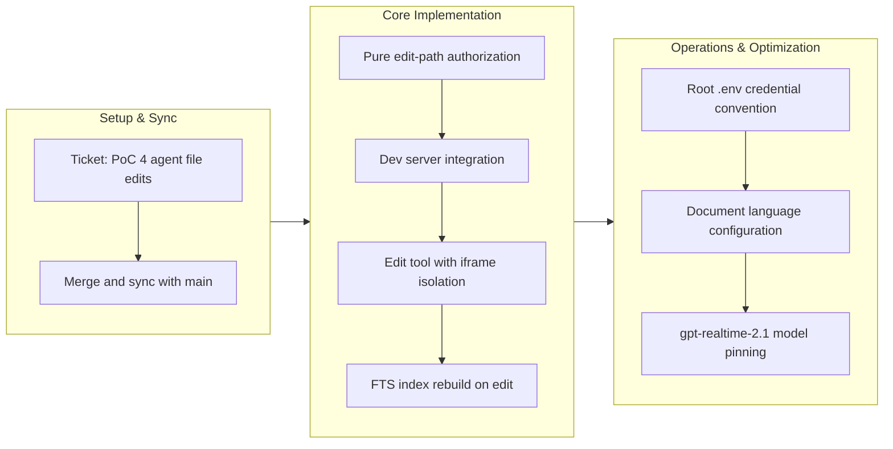

## 1. Overview

This branch delivered PoC 4 of the plggpress confidence-collection fleet, proving that a browser agent's `edit_file` tool calls can write local doc files through the dev server while live hot reload refreshes the page WITHOUT dropping the OpenAI Realtime session. The work establishes a git-ignored content copy as the edit target, isolates the session in an iframe to survive reload, and introduces a canonical root `.env` credential convention sourced across the PoC fleet.

**Highlights:**

1. Implemented the `edit_file` tool with a pure authorization core and dev-server integration — agent edits write to a git-ignored copy while the served index rebuilds and the doc page reloads live
2. Established the root `.env` credential convention sourced by the canonical `serve-poc.sh` runner, centralizing secrets for the parallel-worktree PoC fleet
3. Pinned the `gpt-realtime-2.1` snapshot to ensure consistent tool-calling discipline and remove the silent-drift surface of the `gpt-realtime` alias
4. Configured the assistant to speak the open document's language (English) regardless of the writer's input language, matching the co-editing flow
5. Built the `packages/plgg-poc4-edit` scaffold with an exhaustively spec'd edit-path security boundary, `POST /api/edit` validation, and in-process FTS index refresh

## 2. Motivation

The plggpress mission's core writer-mode risk was whether a browser agent could edit local documents in real time while maintaining a continuous Realtime session. The developer needed proof that `edit_file` tool calls could land on the server, persist to disk, trigger the dev reload without dropping the WebRTC session, and let the same agent see and act on the changes it made. This PoC locks iframe isolation as the architectural countermeasure, centralizes credentials via a single repo-root `.env` (essential for parallel worktrees), and pins the Realtime model so the judged behavior is tied to a named snapshot.

## 3. Changes

PoC 4 progressed from ticket creation and branch sync through core agent implementation (pure authorization, dev-server routing, iframe isolation to protect the Realtime session) to operational refinement (centralized credentials via root `.env`, assistant language awareness, model version pinning). The dev-server rebuild architecture proves live reload compatible with persistent WebRTC sessions when the session shell and the proxied doc page run in separate processes.

### 3-1. PoC 4: agent file edits with live hot reload over a surviving Realtime session ([f98d1714](https://github.com/qmu/plgg/commit/f98d1714))

Added the new `packages/plgg-poc4-edit` package on PoC 3's proven scaffold: a pure edit-authorization core (`resolveEditPath`, the one authoritative guard), the `edit_file` tool next to `search_docs`, typed-text turns over the same data channel as voice, a session shell served without the dev reload script, and the plggpress-rendered corpus copy inside an iframe behind a streaming `/docs` + `/__plgg_reload` proxy — plus full fleet wiring (workload container on :5187, test script, check-all/npm-install registration, portal status `building`).

### 3-2. Resume: sync poc4-edit branch with main, then drive PoC 4 ([2c220d83](https://github.com/qmu/plgg/commit/2c220d83))

Brought the PoC 4 worktree branch up to date with main (picking up the plgg-bundle 0.0.6 externals-lookup fix its bundle shape depends on) and reinstalled every package, confirming the previously missing plgg-ir toolchain bin on this host.

### 3-3. Credentials from ONE git-ignored root .env, sourced by the canonical PoC runner ([997d08fc](https://github.com/qmu/plgg/commit/997d08fc))

Introduced the repo-root `.env` convention: `scripts/serve-poc.sh` exports the file's KEY=value lines before compose interpolation (caller environment wins; malformed lines are skipped, never eval'd), a committed `.env.example` catalogs the known keys, and the PoC READMEs point at the root file instead of ad-hoc exports.

### 3-4. PoC 4: the assistant speaks the OPEN DOCUMENT's language ([3d334eaf](https://github.com/qmu/plgg/commit/3d334eaf))

Changed the session instructions so the assistant answers and edits in the open document's language (English for this corpus) rather than mirroring the writer's language, keeping the co-editing conversation in the document's own register.

### 3-5. PoC 4: pin the Realtime model to gpt-realtime-2.1 ([3f37768a](https://github.com/qmu/plgg/commit/3f37768a))

Replaced the drifting `gpt-realtime` alias with one exported, spec-pinned `REALTIME_MODEL` constant feeding both the server mint and the browser SDP exchange, so the judged behavior is tied to the named 2.1 snapshot and future bumps are one constant plus one spec line.

### 3-6. Fix PoC 4 language lock-in and edit-corruption from live judging ([9171cf60](https://github.com/qmu/plgg/commit/9171cf60))

Live judging surfaced two bugs, both fixed here: the assistant refused an explicit language switch (the doc-language instruction was too rigid → softened to default-with-explicit-override), and asking it to edit the open document corrupted the file (the model was fed a lossy chunk reconstruction it then wrote back as heading-path text). Retired `docTextOf` and added a guarded `GET /api/doc?path=` raw-read seam so the editing model sees the real file bytes; edits now round-trip as clean markdown.

## 4. Outcome

- Implemented PoC 4 end to end: agent file edits with live hot reload over a surviving Realtime session; offline suite (28 specs) and a fresh `check-all` green, headless container smoke green.
- The pure edit core carries an exhaustively tested security boundary: `resolveEditPath` rejects traversal, absolute paths, and non-`.md` targets as typed errors, with realpath containment layered at the fs boundary and atomic temp+rename writes.
- The shell server proxies `/docs/*` and the SSE reload stream to the internal plggpress dev server, so the iframe (and only the iframe) hot-reloads; the session shell never carries the dev reload script.
- Both writer input paths — the PoC 3 microphone loop and a typed `input_text` turn — share one WebRTC session with no second mint.
- The seeded, git-ignored corpus copy keeps AI edits out of the real guide; `npm run reset-content` re-seeds.
- The root `.env` convention centralizes fleet credentials (with the companion worktree-copy protocol shipped in the workaholic plugin repo), and the Realtime model is pinned to `gpt-realtime-2.1`.
- Live at `plgg-poc4.qmu.dev` (cloudflared ingress applied): health configured, mint 200 against 2.1 — ready for the developer's live judging.

## 5. Historical Analysis

The fleet plan (PoC 4 reserved as agent file edits + hot reload, with its port/hostname, under mission `plggpress-technical-confidence-poc-portal`) proved prescient: every reusable component already shipped on main. PoC 3 proved the Realtime voice loop, the FTS search pattern, and the dev-server hot-reload seams; plgg-kit's GA minter abstracted key management; plggpress and plgg-bundle brought content rendering and live reload. Rather than redesigning, PoC 4 extended the proven scaffold — copying PoC 3's package shape, test config, and entrypoint structure — and spent its architectural decisions on the new risks: iframe isolation to protect module-level WebRTC state, a pure edit core with layered validation, and atomic writes. The pattern has repeated across PoCs 1–4: identify the unproven piece, prove it in isolation with measured feedback, then integrate. Deferred concerns roll forward untouched by this additive branch, consistent with the PR #66 precedent.

## 6. Concerns

### (carried from PRs 31–66) 119 standing deferred concerns remain active

- **Severity:** low
- **Description:** 119 previously recorded deferred concerns from PRs #31–#66 remain active and are unrelated to this branch's additive PoC 4 work. They span infrastructure (plgg dist rebuild semantics, plgg-bundle bin-cache verification, route-table compilation), platform features (binary-request support, Uint8Array BodyInit), and system layers (renderer primitives, plggpress auth patterns). The full set lives in `.workaholic/concerns/`.
- **How to Fix:** Address in dedicated tickets prioritized by impact; classify by urgency and schedule across future missions.

### The co-editing EXPERIENCE is unproven — PoC 4 proved only the mechanics

- **Severity:** moderate
- **Description:** Live judging (2026-07-13) confirmed PoC 4's mechanics work (agent edit → disk → reload → session survives) but that was the expected result; the whole-file `edit_file` plus the full iframe `location.reload()` cannot deliver the "same whiteboard" co-editing feel the mission actually needs — the change is a batch swap, not a legible in-place edit (see [9171cf60](https://github.com/qmu/plgg/commit/9171cf60) in `packages/plgg-poc4-edit`).
- **How to Fix:** PoC 4b (ticket `20260713193614-poc4b-live-coediting-preview.md`, queued): granular diff edits + a live patchable preview that visualizes the change ON the preview (micro-animation and before/after diff, compared), retiring the reloading iframe. Drive from a fresh main branch after this PR merges.

### Live judging of the FIXED PoC 4 build remains pending

- **Severity:** moderate
- **Description:** The two live-judging bugs are fixed and the live container recreated, but the developer has not yet re-judged the corrected build (explicit language switch honored; edits round-trip as clean markdown; session survives). The poc4 verdict flip is still a separate concluding ticket, per the PoC 2/3 precedent (see [f98d1714](https://github.com/qmu/plgg/commit/f98d1714) in `packages/plgg-poc4-edit`).
- **How to Fix:** Re-judge live, then file the concluding verdict ticket flipping the portal's poc4 record from `building` to a concluded status (guarded by `pocConsistent`).

### Container npm rewrites a sibling package-lock on the mounted tree

- **Severity:** moderate
- **Description:** The in-container npm (node:22-slim's version) rewrites `packages/plgg-poc1-search/package-lock.json` (libc-field churn) on the bind-mounted tree at every container start; the churn was reverted twice on this branch and will recur (see [f98d1714](https://github.com/qmu/plgg/commit/f98d1714), `workloads/poc4-edit/dev-entrypoint.sh`).
- **How to Fix:** Align the in-container npm version with the host's (pin the base image or npm), or stop bind-mounting lockfiles the entrypoint installs over (e.g. per-package named volumes); until then, `git restore` the churned lockfile before committing.

### Worktree .env copy protocol pending merge in the workaholic repo

- **Severity:** moderate
- **Description:** The companion protocol change (workaholic `ensure-worktree.sh` copies the root repository's `.env` into new worktrees) is committed on workaholic branch `work-20260713-144839` but not yet merged; until it lands, new and pre-existing worktrees need a manual `cp` of the root `.env`, and harness-created worktrees bypass the protocol entirely (see [997d08fc](https://github.com/qmu/plgg/commit/997d08fc) in `scripts/serve-poc.sh`).
- **How to Fix:** Ship the workaholic branch; for worktrees created by other paths, copy the root `.env` manually as documented in `.env.example`.

## 7. Successful Development Patterns

- **Iframe isolation as the load-bearing decision, decided at ticket time** — the dev server's `location.reload()` and the module-level WebRTC state cannot share a page; confining the reload to an iframe (instead of DOM-morphing or session persistence) let the whole PoC ride on existing hot-reload machinery unchanged. Locking this with the developer before implementation avoided relitigating mid-drive.
- **One authoritative pure guard, layered fs checks** — putting the entire write authorization in `resolveEditPath` (typed errors, exhaustively spec'd offline) with realpath containment as a second fs-side layer made the security boundary testable in milliseconds and auditable in one place.
- **Atomic temp+rename writes shared with a live watcher** — mirroring plgg-cms's `exportFs` pattern meant the hot-reload watcher never reads a torn file, with no coordination needed between the writer and the watcher.
- **Scaffold reuse across the PoC fleet** — copying PoC 3's package shape (package.json, tsconfig, plgg-test config, entrypoint/vendor seams) let PoC 4 spend its effort on the genuinely new surfaces (the edit seam, the proxy); the fleet's per-PoC cost keeps dropping.
- **Single-constant configuration pins** — one spec-pinned `REALTIME_MODEL` feeding both the mint and the SDP URL (and one root `.env` feeding every workload) removed the changed-one-place-forgot-the-other drift surface.
- **Injection-proof env sourcing** — the `.env` loop never evals values and skips non-`[A-Za-z0-9_]` names, so a malformed or hostile line cannot inject shell; the convention (plain KEY=value) is enforced by construction, not documentation.

## 8. Release Preparation

**Verdict**: Ready for release

### 8-1. Concerns

- None - changes are safe for release. The branch is additive (new package + workload + convention); doc drift was checked and the branch itself updated the root README, portal README, and runner scripts; no TODO/FIXME, no secrets in the diff (`.env.example` carries an intentionally empty placeholder).

### 8-2. Pre-release Instructions

- None - standard release process applies.

### 8-3. Post-release Instructions

- Re-judge the fixed PoC 4 build live at `plgg-poc4.qmu.dev` (language switch honored, edits round-trip clean, session survives) and record the verdict via the separate concluding ticket (not a merge blocker).
- Drive PoC 4b (the co-editing-experience prototype) from a fresh main branch once this PR is merged.

## 9. Notes

The PoC is already serving live behind the applied cloudflared ingress (`plgg-poc4.qmu.dev → :5187`) with the developer's key from the root `.env`, now on the fixed build (`gpt-realtime-2.1`, raw-doc read seam). The mission `plggpress-technical-confidence-poc-portal` has PoC 4 built and awaiting verdict (its acceptance checkbox ticks when the concluding verdict ticket lands, per the PoC 2/3 precedent).

Two forward pointers were set during this branch's live judging: **PoC 4b** (ticket `20260713193614-poc4b-live-coediting-preview.md`, queued in todo) redirects the confidence question to the co-editing EXPERIENCE — a live preview that visualizes the change in place (micro-animation + before/after diff, compared), driven from a fresh main branch after this PR merges. Separately, **plggpress@0.0.4** was published to npm for plggmatic's documentation (its version bump rides on branch `work-20260713-183628`, to merge to main separately). The companion workaholic-repo change (worktree `.env` copy) rides on workaholic branch `work-20260713-144839`.
