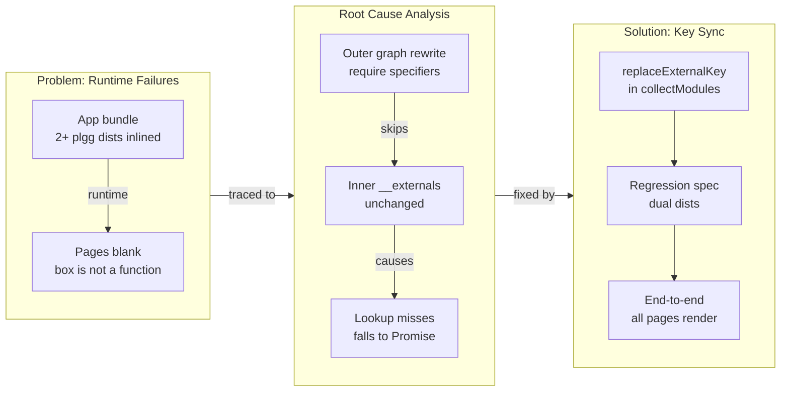

## 1. Overview

Fixed a critical bug in plgg-bundle 0.0.6 where inlined dists had misaligned `__externals` table keys after outer graph rewrites, causing runtime failures in bundled apps. The fix coordinates the inner externals-table key rewrite with the outer require-specifier rewrite, verified by regression testing and end-to-end validation of all plggmatic-example pages rendering.

**Highlights:**

1. Resolved plgg-bundle's `__externals` lookup failure that left every plggmatic-example page blank at runtime
2. Added `replaceExternalKey` logic to sync inner dist registry keys with outer graph rewrites in the same step
3. Regression spec bundles apps over dual emitter-generated dists with colliding inner keys to prevent future regressions
4. All five plggmatic pages (index, demo1–3, forms) verified rendering with fixed bundler; plgg-bundle bumped to 0.0.6

## 2. Motivation

An app bundling two or more plgg-family dists broke completely at runtime: the plggmatic-example UI was blank everywhere with a `plgg_1.box is not a function` error. The root cause was externals-table key drift — the outer graph walk rewrote `require(spec)` calls inside inlined dists but never updated the inner registry's `__externals` table, so lookups missed and fell through to a dynamic-import fallback returning a Promise where a namespace was expected. The ticket's initial diagnosis (duplicate keys in inner registries) was a misread; inner registries are separate closures and never collide. The actual defect was the key mismatch at lookup time, entirely blocking the example app in the qmu/plggmatic repository.

## 3. Changes

The work began by reproducing the cross-repo handoff evidence against the actual broken bundle, which overturned the ticket's duplicate-key diagnosis and located the real defect in the require-rewrite pass. The fix keeps an inlined dist's inner externals table keyed in step with the rewritten requires, proven red-to-green by a regression spec over emitter-generated fixtures, then confirmed golden by rebuilding the real plggmatic-example and rendering all five pages in headless Chromium.

### 3-1. plgg-bundle flattens nested bundles with colliding module keys ([22d511ab](https://github.com/qmu/plgg/commit/22d511ab))

Fixed the runtime breakage of app bundles that inline multiple plgg-family dists: `collectModules.ts` now rewrites an inlined dist's inner `__externals` table key to the outer module id in step with the require rewrite (`replaceExternalKey`, gated on `isInstalledDist`). Added a regression spec that bundles an app over two emitter-generated dists sharing the inner key `src/index.ts` and evaluates the emitted bundle end-to-end; bumped plgg-bundle to 0.0.6 for republish.

## 4. Outcome

- Fixed plgg-bundle's inlined-dist externals lookup defect that caused runtime errors (`plgg_1.box is not a function`) when app bundles inlined multiple plgg-family dists
- Identified root cause: externals table key drift during module flattening, not duplicate-key collision in module maps
- Rewrote collectModules.ts to rekey an inlined dist's inner `__externals` table to match the outer module id, synchronized with require-specifier rewrites
- Added regression test: emitter-generated fixture bundling two dists with shared internal paths, asserting both exports resolve
- Bumped plgg-bundle to 0.0.6 for republish; fix is transparent to already-published dists (rewrite occurs at consumer flatten time)
- Full test suite verified: 94 plgg-bundle tests, 483 total tests passed with >90% coverage gates
- Golden verification: rebuilt plggmatic-example and confirmed all five pages (index, demo1–3, forms) render populated `#root` in headless Chromium
- Synced plgg-kit lockfile: updated linked-package entries (plgg-bundle 0.0.2→0.0.5, plgg-test 0.0.3→0.0.5)

## 5. Historical Analysis

- Cross-repo handoff pattern: defects diagnosed in consumer repos (qmu/plggmatic) are escalated with reproduction evidence to the infrastructure owner (plgg-bundle)
- Key design decision: maintain backward compatibility at flatten time rather than requiring republish of already-published dists — the fix rewrites keys during inlining, so stale dists remain consumable
- Latent defects in plgg-family bundling only surface when an app inlines two or more dists; library bundles (single package output) are unaffected — suggests broad applicability of this fix beyond plggmatic

## 6. Concerns

### (carried from PRs #31–#65) 116 standing deferred concerns

- **Severity:** moderate
- **Description:** 116 previously recorded deferred concerns from PRs #31–#65 remain active and unrelated to this branch's inlined-dist externals fix. Concerns span multiple infrastructure and feature areas (plgg-dist rebuild semantics, route-table compilation trade-offs, binary-request support, renderer primitives, plggpress auth patterns, etc.).
- **How to Fix:** Address each concern in dedicated tickets prioritized by business impact. Deferred concerns are tracked in `.workaholic/concerns/` and consolidated in release-readiness assessments.

### TS-printer shape dependency in externals-key rewrite

- **Severity:** moderate
- **Description:** The externals-key rewrite in collectModules.ts matches the exact TS-printer output shape `"<spec>": __extN` (see [22d511ab](https://github.com/qmu/plgg/commit/22d511ab) in packages/plgg-bundle/src/domain/usecase/collectModules.ts). A future TypeScript version or custom printer emitting the externals table in a different format would silently skip the rewrite, causing the same runtime failure to resurface in downstream consumers.
- **How to Fix:** Extract the externals-table printing and rewriting into an abstraction with a public contract, making the shape dependency explicit and testable independent of TS-printer internals. Document the shape assumption in comments at both emission and rewrite sites.

### plgg-bundle bin-cache verification gotcha

- **Severity:** low
- **Description:** plgg-bundle's bin relocates registry-installed source to a /tmp cache keyed by (version, install-path) and reuses it while the ready-marker exists. Hot-patching a consumer's node_modules source does nothing until the cache is cleared (see [22d511ab](https://github.com/qmu/plgg/commit/22d511ab) Insights; cache dirs look like `/tmp/plgg-relocate-plgg-bundle-<version>-<tag>`).
- **How to Fix:** Document the cache behavior in the plgg-bundle README and reference it in verification guides, including the manual cache-clear step for developers doing hot-patch verification.

## 7. Successful Development Patterns

- **Emitter-generated fixtures prevent fixture/emitter drift:** The regression spec bundles an app over two programmatically-generated dists sharing internal module paths, ensuring the test definition and the actual dists under test stay synchronized — avoids the maintenance burden of hand-written golden fixtures that diverge from real bundler output.
- **Red-green verification by stashing the fix:** Test fails with the fix stashed, passes with it applied — a mechanical proof that the test actually exercises the defect and not a false positive. Complements full test-suite and golden verification.
- **Golden verification by rebuilding the real downstream consumer:** Rebuilt plggmatic-example with the fixed bundler and rendered all five pages in headless Chromium, confirming the fix works in the actual context where the bug manifested. Catches integration issues that unit and regression specs miss.
- **Cross-repo handoff tickets carrying reproduction evidence:** Tickets escalated from consumer repos (qmu/plggmatic) include detailed evidence (filenames, line numbers, stack traces) so the infrastructure owner (plgg) can reproduce, verify the fix, and plan the republish without guesswork or back-and-forth.

## 8. Release Preparation

**Verdict**: Ready for release

### 8-1. Concerns

- Minor lockfile lag (non-blocking): packages/plgg-kit/package-lock.json records ../plgg-bundle at 0.0.5, but plgg-bundle/package.json is now 0.0.6. It is a file: dev-dependency resolved from disk, so builds are unaffected; the sync landed one version behind the same-branch bump and an npm install in plgg-kit would reconcile it.
- plgg-bundle collectModules.ts coverage is 96.00% statements / 93.02% branches — above the >90% gate but the lowest in the package; acceptable, not a blocker.

### 8-2. Pre-release Instructions

- None - standard release process applies

### 8-3. Post-release Instructions

- npm-publish plgg-bundle@0.0.6 via scripts/publish-npm.sh (developer-driven; preflight confirms the publish set is exactly plgg-bundle@0.0.6).
- After publish, have qmu/plggmatic repin to plgg-bundle@0.0.6 and re-verify its example pages (tracked by plggmatic ticket 20260712011500); golden headless-Chromium render of all five pages already passed on the fixed bundler.

## 9. Notes

The fix unblocks the qmu/plggmatic engine-absorption work: its example app was fully broken by this defect on both pre- and post-absorption builds. Old already-published plgg-family dists need no republish — the rewrite happens at consumer flatten time.

## Deployment Evidence

- **When:** 2026-07-13T11:41:28+09:00
- **Target:** plgg npm packages (developer-driven publish)
- **Method:** api-probe
- **Status:** pass
- **Observed:** npm view plgg-bundle@0.0.6 resolves on the registry; scratch-dir npm install plgg-bundle@0.0.6 succeeds; installed source carries the replaceExternalKey fix; bin launches from a real install with no module-resolution failure. Pre-merge readiness: scripts/check-all.sh green on the branch (27 suites, 0 failed).
