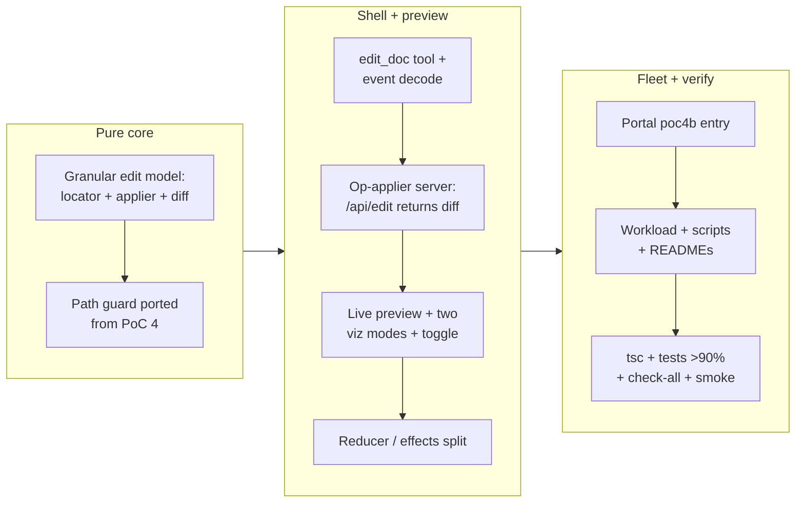

## 1. Overview

This branch builds **PoC 4b of the plggpress confidence-collection fleet — live co-editing preview**, the spin-off that answers the *experience* question PoC 4 left open: does an AI edit *feel* like co-editing the same whiteboard? A new private package `packages/plgg-poc4b-coedit` forks PoC 4's Realtime shell but retires the reloading iframe: the assistant now makes **granular `edit_doc(path, edits)` find/replace edits**, and each change lands **on a live preview the page patches in place** — the edited span erases and the new text writes in, or shows a before/after diff (toggleable) — with no page reload while the same Realtime session keeps talking.

**Highlights:**

1. New package `packages/plgg-poc4b-coedit` with a pure, exhaustively-spec'd edit core (operation locator, applier, diff builder) and a TEA app split into a gated pure reducer (`app.ts`) and excluded IO effects (`effects.ts`).
2. Retired PoC 4's reloading iframe + two-process container → a single-process shell that renders and patches a live markdown preview client-side; the `plggpress` dependency was dropped entirely.
3. Two compared change visualizations — a micro-animation (erase → write, via plgg-view's declarative Web-Animations seam + keyed reconciliation) and a before/after diff — both driven by one pure diff.
4. `/api/edit` became a granular op-applier that returns `{path, text, segments}` so the preview and disk agree; PoC 4's layered path guard (lexical `resolveEditPath` + realpath containment, `.md` only, atomic temp+rename) is preserved.
5. Portal `poc4b` entry (building, port 5190, `plgg-poc4b.qmu.dev`) plus single-process workload and full fleet wiring (scripts, check-all/npm-install registration, READMEs).

## 2. Motivation

Live judging of PoC 4 confirmed its mechanics work — an agent edit lands on disk, the page hot-reloads, the Realtime session survives — but that was the *expected* result. The confidence signal the mission actually needs is the co-editing *experience*: standing at the same whiteboard while the AI erases and adds text in place, not "the AI rewrites the file offscreen and the poster is swapped." PoC 4's whole-file `edit_file` and full `location.reload()` iframe are structurally incapable of that feel — a batch-swap, not a watchable change. PoC 4b changes both mechanisms (granular edits + a live patchable preview) and prototypes two visualizations side by side so the developer can judge which — if either — makes co-editing feel real.

## 3. Changes

The work proceeded from the pure, testable heart outward: first the granular edit model (locate each `find` exactly once or a typed error; apply; build the diff segments the preview animates), then the Realtime tool + server op-applier that feeds it, then the live preview surface with its two compared visualizations, and finally the fleet wiring and the full offline + headless verification. The reducer was deliberately split from its IO effects so both the pure core and the reducer meet a real >90% coverage gate.

### 3-1. PoC 4b: live co-editing preview — the change happens on the preview ([43fb3c2d](https://github.com/qmu/plgg/commit/43fb3c2d))

Forked PoC 4's shell into a new private package that makes the AI's edit happen *on* the preview: granular `edit_doc` find/replace ops, a pure applier / span-locator / diff-builder core, a live markdown preview the client renders and patches in place (iframe retired), and the change visualized two ways (micro-animation and before/after diff), toggleable, both driven by one pure diff. `/api/edit` returns the applied text and diff segments so preview and disk agree; PoC 4's layered path guard is preserved. Added the portal `poc4b` entry (building, 5190) and full single-process fleet wiring.

### 3-2. Archive PoC 4b resume checkpoint (step 1 done; steps 2-3 carried) ([be382f42](https://github.com/qmu/plgg/commit/be382f42))

Closed the session-handoff orientation checkpoint whose primary directive — drive PoC 4b — was completed on this branch. Recorded the two remaining follow-ups (re-judge PoC 4 and file its concluding verdict; ship the workaholic `.env`-copy branch in the other repo) as carry-forward work for a later session.

## 4. Outcome

`packages/plgg-poc4b-coedit` is built, wired into the fleet, and serving live at `plgg-poc4b.qmu.dev` (behind Cloudflare Access) on host port 5190. Offline verification is fully green: `tsc` clean; 52 spec cases with the coverage gate passed (edit / editPath / agent / protocol at 100%, the app reducer at 96%); a fresh whole-monorepo `check-all` exits 0. The write seam was smoke-tested end-to-end through the running server — a raw doc read, an `/api/edit` op round-trip that changed one span and returned its diff segments, an index refresh, and every guard rejection (traversal 400; absent / ambiguous / empty find 422; malformed body 400). What remains is the developer's live "same-whiteboard feel" judgment of the two visualization modes, which becomes a concluding verdict ticket (as PoC 2/3/4 did). See ticket `20260713193614-poc4b-live-coediting-preview.md` for the full spec and Final Report.

## 5. Historical Analysis

This is the fifth entry in the plggpress confidence-collection fleet and builds directly on PoC 4 (`work-20260712-174248`): it reuses that PoC's Realtime mint seam, `/api/doc` raw-read seam, the layered edit-path security boundary, the `gpt-realtime-2.1` pin, and the repo-root `.env` credential convention sourced by `serve-poc.sh`. It reuses PoC 1's full-text-search arm through the same relative-import seam (`src/poc1.ts`) that PoC 2/3/4 established. The fleet's pattern — one PoC per durable question → proof → portal record, each concluding ticket editing only its own `pocs.ts` entry — is extended with a new `poc4b` record while PoC 4's own record stays untouched (its verdict flip is a separate, still-pending follow-up).

## 6. Concerns

### Live co-editing "same-whiteboard feel" is not yet proven

- **Severity:** moderate
- **Description:** PoC 4b ships the prototype the reframing called for, but its portal record is `building` with an empty verdict — the co-editing experience has not yet been live-judged (see [43fb3c2d](https://github.com/qmu/plgg/commit/43fb3c2d) in `packages/plgg-poc-portal/src/pocs.ts`). The confidence signal requires proof, not just the scaffold. This overlaps the standing `the-co-editing-experience-is-unproven` concern.
- **How to Fix:** The developer judges the two visualization modes live at `plgg-poc4b.qmu.dev`, then a concluding verdict ticket flips the `poc4b` record to a concluded status with the measured outcome (guarded by `pocConsistent`, as PoC 2/3 did).

### The two-phase erase→write animation is unverified in a real browser

- **Severity:** low
- **Description:** The micro-animation (erase dwell → write-in via plgg-view's WAAPI `transition`/`slideIn`/`fadeOut` + keyed reconciliation, timed by `REVEAL_MS`) is covered only at the reducer/data level; no browser rendered it in this environment (Chrome was unavailable for a headless check) — see [43fb3c2d](https://github.com/qmu/plgg/commit/43fb3c2d) in `packages/plgg-poc4b-coedit/src/view.ts` and `effects.ts`. The keyed reconciliation re-trigger and the erase→write timing are the parts most likely to need tuning.
- **How to Fix:** Fold the visual verification into the developer's live judging session; if the timing reads wrong, tune `REVEAL_MS` and the enter/exit motions (they are an isolated seam, not logic).

### Preview drops plggpress theming (accepted PoC trade-off)

- **Severity:** low
- **Description:** Retiring the iframe means the preview is prose-focused markdown, not the real themed plggpress page (see [43fb3c2d](https://github.com/qmu/plgg/commit/43fb3c2d) in `packages/plgg-poc4b-coedit/src/view.ts`). This was an accepted trade-off — the point is the change animation, not the chrome — but it is a real difference from PoC 4.
- **How to Fix:** If the developer wants themed rendering in the preview later, that is a follow-up PoC, not this one.

_Standing corpus note: 93 pre-existing deferred concerns were judged this cycle and all remain `still_active` — none were introduced or resolved by this purely-additive branch, and none compound. The corpus is large enough (>20) to warrant a dedicated triage pass in a future session; it was not triaged here to avoid blocking this ship on unrelated hygiene._

## 7. Successful Development Patterns

- **Reuse the framework's existing animation seam instead of adding a dependency or hand-rolling DOM** — plgg-view already ships a declarative Web-Animations vocabulary (`transition`/`fadeIn`/`slideIn`/`fadeOut` + `key` for keyed reconciliation). The erase→write micro-animation needed no new runtime dep and no imperative DOM code: the pure diff decides *what* changed, a keyed node swap + WAAPI motion decide *how*. This satisfies vendor-neutrality and domain/animation separation for free.
- **Let a reframing simplify the architecture** — retiring the reloading iframe (the whole point of PoC 4b's "change on the preview") collapsed PoC 4's two-process container (shell + internal plggpress dev server + `/docs` proxy) into a single poc3-style process and dropped the `plggpress` dependency. The experience reframing paid for itself in reduced moving parts.
- **Split the pure reducer from its IO effects to earn a real coverage gate** — moving all `Cmd` thunks (fetch / WebRTC / the reveal timer) out of `app.ts` into `effects.ts` let both the pure core *and* the TEA reducer meet a real >90% gate, rather than exempting the whole app as PoC 4 did. The `plgg-test.config.json` `_rationale` documents exactly which files are IO-only.
- **Build outward from the pure, testable heart** — the granular edit model (locator / applier / diff builder) was written and spec'd to 100% first, then the tool, server, and view were layered on top. The pure core's exhaustive spec (empty / absent / ambiguous / overlapping find as typed errors) made the server op-applier a thin, obviously-correct shell.

## 8. Release Preparation

**Verdict**: Ready for release

### 8-1. Concerns

- None that block release. The change is a new, self-contained private package plus additive portal/fleet wiring; it touches no other package source, and the whole-monorepo `check-all` is green. The live-feel verdict (Section 6) is a follow-up judgment, not a release blocker.

### 8-2. Pre-release Instructions

- None — standard release process applies. (The `plgg-poc4b.qmu.dev` Cloudflare Access ingress route was already added and the tunnel verified during this session.)

### 8-3. Post-release Instructions

- After merge, in the repo where the freshly-merged package will be driven/served, run `scripts/npm-install.sh` before a `check-all` so `plgg-poc4b-coedit`'s `node_modules` exist (the PoC 4 merge hit a `TS2688 node` types error from exactly this — a newly-merged package whose deps had only been installed in the worktree).
- Follow-ups carried for a later session (not this branch): re-judge PoC 4 live and file its concluding verdict ticket; file PoC 4b's own concluding verdict once judged; ship the workaholic `.env`-copy branch (`work-20260713-144839`) in `~/projects/workaholic`.

## 9. Notes

The branch was developed as a `/drive` of the queued PoC 4b ticket on a fresh `work-*` branch off `main` (PoC 4's scaffold was already on `main`). The `poc4b` portal record is intentionally added *alongside* PoC 4's, which stays `building`/awaiting-verdict for the mechanics — 4b owns the separate experience question. Ports: `poc4b` takes 5190, filling the fleet's reserved 5184–5190 block.

## Deployment Evidence

- **When:** 2026-07-14T00:05:22+09:00
- **Target:** plgg guide (plggpress docs site)
- **Method:** api-probe (pre-merge readiness: scripts/check-all.sh)
- **Status:** pass
- **Observed:** check-all EXIT 0 on the branch tip — whole-monorepo fresh rebuild + full suite green; plgg-poc4b-coedit 52 specs, coverage gate passed (98.71/96.33/95.00/98.71)
