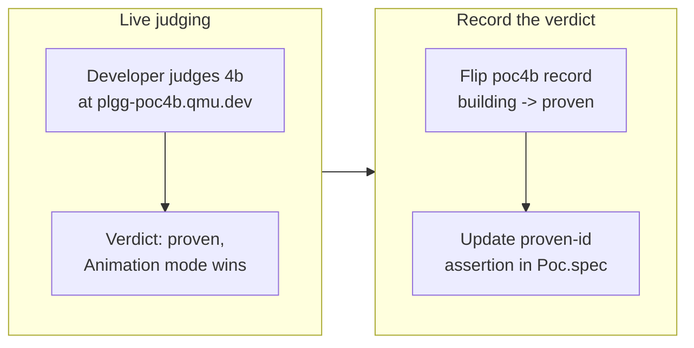

## 1. Overview

This branch concludes **PoC 4b of the plggpress confidence-collection fleet**: the developer judged the live co-editing preview at `plgg-poc4b.qmu.dev` and approved it, so the portal's durable data now records the verdict — the `poc4b` record flips from `building` to **`proven`** with the measured outcome: the co-editing experience feels real, and of the two compared visualizations the **micro-animation mode wins**.

**Highlights:**

1. `poc4b` portal record flipped `building` → `proven` with the live-judging verdict (`packages/plgg-poc-portal/src/pocs.ts`).
2. Verdict text records the measured finding: co-editing feels like the same whiteboard, and the erase→write micro-animation delivers the co-presence the before/after diff does not.
3. Three standing deferred concerns closed by the verdict (the co-editing experience was unproven / the same-whiteboard feel unjudged / the animation unverified).

## 2. Motivation

PoC 4b shipped its prototype the prior branch, but a PoC's confidence signal is the developer's judgment, not the scaffold. The developer judged it live — "Animation wins — feels like co-editing" — so the fleet's durable record (the portal data the mission reads its progress from) must reflect that conclusion, exactly as PoC 1/2/3's concluding tickets did.

## 3. Changes

A data-only conclusion: the developer's live verdict was recorded by flipping exactly the `poc4b` portal record and adjusting the one spec assertion that enumerates the proven PoCs — no type, logic, or other-PoC changes.

### 3-1. Conclude PoC 4b: proven — co-editing feels real, Animation mode wins ([7417dfdd](https://github.com/qmu/plgg/commit/7417dfdd))

Flipped the `poc4b` record in `pocs.ts` from `status: "building"` / `verdict: none()` to `status: "proven"` / `verdict: some(...)` with the measured live-judging outcome, and updated the proven-id assertion in `Poc.spec.ts` to `["poc1","poc2","poc3","poc4b"]`. `pocConsistent` stays satisfied (the concluded record now carries a verdict).

## 4. Outcome

The portal at `plgg-poc.qmu.dev` now presents PoC 4b as **proven** with the co-editing-experience conclusion, and the mission `plggpress-technical-confidence-poc-portal` reads one more proven signal. PoC 4 remains `building` — its own concluding verdict (the mechanics question) is a separate, still-pending follow-up. Portal specs are green (12 passed) and `pocConsistent` holds for every record.

## 5. Historical Analysis

This extends the fleet's established "conclude a PoC" pattern — each concluding ticket edits exactly its own `pocs.ts` record (status + verdict) and nothing else, guarded by the `pocConsistent` data invariant, as PoC 1, 2, and 3 did. PoC 4b's verdict is the first to conclude the *experience* arm of the writer-side story (PoC 4 proved the mechanics; 4b proves it feels like co-editing).

## 6. Concerns

None new — this is a data-only verdict recording. Three standing deferred concerns were **resolved** by this verdict (the co-editing experience being unproven, the same-whiteboard feel being unjudged, and the two-phase erase→write animation being unverified in a browser — all answered by the live judging that chose the animation mode). The standing concern that the portal's verdict data is hand-edited (rather than generated) persists and is unchanged by this branch.

## 7. Successful Development Patterns

- **Judge live, then record the verdict as durable data.** The PoC fleet separates the human's live confidence judgment from the machine-readable record: the developer judges at the live URL, and the concluding ticket writes the measured outcome into `pocs.ts` guarded by `pocConsistent`. The verdict text captures *what was observed and chosen* (animation over diff), not aspiration — so the mission's progress rests on a recorded judgment, not a claim.
- **A tightly-scoped concluding ticket keeps the portal honest.** Editing only the one record's `status`/`verdict` plus the single enumerating assertion means the change is reviewable at a glance and the `pocConsistent` invariant does the rest.

## 8. Release Preparation

**Verdict**: Ready for release

### 8-1. Concerns

- None — a data-only portal record flip; portal specs green, `pocConsistent` holds, and the whole-monorepo `check-all` is the ship readiness proof.

### 8-2. Pre-release Instructions

- None — standard deploy-on-merge (the merge redeploys the guide/portal; `plgg-poc.qmu.dev` will show 4b as proven).

### 8-3. Post-release Instructions

- Follow-up (separate, not this branch): conclude PoC 4's own verdict once re-judged at `plgg-poc4.qmu.dev`.

## 9. Notes

The verdict was reached in-session (the developer judged 4b live at `plgg-poc4b.qmu.dev` while the container served on host 5190). "Animation wins — feels like co-editing" is the recorded conclusion.

## Deployment Evidence

- **When:** 2026-07-14T01:53:22+09:00
- **Target:** plgg guide (plggpress docs site)
- **Method:** api-probe (pre-merge readiness: scripts/check-all.sh)
- **Status:** pass
- **Observed:** check-all EXIT 0 on the branch tip; portal specs green (12 passed), pocConsistent holds, proven-id list [poc1,poc2,poc3,poc4b]
