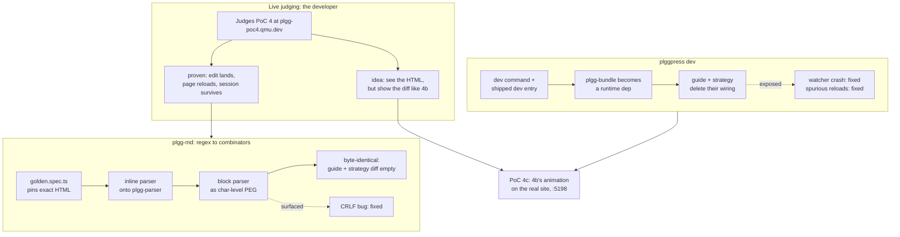

## 1. Overview

This branch does four separable things, joined by one theme: **the plgg family stopped
hand-rolling what it already owns.** It concludes a PoC from a live judgment, moves the
markdown core onto the family's own parser combinators, gives plggpress the `dev` command
that deletes every consumer's hand-wiring, and builds the PoC the developer asked for
while judging.

**Highlights:**

1. **PoC 4 is `proven`** (`be398d2e`) — the developer judged the fixed build live; the
   portal record carries the measured outcome.
2. **plgg-md's two parsers are plgg-parser combinators** (`0b948549`, `db03ae5b`) — 1028
   lines of regex line-grammar gone, output **byte-identical** on the real corpora.
3. **`plggpress dev` exists** (`c6761c06`) — a docs repo whose only dependency is
   plggpress now runs `plggpress dev` and gets hot reload. `guide` and `../strategy` both
   deleted their `bundle.config.ts` + `devEntry.ts` + `plgg-bundle` devDep (`2ec28d27`).
4. **PoC 4c is built and serving** (`7db57cf6`) — 4b's animated in-place edit on PoC 4's
   REAL rendered site, at `localhost:5198`, awaiting the developer's live judgment.
5. **Three real bugs fixed**, each found by doing the work: a CRLF markdown source parsed
   as nothing but paragraphs (`ef2c04c6`); an unhandled `fs.watch` error killed the dev
   server (`b30eceaa`); a build caused spurious reloads (`1e25e317`).

## 2. Motivation

Three of the four threads started as the developer's own words during a judging session.
PoC 4's verdict needed their live judgment because *that judgment is the verdict*. While
judging, they said what was missing — "we can actually see the HTML, but when it is
edited, it should show the diff like v4b shows" — which became PoC 4c. And the friction
that produced `plggpress dev` was measured in their own repo: dev-ing `../strategy`
required writing a `bundle.config.ts`, a `devEntry.ts`, and taking a bundler dependency,
just to read one's own Markdown.

The parser rewrite is the odd one out: it closes **no** deferred concern, because none
existed. plgg-md renders every plggpress site through a hand-rolled regex line-grammar,
in a package that already depends on plgg-parser and already parses its front matter with
it. It was the last place in the markdown core speaking ad-hoc regex instead of the
family's zero-dep combinator vocabulary — the seed to refactor rather than keep cloning.

## 3. Changes

- **`packages/plgg-md`** — `golden.spec.ts` (the oracle) added first; `renderInline.ts`
  and `parseBlocks.ts` rewritten onto plgg-parser; `normalizeLineEndings` fixes CRLF.
- **`packages/plggpress`** — `framework/Dev/**` (pure plan + injected toolchain seam),
  `devServerEntry.ts`, the `dev` verb, plgg-bundle promoted to a runtime dependency, and
  the reversed "plggpress ships no dev command" stance documented where it was stated.
- **`packages/plgg-bundle`** — the watcher survives a later `error`; the reload decision
  ignores the app's own `outDir`.
- **`packages/plgg-poc4c-livesite`** + `workloads/poc4c-livesite` — the new PoC.
- **`packages/plgg-poc-portal`** — poc4 → `proven`; poc4c added at 5198; the pinned port
  range widened because the reserved block is full.
- **`packages/guide`** — `bundle.config.ts` and `devEntry.ts` deleted.
- Pre-existing on this branch (earlier sessions): PoC 5, PoC 6, the qmu.co.jp theme.

## 4. Outcome

The portal shows **five proven PoCs** (poc1–poc4, poc4b) and three building (poc5, poc6,
poc4c). Every plggpress site renders through combinator parsers whose output is provably
unchanged. A docs repo needs one dependency to get hot reload, and both of ours have
dropped their wiring. `check-all` is EXIT 0 with no failing suite; ten containers serve,
including the guide (5181) — which this branch also found dead, twice, and fixed.

What is NOT done: PoC 4c has no verdict (that is the developer's live judgment, and the
voice path has never been driven end-to-end), and four known plgg-md grammar bugs are
recorded but deliberately unfixed — each changes rendered output and needs its own
sign-off.

## 5. Historical Analysis

This is the fleet's established rhythm — judge live, record the verdict as data guarded
by `pocConsistent` — applied to PoC 4 exactly as PoC 1/2/3/4b were concluded. PoC 4c
continues the spin-off pattern 4b started: one PoC, one question. It also hit the first
structural limit of that growth: the reserved port block 5184–5190 filled up, so 4c was
allocated at 5198 and the pinned invariant widened deliberately rather than quietly.

The parser rewrite extends plgg-parser's reach for the third time (plgg-highlight
tokenizes with it; `parseYamlSubset` already parsed front matter with it) — and this is
the first consumer big enough to make its **concrete-`S` pinning** ergonomics cost real,
which is why two standing concerns about that changed shape here.

`plggpress dev` reverses a stated policy — the CLI's own header said "authoring
hot-reload is a TOOLCHAIN concern; plggpress ships no `dev` command". The layering
survived (the dev loop is still plgg-bundle's, behind a seam); only the paperwork moved.

## 6. Concerns

**Resolved (1):** `live-judging-of-the-fixed-poc` — its How to Fix was "re-judge live,
then file the concluding verdict ticket flipping poc4 to a concluded status". Both
clauses done in `be398d2e`; `pocConsistent` green.

**Changed but still active (9):** the two `concrete-s-pinning` concerns and the two
`attempt-combinator` ones (a third, much larger grammar now leans on them — the "only two
grammars, one-liner per leaf" cost argument no longer holds); the two
`hot-reload-does-not-refresh-config/site` concerns (**the symptom survives but the fix
location moved** — the watcher now fires; `loadConfig`'s dynamic import lacks a `?v=`
cache-buster, so the config is served from node's module cache. Their recorded How to Fix
is now the wrong fix); `plgg-bundle-bin-cache-verification-gotcha` (newly reachable — the
runtime-dep promotion puts it in every plggpress consumer's install path);
`cloudflared-ingress-for-the-poc-hostnames` (a fourth unmapped hostname);
`preview-drops-plggpress-theming-accepted-poc` (its "follow-up PoC" now exists as 4c, but
4c has no verdict yet).

**New, recorded as tickets rather than concerns:** four plgg-md grammar bugs the
equivalence swap surfaced and deliberately preserved (fence closes on the same character
regardless of run length; the container's colon scan is flat; table rows continue on any
line containing `|`; three unreachable paths).

**Not resolved, and a PR reader should know:**
`container-npm-rewrites-a-sibling-package` is untouched — PoC 4c's entrypoint replicates
the same bind-mount `npm install`, making it a fourth container doing so. The portal's
verdict data is still hand-edited; this branch hand-edited it three more times and the
fleet is now eight records. plgg-md's **branch coverage margin thinned** to ~90.7% against
a >90% gate: nothing is less tested (`parseBlocks.ts` is 100%), the denominator shrank
because the branching moved inside plgg-parser's combinators — but the next change in
that package could dip under for reasons unrelated to its own quality.

## 7. Successful Development Patterns

- **Build the oracle before the refactor, then prove the oracle bites.** `golden.spec.ts`
  landed first, and a trip-test earned its keep immediately: a one-character mutation to
  `strong`'s empty-content guard was caught by that spec **alone** while all 104
  pre-existing specs stayed green. "The specs still pass" was never evidence of
  equivalence — which reframed the whole rewrite's risk before a line of it was written.
- **Reproducing a grammar means reproducing its bugs — and that is what makes the cure
  safe.** The swap preserved a CRLF quirk faithfully rather than accidentally "fixing" it
  mid-refactor; the same gate then proved the deliberate fix moved nothing else (LF
  sources pass through untouched, corpora diff empty).
- **A green check is not a verified change.** Three claims died on contact this branch: a
  site diff that "passed" because the build had FAILED and left `dist` stale; a
  non-reproduction that was a race, not a disproof; a "39-page reload storm" that measured
  as 2 because the debounce already collapsed it. Each was caught by deliberately breaking
  the thing and checking the gate moved.
- **The full gate catches what package tests cannot.** Two real regressions passed every
  package suite and were caught only by `check-all`: a dependency promotion that broke the
  container-provisioning gate, and an `import.meta` in a built entry's module graph that
  made plggpress's own dist unbuildable.
- **Drive the code, not just its tests.** PoC 4c's 308-line DOM choreography had never
  run; a real headless browser proved the live page's `h1` changes in place with no
  reload — before it reached a judging session, where a first-line failure would have cost
  the developer's time (as PoC 4's first round did).

## 8. Release Preparation

**Verdict**: Ready for release

### 8-1. Concerns

- **Scale**: 149 files. The branch-safety scan flags `too-many-files` (override) — the
  count is three new PoC packages (4c/5/6 = 87 files), not a broad rewrite of existing code.
- The scan's five `secret` findings are **all false positives**, verified individually: a
  `htmlToken` identifier, a `firstToken` identifier, and OpenAI's public
  `client_secrets` endpoint path. No credential is in the diff (checked for `sk-`/`ek_`/
  AWS/private-key patterns; `.env` is not committed; keys come from `keyOption()`).
- plgg-md's branch-coverage margin is thin (~90.7% vs a >90% gate).

### 8-2. Pre-release Instructions

- None — `check-all` EXIT 0 on the branch tip is the readiness proof.

### 8-3. Post-release Instructions

- **Apply the cloudflared route** for `plgg-poc4c.qmu.dev` → :5198 (developer-applied;
  the exact lines are in `packages/plgg-poc4c-livesite/README.md`). Until then 4c is
  judgeable only at `http://localhost:5198/`.
- **Judge PoC 4c live** — that judgment is its verdict. Its voice/Realtime path has never
  been driven end-to-end (the key mints 200), so expect the possibility of a first-round
  bug there.
- Decide which of the four recorded plgg-md grammar bugs to fix; each needs a deliberate
  `golden.spec.ts` re-pin.

## 9. Notes

The guide's dev container was found dead — twice — during this branch, each time
unnoticed for hours, because `check-all` neither builds nor runs the guide. The first
death was caused by this session's own host-side builds racing the container's watcher.
Both crashes are fixed, but the operational gap is not: **nothing watches these
containers.** A health check on the workloads would turn hours into minutes, and is worth
its own ticket.

## Deployment Evidence

- **When:** 2026-07-15T15:04:06+09:00
- **Target:** plgg monorepo (pre-merge readiness)
- **Method:** api-probe + container verification
- **Status:** pass
- **Observed:** `scripts/check-all.sh` EXIT 0 with no failing suite on the branch tip;
  plgg-md 108 passed, plggpress 248, plgg-bundle 96, poc4c 86, portal 13 — all 0 failed.
  guide + strategy rebuilt through both new parsers diff EMPTY against the pre-change
  baseline (`command diff` EXIT 0, sha256 unchanged, both builds EXIT 0). Live: guide
  5181 → 200 (theme hot reload proven in-container), poc4c 5198 → 200 (real page patched
  in place in a headless browser), poc4 5187 / poc4b 5190 / portal 5183 → 200.
