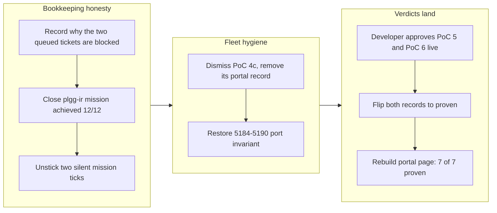

## 1. Overview

This 5-commit branch wraps the plgg-ir mission (the IR package family) as achieved after 12/12 tickets, unsticks the mission board's silent reporting drift that had hidden progress for two days, dismisses PoC 4c as abandoned (mechanically proven but never live-judged), and concludes PoC 5 and PoC 6 as proven from the developer's live approval at plgg-poc5.qmu.dev and plgg-poc6.qmu.dev — bringing the whole 7-PoC plggpress fleet to proven and the PoC-portal mission to 8/9 (all PoCs concluded, only production integration pending).

**Highlights:**

1. Concluded PoC 5 (central configuration generation) proven: typed commands through one total `applyOp` over one typed `Config`, live re-render, seven `sz-` sizing themes and three layouts as closed unions, voice as the bonus second way in
2. Concluded PoC 6 (non-tree file classification) proven: three side-by-side navigation variants over one corpus, each search a deterministic pure function via closed-union `VariantQuery`; the developer approved the comparison itself
3. Dismissed PoC 4c as abandoned — mechanically proven, but the live judgment that IS the verdict was blocked by a route gate to the end; the portal record was removed and the 5184–5190 port invariant restored
4. Closed `build-the-plgg-ir-package-family` mission as achieved (12/12 tickets)
5. Unstuck the mission board's silent tick drift (marker-convention no-ops had under-reported progress for two days) and recorded why the two queued tickets are blocked on developer decisions

## 2. Motivation

The developer reviewed PoC 5 and PoC 6 live and approved both at their qmu.dev hostnames. The branch records their verdicts the way every PoC in this fleet has been concluded — a record-only flip of the portal's typed data, gated by `pocConsistent` — and clears the surrounding bookkeeping debt: the achieved plgg-ir mission is closed and archived, the mission board's silent marker-convention drift that had been hiding two days of progress is fixed at the point of use, and the two tickets that a night `/drive` could not do autonomously carry written diagnoses of exactly which developer decision each needs. With this branch, every mechanical PoC question is answered; the sole remaining mission item is post-PoC integration into production plggpress.

## 3. Changes

Five commits: a night `/drive` recorded the measured blockers on the two queued tickets (both waiting on developer decisions, not effort), closed the achieved plgg-ir mission, and unstuck the mission board's stale ticks (the portal went 5/9 → 6/9). The developer then dismissed PoC 4c ("dismiss 4c, moving on") and its portal record was removed, returning the fleet to seven. Finally the developer approved PoC 5 and PoC 6 live at their hostnames, both records flipped to proven, and the portal now serves seven proven badges — 8/9 on the mission, integration remaining.

### 3-1. Show the agent's edit as a watchable diff ON the real rendered HTML — dismissed ([fc9acefb](https://github.com/qmu/plgg/commit/fc9acefb))

The PoC 4 × PoC 4b synthesis ticket was closed unjudged on the developer's call. Its `poc4c` portal record was removed entirely rather than concluded (the mission requires every listed PoC to record a verdict, and this question was abandoned, not disproven), restoring the seven-PoC fleet and the 5184–5190 port-block invariant. The research assets — the text-run-local span mapper with typed refusals and reload-release degradation — survive in the archived ticket for whoever asks the question again.

### 3-2. Conclude PoC 5: central configuration generation is proven ([34be6698](https://github.com/qmu/plgg/commit/34be6698))

Record-only flip of the `poc5` entry after the developer's live approval at plgg-poc5.qmu.dev (2026-07-16). The verdict records what the approved build demonstrates: typed commands parse to exactly one `ConfigOp` applied by the one total `applyOp` into a single typed `Config`, the sample site re-renders live, seven `sz-` sizing themes and three layouts are closed unions under exhaustive `switch`, and the Realtime voice session drives the same five tools as a bonus. The accepted sacrificial bound (config as client state, no disk-persistence seam) is stated in the verdict.

### 3-3. Conclude PoC 6: non-tree file classification is proven ([8e3a3f2a](https://github.com/qmu/plgg/commit/8e3a3f2a))

Record-only flip of the `poc6` entry after the developer's live approval at plgg-poc6.qmu.dev (2026-07-16). Three navigation variants — tag facets (AND/OR), link/backlink graph, multi-dimensional filter — render side by side over one corpus, and each variant's search is a deterministic pure function of `(pages, query)`, which is what makes the agent-drivability signal checkable headlessly. No winning variant is claimed: the developer approved the comparison itself; picking the production UX belongs to the integration phase.

## 4. Outcome

- The complete seven-PoC confidence fleet is proven: PoC 1 (browser search core), PoC 2 (reader-side embedded browser agent), PoC 3 (writer-side voice assistant), PoC 4 (agent file edits with live hot reload), PoC 4b (live co-editing preview), PoC 5 (central configuration generation), and PoC 6 (non-tree file classification) — each concluded from the developer's live review at its `*.qmu.dev` hostname.
- PoC 4c was deliberately dismissed after reaching full mechanical proof: the question remains unanswered (not disproven), the research assets are intact in the archived ticket, and the durable components (PoC 4b's pure diff core plus the plgg-view animation seam) carry forward.
- The PoC-portal mission stands at 8/9 — only post-PoC integration into production plggpress remains; the portal page was rebuilt and verified serving 7 proven badges live at plgg-poc.qmu.dev.
- `packages/plgg-poc4c-livesite` remains orphaned in the repo and needs a delete-or-keep decision (recorded as a concern below).
- The plgg-ir mission closed achieved (12/12), and the mission board's two silently-stuck ticks were repaired.

## 5. Historical Analysis

- **Silent marker convention drift**: when a ticket-acceptance marker is absent or malformed, `tick-acceptance.sh` no-ops silently and returns success, so a mission under-reports indefinitely. Both the plgg-ir close and the PoC 4 tick were invisible for two days for exactly this reason; the fix and the convention are now recorded at the point of use in the mission files.
- **Measurement-driven ticket validation**: several recent ticket premises failed the same way — written from tree listings or inference rather than from running the thing. The measurements in those tickets were accurate; the conclusions drawn from them were premature. Checking measurements and conclusions separately is the recurring lesson.
- **Verdict confidence in PoC design**: PoC 4c reached full mechanical proof yet was dismissed, because the developer's live judgment — which IS the verdict in this fleet — was gated on a route only they could apply. A PoC whose verdict requires human judgment can be built to completion and still answer nothing; that is a property of the confidence-PoC design, not a failure.
- **Build coverage completeness**: the portal's `dist/site/index.html` is not covered by `scripts/build.sh`; verdict flips need the package's own `npm run build`, or the live page silently serves a stale render.

## 6. Concerns

### (carried from prior PRs) Standing deferred concerns remain active

- **Severity:** moderate
- **Description:** The curated corpus of ~80 still-active deferred concerns (deduplicated this run: 12 twin files superseded into 9 survivors, 1 resolved) targets plgg-web HTTP/Result combinators, plgg-sql, plggmatic/renderer, plggpress/auth, plgg-bundle, plgg-parser, plgg-highlight, CI/dependabot, operations, and policy validation. This branch touched only `.workaholic` bookkeeping and portal verdict data; none of the flagged patterns changed, so the set carries forward unchanged in `.workaholic/concerns/`.
- **How to Fix:** Address them as their target areas are worked on in future PRs; the corpus is now deduplicated and supersession-resolved, prioritized by severity.

### proc's Defect stays invisible AND proc adoption is incomplete, so throws surface under types claiming to be precise

- **Severity:** urgent
- **Description:** Two individually-moderate concerns compound into a type-soundness gap: (A) precise downstream error channels (SqlError, HttpError) omit `| Defect`, so an injected Defect is carried at runtime under a type that excludes it; (B) proc/Defect folding was adopted only in plgg-db-migration, leaving hand-rolled ladders elsewhere. Together, an unexpected throw in an un-migrated module surfaces under a precise error type with no uniform fold at the boundary (see `.workaholic/concerns/proc-s-defect-stays-invisible-and.md`).
- **How to Fix:** Audit module boundaries for proc adoption consistency; add `| Defect` to the precise downstream channels or fold uniformly at the boundary; migrate the remaining hand-rolled ladders.

### Portal's verdict data is hand-edited typed data

- **Severity:** low
- **Description:** The portal's `pocs.ts` verdict data is maintained by hand (status + verdict flipped per concluding ticket) rather than derived mechanically. This branch again hand-edited it (PoC 5/6 verdicts, poc4c removal) with the `pocConsistent` gate holding throughout, but the hand-edited-data risk persists (see [34be6698](https://github.com/qmu/plgg/commit/34be6698) in `packages/plgg-poc-portal/src/pocs.ts`).
- **How to Fix:** Keep `pocConsistent` mandatory on every verdict change; with the fleet now fully concluded, the integration phase can close this by deriving portal state mechanically or by freezing the data.

### Portal's static page is not covered by scripts/build.sh, so verdict flips can serve stale

- **Severity:** moderate
- **Description:** Flipping a verdict in `pocs.ts` leaves the live page at :5183 serving a stale render unless `npm run build` is run in `packages/plgg-poc-portal` — `scripts/build.sh` does not cover the SSG output, and nothing warns (observed live during [34be6698](https://github.com/qmu/plgg/commit/34be6698); the page still showed a "Building" badge until the manual rebuild).
- **How to Fix:** Add the portal's SSG render to `scripts/build.sh`, or make the manual rebuild a required step of the PoC-conclusion pattern.

### plgg-poc4c-livesite is orphaned and needs a delete-or-keep decision

- **Severity:** low
- **Description:** Removing poc4c's portal record orphaned `packages/plgg-poc4c-livesite`: nothing links it, `build.sh`/`check-all` still carry it, and its reserved :5198 allocation is unused (see [fc9acefb](https://github.com/qmu/plgg/commit/fc9acefb)). It is cruft until decided.
- **How to Fix:** Delete the package (and its port reservation notes) or keep it as a documented reference artifact — either way, record the decision.

### Ticket diagnostics: measurements held, conclusions did not

- **Severity:** low
- **Description:** The two queued tickets' STATUS findings (recorded in [54c41815](https://github.com/qmu/plgg/commit/54c41815)) show a recurring failure shape: accurate measurements (tarball inspection, dist listings, port probes) paired with premature conclusions (e.g. reading `.d.ts` declaration trees as emitted module trees). The plgg-mcp ticket remains open on a package-boundary decision, with `bun` absent on this host making its quality gate unrunnable as written.
- **How to Fix:** In diagnostic tickets, separate measurements from conclusions so each can be verified independently; restate environment-dependent gates (bun) as module-graph assertions runnable in this repo's pipeline.

## 7. Successful Development Patterns

- **Record-only verdict flips as their own tickets**: concluding a PoC by flipping exactly its own `pocs.ts` entry — with the verdict text held to the honest ceiling of what was measured plus the developer's stated approval — kept every conclusion auditable and the portal invariant (`pocConsistent`) green across five conclusions and one dismissal.
- **Silent no-op detection in automation**: automation that silently succeeds when its precondition is unmet (the acceptance-marker convention) hides drift indefinitely; attaching markers at filing time and verifying the tick landed is now the recorded practice.
- **Abandoned ≠ disproven**: recording PoC 4c's dismissal with its mechanical evidence intact preserves the expensive research (span mapper, typed refusals, reload-release degradation) for whenever the question is asked again — a dismissal that deletes the record but keeps the reasoning in the archive.
- **Measure first, conclude second**: the blocked-ticket diagnoses separated what was measured from what was inferred, which is what made the night `/drive`'s "cannot do this autonomously" verdicts trustworthy rather than lazy.
- **Live-preview verification closes the loop**: after flipping the verdicts, curling the live portal (not just the built file) caught that the served page was stale — the served artifact, not the source, is what the developer reviews.

## 8. Release Preparation

**Verdict**: Ready for release

### 8-1. Concerns

- None — the branch-safety scan passes clean, doc-drift found no candidates, the diff touches only `.workaholic` bookkeeping and the PoC portal, and all gates are green (portal 13 specs, tsc clean, fresh check-all EXIT 0, coverage >91%).

### 8-2. Pre-release Instructions

- None — standard release process applies.

### 8-3. Post-release Instructions

- None — no special post-release actions needed.

## 9. Notes

The dialect export work referenced by this branch's blocked-ticket findings ships separately on `work-20260716-115204` (manifestDialect + mapDialect). The two branches share no code paths; this one is `.workaholic` + portal only.
