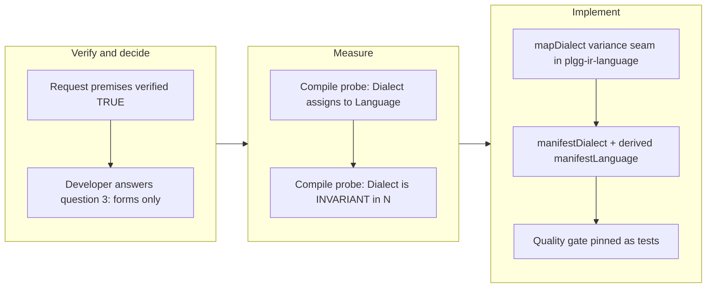

## 1. Overview

Exported the Domain Manifest vocabulary from plgg-ir-manifest as a composable `manifestDialect` (design.md §24's `domainDialect`), so the plggmatic consumer can `compose(mapDialect(embed)(manifestDialect), viewDialect)` into one checked language without forking the vocabulary or defining a purpose-specific manifest. `mapDialect` was added to plgg-ir-language as the variance seam a compile probe proved necessary — `Dialect<N>` is invariant in its node type — and every item of the request's quality gate is a passing test.

**Highlights:**

1. `manifestDialect` (name: `domain`) exported from plgg-ir-manifest, with `manifestLanguage` derived from it so the two exports cannot drift
2. `mapDialect` added to plgg-ir-language as the invariance seam: lifts a dialect to a composition's wider node type while mapped forms keep their own closed vocabulary
3. Consumer dialects add forms only — never extend a domain type (developer decision, enforced by construction through mapDialect's closed interior)
4. The request's whole quality gate is passing tests: heterogeneous compose with zero casts, a two-dialect document reads and checks, a cross-dialect entity reference resolves through the composition, a duplicate name is a composition error
5. plgg-ir-language 66 tests at 100% coverage, plgg-ir-manifest 75 tests over the gate, fresh check-all green; both READMEs document the seam

## 2. Motivation

The plggmatic consumer — "reading a domain document written by an LLM and turning it into a running, operable UI with no compile step" — needs one checked language holding both the domain vocabulary and its own view forms. Its only routes without this export were forking the vocabulary (the corruption anti-corruption-structure exists to prevent) or a purpose-specific manifest (ruled out by its own frozen decision). The request was filed via `/request`, verified claim-by-claim by a `/drive` session, and carried as a design checkpoint with exactly one load-bearing question for the developer: may a consumer dialect extend a domain type, or only add forms? The developer answered "forms only", and everything else followed.

## 3. Changes

One substantive commit. A scratch compile probe settled both type-level questions before design: the `Dialect → Language` derivation is free, but `Dialect<N>` is invariant in `N`, so the export alone could never satisfy the request's composition gate. `mapDialect` — a functor over the node type whose mapped forms keep their own closed vocabulary while the composition's scope flows through — is the additive seam that closes the gap, and it enforces the developer's "forms only" bound by construction. The request and its resume checkpoint were archived together with RESOLUTION sections giving plggmatic the exact shape to target.

### 3-1. Export the domain vocabulary as a composable Dialect ([a16cc0a2](https://github.com/qmu/plgg/commit/a16cc0a2))

The `/request` from the plggmatic consumer, verified sound premise-by-premise. Delivered as asked: a composable `Dialect` for the domain vocabulary exported alongside the existing `Language<Module>`, additive, nothing removed. Its RESOLUTION section records the consumer's target shape: `compose(mapDialect((m: Module): PortalNode => m)(manifestDialect), viewDialect)`.

### 3-2. Resume: decide the domain Dialect's shape ([a16cc0a2](https://github.com/qmu/plgg/commit/a16cc0a2))

The design checkpoint carrying three open questions. Two took their recommended defaults (derive `manifestLanguage` from the dialect; one dialect, not split by subject), and the load-bearing third — extend domain types vs add forms only — was put to the developer, who chose forms only. The ticket's anticipated verification ("one tsc --noEmit settles it") was run and extended: the derivation held, and the invariance finding it did not anticipate was measured and solved with `mapDialect`.

## 4. Outcome

- `manifestDialect` exported from plgg-ir-manifest with name `domain` per design.md §24, making the domain vocabulary composable alongside consumer dialects.
- `manifestLanguage` derived from `manifestDialect` (a variable reference assigns without the excess-property check) so the two exports cannot drift.
- `mapDialect` added to plgg-ir-language as the variance seam lifting a `Dialect<N>` to a composition's wider node type, with `contextOf` exported for its context rebuilding.
- The request's quality gate is fully passing: heterogeneous compose with zero casts; a two-dialect document reads and checks; a cross-dialect entity reference resolves through the composition's scope; a duplicate name is a composition error; `manifestLanguage ≡ manifestDialect`.
- plgg-ir-language 66 tests at 100% coverage; plgg-ir-manifest 75 tests with the coverage gate passed; fresh `check-all` green on the merged tree.
- Both package READMEs document the seam and the forms-only consumer bound; the archived tickets' RESOLUTION sections give plggmatic the exact target shape.

## 5. Historical Analysis

- **The request was unusually sound** — every premise was verified TRUE rather than inferred, which the resume ticket itself notes is rare for recent tickets. It was written from measurement, and its reasoning held.
- **The carry/resume pattern worked as designed**: a `/drive` contextualized the `/request`, verified all claims, took recommended defaults on two questions, and carried exactly one load-bearing design decision to the developer.
- **The gap was adjacent to a closed mission, not part of it**: `build-the-plgg-ir-package-family` was correctly closed achieved — `plgg-ir-language` provides dialect composition. What was missing was `plgg-ir-manifest` exporting its vocabulary AS a dialect: the machinery existed, the keyhole was blocked.
- **The invariance finding was measured, not assumed**: `Dialect<N>` carries `N` in both variance positions through `ctx.language` and `ctx.analyzeForm`, so a compile probe (created, compiled, deleted) settled that the export alone could not satisfy the composition gate — which is exactly what justified `mapDialect` as in-scope.

## 6. Concerns

### (carried from prior PRs) Standing deferred concerns remain active

- **Severity:** moderate
- **Description:** The corpus (~83 items) was curated on PR #73 earlier today; this branch's additive dialect-export work resolves none of them (judged, zero resolved), so the set carries forward unchanged in `.workaholic/concerns/`.
- **How to Fix:** Address them as their target areas are worked on in future PRs.

### mapDialect is new public surface with closed-interior semantics

- **Severity:** moderate
- **Description:** `mapDialect` is now part of plgg-ir-language's public API, and its semantics are a commitment: a mapped form analyzes with its OWN dialect's closed vocabulary while the composition's scope (and with it cross-dialect references) flows through; consumer dialects add forms only, never extend a domain type (see [a16cc0a2](https://github.com/qmu/plgg/commit/a16cc0a2) in `packages/plgg-ir-language/src/domain/usecase/mapDialect.ts`).
- **How to Fix:** Uphold the closed-interior design in future forms machinery (any new `AnalysisContext` member must keep the mapped rebuild honest), and carry the forms-only bound into consumer-facing guides when plggmatic integrates.

### New exports are not yet on npm

- **Severity:** moderate
- **Description:** `manifestDialect`, `mapDialect`, and `contextOf` exist only in the repo — both packages sit at 0.0.1 on the registry and this branch bumps no version, so the plggmatic consumer cannot import them from the published package yet (see [a16cc0a2](https://github.com/qmu/plgg/commit/a16cc0a2)).
- **How to Fix:** Bump plgg-ir-language and plgg-ir-manifest and publish via `publish-npm.sh` when plggmatic is ready to integrate the compose seam.

## 7. Successful Development Patterns

- **Measure the type-level question with a scratch compile probe before designing**: the variance probe (file created, compiled, deleted) settled both the free derivation and the invariance in one `tsc --noEmit`, preventing both over-engineering and a design built on a false assumption.
- **Derive rather than duplicate**: `manifestLanguage = manifestDialect` eliminates drift by construction; the excess-property check applies only to object literals, so the derivation costs nothing.
- **Enforce bounds by construction, not documentation**: the forms-only decision is what mapDialect's closed interior mechanically does, and the spec pins it (a mapped form's interior cannot see the composition's other forms) — stronger than a guideline.
- **Ask exactly one load-bearing question**: of the three open design questions, two took their recommended defaults and only the one that bounds the vocabulary's openness went to the developer — the approval gate stayed sharp.

## 8. Release Preparation

**Verdict**: Ready for release

### 8-1. Concerns

- None — the branch-safety scan passes clean, no doc drift (both READMEs were updated in the same commit), the change is additive, and all gates are green (fresh check-all EXIT 0 on the merged tree).

### 8-2. Pre-release Instructions

- None — standard release process applies.

### 8-3. Post-release Instructions

- The new exports are not yet on npm: before plggmatic can import `manifestDialect`/`mapDialect` from the published packages, bump plgg-ir-language and plgg-ir-manifest and publish them (`publish-npm.sh`).

## 9. Notes

This branch was cut fresh from main per the resume ticket's explicit instruction (the PoC branch `work-20260716-023712`, shipped as PR #73 earlier today, carried unrelated work). The archived tickets' RESOLUTION sections are the durable design record: derivation yes, one dialect named `domain`, forms only.
