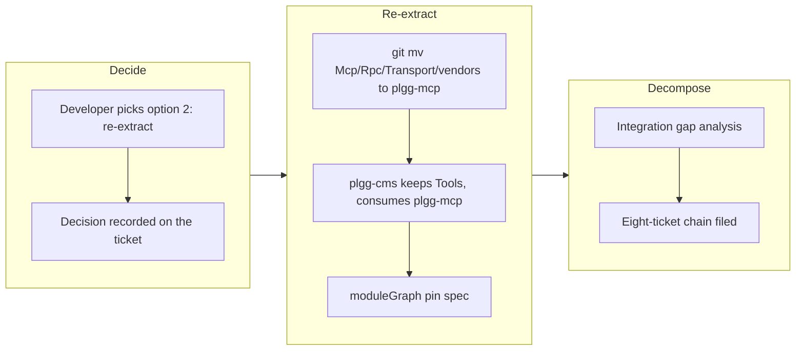

## 1. Overview

Re-extracted the MCP protocol substrate into its own package, reversing the `87b46fc9` consolidation on the developer's explicit decision: `plgg-mcp@0.0.2` carries the tool registry + dispatch, JSON-RPC framing, transport handling, and the stdio seam with **no content coupling** — `node:sqlite` is pinned absent from its module graph by a spec — while `plgg-cms@0.0.3` keeps the content tools and re-exports both through its unchanged barrel. The branch also files the post-PoC integration plan and its eight-ticket chain into the mission.

**Highlights:**

1. New `packages/plgg-mcp@0.0.2` (0.0.1 is frozen on npm): `Mcp`/`Rpc`/`Transport`/`vendors` moved via `git mv` from plgg-cms's internal `mcpProtocol`, depending only on `plgg`
2. The durable pin: `moduleGraph.spec.ts` fails on the first content-shaped import (`node:sqlite`, `plgg-sql`, `plgg-cms`, `plgg-content`) and asserts the dependency set is exactly `plgg` — the module-graph restatement of the unrunnable bun gate
3. `plgg-cms@0.0.3` keeps `Tools/contentTools`, consumes `plgg-mcp`, and its public surface is unchanged (compat re-export barrel)
4. Post-PoC integration decomposed: `integration-plan.md` in the mission plus tickets integration-1..8 in dependency order, with the developer-gated decisions recorded inside the tickets that need them

## 2. Motivation

Ticket `20260716000445` measured that the published MCP surface drags `plgg-content` — and with it `node:sqlite` — into every consumer, which is fatal on bun and heavy everywhere: a substrate that reaches a SQLite store is not a substrate. The night `/drive` proved the ticket's original packaging-only prescription impossible (the dist subpaths were declaration trees, and the package had been deleted into plgg-cms), leaving a developer decision among three options. The developer chose full re-extraction, which also gives ticket 27's future HTTP+OAuth transport the clean seam it needs.

## 3. Changes

One re-extraction commit and one decomposition commit. The moved trees kept their history via `git mv`; consumers inside plgg-cms (`mcp/`, `server/`, specs) were untouched because they import through the `mcpProtocol` barrel, which now re-exports `plgg-mcp` plus the local `Tools`. Build/install scripts, READMEs, and the root package index were wired; the stale coverage exclusion for the moved stdio vendor was cleaned.

### 3-1. plgg-mcp pulls plgg-content into every consumer — re-extracted ([d43ccced](https://github.com/qmu/plgg/commit/d43ccced))

The measured problem and the chosen fix: a new content-free `plgg-mcp` package (protocol substrate only), `plgg-cms` keeping the store-coupled tools, and the pin spec that keeps the property from regressing on the first convenience re-export. `plgg-mcp`'s emitted bundle contains zero `node:sqlite` references, verified by grep against the built dist.

## 4. Outcome

- `plgg-mcp@0.0.2`: tsc clean, 16 tests (13 protocol + 3 pin), coverage gate passed, dist emits zero `node:sqlite` references; runtime dependency set exactly `plgg`.
- `plgg-cms@0.0.3`: tsc clean, 492 tests, coverage gate passed, dist imports `plgg-mcp` as an external; public surface unchanged.
- gate-readme and vendor-boundary green; fresh `check-all` EXIT 0 on the exact committed tree.
- The post-PoC integration roadmap is durable: plan + eight tickets on the mission board, tickets 1–2 autonomously drivable, tickets 3–7 carrying their developer decisions explicitly.

## 5. Historical Analysis

- **The consolidation and its reversal were both deliberate**: `87b46fc9` made the MCP trees internal to plgg-cms three days ago; this branch reverses exactly the protocol half on a measured boundary argument (`node:sqlite` reachability), keeping the content half consolidated. Boundaries move on evidence, not aesthetics.
- **The pin pattern recurs**: like the dialect branch's forms-only bound, the sqlite-free property is enforced by a spec rather than documentation — the module-graph assertion restates a gate that could not run on this host (bun is not installed).
- **The night-drive diagnosis paid off**: the ticket's STATUS section (measurements separated from conclusions) meant this session started from verified facts and one clean decision, not re-derivation.

## 6. Concerns

### (carried from prior PRs) Standing deferred concerns remain active

- **Severity:** moderate
- **Description:** The curated corpus (~85 items) carries forward; this branch resolves none of them directly (the portal-SSG and poc4c-orphan concerns are scheduled inside the integration chain's close-out ticket instead).
- **How to Fix:** Address them as their target areas are worked on; integration-8 names the ones this chain settles.

### plgg-mcp@0.0.2 and plgg-cms@0.0.3 are not on npm until the developer publish

- **Severity:** moderate
- **Description:** Both bumped packages reach the registry only through the ship-time developer-driven publish gate — which is currently also holding PR #75's two dialect packages (the earlier gate found no publish had run). Until published, the frozen `plgg-mcp@0.0.1` remains `latest` with the old content-coupled surface (see [d43ccced](https://github.com/qmu/plgg/commit/d43ccced)).
- **How to Fix:** Run `SKIP_GATE=1 ./scripts/publish-npm.sh` on this host when shipping; the preflight lists the pending set.

### The frozen plgg-mcp@0.0.1 consumer needs a migration decision

- **Severity:** low
- **Description:** `plgg-mcp@0.0.2` is a smaller surface than the frozen 0.0.1 (`contentTools` moved to plgg-cms), so the external consumer pinned to 0.0.1 must choose: adopt 0.0.2 + plgg-cms for content tools, or stay frozen (see the archived ticket's analysis).
- **How to Fix:** File the migration note with that consumer when 0.0.2 publishes; it is out of this repo's mechanical scope.

## 7. Successful Development Patterns

- **Record the decision on the ticket before touching code**: the DECISION section written at drive time made the archive self-explanatory and the commit message derivable.
- **`git mv` across the package boundary** preserved file history through the re-extraction, keeping blame useful for the protocol core's future work.
- **Compat barrels make re-partitioning cheap**: because every in-repo consumer imported through `plgg-cms/mcpProtocol`, moving four trees to a new package changed exactly two import sites.
- **Enforce a boundary as a failing test**: the pin spec turns "please don't re-couple the store" into red CI.

## 8. Release Preparation

**Verdict**: Ready for release

### 8-1. Concerns

- None blocking — scan clean, gates green, fresh check-all EXIT 0 on the committed tree.

### 8-2. Pre-release Instructions

- The developer runs the npm publish at the ship gate (`plgg-mcp@0.0.2`, `plgg-cms@0.0.3` — plus PR #75's pending `plgg-ir-language@0.0.2` / `plgg-ir-manifest@0.0.2` if run from that branch separately).

### 8-3. Post-release Instructions

- File the migration note for the frozen `plgg-mcp@0.0.1` consumer once 0.0.2 is public.

## Deployment Evidence

- **When:** 2026-07-16T16:55:05+09:00
- **Target:** plgg guide (deploy-on-merge)
- **Method:** check-all readiness
- **Status:** pass
- **Observed:** Pre-merge readiness: fresh scripts/check-all.sh EXIT 0 re-run on the exact committed tree (d43ccced + ticket-chain commit); gate-readme and vendor-boundary green

## Deployment Evidence

- **When:** 2026-07-16T16:55:05+09:00
- **Target:** plgg npm packages
- **Method:** publish preflight
- **Status:** pass
- **Observed:** PREFLIGHT=1 scripts/publish-npm.sh: publish set is plgg-mcp@0.0.2 and plgg-cms@0.0.3 - awaiting the developer-driven publish gate before merge
