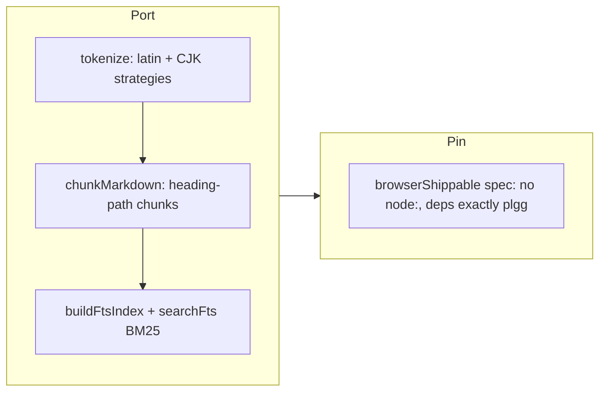

## 1. Overview

Integration ticket 1/8 of the post-PoC chain: PoC 1's proven browser-side full-text search core is now the production package **`plgg-search`** — one shared latin+CJK tokenizer (the strategy carried inside the index so build and query cannot mismatch), a fence-aware heading-path markdown chunker, an inverted-index builder, and from-scratch BM25 ranking. Zero node builtins, dependency set exactly `plgg`, pinned by a browser-shippability spec — the SSG build step and the reader's browser run the same code.

**Highlights:**

1. New `packages/plgg-search@0.0.1` under the `domain/{model,usecase}` layout, ported from `plgg-poc1-search`'s spec-covered pure functions
2. The shared-tokenizer invariant made un-mismatchable: the `CjkStrategy` (`Intl.Segmenter("ja")` word mode or bigram fallback) is stored inside the built `FtsIndex` and read back at query time
3. The vector arm was deliberately NOT ported — PoC 1's verdict rejected it for the browser; semantic search stays server-side in plgg-cms
4. `browserShippable.spec.ts` pins the point: no `node:` import and nothing server-shaped anywhere in production source

## 2. Motivation

The mission's Reader goal — `npx plggpress` generating a static site with an embedded browser agent over indexed document data — is almost entirely absent from production plggpress today (the gap analysis in the mission's `integration-plan.md` measured it). This core is the dependency root of the whole Reader path (integration tickets 2 and 3) and of the writer's agent-driven `search_docs` loop (ticket 4), and it is the one chain link that ports mechanically: pure, zero-dependency, already spec-covered functions needing no live judging.

## 3. Changes

One commit: the package scaffold per the family conventions, the four modules re-homed under `domain/{model,usecase}` with alias imports, their specs ported alongside, the pin spec added, and build/install/README wiring.

### 3-1. Port the browser-side FTS search core into production as plgg-search ([c874fe34](https://github.com/qmu/plgg/commit/c874fe34))

The PoC sources were already house-style; the only adaptations were import-alias form and two inference seams (a tuple literal needing its named type, `Intl.Segmenter` needing `lib: ES2022.Intl`). 15 tests, 100% statements, coverage gate passed.

## 4. Outcome

- `plgg-search@0.0.1`: tsc clean, 15 tests, 100% statements, coverage gate passed, dist built; gate-readme and vendor-boundary green; fresh check-all EXIT 0.
- Integration tickets 2 (static build emits `fts.json` + sitemap) and 3 (reader agent) now have their dependency in place; ticket 4's `search_docs` loop grounds on the same core.

## 5. Historical Analysis

- **Port, don't rewrite, a proven artifact**: PoC 1 measured this exact code against the vector arm on a real corpus; the integration preserves the verdict by porting the winner verbatim and leaving the loser behind.
- **The pin-spec pattern's third use today**: forms-only (dialects), sqlite-free (plgg-mcp), and now browser-shippable (plgg-search) — enforcing an architectural bound as a failing test rather than documentation.

## 6. Concerns

### plgg-search is not yet on npm

- **Severity:** low
- **Description:** A brand-new package counts as bumped at the ship preflight; until the developer publish runs, `plgg-search` exists only in-repo (see [c874fe34](https://github.com/qmu/plgg/commit/c874fe34)). In-repo consumers (integration 2+) use `file:` and are unaffected.
- **How to Fix:** Publish at this ship's npm gate.

## 7. Successful Development Patterns

- **Chunker/tokenizer/index/ranker as four one-concern modules** made the port reviewable function-by-function against the PoC originals — the diff is a re-homing, not a rewrite.
- **Carrying the tokenization strategy inside the index** turns a subtle operational invariant (index/query tokenizer agreement) into a type-level impossibility.

## 8. Release Preparation

**Verdict**: Ready for release

### 8-1. Concerns

- None — scan clean, all gates green, fresh check-all EXIT 0.

### 8-2. Pre-release Instructions

- The developer runs the npm publish at the ship gate (`plgg-search@0.0.1`, new package).

### 8-3. Post-release Instructions

- None.
