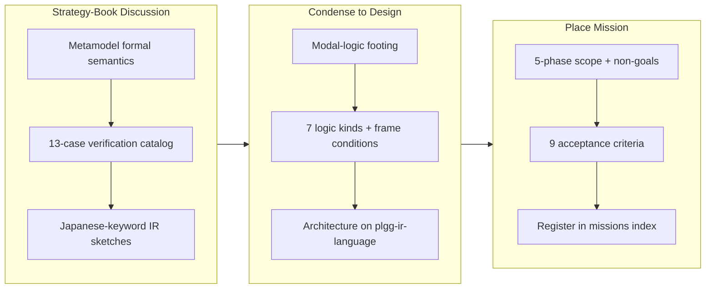

## 1. Overview

Placed the **Build the plgg-ir-thesis Evaluator** mission on the board: a durable goal to build `plgg-ir-thesis`, the second dialect on `plgg-ir-language` (sibling to `plgg-ir-manifest`), which statically verifies *argumentation structures* written in the qmu conceptual metamodel's Japanese vocabulary. The branch is pure mission placement — three markdown files, no code, no tickets — condensing the strategy book's metamodel formal-semantics discussion into a five-phase scope with a nine-item acceptance checklist and a companion `design.md` carrying the modal-logic semantics and the thirteen-case verification catalog.

**Highlights:**

1. Mission `build-the-plgg-ir-thesis-evaluator` filed with a five-phase scope (syntax prerequisite → assertion-level → frame-level → model checker → structure level), explicit non-goals, and nine acceptance criteria
2. `design.md` records the formal footing — modal logic over finite Kripke models, **model checking never satisfiability search** — with the seven logic kinds mapped to their modal systems and static frame conditions
3. The declare-and-reject rule carried over from `plgg-ir-manifest`: the writer always declares the correspondence, the compiler only checks it, keeping every pass polynomial and every rejection accompanied by a concrete counterexample
4. The motivating check — "does assertion A rebut assertion B exhaustively?" — made decidable in two selectable senses, 被覆 (coverage) and 遮断 (severing), with the reference example's expected diagnostics pinned
5. Mission registered in `.workaholic/missions/index.md`, bringing the active board to three

## 2. Motivation

The qmu conceptual metamodel is written in prose, and prose lets an AI *claim* an argument is complete without any way to be refuted. The strategy book's formal-semantics discussion (`/metamodel-semantics`) worked out that this is fixable: if an LLM declares concepts, relations, assertions, and the frames between them in a closed vocabulary, then "does A rebut B exhaustively?" stops being a rhetorical judgement and becomes a decidable model-checking problem. The design chose modal logic over finite Kripke models precisely because van Benthem's characterization theorem makes every expressible property bisimulation-invariant — content-independent by construction, which is exactly what the metamodel demands of frameworks (同型的に包摂). The constraint that shaped the whole scope is the refusal to search: checking a *declared* simulation is polynomial while searching for one is NP-hard, so the dialect always makes the writer declare and the compiler check. This extends the existing plgg-ir safety boundary from domain models to argumentation, and the mission exists to hold that goal across the many tickets it will take.

## 3. Changes

An overnight discussion in the qmu.app strategy book settled the formal semantics for verifying argumentation structures, producing a thirteen-case catalog with IR sketches. That result was condensed into a mission and a companion design note rather than implemented directly: the scope spans a tokenizer audit, four verification layers, and a model checker, which is many tickets' worth of work and exactly what the mission format exists to hold. No code was written; the branch is the goal's placement on the board.

### 3-1. Place the plgg-ir-thesis evaluator mission ([9d6124a2](https://github.com/qmu/plgg/commit/9d6124a2))

Filed `.workaholic/missions/active/build-the-plgg-ir-thesis-evaluator/{mission.md,design.md}` and registered it in the missions index. The mission defines the goal (a static verifier for argumentation structures in the metamodel's vocabulary), a five-phase scope, and nine acceptance criteria; `design.md` carries the condensed technical design — modal-logic semantics, the seven logic kinds and their frame conditions, the closed Japanese surface vocabulary with the 撤退論/継続論 reference example, the thirteen-case verification catalog, and the architecture placing the dialect on `plgg-ir-language` beside `plgg-ir-manifest`.

> **Note:** this branch archived no tickets, so this section is authored from the commit's own message body rather than from ticket Final Reports. See section 9.

## 4. Outcome

A durable, information-rich goal is now on the board with its rationale attached, and the overnight design discussion is preserved in the repository that will implement it rather than living only in the strategy book. The mission is deliberately unstarted: `tickets: []`, `stories: []`, no acceptance item ticked, and **no assignee**. Nothing is claimed to work, because nothing was built — the branch's whole value is that the goal and its formal footing are now written down where `/ticket` and `/drive` can pick them up.

The mission's architectural premises were verified against the actual tree while reporting, and they hold: `plgg-ir-syntax@0.0.1`, `plgg-ir-language@0.0.2`, and `plgg-ir-manifest@0.0.2` all exist, and the `mapDialect` + `manifestDialect` compose seam that `design.md` §6 relies on landed the day before (PR #74/#75). The Phase 1 premise is likewise genuinely open: CJK currently appears in `plgg-ir-syntax` only inside a string-literal test case (`printSexp.spec.ts`), never as a bare symbol or keyword, so the tokenizer audit really is unstarted work rather than a solved problem.

## 5. Historical Analysis

This is the second time the plgg-ir line has been extended by declaring a dialect rather than growing a general-purpose language. `plgg-ir-manifest` established the pattern — a closed vocabulary on `plgg-ir-language`, with the compiler accepting or rejecting what an LLM declares — and PR #74/#75 generalized the seam by exporting `manifestDialect` and adding `mapDialect`, explicitly so a consumer could compose its own dialect onto a checked language. `plgg-ir-thesis` is the first mission to take that seam up from outside the manifest line, which is a fair test of whether the generalization actually paid off.

The strategy book frames this as the third instance of one in-house design choice — declare a closed vocabulary and let the compiler accept or reject — after `plgg-ir` itself and `qfs`'s closed relational pipe algebra (`/metamodel-dsl`). That framing is worth preserving: it places `qfs` as **prior art**, not as a competing host.

There is also a cautionary precedent. The still-active concern `dsl-division-of-labor-between-plgg` (filed 2026-07-12) records that the division between `plgg-ir` and the plggmatic screen-structure mission — "plgg-ir owns the generic language toolchain, screen-structure owns the dialect and runtime semantics" — **has not yet been tested by an actual ticket on either side**. This mission adds a third claimant to that same untested partition. The lesson transfers by analogy rather than by subject, but it is the reason section 6 keeps the boundary question open.

## 6. Concerns

### (carried from prior PRs) Standing deferred concerns remain active

- **Severity:** moderate
- **Description:** The corpus carries 84 active items forward; this branch resolves none of them (judged: zero resolved). The judgement is trivial here — the branch's entire diff is three markdown files under `.workaholic/missions/`, and no concern in the corpus references those paths or any code this branch touches (it touches none).
- **How to Fix:** Address them as their target areas are worked on. The corpus is over the triage threshold (84 > 20, `should_triage: true`) and a triage pass is owed — see the next concern.

### The active concern corpus is 17% legacy meta-aggregates that can never self-resolve

- **Severity:** moderate
- **Description:** 14 of the 84 active concerns are "concerns about concerns being carried" (`102-standing-deferred-concerns-remain-active`, `107-standing-deferred-concerns-from-prior`, `40-long-standing-carry-over-concerns`, …), and 11 of them carry a numeric-prefixed `concern_id` derived from a pre-identity-fix filename. Since `extract-deferred-concerns.sh` keys identity on `slugify(strip_carried(title))`, no future story title can ever slugify to `102-standing-…`, so these can never be matched, updated, or resolved by the normal flow — they are inert residue that will inflate `active_count` and trip the triage threshold forever. Each has `first_seen == last_seen`, confirming none was ever re-matched.
- **How to Fix:** A developer-confirmed triage pass folding them into the single live `standing-deferred-concerns-remain-active` via `merge-concerns.sh`, or closing them with `close-concern.sh <id> accepted "legacy pre-identity-fix aggregate"`. `/report` cannot do this unprompted — the merge/severity call is the developer's.

### The thesis mission is unclaimed and its scope is a research programme, not a sprint

- **Severity:** moderate
- **Description:** `mission.md` has an empty `assignee:`, `tickets: []`, and `stories: []` — nobody owns it. Its scope is five phases spanning a tokenizer audit, four verification layers, a Dung grounded-extension solver, and a docs page, gated on a nine-item acceptance checklist at >90% coverage. That is a substantial programme to leave unowned on a board that already carries two active missions, and an unowned mission with an attractive design note is exactly the kind of thing that gets half-started.
- **How to Fix:** Set `assignee:` when the mission is actually picked up, or leave it deliberately parked and say so — the mission format supports a parked goal, but the emptiness should be a decision rather than an oversight.

### The plgg-ir ↔ plggmatic ↔ thesis dialect boundary is now three-way and still untested

- **Severity:** moderate
- **Description:** `dsl-division-of-labor-between-plgg` (2026-07-12, still active) records that the plgg-ir/plggmatic partition has never been tested by a real ticket. `plgg-ir-thesis` becomes the third dialect claimant on `plgg-ir-language`, and `design.md` §6 asserts "reuse the language layer whole" plus "no changes to `plgg-ir-manifest`" — a strong claim that nothing in the thesis vocabulary will force the shared language layer to bend. Phase 1's tokenizer extension is the likely first pressure point, since non-ASCII symbol support is a change to `plgg-ir-syntax` that both existing dialects share.
- **How to Fix:** Make Phase 1's first ticket state explicitly what may and may not change in `plgg-ir-syntax`/`plgg-ir-language`, and treat any forced change to the shared layer as the signal to revisit the partition rather than absorb it silently.

### The mission's load-bearing rationale lives behind a private link from a public repo

- **Severity:** low
- **Description:** `qmu/plgg` is **public**, but `mission.md` and `design.md` cite `strategy.qmu.dev/metamodel-semantics`, `/metamodel-dsl`, and `/metamodel` as the originating discussion, and `design.md` §5 defers the *full IR sketches for every catalog case* to that site. `qmu/strategy` is a **private** repository and the site answers 302 site-wide. For any reader of the public repo — including a future agent driving this mission — the mission's primary justification and its most concrete artefact are unreachable. (The `qfs` reference at §8 is fine: `qmu/qfs` is public.)
- **How to Fix:** Either inline the thirteen IR sketches into `design.md` when Phase 1 starts, or accept the design note as the public source of truth and mark the strategy links as internal-only context. Worth also confirming that condensing private strategy-book material into a public repo was intentional here — the release scan is clean and this is qmu's own conceptual material, not client work, so this is a "confirm the choice" note rather than a leak finding.

## 7. Successful Development Patterns

- Condensing an overnight design discussion into a **mission + design.md pair** rather than straight into tickets kept the reasoning attached to the goal: the mission holds *what done means* (nine acceptance criteria) while `design.md` holds *why the shape is forced* (the NP-hardness argument for declare-and-reject), so a future driver inherits the constraint and not just the task list
- Writing the non-goals as explicitly as the scope — no truth evaluation, no search for mappings, no graded semantics in v1, no NL→IR loop — pre-answers the questions most likely to expand this mission mid-flight, and names the follow-on missions instead of quietly absorbing them
- Pinning the reference example's **expected failure diagnostics** ("surviving path 競合参入 →r3→ 撤退判断" under 遮断, "r3 has no declared attack" under 被覆) makes the acceptance criteria falsifiable before any code exists — the mission can be checked against reality rather than declared done by judgement
- Grounding the mission's architecture in a seam that landed the day before (`mapDialect`/`manifestDialect`, PR #74/#75) meant the design's central "reuse the language layer whole" claim rests on shipped code, and reporting could verify that premise mechanically instead of taking it on faith

## 8. Release Preparation

**Verdict**: Ready for release

### 8-1. Concerns

- None that block release. The branch-safety scan returns `verdict: pass` with zero findings; the diff is 309 added lines across three markdown files under `.workaholic/missions/`, touching no code, no configuration, and no published surface.
- Documentation drift check returns zero candidates: no structural files (skills, commands, agents, hooks, `scripts/`) changed presence, so `CLAUDE.md`/`README.md` legitimately did not need updating.
- No version bump was performed and none is owed: plgg's `CLAUDE.md` defines no Version Management section, and the branch publishes nothing — no package version can be affected by a mission document.

### 8-2. Pre-release Instructions

- None — standard release process applies. This merges as documentation.

### 8-3. Post-release Instructions

- The concern corpus triage (84 active, threshold 20) is owed and is a developer decision; the 14 legacy meta-aggregates identified in section 6 are the highest-value target and would drop the count by ~17% without losing any real signal.
- Decide the mission's `assignee:` — or record that it is deliberately parked.

## 9. Notes

**This branch has no archived tickets.** `/report`'s section 3 is normally driven by `.workaholic/tickets/archive/<branch>/*.md` (Final Reports and per-ticket commit hashes); here `git-context.sh` returned `archived_tickets: []` and `ticket-commits.sh` returned `[]`, because the branch is a *mission placement* — its payload is the goal itself, not work done against it. Section 3 was therefore authored from the single commit's own message body, with one `3-N` subsection standing for the commit rather than for a ticket, and the commit hash linked exactly as the ticket flow would link it. This shape is recorded here so the deviation is legible rather than looking like a section the workflow failed to fill.

**Frontmatter `mission:` was set directly, not inherited.** The documented rule derives `mission:` as the union of the archived tickets' `mission:` fields; with zero tickets that rule yields `[]`, which would have silently detached this story from the very mission it places and skipped the Phase 4 mission roll. The relation here is direct rather than inherited, so it is recorded as such. `tick-acceptance.sh` iterates the (empty) ticket list and is a no-op, so the only effect is the mission's changelog line — which is accurate: this PR is where the mission was reported.

**Deferred-concern judging was performed inline rather than fanned out.** The skill's Agent Compatibility clause permits sequential in-session execution with identical inputs and outputs. With a one-commit branch whose diff is three markdown files, the verdict for all 84 active concerns is `still_active` on decisive evidence (no concern references `.workaholic/missions/`, and the branch changes no code), so no `resolved` verdicts existed to apply and `apply-deferred-concern-verdicts.sh` had nothing to act on.

**The Phase 1b triage gate fired but was not applied.** `list-active-deferred-concerns.sh` reported `active_count: 84`, `should_triage: true`. Triage is judge-proposes/developer-decides and must never auto-merge without confirmation, so it is surfaced in section 6 and section 8-3 for the developer rather than actioned here.

**Base sanity was verified before reporting.** `main` and `origin/main` both resolve to `eb802711` and the branch is exactly 1 ahead / 0 behind, so the base-relative tooling (`collect-commits.sh`, `scan-branch-safety.sh`, `doc-drift.sh`) narrated only this branch's own single commit. This check was deliberate: stale local `main` refs elsewhere today caused base-relative tools to attribute dozens of already-merged commits to a branch and to emit false `secret` findings.
