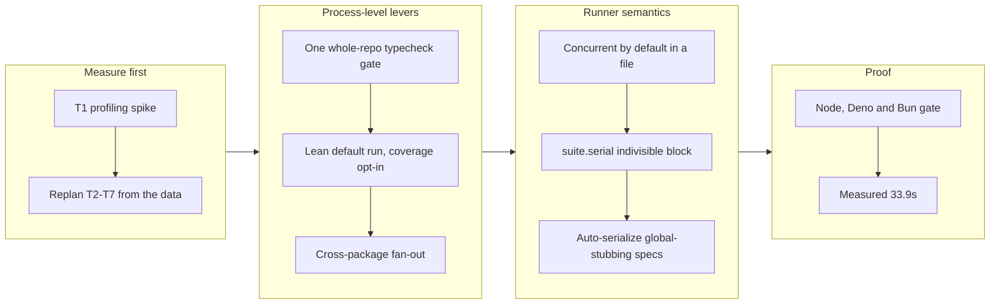

# plgg-test: the test phase from 228.5s to 33.9s

_Mission `modernize-plgg-test-for-concurrent-speed`, complete at 9/9 — a profiling spike that invalidated its own mission plan, a measurement-driven replan under two developer rulings, then the whole reconciled chain drained in one drive._

## 1. Overview

`check-all` is the most frequently executed command in this repository, and its
test-execution phase cost minutes. This branch measures where that time actually
goes, replans the mission around the answer, and then removes the cost: the
phase drops from **228.5 s to 33.9 s (6.7×)** while covering 38 packages instead
of the 37 the old hand-maintained list reached. The runner also gains the
authoring semantics the speed work made necessary — concurrent-by-default tests,
a `suite.serial` opt-in, and automatic serialization of specs that stub process
globals — and a cross-runtime gate that executes the no-`worker_threads`
constraint on Node, Deno and Bun instead of merely asserting it in a comment.

**Highlights:**

1. Three process-level levers account for nearly all of it: one whole-repo
   typecheck gate replacing 38 cold `tsc` programs (−58 s), a lean default run
   with coverage opt-in and its gate folded in-process (−76 s), and cross-package
   fan-out through a canonical runner (−48 s).
2. The plan itself was wrong before it was measured — the original tickets led
   with in-process concurrency worth ~3.6 s and had no ticket at all for the two
   levers worth ~219 s.
3. The constraint that shaped the design is now enforced: `gate-cross-runtime.sh`
   runs the scheduler for real on Node v24.13.1, Deno 2.9.2 and Bun 1.3.14.

## 2. Motivation

Every developer runs `check-all` before every commit and every autonomous drive
gates on it, so its cost is levied on the tightest inner loop in the project. The
mission was created on the reasonable-sounding theory that plgg-test's runner was
slow because it was sequential by design. The T1 profiling spike was placed ahead
of the implementation tickets precisely so that theory would be tested before
anything was built on it — and it failed: the serialization the mission named was
worth ~3.6 s of a 296.5 s phase, while 57% of the phase was V8 coverage
instrumentation plus a third spawned process to fold the gate, and another 17%
was 38 cold `tsc --noEmit` programs re-parsing `lib.d.ts` from scratch. The
mission was deliberately left unauthorized until that replan happened.

## 3. Changes

The order of work is the order of leverage the measurement established, not the
order the mission was written in. Each lever was measured in the same session as
the path it replaced, so every number below is a before/after taken under the
same load rather than a quote of the archived spike figure.

### 3-1. Profile the test phase and validate the approach ([fee27457](https://github.com/qmu/plgg/commit/fee27457))

The T1 spike instrumented a full sequential run: 296.5 s split ~57% V8 coverage
collection plus a spawned gate-fold process, ~26% pure test execution, ~17% cold
`tsc`. Roughly 24 of 38 packages sat at a ~3.9 s fixed floor regardless of test
count, so ~150 s was per-package process overhead independent of test volume, and
naive `xargs -P4` fan-out reached only 1.3–1.56× because the work is CPU-bound.

### 3-2. Replan the mission from the measurement ([dfec09e3](https://github.com/qmu/plgg/commit/dfec09e3))

Scope, Experience and Acceptance were re-ordered behind the three process-level
levers; two tickets were minted for the levers that had none (123008, 123009),
123005 and 123002 were rewritten, 123007 was superseded by a ≤35 s measurement
ticket (123011), and `depends_on` was relinked into one chain. On the developer's
rulings the target became a measured **≤35 s on the dev machine with no separate
CI-host target**, with ≤10 s stated plainly as unreachable there rather than
dropped silently, and the in-process scheduler was **kept for its authoring
semantics** but re-prioritized behind the levers. Authorizing the mission also
required a strategy link, so `keep-the-plgg-inner-loop-fast-and-its-gates-trustworthy`
was created and linked.

### 3-3. Replace 38 cold tsc runs with one repo gate ([93438199](https://github.com/qmu/plgg/commit/93438199))

Tests already run through native type-stripping and never needed `tsc`, so
`npm run test` stopped typechecking and `node scripts/typecheck.ts` became the
whole-repo gate that check-all runs once after the build — covering 38 packages,
one more than the old path, which never checked `plgg-mcp`. The phase drops
228.5 s → 157.9 s with the gate costing 12.7 s warm.

### 3-4. Make coverage opt-in and fold its gate inline ([a10bccee](https://github.com/qmu/plgg/commit/a10bccee))

`plgg-test src` now runs the specs and nothing else — one child process, no
instrumentation, no gate process — while `--coverage` flushes the run's own V8
dump and folds the gate in-process with the same four metrics, thresholds and
exit codes. The phase drops 157.9 s → 81.9 s, and the new numbers were verified
byte-identical to the spawned fold on three packages.

### 3-5. Fan out the test phase in a canonical runner ([e2ef147c](https://github.com/qmu/plgg/commit/e2ef147c))

check-all's 37 hand-listed `test-<pkg>.sh` lines became one command —
`node scripts/runTests.ts --typecheck`, a bounded process pool that runs every
package's suite plus the typecheck gate together, prints the phase wall clock on
every run, and derives its package set from "has a test script" rather than a
list that had gone stale. 81.9 s → 33.8 s, 38 packages.

### 3-6. Run tests concurrently inside a spec file ([6f2e2353](https://github.com/qmu/plgg/commit/6f2e2353))

Tests and nested `describe` blocks now run through a bounded async pool
(`PLGG_TEST_CONCURRENCY`, default 4) with results collected by index so printed
order stays registration order. Worth 10–26% on a single package and nothing
across the repo — the process fan-out already saturates the CPU — but it is what
makes a serial block mean anything.

### 3-7. Add suite.serial for indivisible test blocks ([e3e22427](https://github.com/qmu/plgg/commit/e3e22427))

`suite.serial(name, fn)` / `describe.serial` run a block as one indivisible unit:
its tests in registration order, nothing else in the file in flight, and
`beforeEach`/`afterEach` bracketing each — the sanctioned way to express a
seed → assert → truncate fixture sequence, documented in the plgg-test README.

### 3-8. Make global stubs safe under concurrency ([584af0e8](https://github.com/qmu/plgg/commit/584af0e8))

A spec that stubs a process-wide value is now scheduled serially automatically,
detected from its source with no directive to write, and a stub attempted while
siblings are in flight throws with a message naming the fix — so the failure mode
is a red test rather than a global swapped underneath a concurrent sibling.
plgg-fetch's hand-written opt-out was removed.

### 3-9. Gate the runner on Node, Deno and Bun ([5c64c98d](https://github.com/qmu/plgg/commit/5c64c98d))

`scripts/gate-cross-runtime.sh` runs the scheduler for real on every runtime
installed and is wired into check-all: Node v24.13.1, Deno 2.9.2 and Bun 1.3.14
all pass. Deno and Bun are optional and reported as skipped when absent; Node is
mandatory.

### 3-10. Record the test phase at 33.9s ([6aad682c](https://github.com/qmu/plgg/commit/6aad682c))

Three timed runs at 34.3 s, 33.6 s and 34.0 s against the 35 s target, 28.6 s
without the typecheck gate and 61.2 s coverage-gated, with the full check-all at
`EXIT=0 WALL=116.3s`. Both deliberate-defect probes were re-run at the same HEAD:
a failing assertion in plgg-router and a type error in plgg-kit each give
`EXIT=1` naming the package.

## 4. Outcome

The mission is complete at 9/9. The default inner-loop command costs 33.9 s where
it cost 228.5 s, coverage remains enforceable on demand through the same runner,
one more package is covered than before, and the cross-runtime constraint that
justified the whole design is now a gate rather than a comment. The runner also
gained the semantics that make concurrency safe to have on by default.

## 5. Historical Analysis

This is the clearest instance yet of the repository's spike-before-plan pattern
paying for itself: T1 was placed ahead of the implementation tickets precisely so
the mission's own theory could be falsified, and it was. The same shape appears in
the sibling plggpress mission, where a `/carry` checkpoint had to decompose an
oversized ticket before it could land — in both cases the correction came from
evidence written into a checkpoint, not from retrying the original plan. The
honesty discipline is also consistent: the drive explicitly refused to quote T1's
296.5 s as the "before" (it was taken under heavier load and would have inflated
the improvement from 6.7× to 8.7×) and re-measured the old path in the same
session instead.

## 6. Concerns

### The 35s margin is about one second

- **Severity:** moderate
- **Description:** The phase measures 33.6–34.3 s against a 35 s ceiling, and the
  run-to-run spread already spans 0.7 s (see [6aad682c](https://github.com/qmu/plgg/commit/6aad682c)), so extra machine load or
  a few more packages push it over. The typecheck gate is now the critical path at
  ~29 s of the 33.9 s — the 38 package suites hide almost entirely behind it — so
  further speedup must come from typechecking, not the runner.
- **How to Fix:** Decide whether 35 s becomes a hard CI gate or stays a measured
  claim, and target the next work at `tsc -b` project granularity or a persistent
  typecheck server rather than at the test runner.

### Coverage enforcement moved off the default command

- **Severity:** moderate
- **Description:** The >90% four-metric rule no longer runs on every
  `npm run test`; it is enforced only through the canonical runner's `--coverage`
  mode (see [a10bccee](https://github.com/qmu/plgg/commit/a10bccee) and [e2ef147c](https://github.com/qmu/plgg/commit/e2ef147c)). A developer or drive that runs the lean
  path and reads it as "green" is not checking coverage at all.
- **How to Fix:** Make the coverage mode the one CI runs, and state in the
  plgg-test README and CLAUDE.md which command carries the gate.

### The cross-runtime gate covers the scheduler, not the launcher

- **Severity:** moderate
- **Description:** `bin/plgg-test.mjs` spawns children with Node flags, the
  plgg-test self-alias needs a Node `module.register` hook, and coverage uses
  `NODE_V8_COVERAGE`; the full self-suite still fails on Bun (144/3, DOM-install
  assertions) and Deno (101/10, self-alias) (see [5c64c98d](https://github.com/qmu/plgg/commit/5c64c98d)). The constraint the
  gate defends — no Node-only primitive in the scheduler — is genuinely enforced,
  but "runs on three runtimes" is narrower than it sounds.
- **How to Fix:** Either state the boundary in the README, or port the DOM
  environment and write a resolver per runtime if real multi-runtime execution is
  wanted.

### Unhandled-rejection attribution is coarser under concurrency

- **Severity:** low
- **Description:** Exact per-test attribution of a fire-and-forget rejection needs
  `async_hooks`, which the cross-runtime constraint bans, so concurrently such a
  rejection fails the **file** rather than the test (see [6f2e2353](https://github.com/qmu/plgg/commit/6f2e2353)). Still never
  green, still deterministic, but a developer chasing one reads a file name.
- **How to Fix:** Document it beside the concurrency flag; a file opts back into
  serial attribution with `// @plgg-test-concurrency 1`.

### plgg-server stays serial by declaration

- **Severity:** low
- **Description:** plgg-server binds real loopback sockets, a shared OS resource
  the auto-serialization cannot detect or isolate, so it keeps an explicit opt-out
  (see [584af0e8](https://github.com/qmu/plgg/commit/584af0e8)). Any future suite that grabs a shared OS resource has the same
  problem and no automatic protection.
- **How to Fix:** Give the runner a declared-resource concept (ports, temp paths)
  so such suites serialize on the resource rather than on a hand-written comment.

### The global-stub source scan is deliberately over-inclusive

- **Severity:** low
- **Description:** A mention of `stubGlobal` in a comment or string also serializes
  the file (see [584af0e8](https://github.com/qmu/plgg/commit/584af0e8)). That is the right trade — a false negative is a race
  that reads green — but it silently costs concurrency.
- **How to Fix:** If the cost ever shows up in the phase number, tighten the scan
  to call sites while keeping the conservative default.

### First run on a fresh clone is slower

- **Severity:** low
- **Description:** Incremental build info makes the typecheck gate 34.4 s cold
  versus 12.7 s warm (see [93438199](https://github.com/qmu/plgg/commit/93438199)); a CI job that never reuses a worktree pays
  the worse number on every run.
- **How to Fix:** Cache the build-info directory in CI, or accept the cold cost and
  record it as the CI baseline.

### Multi-package-per-worker was deliberately not implemented

- **Severity:** low
- **Description:** The replan's lever 4 (amortize the ~0.89 s per-process floor by
  running several packages per worker) was skipped: it would require the resolver's
  alias map and cwd to change mid-process and would share one ESM module cache
  between packages, trading isolation for a few seconds (see [e2ef147c](https://github.com/qmu/plgg/commit/e2ef147c)).
- **How to Fix:** Revisit only if the phase target tightens and typechecking has
  already been addressed.

## 7. Successful Development Patterns

- **Put the spike before the plan, and let it falsify the plan.** T1 was placed
  ahead of the implementation tickets and the mission was held unauthorized until
  it reported; it then showed the mission's headline lever was worth ~3.6 s of
  296.5 s. Replanning from the data cost one ticket and saved building the wrong
  thing.
- **Re-measure the old path in the same session as the new one.** The drive
  refused to quote T1's archived 296.5 s as the "before" because it was taken
  under heavier load, and re-measured at 228.5 s — turning a flattering 8.7× into
  an honest 6.7×.
- **Mutation-check every gate you add.** Each new guarantee was proven by breaking
  it: forcing `DEFAULT_CONCURRENCY` to 1 turns the cross-runtime gate red, forcing
  `stubsGlobals` to false turns the isolation suites red, downgrading
  `suite.serial` to `suite` turns the fixture red. A gate that has never failed is
  not known to work.
- **Derive the work set, never hand-maintain it.** Replacing check-all's hand-listed
  37 packages with "has a test script" immediately found `plgg-mcp`, whose four
  specs had never run.
- **Measure the counter-intuitive knob rather than reasoning about it.** More
  children than cores is faster (jobs=6 at 33.8 s vs jobs=4 at 35.5 s) because
  children block in startup and module load; fanning the *typecheck* out bought
  nothing because each worker re-parses the shared `.d.ts` graph. The two look
  alike and behave oppositely.
- **A flag that is silently never on is the worst failure mode.** `environmentOf()`
  returns `undefined` for a plain spec, so guarding on `=== "node"` made every file
  serial while all tests stayed green; only measuring a behavioural difference
  caught it.
- **Separate "ordered" from "isolated" when specifying a concurrency primitive.**
  Implementing `suite.serial` as a per-child concurrency limit of 1 delivers
  registration order while its concurrent siblings keep running beside it — the
  isolation has to be a scheduling phase, not a parameter.

## 8. Release Preparation

**Verdict**: Ready for release

### 8-1. Concerns

- The branch-safety scan reports **no secret and no leak findings**; the only
  findings are `override`-tier size (223 changed files, seven commits above the
  500-line non-generated threshold, including the pre-existing 10,678-line merge
  `c42ff49f`).
- This branch changes how the repository is verified. `npm run test` in a package
  no longer typechecks and no longer collects coverage — both moved to the
  canonical runner — so any habit or automation that read a bare package test as
  "fully checked" must move to `./scripts/check-all.sh` or
  `node scripts/runTests.ts --typecheck`.

### 8-2. Pre-release Instructions

- Re-run `./scripts/check-all.sh` on a settled tree; a run taken immediately after
  editing sources reads ~42 s rather than ~34 s because incremental build info is
  invalidated for every changed package.
- Confirm `./scripts/gate-cross-runtime.sh` still reports all three runtimes
  (Deno and Bun are optional and skip cleanly when absent).

### 8-3. Post-release Instructions

- Update CLAUDE.md's "Test with `scripts/test-plgg.sh`" guidance to name the
  command that now carries the typecheck and coverage gates.
- Decide whether the 35 s phase target becomes a hard CI gate.

## 9. Notes

The mission's hard constraints held: no `worker_threads`, no `cluster`, no native
addons, and zero new dependencies — every lever is promises, child processes and
the project's own TypeScript. The developer's two replan rulings are recorded
verbatim in the mission body and the T1 ticket remains archived with its raw
instrumentation, so the 6.7× claim is reconstructible from the branch alone.
