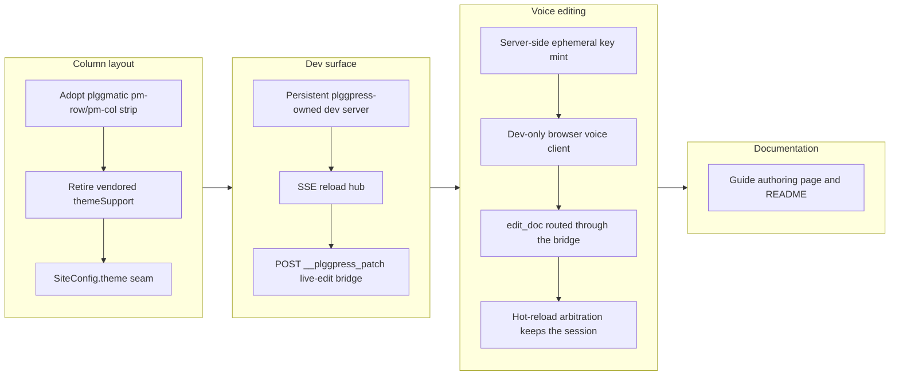

# plggpress: column layout, config theme, dev server + voice editing

_Mission `plggpress-column-layout-and-voice-ai-editing`, created and driven to completion (6/6) on this branch across successive `/monitor` runs, the last being `monitor-20260726-005704`._

## 1. Overview

plggpress — the plgg family's from-scratch documentation-site generator — stops
being a product with its own vendored copy of the family's UI primitives and
becomes the first real consumer of the `plggmatic` framework: its docs render as
plggmatic's column-oriented horizontal strip, and its B&W theme is a value in
`SiteConfig` rather than a constant at the composition root. On top of that, the
branch builds the dev-time authoring loop the mission was created for: a
persistent, plggpress-owned dev server with an SSE reload hub, a guarded
live-edit bridge, and a voice assistant that is grounded in the open document and
edits it by tool call while the realtime session stays alive.

**Highlights:**

1. The doc site is a horizontal column strip — drilling a section opens a column
   to the right and body width stays invariant ("depth does not consume the
   viewport"), with the vendored `themeSupport` tree deleted.
2. `plggpress dev` owns its server: an in-process `node:http` surface with an SSE
   reload hub and `POST /__plggpress_patch`, replacing the plgg-bundle dev loop.
3. A writer can talk to the open page: ephemeral Realtime keys are minted
   server-side, a dev-only browser client is grounded in the page's markdown, its
   `edit_doc` tool routes through the existing bridge, and hot reload swaps the
   body in place so the WebRTC session survives its own edit.

## 2. Motivation

The plgg family already has one general horizontal-orientation UI framework
(`plggmatic`), and plggpress was quietly re-implementing a slice of it — a fixed
sidebar+content+rail shell over a vendored Style copy. That duplication is what
the `plgg-horizontal-orientation-ui-stack` strategy exists to end: plggmatic is
the framework, plggpress is the first product resting on it, and the framework
only earns that claim if a real product depends on it. The second half of the
mission comes from the PoC fleet's verdicts: `plgg-poc3-voice` proved the OpenAI
Realtime loop and `plgg-poc4c-livesite` proved patch/reload arbitration, but both
sat in throwaway packages. This branch promotes those proven cores into
production plggpress so a writer edits conversationally in `plggpress dev`
instead of in a demo.

## 3. Changes

The branch moves in one direction throughout: replace the local copy with the
framework, then give the dev command a surface it owns, then put a voice
assistant on that surface. The one non-linear moment is the middle: the
voice-realtime ticket was deferred by three separate autonomous passes as one
oversized integration, and only landed after a `/carry` checkpoint split it into
four ordered sub-tickets — decomposition, not capability, was the blocker.

### 3-1. Adopt plggmatic column layout in plggpress ([0e9a8ef6](https://github.com/qmu/plgg/commit/0e9a8ef6))

plggpress takes a real dependency on `plggmatic` and renders its docs navigation
as the `pm-row`/`pm-col` column strip — the sections column at left, the active
section drilling open as a column to its right, then the fixed-width content
column and the chrome rail. The vendored `themeSupport` Style/Component/Meta tree
was deleted and `styleEntry` reduced to a re-export of `plggmatic/style`; the
spec asserts the strip structure, that drilling adds a column, width invariance,
and a grayscale scheme.

### 3-2. Make plggpress doc-site theme config-driven ([bb9db85e](https://github.com/qmu/plgg/commit/bb9db85e))

`SiteConfig` gained an optional `theme` field validated through plggmatic's
`pragmaticThemeWithPalette`, and `baseCss`/`shell` became functions of the
resolved theme (`resolveTheme` — the override when present, the qmu B&W default
otherwise), so the aesthetic is a site's choice rather than a constant baked in
at the composition root.

### 3-3. Add plggpress persistent dev-server surface ([e86907be](https://github.com/qmu/plgg/commit/e86907be))

A dev-only, plggpress-owned persistent `node:http` surface — `startDevServer`
plus a `makeReloadHub` SSE broadcast hub, a `devWeb` injector and a reload client
— whose channel survives rebuilds because the server process holds the hub across
content edits. Delivered with a start-server/connect-SSE/edit-file/observe-reload
integration test.

### 3-4. Add live-edit bridge to the plggpress dev server ([2a041358](https://github.com/qmu/plgg/commit/2a041358))

`POST /__plggpress_patch` promotes PoC 4b's proven pure core (the `applyEdits`
exactly-once locator and the `resolveEditPath` lexical guard) into production and
adds fs realpath containment plus an atomic temp+rename write before notifying
the hub. Integration tests cover the disk edit, the hot reload, the channel
staying connected, and the rejection paths (out-of-content-dir 400 writing
nothing, plus 400/404/422 misuse).

### 3-5. Serve plggpress dev via its own surface ([9f4542b8](https://github.com/qmu/plgg/commit/9f4542b8))

The `plggpress dev` CLI stopped delegating to the plgg-bundle dev loop and now
serves plggpress's own persistent surface with the bridge mounted and file-watch
hot reload preserved; the now-dead `devSeam` was deleted. This cleared the
prerequisite the previous run's reflection had front-loaded.

### 3-6. Split voice-realtime into four sub-tickets ([430a1adc](https://github.com/qmu/plgg/commit/430a1adc))

A queue change only, executing the `/carry` checkpoint: the thrice-deferred
`004040` was decomposed into 004041 (ephemeral key mint), 004042 (dev-only
browser voice client), 004043 (`edit_doc` through the existing bridge) and 004044
(hot-reload arbitration), stamped to the mission with an ordered `depends_on`
chain, with 004040 keeping its joint specification behind a SUPERSEDED banner.

### 3-7. Mint ephemeral Realtime keys on the dev surface ([33a420b9](https://github.com/qmu/plgg/commit/33a420b9))

`plggpress dev` answers `GET /__plggpress_voice/health` with `{ configured }` and
`POST /__plggpress_voice/session` with a short-lived `{ value, expiresAt }` grant
minted server-side through plgg-kit's `minterFromConfig`, so the operator's
standing `OPENAI_API_KEY` never leaves the server. With no key the mint route is
an honest 404 and dev is unchanged.

### 3-8. Serve a dev-only voice panel on the same page ([336be2d8](https://github.com/qmu/plgg/commit/336be2d8))

With `OPENAI_API_KEY` set, dev serves a voice panel on every page and mints a
session grounded in that page's markdown — the instructions quote the open
document and name it, with the route-to-document mapping kept server-side so the
model never names a file. Without the key the panel, its script tag and its
module route are all absent.

### 3-9. Route the assistant's edit_doc through the bridge ([8fdf6e4f](https://github.com/qmu/plgg/commit/8fdf6e4f))

The model calls `edit_doc` with an exact span, the client posts it to the
**existing** `POST /__plggpress_patch`, and the page re-renders with the edit; a
bridge refusal is spoken back to the writer and returned to the model to retry.
The tool schema is deliberately pathless — the server substitutes the session's
own document, so the bridge's path guards never see a model-chosen path.

### 3-10. Arbitrate hot reload so the voice session survives ([96cac8ab](https://github.com/qmu/plgg/commit/96cac8ab))

The injected reload client previously answered every SSE frame with
`location.reload()`, destroying the page's JS context and with it the
`RTCPeerConnection` and the conversation. Reload is now arbitrated: with a live
voice session the body swaps in place and the panel and session stay up; with no
session an edit still hard-reloads exactly as before.

### 3-11. Close the voice-realtime assistant ticket ([6780e58a](https://github.com/qmu/plgg/commit/6780e58a))

The superseded umbrella ticket 004040 was closed against its four delivered
sub-tickets, ticking the mission's voice-assistant acceptance item (whose marker
still carries 004040's filename).

### 3-12. Document the column layout and voice-editing loop ([eb5665d9](https://github.com/qmu/plgg/commit/eb5665d9))

The guide gains an Authoring page explaining the column strip and the whole
voice-editing workflow, reachable from the plggpress sidebar and cross-linked
from the overview; the stale dev row in the mode table is corrected and the
plggpress README carries the same story with the runnable command.

## 4. Outcome

The mission is complete at 6/6 acceptance. plggpress renders through plggmatic's
column layout with the vendored copy gone, its theme is a `SiteConfig` value,
`plggpress dev` serves a surface plggpress owns, and a writer with
`OPENAI_API_KEY` set can talk to the open page and watch it change underneath the
conversation. The plgg guide documents the layout and the loop, and the whole
branch is green under `./scripts/check-all.sh` with plggpress coverage above the
>90% gate on every axis (93.72/94.55/93.43/93.72 at the `edit_doc` step).

## 5. Historical Analysis

The branch is the third act of a pattern the repository keeps repeating: prove a
risky capability in a throwaway PoC package, then promote only its pure core into
production. The live-edit bridge took PoC 4b's `applyEdits` locator and
`plgg-poc4c-livesite`'s patch/reload arbitration; the voice work took
`plgg-poc3-voice`'s GA Realtime loop, which had already been migrated to the GA
`/v1/realtime/client_secrets` + `/v1/realtime/calls` endpoints when the pre-GA
`/realtime/sessions` path was retired. The deferral history is equally
instructive: `004040` was deferred by three separate autonomous passes, each
correctly protecting already-green work, and the deadlock only broke when a
`/carry` checkpoint decomposed it — the same "decompose the oversized unit before
driving" lesson `workaholic:implementation`'s operational-planning policy states.

## 6. Concerns

### (carried from PRs #31–#87) 84 standing deferred concerns remain active

- **Severity:** moderate
- **Description:** All 84 active concerns in `.workaholic/concerns/` were judged
  against this branch and every one came back `still_active` — the branch touches
  plggpress, plggmatic consumption, the guide and `.workaholic` records, while the
  corpus targets plgg core/plgg-web, plgg-sql, plgg-bundle, plgg-ir, plgg-view and
  the PoC fleet.
- **How to Fix:** Address them as their target areas are worked on; they carry
  forward unchanged.

### Two compound concerns proposed but not applied (pending developer triage)

- **Severity:** moderate
- **Description:** The deferred-concern judge proposed two compounds that could
  not be applied because a compound merge is a developer ruling and this was an
  unattended `/monitor` run: (a) "Stale sibling dists are invisible to tsc,
  vendored into published bundles, and executed at build time" (members
  `plgg-dist-rebuild-required-after-core`, `plgg-server-plgg-fetch-vendor-a`,
  `export-surface-discovered-by-executing-the`; suggested urgent), and (b)
  "plggmatic's `pm-*` names are a published, string-matched contract with no gate
  on either side" (members `demo-1-s-css-overrides-hard`,
  `registry-consumability-blockers-were-fixed-reactively`; suggested moderate).
  The corpus also tripped its triage threshold (84 active, `should_triage: true`).
- **How to Fix:** Run `/report` interactively and confirm or edit each compound's
  severity and title, then apply with `merge-concerns.sh`; use the same pass to
  demote or close the roll-up entries that inflate the count.

### plggpress now string-matches plggmatic's `pm-*` contract

- **Severity:** moderate
- **Description:** plggpress's theme targets plggmatic's `pm-*` tokens and
  row/column hooks by literal string (see [0e9a8ef6](https://github.com/qmu/plgg/commit/0e9a8ef6) in `packages/plggpress/src/theme/baseCss.ts`), and
  plggmatic publishes to npm from this repo — so a `pm-*` rename ships to the
  registry and breaks the framework's flagship consumer with no compiler signal.
- **How to Fix:** Give plggmatic a typed, exported token surface consumers import
  instead of spelling class names, or add a CI check that exercises the published
  artifact against plggpress.

### Config changes still need a dev-server restart

- **Severity:** moderate
- **Description:** `site.config.ts` is a watched path, but `startDevServer` loads
  the config once at startup and passes the value into `devWeb` (see [e86907be](https://github.com/qmu/plgg/commit/e86907be) in
  `packages/plggpress/src/framework/DevServer/devServer.ts`), so a config or IA
  edit fires a browser reload against a stale in-memory config.
- **How to Fix:** Re-read and re-validate the config inside the watch handler and
  thread the fresh value into the injector before notifying the hub.

### Theme `.ts` hot-reload was lost with the in-process surface

- **Severity:** low
- **Description:** Under the retired plgg-bundle dev loop a theme module was
  re-imported on change; the in-process surface keeps content/config file-watch
  reload but not module re-import (see [9f4542b8](https://github.com/qmu/plgg/commit/9f4542b8) in `packages/plggpress/src/framework/DevServer/`).
- **How to Fix:** Belongs to the sibling `grow-plggmatic-as-the-reference-framework`
  mission — decide there whether the framework should expose a re-importable theme
  entry.

### Dead plgg-bundle dev scaffolding remains in the tree

- **Severity:** low
- **Description:** `devPlan`/`devEntryEnv`/`devServerEntry`/`devEntry`/
  `pressDevEntry` became unreachable when `plggpress dev` moved to its own surface
  (see [9f4542b8](https://github.com/qmu/plgg/commit/9f4542b8) in `packages/plgg-bundle/src/`) but are still present.
- **How to Fix:** A cleanup ticket deleting the dead seam and its tests.

### The browser voice client rides an experimental Node API

- **Severity:** low
- **Description:** The dev-only client is served through `node:module`'s
  `stripTypeScriptTypes`, still marked experimental (see [336be2d8](https://github.com/qmu/plgg/commit/336be2d8) in
  `packages/plggpress/src/framework/DevServer/`); an upstream signature change
  breaks the module route. The specs assert the served output, so it fails loudly
  rather than silently.
- **How to Fix:** Pin the behaviour behind a small adapter with its own spec, or
  pre-strip at build time if the API churns.

### `edit_doc` quality depends on the model quoting an exact span

- **Severity:** low
- **Description:** The bridge refuses a fuzzy find with 422 — deliberate (no
  whole-file rewrites), but it makes edit success depend on how faithfully the
  model copies from the quoted document (see [8fdf6e4f](https://github.com/qmu/plgg/commit/8fdf6e4f) in
  `packages/plggpress/src/framework/DevServer/`).
- **How to Fix:** If refusals prove common in real use, add a server-side
  normalisation pass (whitespace and entity folding) before the locator runs.

### In-place swap would drop future page-level client state

- **Severity:** low
- **Description:** The reload arbiter replaces the body's children and the theme's
  inlined `<style>` tags (see [96cac8ab](https://github.com/qmu/plgg/commit/96cac8ab) in
  `packages/plggpress/src/framework/DevServer/reloadArbiter.ts`); any future
  page-level client state living in the swapped region — there is none today —
  would be lost across a swap.
- **How to Fix:** Introduce a preserved-region convention (an attribute the
  arbiter skips) before adding such state.

### The dev surface binds all interfaces with unauthenticated write routes

- **Severity:** moderate
- **Description:** `startDevServer` passes no `hostname` to plgg-server's `serve`,
  so `server.listen(port)` binds every interface (see [e86907be](https://github.com/qmu/plgg/commit/e86907be) in
  `packages/plggpress/src/framework/DevServer/devServer.ts`), and neither
  `POST /__plggpress_patch` (writes `.md` under the content root) nor
  `POST /__plggpress_voice/session` (mints a Realtime grant off the operator's
  standing key) requires auth, an Origin check, or a non-simple content type — a
  `text/plain` POST is a CORS-simple request, so any page the writer visits can
  drive both, and any host on the LAN can reach them directly. Production-grade
  dev-server auth is explicitly out of the mission's scope and the path guards are
  strong (lexical `resolveEditPath` plus `realpathSync` containment, `.md`-only,
  whitelisted browser modules), so the blast radius is markdown under the content
  root plus mint abuse — but the default is wider than it needs to be.
- **How to Fix:** Bind to `127.0.0.1` by default (`ServeOptions.hostname`, with an
  opt-in flag to widen) and reject requests whose `Origin` is not the dev surface's
  own on both routes.

### Targeted per-span DOM animation was deferred

- **Severity:** low
- **Description:** The live-edit path re-renders the page (in place, under the
  arbiter) rather than animating the edited span; PoC 4c's `spanMap`/`patchClient`
  client injection for targeted per-span updates was intentionally left out (see
  [2a041358](https://github.com/qmu/plgg/commit/2a041358) in
  `packages/plggpress/src/framework/DevServer/`). This satisfies the acceptance but
  is less polished than a targeted update.
- **How to Fix:** A refinement ticket — the bridge already records `path` and
  `applied`, so client-side targeted animation is additive and changes no contract.

### The guide documents the built CSS, not the mission's Experience text

- **Severity:** low
- **Description:** The Authoring page describes the wide-viewport strip and the
  narrow-viewport collapse as the built CSS implements them; the mission's
  Experience text promises a scroll-snap strip that does not exist (see [eb5665d9](https://github.com/qmu/plgg/commit/eb5665d9)
  in `packages/guide/packages/plggpress/authoring.md`).
- **How to Fix:** Revisit the page if plggmatic later adds scroll-snap.

## 7. Successful Development Patterns

- **Decompose before driving beats retrying.** Three autonomous passes each
  correctly deferred the voice ticket to protect green work; the fourth landed it
  in one wave after a `/carry` checkpoint split it into four ordered sub-tickets.
  When a unit is deferred repeatedly, the signal is size, not difficulty.
- **Inject the capability, don't read the environment inside the handler.**
  Passing `Option<KeyMinter>` into the mint handlers (instead of reading
  `process.env` there) is what made every outcome — unconfigured, minted, upstream
  failure — assertable with a stub, with no test ever reaching the network.
- **Keep the model pathless and let the server substitute the document.** The
  `edit_doc` schema names no path, so the bridge's existing containment guards
  never see a model-chosen one — containment by construction rather than by
  validation.
- **Promote the pure core of a PoC, not the PoC.** `applyEdits`, `resolveEditPath`
  and the reload arbitration came across as tested pure functions with production
  wrapping added around them, which is why they landed inside the coverage gate.
- **Document against the built artifact.** Writing the guide page from the built
  CSS rather than from the mission prose caught an aspirational claim (a
  scroll-snap strip that does not exist).
- **Model complex control flow as a closed state algebra.** `reloadArbiter` is an
  exhaustive message/phase machine (idle/listening/swapping × SessionOpened /
  SessionClosed / ReloadFrame / SwapDone) with every transition asserted, rather
  than scattered conditionals — the exhaustive match is what catches a missed case.
- **Add drivers to a boundary, never a second implementation of it.** `edit_doc`
  drives the existing `/__plggpress_patch` bridge and the mint reuses plgg-kit's
  `minterFromConfig`; the surface area stayed fixed while the capability grew.
- **Gate dev-only surfaces explicitly.** The panel, the mint route and the module
  route each gate on `OPENAI_API_KEY` presence, so the no-key path is asserted
  rather than inferred and cannot be lost by accident.
- **Pin cross-boundary string contracts with a spec.** The reload client is a
  `<script>` literal and the voice client is an ES module; they meet only through
  a window global, so a spec pins the two spellings together — a silent drift
  would otherwise leave an arbiter that arbitrates nothing while every unit test
  passed.

## 8. Release Preparation

**Verdict**: Needs attention before release

### 8-1. Concerns

- The deterministic branch-safety scan flagged two `secret`/hard findings in
  `packages/plggpress/src/framework/DevServer/usecase/voiceMinter.spec.ts` — a
  fake fixture (`OPENAI_API_KEY` assigned a quoted literal) whose shape matches
  the credential rule. The value is not a real key, but the `secret` tier is
  non-overridable, so it blocks `/ship` until the fixture binds the value through
  an identifier instead of a quoted literal. A follow-up wave on this branch
  addresses it.
- Size findings are `override`-tier and expected for a mission-sized branch
  (219 changed files; eight commits above the 500-line non-generated threshold).
- The voice surface reaches OpenAI's GA `/v1/realtime/client_secrets` endpoint at
  runtime; if that path is retired the mint route answers 502 and the voice
  surface goes dark until the constant is updated.

- `plggpress dev` binds all interfaces and its patch and voice-mint routes are
  unauthenticated (see the concern above). Dev-only and out of the mission's
  scope, but it is a wider default than the feature needs.

The security surface itself reviewed clean: the standing key is read in exactly
one place (`Press/usecase/devSpec.ts` → `voiceMinterFrom(process.env)`), never
reaches the browser (only a short-lived grant from plgg-kit's `minterFromConfig`
is returned), and none of the dev, voice or patch surface is reachable from
`plggpress build`.

### 8-2. Pre-release Instructions

- Confirm `scan-branch-safety.sh` reports zero `secret` findings.
- Re-run `./scripts/check-all.sh` so `.check-all-green.stamp` matches the new HEAD
  on a clean tree, and `cd packages/guide && npm run build` (dead-link checker
  clean).
- At `/ship`, consciously accept the `override`-tier size findings — the
  themeSupport tree deletion in the column-layout adoption accounts for the bulk
  of them.

### 8-3. Post-release Instructions

- File a ticket to bind the dev server to `127.0.0.1` by default
  (`ServeOptions.hostname`, opt-in flag to widen) and to require a matching
  `Origin` on `POST /__plggpress_patch` and `POST /__plggpress_voice/session`.
- Carry the two recorded follow-ups to their owners: the dead plgg-bundle dev
  scaffolding cleanup, and the theme `.ts` hot-reload loss, which belongs to
  `grow-plggmatic-as-the-reference-framework`.
- Nothing operational ships with this branch — the voice surface is dev-only and
  absent from `build` output.

## 9. Notes

The dev-time voice surface is strictly dev-only: with no `OPENAI_API_KEY` the
panel, its script tag and its module route are all absent and `plggpress dev`
behaves byte-for-byte as before, and the production `build` path is asserted to
contain no EventSource client. Every voice step was verified against a live
`plggpress dev` in a real browser (Playwright), not only in unit tests — the mint
returned an `ek_…` grant with the standing key appearing in no response body, a
decoded `edit_doc` frame landed on disk through the bridge, and the arbiter kept
the JS context alive across an edit while clearing the hook restored the hard
reload.
